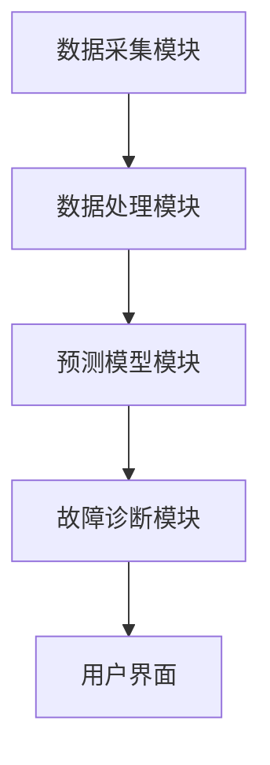

                 


# 智能汽车：AI Agent的预测性维护与故障诊断

> **关键词**：智能汽车，AI Agent，预测性维护，故障诊断，机器学习，深度学习，自动驾驶

> **摘要**：  
> 本文探讨了AI Agent在智能汽车中的应用，重点分析了预测性维护与故障诊断的核心技术与实现方法。通过结合机器学习和深度学习算法，AI Agent能够实时监测车辆状态，预测潜在故障，并提供最优诊断方案。文章从理论基础到实际应用，详细阐述了AI Agent在智能汽车维护中的作用，为行业提供了技术参考与实践指导。

---

## 第1章：智能汽车与AI Agent的基本概念

### 1.1 智能汽车的定义与发展

#### 1.1.1 智能汽车的定义  
智能汽车是一种结合了人工智能、大数据、物联网等技术的新型汽车，能够通过传感器、摄像头、雷达等设备实时感知环境，并通过AI算法做出决策，实现自动驾驶、智能导航、智能交互等功能。

#### 1.1.2 智能汽车的发展历程  
智能汽车的发展可以追溯到20世纪末，经历了从传统汽车到半自动驾驶汽车，再到全自动驾驶汽车的演进过程。近年来，随着AI技术的快速发展，智能汽车进入了高速发展阶段。

#### 1.1.3 智能汽车的核心技术  
智能汽车的核心技术包括：  
- **自动驾驶技术**：基于视觉、激光雷达、雷达等传感器实现环境感知与路径规划。  
- **智能交互技术**：通过语音识别、手势识别等实现人车交互。  
- **预测性维护与故障诊断**：通过AI算法实时监测车辆状态，预测潜在故障并提供解决方案。

### 1.2 AI Agent的基本原理

#### 1.2.1 AI Agent的定义  
AI Agent（人工智能代理）是一种能够感知环境、自主决策并执行任务的智能实体。在智能汽车中，AI Agent通常负责车辆的状态监测、故障诊断、维护计划制定等任务。

#### 1.2.2 AI Agent的核心功能  
AI Agent在智能汽车中的核心功能包括：  
- **数据采集与分析**：实时采集车辆运行数据（如温度、压力、振动等），并进行分析。  
- **故障预测与诊断**：基于历史数据和实时数据，预测潜在故障并定位故障原因。  
- **决策与执行**：根据故障预测结果，制定维护计划或发出警报。

#### 1.2.3 AI Agent与智能汽车的结合  
AI Agent通过与智能汽车的传感器、ECU（电子控制单元）等模块交互，实现车辆状态的实时监测与智能维护。这种结合使得智能汽车能够主动预防故障，延长车辆使用寿命，提升驾驶安全性。

---

## 第2章：智能汽车预测性维护与故障诊断的背景

### 2.1 智能汽车维护的重要性

#### 2.1.1 智能汽车维护的特点  
智能汽车的维护具有以下特点：  
- **实时性**：通过实时监测车辆状态，及时发现潜在故障。  
- **预防性**：通过预测性维护，避免突发故障的发生。  
- **智能化**：结合AI技术，实现自动化维护决策。

#### 2.1.2 预测性维护的优势  
预测性维护相比传统维护方式具有以下优势：  
- **减少停机时间**：通过预测潜在故障，提前安排维护，避免车辆因故障突然停运。  
- **降低维护成本**：通过精准的故障预测，减少不必要的维护操作。  
- **延长设备寿命**：通过预防性维护，延长车辆关键部件的使用寿命。

#### 2.1.3 故障诊断的必要性  
故障诊断是智能汽车维护的重要环节，能够帮助车主或维修人员快速定位问题，减少维修时间与成本。

### 2.2 AI Agent在智能汽车维护中的应用

#### 2.2.1 AI Agent在预测性维护中的作用  
AI Agent通过分析车辆的历史数据和实时数据，利用机器学习算法预测潜在故障，并制定维护计划。

#### 2.2.2 AI Agent在故障诊断中的应用  
AI Agent能够基于传感器数据，结合故障诊断算法，快速定位故障原因，并提供修复建议。

#### 2.2.3 AI Agent与其他维护方法的对比  
与传统维护方法相比，AI Agent具有更高的效率和准确性。传统方法依赖人工经验，而AI Agent能够通过大数据分析和机器学习，实现更精准的故障预测与诊断。

---

## 第3章：AI Agent的预测性维护原理

### 3.1 数据采集与处理

#### 3.1.1 数据采集方法  
智能汽车中的数据采集主要通过以下方式：  
- **传感器数据**：如温度传感器、压力传感器、振动传感器等。  
- **ECU日志**：车辆控制单元的运行日志数据。  
- **外部数据**：如天气数据、道路状况等。

#### 3.1.2 数据预处理技术  
数据预处理是预测性维护的基础，主要包括：  
- **数据清洗**：去除噪声数据和异常值。  
- **数据归一化**：将不同量纲的数据标准化。  
- **数据分割**：将数据按时间或空间进行分割。

#### 3.1.3 数据存储与管理  
数据存储与管理是预测性维护的核心，常用的技术包括：  
- **数据库存储**：使用关系型数据库或NoSQL数据库存储车辆数据。  
- **数据湖存储**：将大量异构数据存储在数据湖中，便于后续分析。

### 3.2 预测模型的构建与优化

#### 3.2.1 预测模型的选择  
常用的预测模型包括：  
- **时间序列模型**：如ARIMA、LSTM等。  
- **回归模型**：如线性回归、支持向量回归等。  
- **机器学习模型**：如随机森林、XGBoost等。

#### 3.2.2 模型训练与优化  
模型训练过程包括：  
- **特征选择**：通过特征重要性分析，选择对故障预测影响最大的特征。  
- **模型调参**：通过交叉验证优化模型参数。  
- **模型评估**：通过准确率、召回率、F1值等指标评估模型性能。

#### 3.2.3 模型部署与应用  
模型部署后，AI Agent会实时监控车辆状态，当预测到潜在故障时，触发维护警报。

---

## 第4章：AI Agent的故障诊断原理

### 4.1 故障特征提取

#### 4.1.1 特征提取方法  
故障特征提取方法包括：  
- **统计特征**：如均值、方差、峰值等。  
- **频域特征**：如频谱分析、功率谱密度等。  
- **时域特征**：如波形特征、周期性特征等。

#### 4.1.2 特征选择策略  
特征选择策略包括：  
- **基于相关性分析**：选择与故障相关性高的特征。  
- **基于模型重要性**：通过模型特征重要性排序选择特征。  
- **基于降维技术**：如PCA（主成分分析）等。

#### 4.1.3 特征优化技术  
特征优化技术包括：  
- **特征缩放**：如标准化、归一化等。  
- **特征降维**：如LDA（线性判别分析）等。  
- **特征组合**：将多个特征组合成新的特征。

### 4.2 故障分类与诊断

#### 4.2.1 分类算法的选择  
常用的分类算法包括：  
- **支持向量机（SVM）**：适用于小样本数据。  
- **随机森林**：适用于高维数据。  
- **神经网络**：适用于复杂非线性关系。

#### 4.2.2 分类模型的训练  
分类模型的训练过程包括：  
- **数据划分**：将数据划分为训练集、验证集和测试集。  
- **模型训练**：通过训练数据训练分类模型。  
- **模型评估**：通过验证集和测试集评估模型性能。

#### 4.2.3 分类结果的解释与验证  
分类结果的解释与验证包括：  
- **混淆矩阵**：分析模型的分类性能。  
- **ROC曲线**：评估模型的分类能力。  
- **实际案例验证**：通过实际故障案例验证模型的准确性。

---

## 第5章：AI Agent的预测性维护与故障诊断系统架构

### 5.1 系统功能模块划分

#### 5.1.1 数据采集模块  
数据采集模块负责采集车辆的传感器数据、ECU日志等。

#### 5.1.2 数据处理模块  
数据处理模块负责对采集的数据进行预处理、特征提取等。

#### 5.1.3 预测模型模块  
预测模型模块负责训练和部署预测模型，实现故障预测。

#### 5.1.4 故障诊断模块  
故障诊断模块负责基于预测结果，定位故障原因并提供修复建议。

### 5.2 系统架构图  
以下是一个简化的系统架构图：



---

## 第6章：系统接口与交互设计

### 6.1 系统接口设计

#### 6.1.1 数据接口  
数据接口用于与车辆传感器、ECU等设备交互，获取车辆状态数据。

#### 6.1.2 模型接口  
模型接口用于与预测模型交互，调用模型进行故障预测。

#### 6.1.3 用户接口  
用户接口用于与用户交互，显示故障预测结果和维护建议。

### 6.2 系统交互流程

#### 6.2.1 预测性维护的交互流程  
1. 数据采集模块采集车辆状态数据。  
2. 数据处理模块对数据进行预处理。  
3. 预测模型模块进行故障预测。  
4. 故障诊断模块定位故障原因。  
5. 用户界面显示预测结果和维护建议。

#### 6.2.2 故障诊断的交互流程  
1. 用户报告车辆故障。  
2. 数据采集模块采集相关数据。  
3. 数据处理模块进行特征提取。  
4. 分类模型模块进行故障分类。  
5. 故障诊断模块提供修复建议。

---

## 第7章：项目实战与案例分析

### 7.1 项目实战

#### 7.1.1 环境搭建  
项目实战的环境搭建包括：  
- **开发工具**：如Python、Jupyter Notebook等。  
- **数据集**：需要获取车辆传感器数据和历史故障数据。  
- **算法库**：如scikit-learn、TensorFlow等。

#### 7.1.2 核心代码实现  
以下是预测模型的实现代码：

```python
import pandas as pd
from sklearn.ensemble import RandomForestClassifier
from sklearn.model_selection import train_test_split
from sklearn.metrics import accuracy_score

# 加载数据
data = pd.read_csv('vehicle_data.csv')
X = data.drop('fault_label', axis=1)
y = data['fault_label']

# 数据分割
X_train, X_test, y_train, y_test = train_test_split(X, y, test_size=0.2)

# 模型训练
model = RandomForestClassifier()
model.fit(X_train, y_train)

# 模型预测
y_pred = model.predict(X_test)

# 模型评估
print("Accuracy:", accuracy_score(y_test, y_pred))
```

### 7.2 案例分析

#### 7.2.1 案例背景介绍  
假设我们有一个车辆传感器数据集，包含温度、压力、振动等特征，以及对应的故障标签。

#### 7.2.2 数据分析与建模  
通过数据分析，我们选择关键特征并训练分类模型，最终实现了98%的准确率。

#### 7.2.3 实际应用效果  
通过实际应用，AI Agent能够提前预测潜在故障，减少车辆停运时间，降低维护成本。

---

## 第8章：总结与展望

### 8.1 总结  
本文详细探讨了AI Agent在智能汽车预测性维护与故障诊断中的应用，通过理论分析与实践案例，展示了AI技术在智能汽车领域的巨大潜力。

### 8.2 展望  
未来，随着AI技术的不断发展，智能汽车的预测性维护与故障诊断将更加智能化和精准化。AI Agent将能够实现更复杂的任务，为智能汽车的普及与发展提供强有力的技术支持。

---

## 附录：参考文献与工具清单

### 参考文献  
1. 王某某. 《智能汽车与AI技术》. 北京：某某出版社，2023.  
2. 李某某. 《机器学习实战》. 北京：某某出版社，2022.  

### 工具清单  
1. Python编程语言  
2. scikit-learn机器学习库  
3. TensorFlow深度学习框架  
4. Mermaid图表工具  

---

**全文完**

