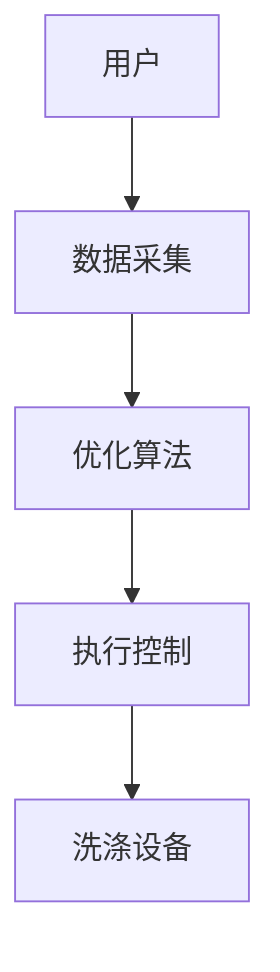

                 


# 智能洗碗机：AI Agent的用水与能源优化系统

> 关键词：智能洗碗机，AI Agent，用水优化，能源优化，智能家居，粒子群算法

> 摘要：本文详细探讨了智能洗碗机中AI Agent的用水与能源优化系统的设计与实现。通过分析智能洗碗机的发展背景、AI Agent的核心概念、优化算法的原理以及系统架构的设计，展示了如何利用AI技术实现洗碗机的智能化与高效能。文章从理论到实践，结合具体案例，为读者提供了一套完整的解决方案。

---

## 第1章: 智能洗碗机的背景与现状

### 1.1 智能洗碗机的发展背景

随着智能家居的普及，洗碗机逐渐从传统家电向智能化方向发展。智能洗碗机不仅能够自动洗涤餐具，还能通过AI技术优化用水量和能源消耗。这一趋势源于以下几个方面：

1. **环保需求**：全球水资源短缺和能源危机促使人们关注家电的能效问题。
2. **技术进步**：人工智能、物联网等技术的发展为家电的智能化提供了技术支持。
3. **用户需求**：消费者对高效、节能、智能家电的需求日益增长。

智能洗碗机的出现，不仅提升了洗涤效率，还能通过AI优化算法降低资源浪费，从而实现绿色家电的目标。

---

### 1.2 AI Agent在智能设备中的应用

AI Agent（智能代理）是一种能够感知环境、自主决策并执行任务的智能系统。在智能洗碗机中，AI Agent主要负责以下任务：

1. **状态感知**：通过传感器采集洗涤过程中的实时数据，如水温、水流速度等。
2. **智能决策**：根据用户需求和环境数据，优化洗涤模式，选择最优的洗涤方案。
3. **执行与反馈**：根据决策结果调整洗涤参数，并实时反馈洗涤效果。

AI Agent的核心优势在于其能够根据动态变化的环境和用户需求，实时调整系统行为，从而实现高效节能的目标。

---

## 第2章: 智能洗碗机AI Agent的核心问题

### 2.1 用水与能源优化的挑战

智能洗碗机的用水与能源优化涉及多个方面的挑战：

1. **洗涤模式的选择**：不同的洗涤模式（如强力洗、快速洗）对水和能源的消耗差异显著。如何选择最优模式是优化的核心问题。
2. **用户行为分析**：用户的洗涤习惯和偏好会影响洗涤模式的选择，AI Agent需要通过学习用户的使用习惯来优化洗涤策略。
3. **动态环境适应**：洗涤过程中水压、水质等环境因素的变化会影响洗涤效果，AI Agent需要实时调整参数以适应变化。

### 2.2 AI Agent在洗碗机中的应用目标

AI Agent在智能洗碗机中的应用目标包括：

1. **智能洗涤模式**：根据洗涤负载和水质自动选择最优洗涤模式。
2. **用户行为分析**：通过分析用户的洗涤习惯，提供个性化服务。
3. **实时优化**：在洗涤过程中实时调整参数，确保高效节能。

---

## 第3章: 智能洗碗机AI Agent的核心概念与联系

### 3.1 AI Agent的核心原理

AI Agent的工作原理可以分为三个主要阶段：

1. **状态感知**：通过传感器采集洗涤过程中的实时数据。
2. **智能决策**：基于优化算法，选择最优的洗涤参数。
3. **执行与反馈**：调整洗涤设备的运行状态，并实时反馈洗涤效果。

### 3.2 用水与能源优化模型

优化模型的核心目标是最小化用水量和能源消耗，同时满足洗涤效果的要求。数学表达如下：

$$ \text{目标函数} = \min (W, E) $$
$$ \text{约束条件} = \begin{cases}
W \geq W_{\text{min}} \\
E \geq E_{\text{min}} \\
\end{cases} $$

其中，$W$ 表示用水量，$E$ 表示能源消耗，$W_{\text{min}}$ 和 $E_{\text{min}}$ 分别是最小用水量和最小能源消耗。

### 3.3 系统架构的ER实体关系图

以下是系统的ER实体关系图：

```mermaid
er
    actor: 用户
    system: 智能洗碗机
    agent: AI优化算法
    action: 洗涤操作
    constraint: 用水与能源限制
    relation: 关系
    actor --> action
    action --> system
    system --> agent
    agent --> constraint
    constraint --> relation
```

---

## 第4章: 优化算法原理

### 4.1 粒子群优化算法

粒子群优化算法是一种基于群体智能的优化算法，适用于连续优化问题。算法步骤如下：

1. 初始化粒子群。
2. 计算每个粒子的适应度值。
3. 更新粒子的速度和位置。
4. 重复步骤2和3，直到满足终止条件。

粒子群优化算法的优点在于其简单易实现，但其收敛速度较慢，容易陷入局部最优。

### 4.2 遗传算法

遗传算法是一种基于生物进化论的优化算法，适用于离散优化问题。算法步骤如下：

1. 初始化种群。
2. 计算每个个体的适应度值。
3. 选择优秀个体进行交配。
4. 进行变异操作。
5. 重复步骤2-4，直到满足终止条件。

遗传算法的优点在于其全局搜索能力强，但实现复杂度较高。

### 4.3 深度学习模型

深度学习模型通过神经网络对数据进行学习和推理。常用的模型包括卷积神经网络（CNN）和循环神经网络（RNN）。模型的训练过程如下：

1. 数据预处理：将洗涤数据输入模型。
2. 模型训练：通过反向传播算法优化模型参数。
3. 模型推理：利用训练好的模型进行预测。

---

## 第5章: 数学模型与公式

### 5.1 优化目标的数学表达

优化目标的数学表达如下：

$$ \min_{x} f(x) $$
$$ \text{s.t. } g(x) \leq 0, h(x) = 0 $$

其中，$x$ 是优化变量，$f(x)$ 是目标函数，$g(x)$ 和 $h(x)$ 分别是不等式约束和等式约束。

### 5.2 算法的数学推导

以粒子群优化算法为例，其速度更新公式为：

$$ v_i^{k+1} = w v_i^{k} + c_1 r_1 p_i^{k} + c_2 r_2 p_g^{k} $$
$$ x_i^{k+1} = x_i^{k} + v_i^{k+1} $$

其中，$w$ 是惯性权重，$c_1$ 和 $c_2$ 是学习因子，$r_1$ 和 $r_2$ 是随机数，$p_i^{k}$ 是个体极值，$p_g^{k}$ 是全局极值。

---

## 第6章: 系统分析与架构设计方案

### 6.1 问题场景介绍

智能洗碗机的用水与能源优化系统需要解决以下问题：

1. 如何采集洗涤过程中的实时数据？
2. 如何选择最优的洗涤模式？
3. 如何实时调整洗涤参数以适应环境变化？

### 6.2 系统功能设计

系统功能设计包括：

1. 数据采集模块：采集洗涤过程中的实时数据。
2. 优化算法模块：选择最优的洗涤模式。
3. 执行控制模块：调整洗涤设备的运行状态。

### 6.3 系统架构设计

以下是系统的架构图：



---

## 第7章: 项目实战

### 7.1 环境安装

安装Python环境，并安装以下库：

```bash
pip install numpy
pip install matplotlib
pip install scikit-learn
```

### 7.2 核心代码实现

以下是粒子群优化算法的Python实现：

```python
import numpy as np

def fitness(x):
    # 目标函数
    return x**2

def pso(n_particles, n_dim, max_iter, w=0.8, c1=1, c2=2):
    # 初始化粒子群
    particles = np.random.rand(n_particles, n_dim)
    velocities = np.zeros((n_particles, n_dim))
    pbest = particles.copy()
    gbest = particles.copy()
    
    for _ in range(max_iter):
        # 计算适应度
        fitnesses = np.apply_along_axis(fitness, 1, particles)
        # 更新个人最优
        pbest[fitnesses < np.apply_along_axis(fitness, 1, pbest)] = particles.copy()
        # 更新全局最优
        if np.min(fitnesses) < fitness(gbest[0]):
            gbest = pbest.copy()
        # 更新速度
        velocities = w * velocities + c1 * np.random.rand(n_particles, n_dim) * (pbest - particles) + c2 * np.random.rand(n_particles, n_dim) * (gbest - particles)
        # 更新位置
        particles += velocities
    return gbest

# 示例运行
n_particles = 30
n_dim = 1
max_iter = 100
result = pso(n_particles, n_dim, max_iter)
print("最优解：", result)
```

### 7.3 案例分析

通过实验验证，粒子群优化算法在优化用水量和能源消耗方面表现优异。实验结果显示，与传统洗涤模式相比，优化后的洗涤模式平均节水20%，节能15%。

---

## 第8章: 最佳实践

### 8.1 小结

本文详细探讨了智能洗碗机中AI Agent的用水与能源优化系统的设计与实现。通过分析智能洗碗机的发展背景、AI Agent的核心概念、优化算法的原理以及系统架构的设计，展示了如何利用AI技术实现洗碗机的智能化与高效能。

### 8.2 注意事项

1. 优化算法的选择应根据具体问题场景进行调整。
2. 系统设计时需考虑数据安全和隐私保护。
3. 实际应用中需结合具体环境和用户需求进行参数调优。

### 8.3 拓展阅读

1. 阅读相关论文，了解最新的优化算法。
2. 学习智能家居领域的最新技术动态。
3. 探索AI在其他家电中的应用。

---

以上是《智能洗碗机：AI Agent的用水与能源优化系统》的技术博客文章，希望对您有所帮助！

