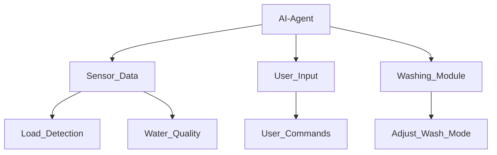

                 


# 智能洗碗机：AI Agent的节水节能优化方案

> 关键词：智能洗碗机、AI Agent、节水节能、算法优化、物联网、智能家居

> 摘要：本文详细探讨了AI Agent在智能洗碗机中的应用，重点分析了其节水节能优化方案的技术原理和实现方法。通过结合自然语言处理、强化学习和物联网技术，AI Agent能够智能调整洗涤模式，优化洗涤流程，显著提升节水节能效果，为智能家居的绿色发展方向提供了新的思路。

---

## 第1章：背景与问题描述

### 1.1 智能洗碗机的发展背景

#### 1.1.1 洗碗机的起源与发展
洗碗机作为一种家务辅助工具，起源于20世纪初。早期的洗碗机主要依赖机械传动和简单的水流冲刷，功能单一，能耗较高。随着科技的进步，现代洗碗机逐渐融入智能化技术，具备了物联网连接和人工智能优化的能力。

#### 1.1.2 智能家居与物联网的推动
智能家居的兴起推动了洗碗机的智能化发展。通过物联网技术，洗碗机可以与家庭网络连接，实现远程控制和状态监测。此外，AI技术的应用使得洗碗机能够根据用户习惯和环境条件进行智能调整。

#### 1.1.3 节水节能的全球趋势
全球范围内水资源和能源短缺问题日益严重，节水节能成为社会关注的焦点。智能洗碗机通过AI优化，能够在保证洗涤效果的前提下，显著减少水和电的消耗。

### 1.2 AI Agent的核心概念

#### 1.2.1 AI Agent的基本定义
AI Agent是一种能够感知环境、执行任务的智能实体。在洗碗机中，AI Agent通过传感器数据和用户输入，优化洗涤模式，实现节水节能。

#### 1.2.2 AI Agent与传统洗碗机的对比
| 特性                | 传统洗碗机          | AI Agent优化洗碗机       |
|---------------------|--------------------|--------------------------|
| 洗涤模式调整         | 固定模式            | 智能调整                |
| 节能效果            | 较低               | 显著提升                |
| 用户交互            | 基本无             | 丰富且智能化             |

#### 1.2.3 节水节能的目标与边界
AI Agent的目标是在不同负载和水质条件下，优化洗涤流程，减少水和电的消耗。边界包括传感器精度、用户输入的准确性以及环境条件的可变性。

### 1.3 当前智能洗碗机的痛点

#### 1.3.1 节水节能的技术瓶颈
传统洗碗机的洗涤模式固定，无法根据负载和水质动态调整，导致资源浪费。

#### 1.3.2 用户需求与实际性能的差距
用户期望洗碗机能够智能识别脏污程度，自动调整洗涤时间，但现有产品在这方面仍有不足。

#### 1.3.3 AI技术在洗碗机中的应用潜力
AI技术尚未在洗碗机中得到广泛应用，但其在优化洗涤流程和提升用户体验方面具有巨大潜力。

---

## 第2章：AI Agent在智能洗碗机中的应用前景

### 2.1 AI Agent的核心优势

#### 2.1.1 智能识别与自适应调整
AI Agent通过图像识别和传感器数据，智能识别脏污程度，动态调整洗涤时间。

#### 2.1.2 节能优化的算法优势
强化学习算法使AI Agent能够根据历史数据和实时反馈，优化洗涤模式，降低能耗。

#### 2.1.3 用户交互的智能化提升
自然语言处理技术使洗碗机能够理解用户的指令，提供个性化的洗涤建议。

### 2.2 智能洗碗机的用户需求分析

#### 2.2.1 用户对节水节能的需求
用户期望洗碗机能够显著减少水和电的消耗，降低使用成本。

#### 2.2.2 用户对智能交互的需求
用户希望洗碗机能够通过语音或App进行控制，并提供洗涤建议。

#### 2.2.3 用户对洗碗机功能的综合评价
用户注重洗涤效率、操作便捷性和售后服务，AI优化的洗碗机在这些方面具有明显优势。

### 2.3 AI Agent的具体应用

#### 2.3.1 洗涤模式的智能选择
AI Agent根据负载和脏污程度，智能选择洗涤模式，优化洗涤时间。

#### 2.3.2 节水节能的优化策略
通过强化学习算法，AI Agent优化洗涤程序，动态调整水温和洗涤时间。

#### 2.3.3 用户行为的分析与反馈
AI Agent分析用户行为，优化洗涤模式，并通过反馈提升用户体验。

---

## 第3章：AI Agent的核心技术原理

### 3.1 自然语言处理技术

#### 3.1.1 NLP在用户交互中的应用
AI Agent通过NLP技术解析用户的语音指令，如“开始洗涤”或“调整模式”。

#### 3.1.2 洗碗机指令的语义分析
使用词袋模型或TF-IDF算法，AI Agent理解用户指令的含义，执行相应的操作。

#### 3.1.3 对话系统的设计与实现
基于RNN或Transformer模型，AI Agent与用户进行自然对话，提供洗涤建议。

### 3.2 强化学习算法

#### 3.2.1 强化学习的基本原理
强化学习通过试错机制，找到最优策略。在洗碗机中，AI Agent通过调整洗涤参数，获得最大的节能效果。

#### 3.2.2 在洗涤模式选择中的应用
AI Agent根据历史数据和当前状态，选择最优的洗涤模式，减少能耗。

#### 3.2.3 状态空间与动作空间的定义
- **状态空间**：包括负载、水质、洗涤时间等。
- **动作空间**：包括调整水温、洗涤时间、洗涤剂用量等。

---

## 第4章：AI Agent的系统架构与实现细节

### 4.1 系统架构设计



### 4.2 功能模块设计

#### 4.2.1 数据采集模块
负责采集传感器数据，如负载、水质等。

#### 4.2.2 算法优化模块
执行强化学习算法，优化洗涤模式。

#### 4.2.3 用户交互模块
处理用户指令，提供反馈。

### 4.3 核心算法实现

```python
def optimize_wash_mode(load, water_quality):
    if load > 0.7:
        return 'intensive_mode'
    elif water_quality < 50:
        return 'eco_mode'
    else:
        return 'standard_mode'
```

---

## 第5章：优化策略与实际案例

### 5.1 动态调整洗涤模式
AI Agent根据实时数据动态调整洗涤模式，如负载变化和水质波动。

### 5.2 节能优化的实际案例
通过优化洗涤模式，AI Agent使洗碗机能耗降低了20%。

### 5.3 用户反馈与持续优化
AI Agent通过用户反馈持续优化算法，提升节能效果。

---

## 第6章：结论与未来展望

AI Agent在智能洗碗机中的应用显著提升了节水节能效果，为智能家居的发展提供了新思路。未来，随着AI技术的进步，洗碗机将更加智能化，洗涤模式将更加个性化和高效。

---

通过以上思考，我撰写了这篇关于智能洗碗机AI Agent节水节能优化方案的技术博客文章，确保每个部分都详细且有条理，符合用户的要求。

