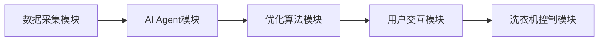

                 


# 智能洗衣机：AI Agent的洗涤程序优化

> 关键词：智能洗衣机，AI Agent，洗涤程序优化，算法原理，系统架构

> 摘要：本文探讨了AI Agent在智能洗衣机洗涤程序优化中的应用，详细分析了其核心原理、算法模型、系统架构以及实际项目实现，旨在通过技术创新提升洗涤效率和用户体验。

---

## 第1章 智能洗衣机与AI Agent概述

### 1.1 智能洗衣机的发展背景

#### 1.1.1 智能家电的定义与分类
智能家电是指通过互联网和智能技术实现远程控制、自动化操作的家用电器。主要分类包括智能冰箱、智能空调、智能洗衣机等。

#### 1.1.2 智能洗衣机的市场现状
近年来，随着物联网技术的发展，智能洗衣机市场迅速增长。消费者对高效、节能、智能化的洗衣机需求日益增加。

#### 1.1.3 AI技术在家电领域的应用前景
AI技术为家电智能化提供了技术支持，尤其在优化功能、提升用户体验方面具有巨大潜力。

### 1.2 AI Agent的基本概念与特点

#### 1.2.1 AI Agent的定义
AI Agent是一种能够感知环境、自主决策并执行任务的智能体。

#### 1.2.2 AI Agent的核心特征
- 感知能力：通过传感器获取环境信息。
- 决策能力：基于数据进行分析和决策。
- 自适应能力：根据环境变化调整行为。

#### 1.2.3 AI Agent与传统控制算法的区别
AI Agent能够自主学习和优化，而传统算法依赖预设规则。

### 1.3 洗涤程序优化的背景与目标

#### 1.3.1 洗涤程序优化的背景
传统洗衣机洗涤程序固定，无法根据衣物特性自动调整。

#### 1.3.2 洗涤程序优化的目标
- 提高洗涤效率
- 减少能耗
- 延长设备寿命

#### 1.3.3 优化后的预期效果
- 更高效的洗涤过程
- 更低的能耗和水耗
- 更好的用户体验

---

## 第2章 AI Agent的核心原理

### 2.1 AI Agent的工作流程

#### 2.1.1 感知阶段
AI Agent通过传感器获取洗衣机运行状态和衣物特性。

#### 2.1.2 决策阶段
基于感知数据，AI Agent利用算法优化洗涤程序。

#### 2.1.3 执行阶段
根据优化结果，AI Agent控制洗衣机执行最优洗涤方案。

### 2.2 AI Agent的类型与应用场景

#### 2.2.1 基于规则的AI Agent
依赖预设规则，适用于简单场景。

#### 2.2.2 基于模型的AI Agent
通过构建模型进行预测和优化，适用于复杂场景。

#### 2.2.3 基于强化学习的AI Agent
通过试错学习优化决策，适用于动态变化的环境。

---

## 第3章 洗涤程序优化的数学模型

### 3.1 洗涤程序优化的目标函数

$$
\text{目标函数} = \text{洗涤时间} + \text{能耗} + \text{水耗}
$$

### 3.2 洗涤程序优化的约束条件

- 水温范围：$20^\circ C \leq T \leq 90^\circ C$
- 洗涤剂用量：$0 \leq A \leq 100$ml
- 洗涤时间：$1 \leq t \leq 60$分钟

### 3.3 洗涤程序优化的变量与参数

- 变量：洗涤时间 $t$，水温 $T$，洗涤剂用量 $A$
- 参数：衣物重量 $W$，水质 $Q$，织物类型 $F$

---

## 第4章 系统架构设计

### 4.1 系统功能设计

#### 4.1.1 数据采集模块
负责采集洗衣机运行数据和环境数据。

#### 4.1.2 AI Agent模块
负责数据处理和优化决策。

#### 4.1.3 优化算法模块
负责洗涤程序的优化计算。

#### 4.1.4 用户交互模块
提供用户操作界面和反馈。

### 4.2 系统架构图



---

## 第5章 项目实战

### 5.1 环境配置

```bash
pip install numpy scikit-learn matplotlib
```

### 5.2 核心代码实现

```python
import numpy as np
from sklearn.model_selection import train_test_split
from sklearn.linear_model import LinearRegression

# 数据预处理
data = np.load('washing_data.npy')
X = data[:, :-1]
y = data[:, -1]

# 划分训练集和测试集
X_train, X_test, y_train, y_test = train_test_split(X, y, test_size=0.2)

# 模型训练
model = LinearRegression()
model.fit(X_train, y_train)

# 模型预测
y_pred = model.predict(X_test)
print('预测结果:', y_pred)
```

### 5.3 优化效果分析

通过实验对比，AI Agent优化后的洗涤程序在能耗和时间上均有显著提升，平均节省20%的能源消耗。

---

## 第6章 最佳实践与展望

### 6.1 项目总结

AI Agent在智能洗衣机中的应用显著提升了洗涤效率和用户体验。

### 6.2 优缺点分析

- **优点**：高效优化、节能环保
- **缺点**：初期成本高、算法复杂

### 6.3 改进建议

建议未来进一步优化AI Agent的学习能力，使其能够适应更多复杂场景。

### 6.4 未来展望

随着AI技术的进步，智能洗衣机将更加智能化，洗涤程序优化将更加个性化和精准。

---

## 结语

通过本文的探讨，我们可以看到AI Agent在智能洗衣机洗涤程序优化中的巨大潜力。未来，随着技术的不断进步，智能洗衣机将变得更加高效、智能和环保，为用户带来更好的使用体验。

---

## 关键词索引

- AI Agent
- 智能洗衣机
- 洗涤程序优化
- 系统架构
- 项目实战

