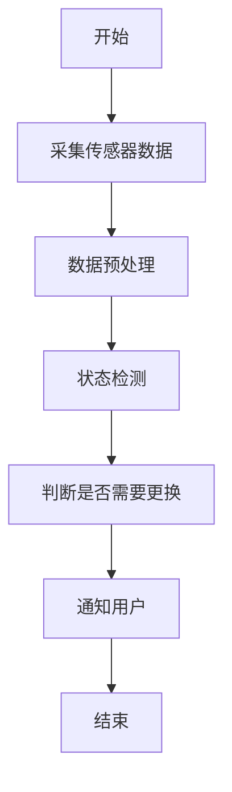
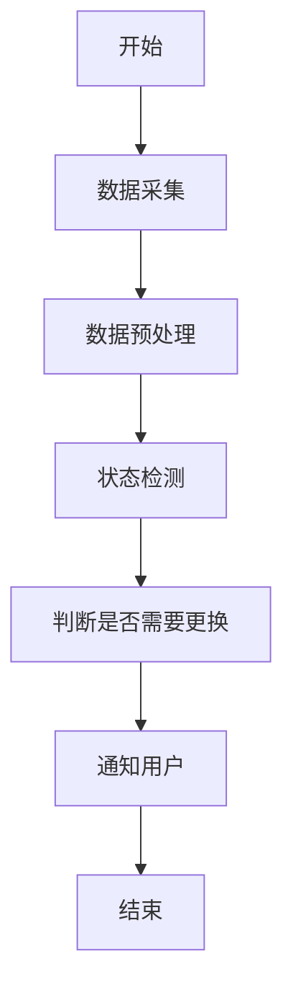
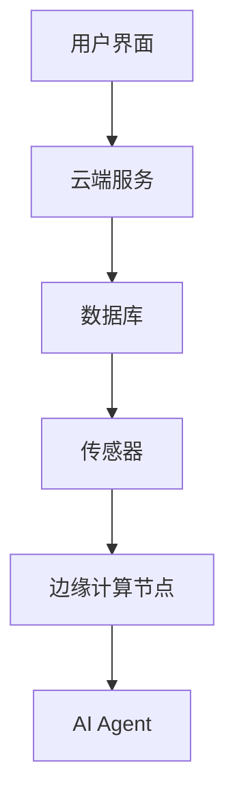
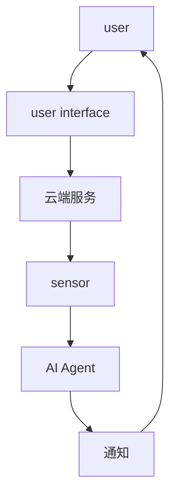

                 


# 智能浴室毛巾架：AI Agent的毛巾更换提醒

> 关键词：智能浴室毛巾架、AI Agent、物联网传感器、智能硬件、智能家居

> 摘要：本文将详细探讨智能浴室毛巾架的设计与实现，重点分析AI Agent在毛巾更换提醒中的应用。通过背景分析、核心算法、系统架构到项目实现的完整流程，揭示如何利用AI技术和物联网传感器实现智能卫浴管理。

---

# 第1章 智能浴室毛巾架的背景与问题背景

## 1.1 问题背景

### 1.1.1 浴室毛巾使用中的常见问题
- **毛巾使用频率高**：浴室是家庭中使用频率最高的场所之一，毛巾每天被使用多次，容易滋生细菌。
- **忘记更换毛巾**：用户常常忘记毛巾需要更换，导致卫生问题。
- **手动管理的不便**：手动记录毛巾使用情况效率低下，容易出错。

### 1.1.2 毛巾更换提醒的必要性
- **卫生问题**：旧毛巾容易积累细菌和污垢，影响健康。
- **使用寿命**：毛巾有一定的使用周期，及时更换可以延长使用寿命。
- **用户体验**：智能提醒可以提升用户体验，让用户更关注个人卫生。

### 1.1.3 解决思路
- **智能化解决方案**：通过AI Agent和物联网传感器实现自动检测和提醒。
- **数据驱动决策**：利用传感器数据和AI算法，智能判断毛巾的使用状态。

---

## 1.2 问题描述

### 1.2.1 毛巾使用周期的定义
- **周期计算**：根据毛巾的使用频率和环境条件，动态调整更换周期。
- **使用频率**：通过传感器记录每天的使用次数和时间。

### 1.2.2 毛巾更换提醒的触发条件
- **使用次数达到阈值**：例如，每周使用超过50次。
- **传感器数据异常**：如湿度异常或细菌检测超标。

### 1.2.3 用户需求与痛点分析
- **用户需求**：用户希望毛巾更换提醒便捷、智能。
- **痛点**：传统管理方式效率低，用户容易遗忘。

---

## 1.3 问题解决思路

### 1.3.1 AI Agent的核心作用
- **数据采集**：通过传感器收集毛巾的使用数据。
- **智能分析**：利用AI算法分析数据，判断是否需要更换毛巾。
- **用户通知**：通过手机App或语音助手通知用户。

### 1.3.2 智能传感器的应用
- **传感器类型**：包括湿度传感器、重量传感器和细菌检测传感器。
- **数据采集**：实时采集毛巾的使用情况和环境数据。

### 1.3.3 数据分析与用户行为预测
- **使用频率预测**：基于历史数据预测未来的使用情况。
- **损耗评估**：根据数据评估毛巾的损耗程度。

---

## 1.4 边界与外延

### 1.4.1 系统边界定义
- **功能边界**：仅限于毛巾更换提醒，不涉及其他卫浴设备。
- **数据范围**：仅处理毛巾相关的数据。

### 1.4.2 功能的外延范围
- **扩展功能**：未来可以扩展到其他卫浴产品，如浴巾、洗漱用品等。
- **场景扩展**：从家庭场景扩展到酒店、健身房等公共场所。

### 1.4.3 与其他智能家居设备的协同
- **协同工作**：与智能马桶、智能淋浴设备联动，提供更全面的卫浴管理。

---

## 1.5 核心要素组成

### 1.5.1 AI Agent的基本构成
- **传感器模块**：用于数据采集。
- **数据处理模块**：用于分析数据。
- **通知模块**：用于提醒用户。

### 1.5.2 智能传感器的技术特点
- **高灵敏度**：传感器能够准确检测毛巾的使用状态。
- **低功耗**：传感器可以在长时间工作下保持低功耗。

### 1.5.3 数据分析与处理机制
- **数据存储**：将采集的数据存储在云端或本地数据库。
- **数据处理**：利用AI算法分析数据，生成提醒信息。

---

# 第2章 AI Agent与智能传感器的核心概念

## 2.1 AI Agent的基本原理

### 2.1.1 AI Agent的定义与特点
- **定义**：AI Agent是一种能够感知环境并采取行动以实现目标的智能体。
- **特点**：自主性、反应性、主动性。

### 2.1.2 AI Agent的核心功能模块
- **感知模块**：通过传感器获取环境数据。
- **决策模块**：根据数据做出决策。
- **执行模块**：通过通知用户或控制设备执行操作。

### 2.1.3 AI Agent与传统算法的区别
| 特性         | AI Agent                | 传统算法                |
|--------------|-------------------------|--------------------------|
| 自主性       | 高                     | 低                     |
| 学习能力     | 强                     | 弱                     |
| 适应性       | 强                     | 一般                   |

---

## 2.2 智能传感器的技术特征

### 2.2.1 传感器类型与功能
- **湿度传感器**：检测毛巾的湿度，判断是否需要晾晒。
- **重量传感器**：检测毛巾的重量变化，判断是否需要更换。
- **细菌检测传感器**：检测毛巾上的细菌数量。

### 2.2.2 数据采集与传输机制
- **采集频率**：每分钟采集一次数据。
- **传输方式**：通过Wi-Fi或蓝牙传输到云端。

### 2.2.3 传感器的安装与维护
- **安装位置**：安装在毛巾架内部或底部。
- **维护周期**：每季度检查一次传感器的准确性。

---

## 2.3 AI Agent与智能传感器的协同工作

### 2.3.1 数据流的传递过程
- **数据采集**：传感器采集毛巾的使用数据。
- **数据传输**：数据通过网络传输到AI Agent。
- **数据分析**：AI Agent分析数据，判断是否需要提醒。
- **通知用户**：通过App或语音助手通知用户。

### 2.3.2 AI Agent的决策机制
- **状态检测**：检测毛巾的当前状态。
- **使用频率预测**：预测未来的使用情况。
- **损耗评估**：评估毛巾的损耗程度。

### 2.3.3 系统的反馈与优化
- **用户反馈**：用户确认提醒信息，系统记录反馈。
- **系统优化**：根据反馈优化算法，提高准确性。

---

## 2.4 核心概念的ER实体关系图

```mermaid
erDiagram
    user [*--- notification : "触发通知"
    towel [*--- sensor_data : "关联传感器数据"
    sensor [*--- sensor_type : "传感器类型"
    notification [*--- notification_channel : "通知渠道"
    sensor_data [*--- towel : "关联毛巾"
```

---

# 第3章 智能浴室毛巾架的算法原理

## 3.1 AI Agent的核心算法

### 3.1.1 状态检测算法
- **算法描述**：通过传感器数据判断毛巾的当前状态。
- **算法步骤**：
  1. 采集传感器数据。
  2. 数据预处理。
  3. 状态判断。

### 3.1.2 使用频率预测算法
- **算法描述**：基于历史数据预测未来的使用频率。
- **算法步骤**：
  1. 收集历史数据。
  2. 建立预测模型。
  3. 预测未来使用频率。

### 3.1.3 损耗程度评估算法
- **算法描述**：评估毛巾的损耗程度。
- **算法步骤**：
  1. 采集传感器数据。
  2. 数据分析。
  3. 评估损耗程度。

---

## 3.2 算法原理的数学模型

### 3.2.1 使用频率预测模型
$$ P(n) = \frac{1}{(n + k)} $$
- **公式解释**：$n$为使用次数，$k$为常数。

### 3.2.2 损耗程度评估模型
$$ D(n) = a \cdot n + b $$
- **公式解释**：$a$为斜率，$b$为截距。

---

## 3.3 算法实现的代码示例

### 3.3.1 状态检测算法
```python
def detect_state(sensor_data):
    if sensor_data['humidity'] > 70 or sensor_data['weight'] > 100:
        return '更换'
    else:
        return '继续使用'
```

### 3.3.2 使用频率预测算法
```python
def predict_frequency(history_data):
    from sklearn import linear_model
    import numpy as np
    x = np.array(range(len(history_data))).reshape(-1, 1)
    y = np.array(history_data)
    model = linear_model.LinearRegression()
    model.fit(x, y)
    return model.predict(x)[-1]
```

### 3.3.3 损耗程度评估算法
```python
def assess_damage(sensor_data):
    damage_level = sensor_data['bacteria_count'] * 0.1 + sensor_data['humidity'] * 0.2
    if damage_level > 0.7:
        return '严重'
    elif damage_level > 0.4:
        return '中等'
    else:
        return '轻微'
```

---

## 3.4 算法流程图



---

## 3.5 算法实现的详细解读

### 3.5.1 状态检测算法
- **实现细节**：通过湿度和重量传感器的数据，判断毛巾是否需要更换。
- **代码解读**：`detect_state`函数返回“更换”或“继续使用”。

### 3.5.2 使用频率预测算法
- **实现细节**：使用线性回归模型预测未来的使用频率。
- **代码解读**：`predict_frequency`函数返回预测的使用频率。

### 3.5.3 损耗程度评估算法
- **实现细节**：根据细菌数量和湿度评估损耗程度。
- **代码解读**：`assess_damage`函数返回“严重”、“中等”或“轻微”。

---

## 3.6 算法的优化与改进

### 3.6.1 算法优化
- **数据预处理**：增加数据清洗步骤，提高算法准确性。
- **模型优化**：使用更复杂的模型，如随机森林，提高预测精度。

### 3.6.2 算法改进
- **实时性优化**：减少算法计算时间，提高实时性。
- **鲁棒性优化**：增强算法对异常数据的处理能力。

---

## 3.7 算法实现的注意事项

### 3.7.1 数据质量问题
- **数据清洗**：确保数据的准确性和完整性。
- **数据存储**：选择合适的存储方案，保证数据的安全性。

### 3.7.2 算法性能优化
- **并行计算**：利用多线程或分布式计算提高算法效率。
- **缓存机制**：减少重复计算，提高运行效率。

---

## 3.8 算法实现的案例分析

### 3.8.1 案例背景
- **用户场景**：一个三口之家，每天使用毛巾的频率较高。
- **数据采集**：传感器每天采集毛巾的湿度、重量和细菌数量。

### 3.8.2 算法应用
- **状态检测**：检测到湿度超过70%，重量超过100g，系统触发更换提醒。
- **使用频率预测**：预测未来一周的使用频率，提前做好准备。

### 3.8.3 算法结果
- **结果解读**：系统成功提醒用户更换毛巾，减少细菌滋生，提升用户体验。

---

## 3.9 算法实现的项目小结

### 3.9.1 章节小结
- **算法实现的核心**：通过传感器数据和AI算法，实现毛巾更换提醒。
- **算法实现的关键点**：数据采集、数据分析和通知用户。

### 3.9.2 章节重点回顾
- **状态检测算法**：判断毛巾是否需要更换。
- **使用频率预测算法**：预测未来的使用情况。
- **损耗程度评估算法**：评估毛巾的损耗程度。

### 3.9.3 章节难点与解决方案
- **难点**：算法的准确性和实时性。
- **解决方案**：优化算法模型，提高计算效率。

---

## 3.10 章节小结

### 3.10.1 章节总结
- 本章详细介绍了智能浴室毛巾架的核心算法，包括状态检测、使用频率预测和损耗程度评估。
- 通过数学公式和代码示例，帮助读者理解算法的实现细节。

### 3.10.2 章节重点回顾
- **算法实现的关键点**：数据采集、数据分析和用户通知。
- **算法优化的方向**：提高算法的准确性和实时性。

### 3.10.3 下一章的预览
- 下一章将介绍智能浴室毛巾架的系统架构设计，包括系统功能设计、系统架构设计和系统交互设计。

---

# 第4章 智能浴室毛巾架的系统架构设计

## 4.1 系统功能设计

### 4.1.1 功能模块划分
- **传感器模块**：负责数据采集。
- **数据处理模块**：负责数据分析和处理。
- **通知模块**：负责通知用户。

### 4.1.2 功能流程图



---

## 4.2 系统架构设计

### 4.2.1 系统架构图



---

## 4.3 系统接口设计

### 4.3.1 传感器接口
- **输入接口**：接收传感器数据。
- **输出接口**：发送数据到云端。

### 4.3.2 用户界面接口
- **输入接口**：接收用户的操作指令。
- **输出接口**：显示通知信息。

---

## 4.4 系统交互设计

### 4.4.1 交互流程图



---

## 4.5 系统架构的优化与改进

### 4.5.1 系统优化
- **数据存储优化**：使用分布式数据库提高数据访问效率。
- **计算优化**：利用边缘计算减少数据传输延迟。

### 4.5.2 系统改进
- **安全性优化**：增加数据加密和访问控制。
- **可扩展性优化**：设计模块化架构，方便功能扩展。

---

## 4.6 系统架构设计的注意事项

### 4.6.1 架构设计的关键点
- **模块化设计**：确保各模块独立性，便于维护和扩展。
- **安全性设计**：保护用户数据和系统安全。

### 4.6.2 架构设计的挑战
- **复杂性**：系统的复杂性可能影响维护和升级。
- **性能**：需要平衡计算资源和存储资源。

### 4.6.3 架构设计的解决方案
- **模块化设计**：采用微服务架构，提高系统的可扩展性。
- **性能优化**：使用缓存技术减少数据库压力。

---

## 4.7 系统架构设计的案例分析

### 4.7.1 案例背景
- **用户场景**：家庭用户使用智能毛巾架。
- **系统架构**：采用边缘计算和云端服务结合的架构。

### 4.7.2 架构实现
- **边缘计算**：在本地进行数据处理和分析。
- **云端服务**：存储数据和提供通知服务。

### 4.7.3 系统优势
- **实时性**：本地处理减少延迟。
- **可靠性**：云端服务提供数据备份和恢复。

---

## 4.8 系统架构设计的项目小结

### 4.8.1 章节小结
- 本章详细介绍了智能浴室毛巾架的系统架构设计，包括功能设计、架构设计和交互设计。
- 通过系统架构图和流程图，帮助读者理解系统的整体结构。

### 4.8.2 章节重点回顾
- **系统架构的核心**：模块化设计和边缘计算结合。
- **系统交互的关键点**：用户界面、传感器和AI Agent的协同工作。

### 4.8.3 章节难点与解决方案
- **难点**：系统复杂性和性能优化。
- **解决方案**：采用微服务架构和边缘计算技术。

---

## 4.9 章节小结

### 4.9.1 章节总结
- 本章详细介绍了智能浴室毛巾架的系统架构设计，包括功能模块划分、系统架构图和交互流程图。
- 通过案例分析，展示了系统架构设计的实际应用。

### 4.9.2 章节重点回顾
- **系统架构设计的关键点**：模块化设计和边缘计算结合。
- **系统交互设计的重点**：用户界面、传感器和AI Agent的协同工作。

### 4.9.3 下一章的预

