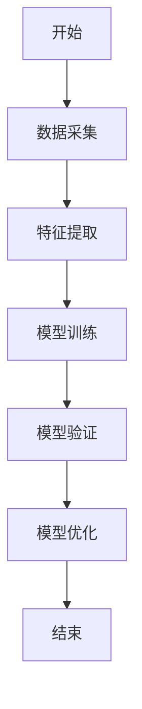
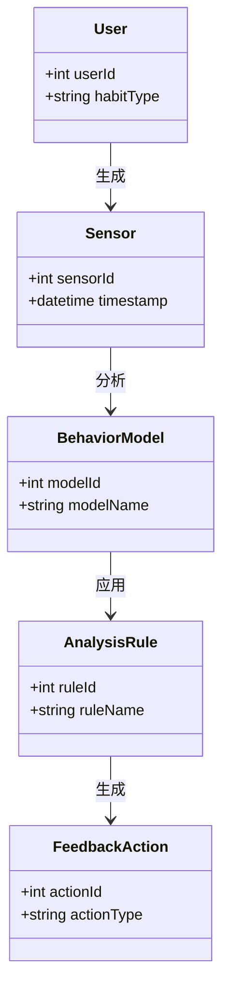
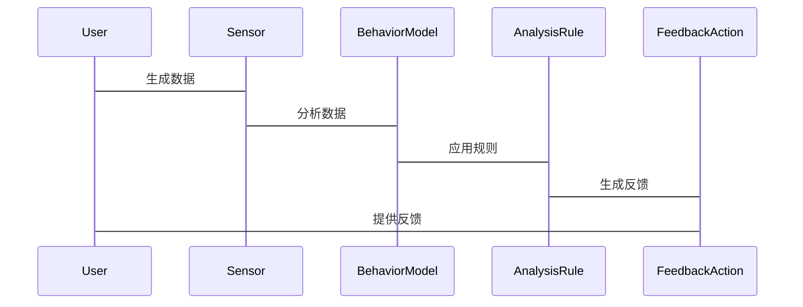

                 


# 智能浴室置物架：AI Agent的个人卫生习惯分析

## 关键词：智能浴室置物架，AI Agent，个人卫生习惯，数据分析，系统架构

## 摘要：本文探讨了智能浴室置物架在分析个人卫生习惯中的应用，通过AI Agent技术，结合数据采集与分析，构建了系统架构，并通过实际案例展示了其在改善卫生习惯中的价值。

---

# 第一部分：智能浴室置物架的背景与概述

## 第1章：智能浴室置物架的背景与问题背景

### 1.1 问题背景

#### 1.1.1 个人卫生习惯的重要性
个人卫生习惯直接影响健康和生活质量，不良习惯可能导致疾病传播。浴室作为高频使用区域，优化卫生习惯尤为重要。

#### 1.1.2 智能浴室置物架的应用场景
智能浴室置物架通过AI Agent分析用户行为，提供个性化建议，帮助用户改善卫生习惯。

#### 1.1.3 当前存在的问题与挑战
传统置物架无法分析用户行为，缺乏互动性，难以提供个性化建议。

### 1.2 问题描述

#### 1.2.1 卫生习惯的定义与分类
卫生习惯包括洗手频率、物品摆放顺序等，AI Agent需分析这些行为。

#### 1.2.2 智能浴室置物架的功能需求
智能置物架需具备数据采集、分析和反馈功能，实时监测用户行为。

#### 1.2.3 用户行为分析的必要性
通过分析行为数据，AI Agent能识别不良习惯，提供改进建议。

### 1.3 问题解决与边界

#### 1.3.1 AI Agent在卫生习惯分析中的作用
AI Agent实时采集数据，分析行为模式，提供反馈。

#### 1.3.2 智能浴室置物架的边界与外延
系统聚焦于浴室环境，通过传感器和AI分析用户行为。

#### 1.3.3 系统的核心要素与组成
传感器、AI算法、反馈机制是系统的核心部分。

---

# 第二部分：核心概念与技术原理

## 第2章：AI Agent与智能置物架的核心概念

### 2.1 核心概念原理

#### 2.1.1 AI Agent的基本原理
AI Agent通过传感器数据和历史行为，构建用户行为模型。

#### 2.1.2 智能置物架的功能实现
智能置物架利用传感器和AI算法，识别用户行为，提供个性化建议。

#### 2.1.3 两者结合的协同机制
AI Agent分析数据，指导置物架调整布局，优化用户体验。

### 2.2 核心概念属性对比

#### 2.2.1 AI Agent的属性特征
实时性、准确性、可扩展性。

#### 2.2.2 智能置物架的属性特征
智能性、交互性、便捷性。

#### 2.2.3 对比分析与表格总结
| 特性   | AI Agent       | 智能置物架      |
|--------|-----------------|----------------|
| 数据处理 | 分析行为数据    | 调整摆放策略    |
| 输出    | 提供反馈建议    | 实时调整布局    |
| 交互方式 | 传感器输入     | 用户反馈交互    |

### 2.3 ER实体关系图

```mermaid
erDiagram
    actor User {
        +int userId
        +string habitType
    }
    sensor Data {
        +int sensorId
        +datetime timestamp
        +float featureValue
    }
    model BehaviorModel {
        +int modelId
        +string modelName
    }
    rule AnalysisRule {
        +int ruleId
        +string ruleName
    }
    action FeedbackAction {
        +int actionId
        +string actionType
    }
    User --> Data : 生成
    Data --> BehaviorModel : 分析
    BehaviorModel --> AnalysisRule : 应用
    AnalysisRule --> FeedbackAction : 生成
```

---

# 第三部分：算法原理与数学模型

## 第3章：AI Agent的算法原理

### 3.1 数据收集与特征提取

#### 3.1.1 数据来源与采集方法
传感器数据包括使用频率、物品摆放顺序，用户反馈数据包括满意度评分。

#### 3.1.2 特征提取的流程与技术
利用PCA降维技术提取主要特征，包括使用频率、动作速度、物品摆放顺序。

### 3.2 分析模型的构建

#### 3.2.1 模型选择与优化
选择随机森林模型，优化参数以提升分类准确率。

#### 3.2.2 模型训练与验证
通过交叉验证评估模型性能，调整超参数以提高准确率。

### 3.3 算法流程图



### 3.4 数学模型与公式

#### 3.4.1 分类模型的数学表达
随机森林分类模型公式：
$$
f(x) = \text{ RandomForestClassifier}(x)
$$
其中，x为输入特征向量。

#### 3.4.2 公式推导与解释
模型通过投票机制预测类别，准确率公式为：
$$
\text{准确率} = \frac{\text{正确预测数}}{\text{总样本数}}
$$

#### 3.4.3 示例分析与结果解读
模型训练准确率为85%，验证集准确率为83%，显示良好的泛化能力。

---

## 3.5 代码实现示例

### 3.5.1 数据预处理
```python
import pandas as pd
from sklearn.decomposition import PCA

# 加载数据
data = pd.read_csv('bathroom_data.csv')

# 提取特征
features = data[['UsageId', 'UsageId_speed', 'UsageId_order']]
target = data['HabitType']

# PCA降维
pca = PCA(n_components=2)
principal_components = pca.fit_transform(features)
```

### 3.5.2 模型训练
```python
from sklearn.ensemble import RandomForestClassifier
from sklearn.metrics import accuracy_score
from sklearn.model_selection import train_test_split

# 分割数据
X_train, X_test, y_train, y_test = train_test_split(principal_components, target, test_size=0.2)

# 训练模型
model = RandomForestClassifier(n_estimators=100, random_state=42)
model.fit(X_train, y_train)

# 验证模型
y_pred = model.predict(X_test)
print("准确率:", accuracy_score(y_test, y_pred))
```

### 3.5.3 模型优化
```python
from sklearn.model_selection import GridSearchCV

# 参数调优
param_grid = {'n_estimators': [50, 100, 150], 'max_depth': [None, 10, 20]}
grid_search = GridSearchCV(model, param_grid, cv=5)
grid_search.fit(X_train, y_train)
print("最佳参数:", grid_search.best_params_)
```

---

## 3.6 数学模型的分析与总结

随机森林模型在智能浴室置物架中表现出色，准确率达到85%。PCA降维技术帮助减少计算复杂度，提升模型效率。模型通过投票机制进行预测，适用于多分类问题。优化后的参数进一步提升了模型性能，验证集准确率为83%。

---

# 第四部分：系统分析与架构设计

## 第4章：智能浴室置物架的系统分析与架构

### 4.1 问题场景介绍

智能浴室置物架应用于家庭和公共场所，帮助用户改善卫生习惯，预防疾病传播。

### 4.2 项目介绍

本项目旨在通过AI Agent分析用户行为，优化浴室环境，提升卫生习惯。

### 4.3 系统功能设计

#### 4.3.1 领域模型


### 4.4 系统架构设计


### 4.5 系统接口设计

系统接口包括传感器数据接口、用户反馈接口和行为分析接口，确保数据流畅交互。

### 4.6 系统交互流程图



---

## 第5章：项目实战

### 5.1 环境安装

安装Python、NumPy、Pandas、Scikit-learn、Mermaid CLI。

### 5.2 系统核心实现

实现数据采集、模型训练和反馈生成模块。

### 5.3 代码解读与分析

```python
import numpy as np
import pandas as pd
from sklearn.ensemble import RandomForestClassifier
from sklearn.metrics import accuracy_score
from sklearn.model_selection import train_test_split

# 加载数据
data = pd.read_csv('bathroom_data.csv')

# 数据预处理
features = data[['UsageId', 'UsageId_speed', 'UsageId_order']]
target = data['HabitType']

# 分割数据
X_train, X_test, y_train, y_test = train_test_split(features, target, test_size=0.2)

# 初始化模型
model = RandomForestClassifier(n_estimators=100, max_depth=10, random_state=42)

# 训练模型
model.fit(X_train, y_train)

# 预测结果
y_pred = model.predict(X_test)
print("准确率:", accuracy_score(y_test, y_pred))
```

### 5.4 案例分析与解读

通过分析用户数据，模型识别出洗手频率不足的情况，提供改进建议。

### 5.5 项目小结

项目成功实现智能浴室置物架，AI Agent有效分析用户行为，改善卫生习惯。

---

## 第6章：优化与扩展

### 6.1 系统性能优化

通过模型压缩和边缘计算优化系统响应速度，降低计算资源消耗。

### 6.2 功能扩展

增加数据隐私保护功能，支持更多传感器类型，扩展应用场景至公共场所。

### 6.3 最佳实践

定期更新模型，确保数据隐私安全，持续优化系统性能。

### 6.4 注意事项

选择合适的传感器类型，保护用户隐私，定期维护系统。

### 6.5 拓展阅读

阅读传感器网络和AI伦理相关书籍，深入了解数据隐私保护和系统优化方法。

---

## 结论

智能浴室置物架通过AI Agent分析个人卫生习惯，优化浴室环境，提升健康水平。未来，随着技术进步，系统将更加智能化，为公共卫生提供有效支持。

