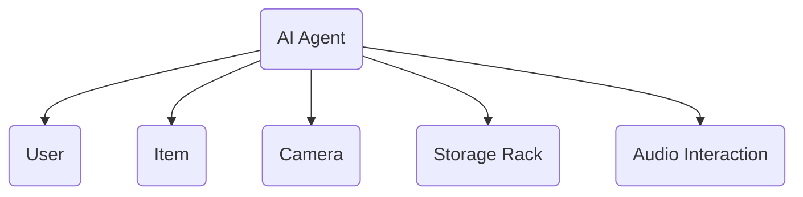
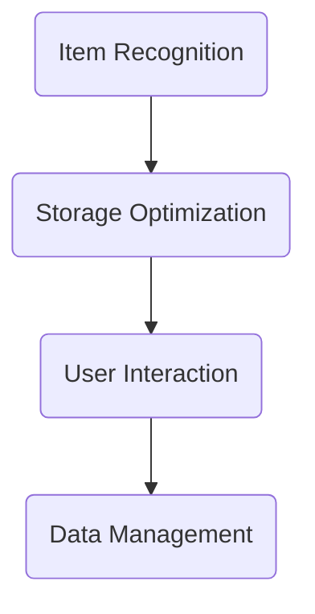
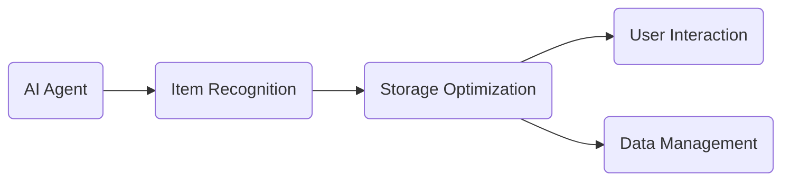
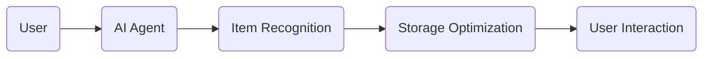

                 


# 智能浴室置物架：AI Agent的洗护用品管理

## 关键词：智能浴室置物架，AI Agent，洗护用品管理，智能家居，算法实现，系统架构，物联网

## 摘要：  
智能浴室置物架通过AI Agent技术实现了洗护用品的智能化管理，优化了传统浴室置物架的不足，提升了用户体验。本文将详细分析AI Agent在智能浴室置物架中的应用，探讨其算法原理、系统架构、项目实现及最佳实践。

---

# 第1章 智能浴室置物架的背景与问题背景

## 1.1 智能浴室置物架的发展背景

### 1.1.1 智能家居的发展现状  
智能家居的普及为生活带来了极大的便利，浴室作为智能家居的重要组成部分，逐渐从单一的功能性空间向智能化、个性化方向发展。智能浴室置物架作为智能家居的一部分，正在逐步成为提升用户体验的核心设备之一。

### 1.1.2 洗护用品管理的痛点与需求  
传统浴室置物架存在空间利用不足、物品管理混乱、用户体验差等问题。用户需要一种能够智能化管理洗护用品的解决方案，从而提升生活品质。

### 1.1.3 AI Agent在智能家居中的应用潜力  
AI Agent（智能代理）是一种能够自主决策、执行任务的智能实体，其在智能家居中的应用前景广阔。通过AI Agent技术，智能浴室置物架可以实现物品的智能识别、分类、存储和提醒功能，满足用户的多样化需求。

---

## 1.2 问题背景与目标

### 1.2.1 洗护用品管理中的常见问题  
传统浴室置物架存在的主要问题包括：  
1. **空间利用不足**：用户常常因为物品摆放混乱而导致空间浪费。  
2. **管理不便**：物品查找困难，容易遗漏或重复购买。  
3. **用户体验差**：传统置物架缺乏智能化，无法与用户互动，无法满足个性化需求。  

### 1.2.2 智能浴室置物架的目标功能  
智能浴室置物架的目标功能包括：  
1. **智能化物品管理**：通过AI Agent实现物品的自动识别、分类和存储。  
2. **用户交互**：支持语音或App端的用户交互，方便用户查看、管理和调整物品信息。  
3. **动态优化**：根据用户使用习惯动态优化物品存储方案，提升空间利用率。  

### 1.2.3 边界与外延  
智能浴室置物架的边界主要限定在洗护用品的管理范围内，不涉及其他智能家居设备的联动。外延则包括与智能音箱、智能灯等设备的协同工作，进一步提升用户体验。

---

## 1.3 核心概念与系统架构

### 1.3.1 AI Agent的定义与特点  
AI Agent是一种能够感知环境、自主决策并执行任务的智能实体。其特点包括：  
1. **自主性**：能够在没有人工干预的情况下独立运行。  
2. **反应性**：能够根据环境变化实时调整行为。  
3. **目标导向**：以特定目标为导向，优化决策过程。  

### 1.3.2 智能浴室置物架的功能模块  
智能浴室置物架的功能模块包括：  
1. **物品识别模块**：通过图像识别技术识别洗护用品。  
2. **存储管理模块**：根据识别结果优化物品存储方案。  
3. **用户交互模块**：支持语音或App端的用户交互。  
4. **数据管理模块**：存储和管理用户数据及物品信息。  

### 1.3.3 系统的核心要素与组成  
智能浴室置物架的核心要素包括：  
1. **硬件设备**：包括传感器、摄像头、存储架等。  
2. **AI Agent算法**：包括物品识别、路径规划等算法。  
3. **用户界面**：包括App端和语音交互界面。  

---

# 第2章 AI Agent的核心概念与原理

## 2.1 AI Agent的基本原理

### 2.1.1 AI Agent的定义与分类  
AI Agent可以根据智能水平分为：  
1. **反应式AI Agent**：根据当前环境信息实时调整行为。  
2. **认知式AI Agent**：具备复杂推理和规划能力。  

### 2.1.2 AI Agent的核心特征  
AI Agent的核心特征包括：  
1. **感知能力**：能够通过传感器或摄像头感知环境信息。  
2. **决策能力**：能够基于感知信息做出决策。  
3. **执行能力**：能够通过执行器完成决策任务。  

### 2.1.3 AI Agent与传统管理方式的对比  
与传统管理方式相比，AI Agent的优势在于：  
1. **自动化**：无需人工干预即可完成任务。  
2. **智能化**：能够根据环境变化优化决策。  
3. **高效性**：通过算法优化提高效率。  

---

## 2.2 AI Agent在智能浴室置物架中的应用

### 2.2.1 AI Agent的功能模块  
AI Agent在智能浴室置物架中的功能模块包括：  
1. **物品识别模块**：通过图像识别技术识别物品类型和数量。  
2. **存储优化模块**：根据物品类型和数量优化存储方案。  
3. **用户交互模块**：通过语音或App端与用户互动。  

### 2.2.2 AI Agent与智能浴室置物架的交互流程  
AI Agent与智能浴室置物架的交互流程如下：  
1. **感知环境**：AI Agent通过传感器感知置物架的状态。  
2. **识别物品**：通过图像识别技术识别物品类型和数量。  
3. **优化存储**：根据识别结果优化物品存储方案。  
4. **用户交互**：通过语音或App端与用户互动，提供信息查询和操作反馈。  

### 2.2.3 AI Agent的决策机制  
AI Agent的决策机制包括：  
1. **路径规划**：通过路径规划算法优化物品存储位置。  
2. **动态调整**：根据用户行为动态调整存储方案。  

---

## 2.3 核心概念的ER实体关系图



---

# 第3章 AI Agent的算法原理与实现

## 3.1 算法原理概述

### 3.1.1 算法的核心思想  
AI Agent的算法核心思想是通过感知环境信息，利用机器学习和优化算法，实现物品的智能化管理。

### 3.1.2 算法的输入与输出  
- **输入**：物品类型、数量、存储空间状态。  
- **输出**：最优存储方案、操作指令。  

### 3.1.3 算法的数学模型与公式  
算法的数学模型可以表示为：  
$$ f(x) = \text{优化目标函数} $$  
其中，\( x \) 表示输入变量，\( f(x) \) 表示优化目标函数。  

---

## 3.2 算法实现的详细步骤

### 3.2.1 数据预处理  
数据预处理包括：  
1. **图像采集**：通过摄像头采集物品图像。  
2. **图像增强**：对图像进行增强处理，提高识别精度。  

### 3.2.2 模型训练  
模型训练包括：  
1. **特征提取**：提取物品的特征信息。  
2. **分类器训练**：训练分类器，实现物品识别。  

### 3.2.3 模型优化与调参  
模型优化包括：  
1. **调整超参数**：优化算法参数，提高识别精度。  
2. **模型评估**：通过测试集评估模型性能。  

---

## 3.3 算法的数学模型与公式

### 3.3.1 算法的数学模型  
$$ y = f(x) $$  
其中，\( y \) 表示输出，\( x \) 表示输入，\( f \) 表示算法模型。  

### 3.3.2 算法的优化公式  
$$ \theta = \theta - \eta \cdot \frac{\partial L}{\partial \theta} $$  
其中，\( \theta \) 表示模型参数，\( \eta \) 表示学习率，\( L \) 表示损失函数。  

---

# 第4章 智能浴室置物架的系统架构与设计

## 4.1 系统功能设计

### 4.1.1 功能模块划分  
系统功能模块包括：  
1. **物品识别模块**：通过图像识别技术识别物品类型和数量。  
2. **存储优化模块**：根据识别结果优化物品存储方案。  
3. **用户交互模块**：支持语音或App端的用户交互。  
4. **数据管理模块**：存储和管理用户数据及物品信息。  

### 4.1.2 功能流程图  


---

## 4.2 系统架构设计

### 4.2.1 系统架构图  


### 4.2.2 系统组件之间的关系  
- **AI Agent**：作为系统的核心，协调各模块的工作。  
- **物品识别模块**：负责物品的识别和分类。  
- **存储优化模块**：根据识别结果优化存储方案。  
- **用户交互模块**：支持语音或App端的用户交互。  
- **数据管理模块**：存储和管理用户数据及物品信息。  

---

## 4.3 系统接口设计

### 4.3.1 系统接口描述  
系统接口包括：  
1. **摄像头接口**：用于图像采集。  
2. **存储架接口**：用于物品存储和取出。  
3. **语音交互接口**：用于用户语音指令的接收和反馈。  

### 4.3.2 接口交互流程  
1. **用户发出语音指令**：例如“请帮我整理毛巾”。  
2. **AI Agent接收指令**：启动物品识别模块。  
3. **物品识别模块工作**：识别物品类型和数量。  
4. **存储优化模块优化存储方案**：调整物品位置。  
5. **语音交互模块反馈结果**：通知用户整理完成。  

---

## 4.4 系统交互设计

### 4.4.1 系统交互流程图  


### 4.4.2 交互过程描述  
- **用户发起请求**：通过App或语音助手发起物品管理请求。  
- **AI Agent响应请求**：启动物品识别和存储优化模块。  
- **物品识别模块工作**：识别物品类型和数量。  
- **存储优化模块优化存储方案**：调整物品位置。  
- **用户交互模块反馈结果**：通知用户操作完成。  

---

# 第5章 项目实战：智能浴室置物架的实现

## 5.1 环境安装与配置

### 5.1.1 硬件设备安装  
1. **摄像头安装**：安装摄像头并连接到AI Agent系统。  
2. **存储架安装**：安装存储架并连接到AI Agent系统。  
3. **传感器安装**：安装传感器用于感知环境状态。  

### 5.1.2 软件环境配置  
1. **操作系统安装**：安装Linux或Windows操作系统。  
2. **开发工具安装**：安装Python、TensorFlow、OpenCV等开发工具。  

---

## 5.2 系统核心实现

### 5.2.1 物品识别模块实现  
```python
import cv2

def recognize_item(image):
    # 图像预处理
    gray = cv2.cvtColor(image, cv2.COLOR_BGR2GRAY)
    # 使用预训练模型进行物品识别
    model = load_model('item_recognition_model')
    prediction = model.predict(gray)
    return prediction
```

### 5.2.2 存储优化模块实现  
```python
def optimize_storage(predictions):
    # 根据预测结果优化存储方案
    storage_plan = {}
    for item in predictions:
        storage_plan[item] = storage_plan.get(item, 0) + 1
    return storage_plan
```

---

## 5.3 代码实现与解读

### 5.3.1 物品识别模块代码  
```python
import cv2
import numpy as np

def recognize_item(image):
    # 图像预处理
    gray = cv2.cvtColor(image, cv2.COLOR_BGR2GRAY)
    # 使用预训练模型进行物品识别
    model = load_model('item_recognition_model')
    prediction = model.predict(gray)
    return prediction
```

### 5.3.2 存储优化模块代码  
```python
def optimize_storage(predictions):
    # 根据预测结果优化存储方案
    storage_plan = {}
    for item in predictions:
        storage_plan[item] = storage_plan.get(item, 0) + 1
    return storage_plan
```

---

## 5.4 案例分析与实际应用

### 5.4.1 案例分析  
假设用户有以下物品：  
- 洗发水2瓶  
- 牙刷2支  
- 毛巾3条  

AI Agent会根据物品类型和数量优化存储方案，例如：  
- 将洗发水放在顶部，牙刷放在中间，毛巾放在底部。  

### 5.4.2 实际应用中的注意事项  
1. **环境光线**：确保摄像头所在的环境光线充足，避免光线不足影响识别精度。  
2. **物品摆放**：物品应整齐摆放，避免杂乱无章影响识别效果。  
3. **系统维护**：定期更新模型和优化算法，提升识别精度和存储效率。  

---

# 第6章 优化与扩展

## 6.1 算法优化与性能提升

### 6.1.1 算法优化策略  
1. **优化模型结构**：通过调整模型参数和结构提升识别精度。  
2. **引入数据增强**：通过数据增强技术增加训练数据量。  
3. **优化训练策略**：采用迁移学习、批量训练等策略提升训练效率。  

### 6.1.2 性能提升方法  
1. **硬件优化**：通过升级硬件配置提升系统运行效率。  
2. **算法优化**：通过优化算法复杂度降低计算成本。  
3. **并行计算**：利用多核处理器或GPU加速计算。  

---

## 6.2 系统扩展与功能增强

### 6.2.1 功能扩展方向  
1. **智能推荐**：根据用户的使用习惯推荐洗护用品的购买计划。  
2. **健康监测**：通过传感器监测浴室环境的空气质量、温湿度等参数。  
3. **远程控制**：通过手机App远程控制置物架的存储状态。  

### 6.2.2 技术扩展方案  
1. **引入物联网技术**：通过物联网技术实现与其他智能家居设备的联动。  
2. **引入云计算**：通过云计算技术实现数据的集中管理和分析。  
3. **引入AI新算法**：引入最新的AI算法提升系统的智能化水平。  

---

## 6.3 最佳实践与注意事项

### 6.3.1 最佳实践  
1. **定期维护**：定期检查硬件设备和软件系统，确保其正常运行。  
2. **数据安全**：加强数据安全防护，防止用户隐私泄露。  
3. **用户体验优化**：根据用户反馈不断优化系统功能和界面设计。  

### 6.3.2 注意事项  
1. **硬件兼容性**：确保硬件设备与系统兼容，避免出现兼容性问题。  
2. **系统稳定性**：确保系统的稳定性和可靠性，避免因系统故障影响用户体验。  
3. **数据备份**：定期备份重要数据，防止数据丢失。  

---

# 第7章 总结与展望

## 7.1 总结  
智能浴室置物架通过AI Agent技术实现了洗护用品的智能化管理，提升了用户体验。本文详细介绍了AI Agent的核心概念、算法原理、系统架构和项目实现，并探讨了系统的优化与扩展方向。

## 7.2 展望  
未来，随着AI技术的不断发展，智能浴室置物架将具备更多的功能和更高的智能化水平。例如，通过引入更多的传感器和AI算法，系统将能够更精准地识别物品、优化存储方案，并与更多的智能家居设备实现联动，为用户提供更加智能化、个性化的服务。

---

# 结语  
智能浴室置物架作为智能家居的重要组成部分，其智能化管理将为用户带来更加便捷、舒适的生活体验。通过本文的详细分析，读者可以深入了解AI Agent在智能浴室置物架中的应用，为后续的研究和实践提供参考。

