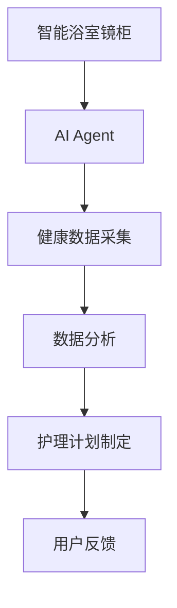
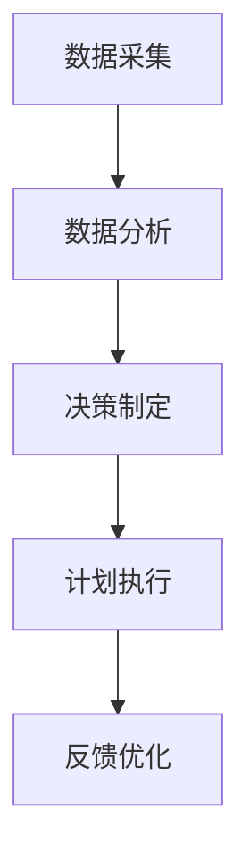
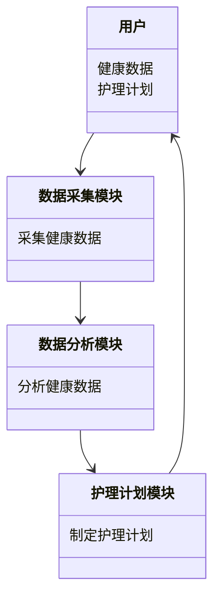
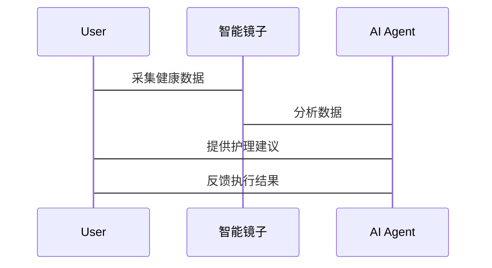

                 


# 智能浴室镜柜：AI Agent的个人护理计划制定

## 关键词：智能浴室镜柜，AI Agent，个人护理计划，智能镜子，健康管理

## 摘要：本文详细探讨了智能浴室镜柜与AI Agent结合的个人护理计划制定技术。通过分析背景、核心概念、算法原理、系统架构、项目实战和最佳实践，本文为读者提供了一套完整的解决方案，帮助用户更好地理解和应用这一创新技术。

---

# 第一部分: 智能浴室镜柜与AI Agent的背景介绍

# 第1章: 背景与问题背景

## 1.1 智能浴室镜柜的背景

### 1.1.1 智能家居的发展趋势

智能家居的普及为日常生活带来了诸多便利，浴室作为家庭中重要的空间之一，也在逐步智能化。智能浴室镜柜的出现，不仅改变了传统浴室的使用方式，还通过AI技术实现了个性化的健康管理。

### 1.1.2 智能浴室镜柜的兴起

随着科技的发展，智能镜子逐渐从概念走向实际应用。智能浴室镜柜的兴起，源于人们对高效、个性化的健康管理需求。通过整合AI技术，镜子不再是单纯的装饰品，而是成为个人健康助手。

### 1.1.3 个人护理与健康管理的结合

现代人对健康越来越重视，个人护理不再局限于日常清洁，而是延伸到健康管理。智能浴室镜柜通过AI Agent，能够根据用户的健康数据，制定个性化的护理计划，帮助用户更好地管理健康。

## 1.2 问题背景与目标

### 1.2.1 当前个人护理存在的问题

传统个人护理方式存在效率低、缺乏个性化、数据分散等问题。用户难以根据自身健康状况调整护理计划，且缺乏专业的健康建议。

### 1.2.2 智能浴室镜柜的解决方案

通过AI Agent，智能浴室镜柜能够实时采集用户的健康数据，结合大数据分析，为用户提供个性化的护理建议，帮助用户实现高效、精准的健康管理。

### 1.2.3 本项目的核心目标

本项目旨在通过智能浴室镜柜与AI Agent的结合，开发一套能够制定个性化护理计划的系统，实现从数据采集到计划执行的全流程智能化管理。

## 1.3 问题描述与解决思路

### 1.3.1 个人护理计划的需求分析

用户需要根据自身的健康状况，制定个性化的护理计划，包括清洁、保湿、防晒等多方面。AI Agent需要能够根据用户的健康数据，动态调整护理计划。

### 1.3.2 AI Agent在个人护理中的作用

AI Agent通过数据采集、分析和决策，为用户提供智能化的护理建议。它能够学习用户的健康数据，优化护理计划，提升用户体验。

### 1.3.3 智能浴室镜柜的技术实现路径

通过整合传感器、AI算法和大数据分析，智能浴室镜柜能够实时采集用户的健康数据，结合云端数据，制定个性化的护理计划。

## 1.4 边界与外延

### 1.4.1 智能浴室镜柜的功能边界

智能浴室镜柜的核心功能包括健康数据采集、个性化护理建议、计划执行反馈等。其外延包括与其他智能家居设备的协同工作，如智能灯、智能空调等。

### 1.4.2 与其他智能家居设备的协同

智能浴室镜柜可以与家中的其他智能设备联动，例如根据用户的健康数据调整室温、湿度等，提供更加舒适的居住环境。

### 1.4.3 个人护理计划的外延扩展

未来的智能浴室镜柜可能扩展到更广泛的健康管理领域，例如疾病预防、慢性病管理等，为用户提供更加全面的健康服务。

## 1.5 概念结构与核心要素

### 1.5.1 智能浴室镜柜的核心组成

- 硬件部分：镜子、传感器、摄像头、显示屏等。
- 软件部分：AI算法、数据处理模块、用户界面等。

### 1.5.2 AI Agent的构成要素

- 数据采集模块：负责采集用户的健康数据。
- 数据分析模块：对数据进行处理和分析。
- 决策模块：根据分析结果，制定护理计划。
- 交互模块：与用户进行实时互动。

### 1.5.3 个人护理计划的要素分析

- 用户健康数据：包括皮肤状况、作息时间、健康指标等。
- 护理目标：根据数据制定的个性化护理方案。
- 计划执行：用户按照计划执行护理步骤。
- 反馈优化：根据执行结果调整护理计划。

## 1.6 本章小结

本章通过分析智能浴室镜柜的背景、问题背景和核心概念，为后续的技术实现奠定了基础。通过了解AI Agent的作用和智能浴室镜柜的组成，读者可以更好地理解本项目的技术路线。

---

# 第二部分: 核心概念与联系

# 第2章: AI Agent与智能镜子的核心概念

## 2.1 AI Agent的基本原理

### 2.1.1 AI Agent的定义与特点

AI Agent是一种能够感知环境并采取行动以实现目标的智能体。它具有自主性、反应性、学习性和社会性等特点，能够在复杂环境中自主决策。

### 2.1.2 AI Agent的核心算法

- 机器学习算法：用于数据处理和模式识别。
- 自然语言处理：实现人机交互。
- 优化算法：用于制定最优护理计划。

### 2.1.3 AI Agent的交互方式

通过语音交互、手势交互和视觉交互等方式，AI Agent能够与用户进行实时互动，提供个性化的服务。

## 2.2 智能镜子的功能与技术实现

### 2.2.1 智能镜子的硬件组成

- 显示屏：用于显示健康数据和护理建议。
- 传感器：采集用户的健康数据，如心率、体温等。
- 摄像头：用于面部识别和健康监测。

### 2.2.2 智能镜子的软件架构

- 数据采集模块：负责采集用户的健康数据。
- 数据分析模块：对数据进行处理和分析。
- 用户界面：展示健康数据和护理建议。

### 2.2.3 智能镜子与AI Agent的结合

通过AI Agent，智能镜子能够实时分析用户的健康数据，制定个性化的护理计划，并通过显示屏和语音交互向用户反馈。

## 2.3 个人护理计划的核心要素

### 2.3.1 个人护理计划的制定流程

1. 数据采集：采集用户的健康数据。
2. 数据分析：分析数据，识别健康问题。
3. 计划制定：根据分析结果，制定个性化护理计划。
4. 计划执行：用户按照计划执行护理步骤。
5. 反馈优化：根据执行结果，优化护理计划。

### 2.3.2 数据采集与分析

通过传感器和摄像头采集用户的健康数据，利用机器学习算法进行分析，识别潜在的健康问题。

### 2.3.3 计划执行与反馈

用户执行护理计划，系统通过反馈优化护理计划，提升用户体验。

## 2.4 核心概念的联系与对比

### 2.4.1 AI Agent与智能镜子的对比分析

| **特性** | **AI Agent** | **智能镜子** |
|----------|--------------|--------------|
| 功能     | 数据分析、决策 | 显示数据、交互 |
| 技术实现 | 机器学习、NLP | 传感器、显示屏 |

### 2.4.2 个人护理计划与其他健康管理工具的对比

| **工具**      | **智能浴室镜柜** | **传统健康管理工具** |
|---------------|------------------|-----------------------|
| 核心功能      | AI驱动的护理计划 | 手动记录、简单分析   |
| 个性化程度   | 高度个性化       | 较低                  |
| 技术实现      | 结合AI Agent     | 依赖人工操作          |

### 2.4.3 智能浴室镜柜的系统架构图（Mermaid）



---

# 第三部分: 算法原理讲解

# 第3章: AI Agent的算法原理

## 3.1 AI Agent的工作流程

### 3.1.1 数据采集

通过智能镜子的传感器和摄像头，采集用户的健康数据，如心率、皮肤状况等。

### 3.1.2 数据分析

利用机器学习算法对数据进行分析，识别用户的健康问题，如皮肤干燥、疲劳等。

### 3.1.3 决策与计划制定

基于分析结果，AI Agent制定个性化的护理计划，如增加保湿、调整作息等。

### 3.1.4 计划执行与反馈

用户执行护理计划，系统通过反馈优化计划，提升用户体验。

## 3.2 算法实现的数学模型

### 3.2.1 健康数据的分析模型

健康数据的分析可以通过以下模型实现：

$$
\text{健康状况} = f(\text{心率}, \text{皮肤状况}, \text{体温})
$$

其中，$f$ 是一个机器学习模型，用于预测用户的健康状况。

### 3.2.2 个性化护理计划的优化算法

个性化护理计划的优化可以通过以下算法实现：

$$
\text{优化目标} = \min_{x} \sum_{i=1}^{n} (x_i - d_i)^2
$$

其中，$x_i$ 是护理计划的参数，$d_i$ 是数据的目标值。

## 3.3 算法实现的代码示例

以下是一个简单的AI Agent算法实现代码：

```python
import numpy as np
from sklearn import linear_model

# 数据采集
data = np.array([[20, 30], [25, 35], [30, 40]])

# 数据分析
X = data[:, 0]
y = data[:, 1]

# 建立模型
model = linear_model.LinearRegression()
model.fit(X.reshape(-1, 1), y)

# 预测结果
predicted = model.predict(X.reshape(-1, 1))
print(predicted)
```

## 3.4 算法流程图（Mermaid）



---

# 第四部分: 系统分析与架构设计

# 第4章: 智能浴室镜柜的系统架构设计

## 4.1 项目背景与目标

本项目旨在通过智能浴室镜柜与AI Agent的结合，实现个性化的个人护理计划制定。

## 4.2 系统功能设计

### 4.2.1 功能模块划分

- 数据采集模块：负责采集用户的健康数据。
- 数据分析模块：对数据进行处理和分析。
- 护理计划模块：根据分析结果，制定个性化护理计划。
- 用户交互模块：与用户进行实时互动。

### 4.2.2 领域模型类图（Mermaid）



## 4.3 系统架构设计

### 4.3.1 系统架构图（Mermaid）


### 4.3.2 系统交互流程图（Mermaid）



---

# 第五部分: 项目实战

# 第5章: 项目实战与代码实现

## 5.1 环境安装与配置

### 5.1.1 安装Python与相关库

```bash
pip install numpy scikit-learn
```

## 5.2 系统核心实现代码

### 5.2.1 数据采集模块

```python
import numpy as np

# 采集健康数据
data = np.array([[20, 30], [25, 35], [30, 40]])
```

### 5.2.2 数据分析模块

```python
from sklearn import linear_model

# 建立模型
model = linear_model.LinearRegression()
model.fit(X.reshape(-1, 1), y)
```

### 5.2.3 护理计划模块

```python
# 制定护理计划
plan = model.predict(X.reshape(-1, 1))
```

## 5.3 实际案例分析

### 5.3.1 案例分析

假设用户的心率数据为25，体温数据为35。通过模型分析，预测用户的健康状况，并制定相应的护理计划。

### 5.3.2 代码实现

```python
# 数据分析
X = data[:, 0]
y = data[:, 1]

# 建立模型
model = linear_model.LinearRegression()
model.fit(X.reshape(-1, 1), y)

# 预测结果
predicted = model.predict(X.reshape(-1, 1))
print(predicted)
```

## 5.4 项目小结

通过项目实战，读者可以更好地理解智能浴室镜柜与AI Agent结合的实现过程。通过代码实现，读者可以掌握数据分析和个性化护理计划制定的核心技术。

---

# 第六部分: 最佳实践

# 第6章: 最佳实践与经验分享

## 6.1 最佳实践

### 6.1.1 数据采集的注意事项

- 确保数据的准确性和完整性。
- 定期更新数据，保持模型的准确性。

### 6.1.2 系统优化的建议

- 定期更新AI模型，提升预测精度。
- 提供多样化的用户交互方式，提升用户体验。

## 6.2 小结

通过本文的讲解与实战，读者可以全面了解智能浴室镜柜与AI Agent结合的个人护理计划制定技术。从背景介绍到系统设计，再到项目实战，本文为读者提供了一套完整的解决方案。

## 6.3 注意事项

- 数据安全：确保用户健康数据的安全性，防止数据泄露。
- 系统稳定性：确保系统的稳定运行，避免因故障影响用户体验。

## 6.4 拓展阅读

- 《AI在健康管理中的应用》
- 《智能镜子的技术与实现》

---

# 结语

智能浴室镜柜与AI Agent的结合，为个人护理计划的制定带来了全新的思路。通过本文的讲解，读者可以掌握相关技术的核心原理和实现方法。未来，随着AI技术的不断发展，智能浴室镜柜将为用户提供更加智能化、个性化的健康服务。

---

通过以上目录结构，您可以根据需要逐步展开各章节内容，撰写一篇详细的技术博客文章。

