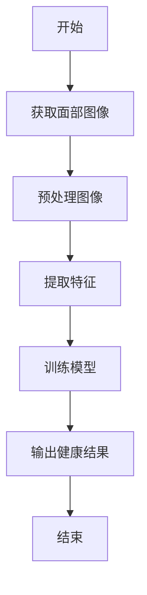
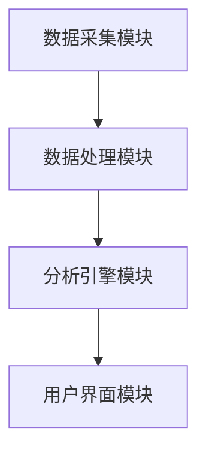

                 


# 智能浴室镜：AI Agent的健康状态分析

## 关键词：人工智能、AI Agent、智能镜子、健康监测、图像识别、机器学习、深度学习

## 摘要：本文探讨了智能浴室镜如何通过AI技术实现健康监测。从背景到技术原理，再到系统架构和项目实战，深入分析了AI Agent在健康状态分析中的应用。文章最后总结了开发经验，并展望了未来的发展方向。

---

## 第一部分：背景介绍

### 第1章：问题背景与目标

#### 1.1 问题背景
随着科技的进步，健康监测已成为日常生活的重要部分。智能浴室镜作为一种创新的健康监测工具，通过AI技术，能够在镜子表面显示用户的健康数据，如皮肤状况、情绪变化等。这种集成化的设备不仅方便了用户的日常使用，还能够实时监测健康状况，及时发现潜在问题。

#### 1.2 问题描述
传统浴室镜仅用于反射影像，无法提供额外信息。现代健康监测设备通常分散，使用不便。智能浴室镜的目标是将健康监测功能集成到镜子中，提供便捷的健康数据分析，帮助用户实时了解健康状况。

#### 1.3 问题解决
通过AI技术，智能浴室镜可以实时捕捉用户的面部数据，分析健康指标，如皮肤状况、情绪状态等。数据通过镜子显示，用户可以即时获取健康反馈，及时采取措施。

#### 1.4 边界与外延
智能浴室镜专注于面部数据分析，不涉及其他身体数据。未来可能扩展至全身检测或其他健康指标。

### 第2章：核心概念与联系

#### 2.1 AI Agent的基本原理
AI Agent通过传感器和摄像头收集数据，利用机器学习模型进行分析，并将结果反馈给用户。在智能浴室镜中，AI Agent负责图像处理、数据分析和结果展示。

#### 2.2 健康状态分析的核心要素
- **数据采集**：通过摄像头捕捉面部图像。
- **数据处理**：预处理图像，提取特征。
- **数据分析**：使用机器学习模型分析特征，得出健康指标。
- **结果反馈**：通过镜子显示分析结果。

#### 2.3 系统架构的ER实体关系图
```mermaid
erDiagram
    user {
        id
        name
        age
        gender
        health_data
    }
    sensor {
        id
        type
        location
        measurement_time
        value
    }
    analysis_result {
        id
        user_id
        timestamp
        health_score
        status
    }
    user <o-1> sensor
    sensor <o-1> analysis_result
```

---

## 第二部分：算法原理与实现

### 第3章：AI Agent的算法原理

#### 3.1 图像处理与特征提取
- **图像采集**：使用摄像头获取面部图像。
- **预处理**：调整亮度、对比度，去除噪声。
- **特征提取**：利用卷积神经网络（CNN）提取面部特征。

#### 3.2 深度学习模型
- **模型选择**：使用预训练的CNN模型，如ResNet。
- **训练过程**：使用标注数据训练模型，优化权重。
- **结果分析**：输出健康指标，如皮肤状况、情绪状态。

#### 3.3 算法流程图


#### 3.4 代码实现
```python
import cv2
import numpy as np
import tensorflow as tf

# 图像预处理
def preprocess_image(image_path):
    img = cv2.imread(image_path)
    img = cv2.resize(img, (224, 224))
    img = img.astype(np.float32) / 255.0
    return img

# 特征提取
model = tf.keras.applications.ResNet50(weights='imagenet', include_top=False)
feature = model.predict(preprocess_image(image_path))[0, 0, 0, :]
```

---

## 第三部分：系统分析与架构设计

### 第4章：系统架构设计

#### 4.1 系统模块划分
- **数据采集模块**：负责获取面部图像。
- **数据处理模块**：处理图像数据。
- **分析引擎模块**：运行AI模型，分析健康状态。
- **用户界面模块**：显示分析结果。

#### 4.2 系统架构图


#### 4.3 接口设计
- **数据接口**：摄像头和传感器的数据输入接口。
- **用户界面接口**：显示健康结果的接口。

---

## 第四部分：项目实战

### 第5章：项目实战与代码实现

#### 5.1 环境安装
- **安装Python**：版本3.6以上。
- **安装库**：TensorFlow、OpenCV、Keras。

#### 5.2 核心代码实现
```python
import cv2
import numpy as np
import tensorflow as tf

# 加载预训练模型
model = tf.keras.applications.ResNet50(weights='imagenet', include_top=False)

# 数据预处理
def preprocess_image(img):
    img = cv2.resize(img, (224, 224))
    img = img.astype(np.float32) / 255.0
    img = np.expand_dims(img, axis=0)
    return img

# 分析健康状态
def analyze_health(img):
    feature = model.predict(preprocess_image(img))[0]
    return feature

# 示例图像分析
image_path = 'face.jpg'
img = cv2.imread(image_path)
result = analyze_health(img)
print("Health Analysis Result:", result)
```

---

## 第五部分：最佳实践与总结

### 第6章：最佳实践与总结

#### 6.1 小结
智能浴室镜通过AI技术实现了便捷的健康监测，结合图像识别和深度学习，能够实时分析用户的健康状态。

#### 6.2 注意事项
- 数据隐私保护至关重要。
- 系统需要定期更新模型，提高准确性。
- 用户需了解设备的局限性，结合其他健康监测手段。

#### 6.3 拓展阅读
- 探索更多AI在健康监测中的应用。
- 深入研究深度学习模型的优化方法。

---

通过以上结构，文章系统地介绍了智能浴室镜的开发背景、技术原理、系统设计和实际应用，为读者提供了全面的技术视角。

