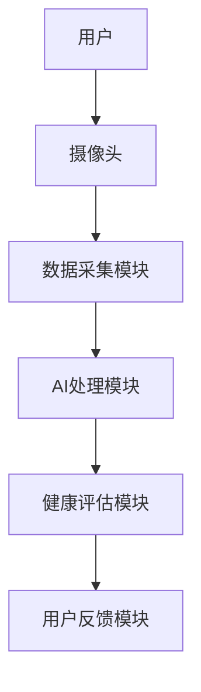
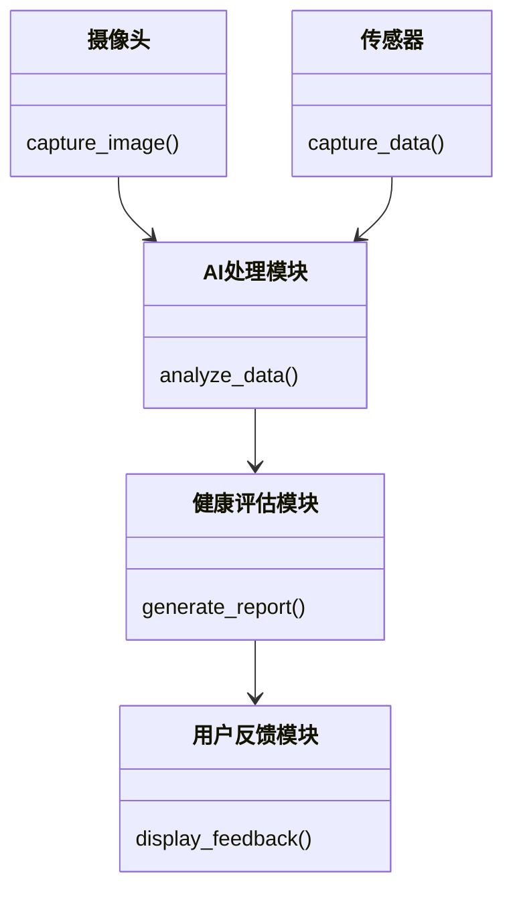
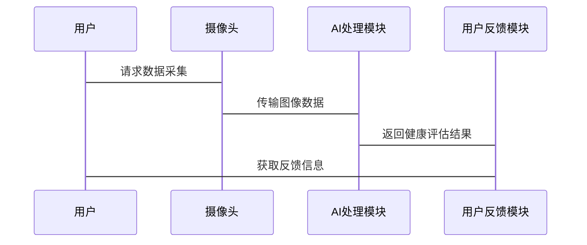

                 


# 智能浴室镜：AI Agent的健康状态评估

---

## 关键词
智能浴室镜, AI Agent, 健康状态评估, 人工智能, 图像识别, 数据分析, 深度学习

---

## 摘要
智能浴室镜通过集成AI Agent技术，能够实时采集用户的生理数据、行为数据和环境数据，并利用深度学习算法进行健康状态评估。本文从智能浴室镜的发展背景、技术原理、系统架构、项目实战等方面，详细分析了AI Agent在健康状态评估中的应用，探讨了其在医疗健康领域的潜力与挑战。

---

# 第一部分: 智能浴室镜与AI Agent的背景与概念

## 第1章: 智能浴室镜的发展与应用

### 1.1 智能浴室镜的定义与特点
#### 1.1.1 传统浴室镜的功能局限性
传统浴室镜仅具备基础的反射功能，无法满足现代用户对智能化、个性化的需求。

#### 1.1.2 智能浴室镜的定义
智能浴室镜是一种集成AI技术的智能设备，能够通过摄像头、传感器等硬件采集用户数据，并利用AI算法进行分析与反馈。

#### 1.1.3 智能浴室镜的核心功能与优势
- **数据采集**：通过摄像头、麦克风、温度传感器等设备采集用户的生理数据和环境数据。
- **AI分析**：利用深度学习算法对采集的数据进行分析，评估用户的健康状态。
- **智能反馈**：根据分析结果，为用户提供个性化的健康建议和生活指导。

### 1.2 AI Agent在智能浴室镜中的作用
#### 1.2.1 AI Agent的基本概念
AI Agent是一种智能体，能够感知环境、自主决策并执行任务。在智能浴室镜中，AI Agent负责数据采集、分析和反馈。

#### 1.2.2 AI Agent在智能浴室镜中的应用场景
- **健康监测**：实时监测用户的体重、体脂、皮肤状态等生理指标。
- **行为分析**：分析用户的洗漱习惯、作息规律等行为数据。
- **环境监测**：监测浴室的温度、湿度、空气质量等环境数据。

#### 1.2.3 AI Agent的核心功能与技术特点
- **数据处理能力**：能够高效处理多模态数据（图像、语音、传感器数据）。
- **自主学习能力**：通过机器学习算法不断优化健康评估模型。
- **实时反馈能力**：能够快速响应用户的操作并提供实时反馈。

### 1.3 智能浴室镜的健康状态评估背景
#### 1.3.1 健康状态评估的定义与重要性
健康状态评估是通过采集和分析用户的生理数据、行为数据和环境数据，评估用户的健康状况并提供个性化建议的过程。

#### 1.3.2 智能浴室镜在健康评估中的独特优势
- **便捷性**：用户可以在日常生活中通过镜子完成健康监测，无需额外设备。
- **实时性**：能够实时采集和分析数据，提供即时反馈。
- **隐私性**：数据采集和分析在本地完成，保护用户隐私。

#### 1.3.3 健康状态评估的边界与外延
健康状态评估不仅关注生理指标，还包括心理健康、生活习惯等多方面因素。

### 1.4 本章小结
智能浴室镜通过集成AI Agent技术，能够高效采集和分析用户的健康数据，为用户提供个性化的健康评估和建议。这种智能化的健康监测方式具有广泛的应用前景。

---

# 第二部分: 健康状态评估的核心概念与技术原理

## 第2章: 健康数据的采集与处理

### 2.1 健康数据的采集方法
#### 2.1.1 视频图像采集技术
- 使用摄像头采集用户的面部图像，用于皮肤状态分析。
- 示例代码：
  ```python
  import cv2
  cap = cv2.VideoCapture(0)
  while cap.isOpened():
      ret, frame = cap.read()
      if not ret:
          break
      cv2.imshow('Camera', frame)
      if cv2.waitKey(1) == ord('q'):
          break
  cap.release()
  cv2.destroyAllWindows()
  ```

#### 2.1.2 语音识别技术
- 使用麦克风采集用户的语音数据，用于情绪分析和健康对话。
- 示例代码：
  ```python
  import speech_recognition as sr
  r = sr.Recognizer()
  audio_file = sr.AudioFile("test.wav")
  with audio_file作为 audio_source:
      audio = r.record(audio_source)
  try:
      text = r.recognize_google(audio)
      print("识别结果：", text)
  except sr.UnknownValueError:
      print("无法识别音频")
  ```

#### 2.1.3 生物特征数据采集（如心率、体温）
- 使用心率传感器和温度传感器采集用户的生理数据。
- 示例代码：
  ```python
  import adafruit sensors
  # 假设使用Adafruit心跳传感器
  sensor = adafruit_heart_sensor.HeartSensor()
  heart_rate = sensor.read_heart_rate()
  print("当前心率：", heart_rate)
  ```

### 2.2 数据预处理与特征提取
#### 2.2.1 图像数据的预处理方法
- 图像增强：调整亮度、对比度等参数。
- 示例代码：
  ```python
  import cv2
  img = cv2.imread('input.jpg')
  gray = cv2.cvtColor(img, cv2.COLOR_BGR2GRAY)
  cv2.imwrite('output.jpg', gray)
  ```

#### 2.2.2 语音数据的特征提取
- 提取梅尔频率倒谱系数（MFCC）。
- 示例代码：
  ```python
  import librosa
  y, sr = librosa.load('test.wav')
  mfccs = librosa.feature.mfcc(y, sr)
  print("MFCC shape:", mfccs.shape)
  ```

#### 2.2.3 生物特征数据的标准化处理
- 标准化处理：将数据归一化到统一范围。
- 示例代码：
  ```python
  import numpy as np
  data = np.array([100, 200, 300])
  normalized_data = (data - np.mean(data)) / np.std(data)
  print("标准化数据：", normalized_data)
  ```

### 2.3 数据分析与健康评估模型
#### 2.3.1 数据分析的基本方法
- 统计分析：计算均值、方差等统计指标。
- 数据可视化：使用折线图、柱状图等展示数据。
- 示例代码：
  ```python
  import matplotlib.pyplot as plt
  data = [10, 20, 30, 40, 50]
  plt.plot(data)
  plt.show()
  ```

#### 2.3.2 健康评估模型的构建
- 基于机器学习的分类模型：如支持向量机（SVM）、随机森林（Random Forest）。
- 示例代码：
  ```python
  from sklearn.svm import SVC
  model = SVC()
  model.fit(X_train, y_train)
  y_pred = model.predict(X_test)
  ```

#### 2.3.3 模型的验证与优化
- 交叉验证：评估模型的泛化能力。
- 调参优化：使用网格搜索（Grid Search）优化模型参数。
- 示例代码：
  ```python
  from sklearn.model_selection import GridSearchCV
  param_grid = {'C': [1, 10, 100], 'kernel': ['linear', 'rbf']}
  grid_search = GridSearchCV(SVC(), param_grid, cv=5)
  grid_search.fit(X_train, y_train)
  best_params = grid_search.best_params_
  print("最佳参数：", best_params)
  ```

## 第3章: AI Agent的健康状态评估算法原理

### 3.1 基于深度学习的健康评估算法
#### 3.1.1 卷积神经网络（CNN）在图像识别中的应用
- 示例代码：
  ```python
  import keras
  model = keras.Sequential([
      keras.layers.Conv2D(32, (3,3), activation='relu', input_shape=(64, 64, 3)),
      keras.layers.MaxPooling2D((2,2)),
      keras.layers.Flatten(),
      keras.layers.Dense(128, activation='relu'),
      keras.layers.Dense(1, activation='sigmoid')
  ])
  model.compile(optimizer='adam', loss='binary_crossentropy', metrics=['accuracy'])
  model.fit(X_train, y_train, epochs=10, batch_size=32)
  ```

#### 3.1.2 循环神经网络（RNN）在时间序列数据处理中的应用
- 示例代码：
  ```python
  import tensorflow as tf
  model = tf.keras.Sequential([
      tf.keras.layers.SimpleRNN(32, return_sequences=True, input_shape=(None, 1)),
      tf.keras.layers.TimeDistributed(tf.keras.layers.Dense(1, activation='sigmoid'))
  ])
  model.compile(optimizer='adam', loss='binary_crossentropy', metrics=['accuracy'])
  model.fit(X_train, y_train, epochs=10, batch_size=32)
  ```

#### 3.1.3 图神经网络（GNN）在关联数据中的应用
- 示例代码：
  ```python
  import tensorflow as tf
  class GraphConvolution(tf.keras.layers.Layer):
      def build(self, input_shape):
          self.kernel = self.add_weight(name='kernel', 
                                        shape=(input_shape[-1], self.filters),
                                        initializer='glorot_uniform')
          super(GraphConvolution, self).build(input_shape)
      
      def call(self, inputs, graph结构):
          支持的操作
          return tf.nn.relu(tf.matmul(inputs, self.kernel) + self.bias)
  model = tf.keras.Sequential([
      GraphConvolution(filters=32, activation='relu'),
      tf.keras.layers.Dense(1, activation='sigmoid')
  ])
  model.compile(optimizer='adam', loss='binary_crossentropy', metrics=['accuracy'])
  model.fit(X_train, y_train, epochs=10, batch_size=32)
  ```

### 3.2 健康状态评估的数学模型
#### 3.2.1 基于回归的健康评估模型
- 示例代码：
  ```python
  import tensorflow as tf
  model = tf.keras.Sequential([
      tf.keras.layers.Dense(64, activation='relu', input_shape=(n_features,)),
      tf.keras.layers.Dense(1, activation='linear')
  ])
  model.compile(optimizer='adam', loss='mean_squared_error', metrics=['mae'])
  ```

#### 3.2.2 基于分类的健康评估模型
- 示例代码：
  ```python
  import tensorflow as tf
  model = tf.keras.Sequential([
      tf.keras.layers.Dense(64, activation='relu', input_shape=(n_features,)),
      tf.keras.layers.Dense(2, activation='softmax')
  ])
  model.compile(optimizer='adam', loss='sparse_categorical_crossentropy', metrics=['accuracy'])
  ```

#### 3.2.3 基于聚类的健康评估模型
- 示例代码：
  ```python
  from sklearn.cluster import KMeans
  kmeans = KMeans(n_clusters=3, random_state=0)
  kmeans.fit(X)
  labels = kmeans.labels_
  ```

### 3.3 算法实现与优化
#### 3.3.1 算法实现的步骤与流程
- 数据预处理
- 模型训练
- 模型评估
- 模型优化

#### 3.3.2 算法优化的策略与方法
- 参数调整
- 模型融合
- 增加数据量

#### 3.3.3 算法的性能评估与对比分析
- 准确率
- 召回率
- F1分数

---

## 第4章: 系统架构与功能设计

### 4.1 智能浴室镜系统的整体架构



### 4.2 系统功能设计



### 4.3 系统接口设计



### 4.4 本章小结
智能浴室镜的系统架构设计是实现AI Agent健康评估功能的关键。通过合理设计模块之间的交互关系，能够高效地完成数据采集、分析和反馈。

---

## 第5章: 项目实战

### 5.1 环境安装与配置
- 安装Python、TensorFlow、OpenCV、SpeechRecognition等库。

### 5.2 核心代码实现
#### 5.2.1 数据采集模块
```python
import cv2
import speech_recognition as sr

def capture_image():
    cap = cv2.VideoCapture(0)
    ret, frame = cap.read()
    cv2.imwrite("face.jpg", frame)
    cap.release()

def capture_audio():
    r = sr.Recognizer()
    audio_file = sr.AudioFile("test.wav")
    with audio_file作为 audio_source:
        audio = r.record(audio_source)
    try:
        text = r.recognize_google(audio)
        print("识别结果：", text)
    except sr.UnknownValueError:
        print("无法识别音频")
```

#### 5.2.2 数据分析与处理模块
```python
import tensorflow as tf
from sklearn.model_selection import train_test_split
import cv2

def preprocess_image():
    img = cv2.imread("face.jpg")
    gray = cv2.cvtColor(img, cv2.COLOR_BGR2GRAY)
    cv2.imwrite("face_gray.jpg", gray)

def train_model():
    # 假设我们有训练数据X和标签y
    X_train, X_test, y_train, y_test = train_test_split(X, y, test_size=0.2)
    model = tf.keras.Sequential([
        tf.keras.layers.Conv2D(32, (3,3), activation='relu', input_shape=(64, 64, 1)),
        tf.keras.layers.MaxPooling2D((2,2)),
        tf.keras.layers.Flatten(),
        tf.keras.layers.Dense(128, activation='relu'),
        tf.keras.layers.Dense(1, activation='sigmoid')
    ])
    model.compile(optimizer='adam', loss='binary_crossentropy', metrics=['accuracy'])
    model.fit(X_train, y_train, epochs=10, batch_size=32, validation_data=(X_test, y_test))
```

#### 5.2.3 健康评估与反馈模块
```python
def generate_feedback():
    # 假设我们有一个健康评估模型
    model = tf.keras.Sequential([
        tf.keras.layers.Dense(128, activation='relu', input_shape=(n_features,)),
        tf.keras.layers.Dense(1, activation='sigmoid')
    ])
    # 加载训练好的模型
    model.load_weights("model.h5")
    # 获取用户数据
    user_data = get_user_data()
    # 预测健康状态
    prediction = model.predict(user_data)
    # 返回反馈
    return prediction

def display_feedback(feedback):
    print("健康评估结果：", feedback)
```

### 5.3 实际案例分析与详细讲解
- 采集用户的面部图像和语音数据。
- 使用预训练模型进行健康评估。
- 根据评估结果提供个性化建议。

### 5.4 项目总结与优化建议
- 当前项目的优缺点。
- 未来优化的方向。

---

## 第6章: 数学模型与算法优化

### 6.1 基于深度学习的健康评估模型
#### 6.1.1 深度学习模型的数学表达
$$
\text{模型输出} = \text{全连接层}( \text{激活函数}( \text{全连接层}( \text{激活函数}( \text{卷积层}(输入) ) ) )
$$

#### 6.1.2 模型的训练与优化
- 损失函数：交叉熵损失。
- 优化器：Adam优化器。
- 正则化：L2正则化。

### 6.2 基于传统机器学习的健康评估模型
#### 6.2.1 支持向量机（SVM）
- 示例代码：
  ```python
  from sklearn.svm import SVC
  model = SVC(C=1, kernel='linear')
  model.fit(X_train, y_train)
  ```

#### 6.2.2 随机森林（Random Forest）
- 示例代码：
  ```python
  from sklearn.ensemble import RandomForestClassifier
  model = RandomForestClassifier(n_estimators=100)
  model.fit(X_train, y_train)
  ```

### 6.3 算法的数学推导与对比分析
- 对比不同算法的数学表达和性能表现。

---

## 第7章: 系统总结与未来展望

### 7.1 系统总结
- 系统的整体架构。
- 各模块的功能实现。

### 7.2 未来展望
- 技术进步带来的新可能性。
- 智能浴室镜在医疗健康领域的拓展应用。

### 7.3 项目实战中的注意事项
- 数据隐私保护。
- 系统稳定性和安全性。

---

## 结语

智能浴室镜通过AI Agent技术，将健康监测融入日常生活。本文从技术原理、系统设计、项目实战等多个方面进行了详细探讨，为智能浴室镜的开发和应用提供了理论支持和实践指导。

---

## 参考文献
（此处列出相关的技术文献和参考资料）

---

## 致谢
感谢读者的关注与支持！

