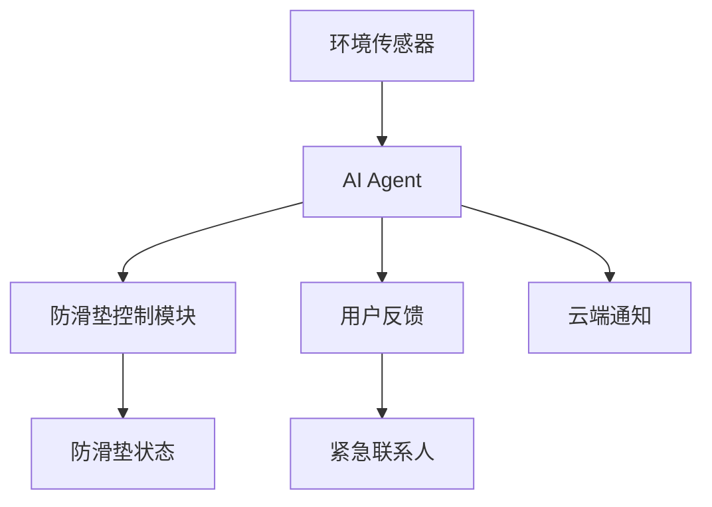
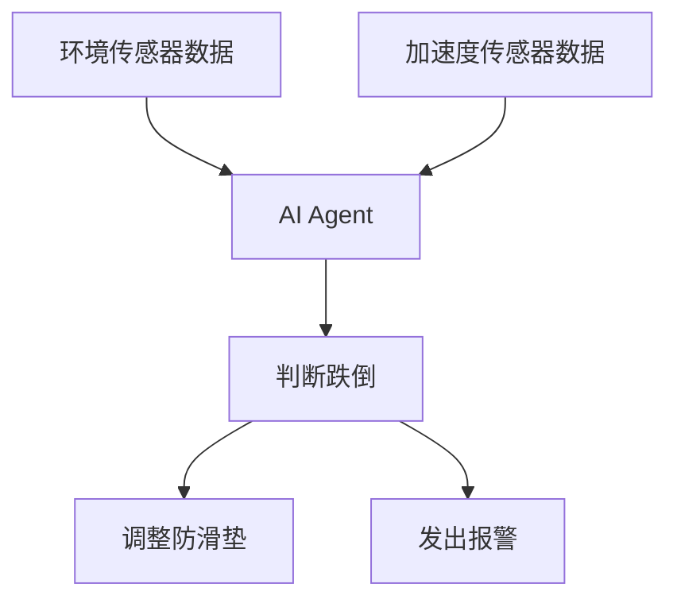
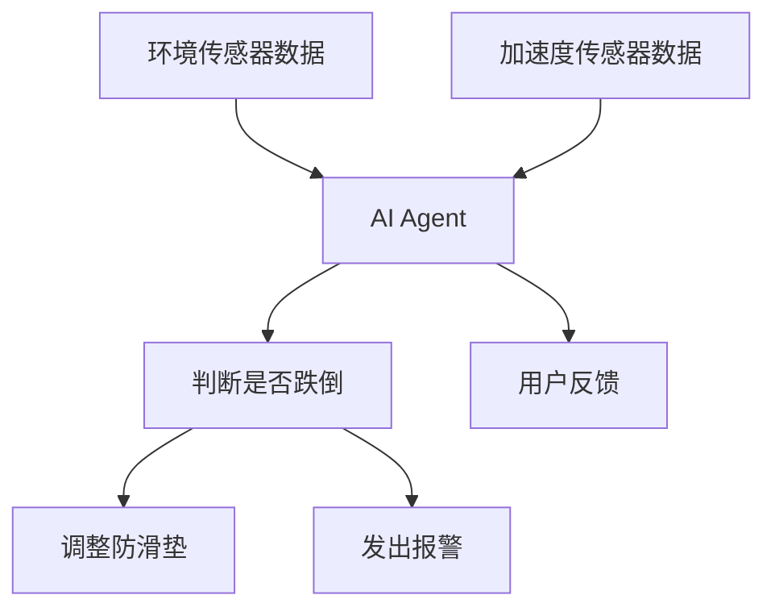
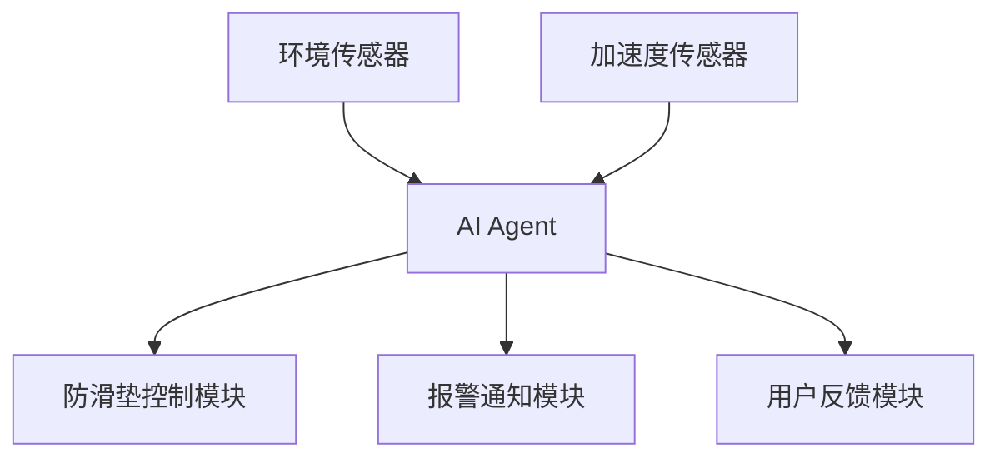
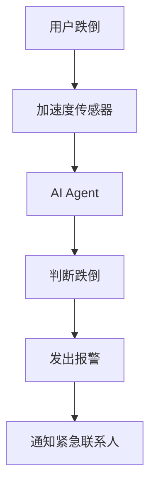

                 


# 《智能浴室防滑垫：AI Agent的老人关怀系统》

## 关键词：智能防滑垫, AI Agent, 老人关怀, 浴室安全, 跌倒检测

## 摘要：  
本文探讨了如何通过AI Agent技术实现智能浴室防滑垫，为老年人提供安全、智能的浴室环境。文章从问题背景、核心概念、算法原理、系统架构到项目实战，全面分析了智能防滑垫的设计与实现过程，结合实际案例，展示了如何利用AI技术提升老年人的生活质量。

---

# 第一部分：背景介绍

## 第1章：老年人浴室安全问题与智能防滑垫的必要性

### 1.1 问题背景  
#### 1.1.1 老年人浴室安全问题的现状  
根据统计，老年人浴室跌倒事故率逐年上升，已成为威胁老年人生命安全的主要因素之一。传统防滑垫的功能单一，无法实时感知环境变化和用户状态，难以满足老年人的安全需求。  

#### 1.1.2 跌倒事故的严重性  
跌倒可能导致骨折、卧床不起甚至死亡，尤其是对于老年人来说，跌倒后的康复周期长，生活质量受到严重影响。  

#### 1.1.3 智能防滑垫的提出背景  
随着人工智能技术的快速发展，结合AI Agent（智能代理）技术的智能防滑垫应运而生，旨在通过实时监测和智能干预，降低老年人在浴室中的跌倒风险。  

### 1.2 问题描述  
#### 1.2.1 老年人浴室环境的危险因素  
浴室环境复杂，包括湿滑地面、水蒸气影响视线、老年人身体机能下降等因素，增加了跌倒的风险。  

#### 1.2.2 防滑垫的传统功能与局限性  
传统防滑垫仅能提供物理防滑功能，无法感知环境变化和用户状态，难以满足智能化需求。  

#### 1.2.3 智能化解决方案的需求  
通过AI Agent技术，实现防滑垫的智能化，实时感知环境和用户状态，主动发出预警或调整防滑性能。  

### 1.3 问题解决  
#### 1.3.1 AI Agent在防滑垫中的应用  
AI Agent通过感知环境和用户行为，实时调整防滑垫的防滑性能，主动发出预警，降低跌倒风险。  

#### 1.3.2 智能防滑垫的功能设计  
智能防滑垫集成了环境传感器、跌倒检测算法和AI Agent，能够实时监测环境和用户状态，主动提供安全保护。  

#### 1.3.3 系统的目标与实现路径  
系统的目标是通过智能化设计，实现对老年人在浴室中的全方位安全保护。实现路径包括硬件设计、算法开发和系统集成。  

### 1.4 系统边界与外延  
#### 1.4.1 系统的功能边界  
系统主要功能包括环境监测、跌倒检测、报警通知和用户反馈。  

#### 1.4.2 系统的适用场景  
适用于家庭浴室、养老院等老年人日常生活场景。  

#### 1.4.3 系统的扩展性与兼容性  
系统支持与其他智能家居设备的联动，例如与智能门锁、紧急呼叫系统等兼容。  

### 1.5 核心要素组成  
#### 1.5.1 系统的核心功能模块  
- 环境传感器模块：监测浴室环境参数，如温湿度、光照强度。  
- 跌倒检测模块：通过加速度传感器实时监测用户动作。  
- AI Agent模块：分析传感器数据，判断是否需要发出预警。  
- 防滑垫控制模块：根据AI Agent的指令调整防滑性能。  

#### 1.5.2 系统的组成结构  
系统由硬件部分（环境传感器、防滑垫、AI Agent控制器）和软件部分（跌倒检测算法、AI Agent算法）组成。  

#### 1.5.3 系统的用户群体与交互方式  
用户群体主要是老年人，交互方式包括语音指令、手机APP远程控制和自动预警。  

---

# 第二部分：核心概念与联系

## 第2章：AI Agent与智能防滑垫的核心原理  

### 2.1 AI Agent的基本原理  
#### 2.1.1 AI Agent的定义与特点  
AI Agent是一种能够感知环境、自主决策并执行任务的智能体。它具备感知能力、决策能力和执行能力，能够根据环境变化调整自身行为。  

#### 2.1.2 AI Agent的核心功能  
- 感知环境：通过传感器获取环境数据。  
- 决策判断：基于感知数据做出决策。  
- 执行动作：根据决策结果执行相应的动作。  

#### 2.1.3 AI Agent在智能防滑垫中的应用  
AI Agent通过感知浴室环境和用户行为，实时调整防滑垫的防滑性能，并在检测到跌倒风险时发出预警。  

### 2.2 智能防滑垫的功能实现  
#### 2.2.1 智能防滑垫的感知功能  
- 通过环境传感器监测浴室温湿度、光照强度等参数。  
- 通过加速度传感器监测用户的动作状态。  

#### 2.2.2 智能防滑垫的决策功能  
AI Agent根据传感器数据判断是否需要调整防滑性能或发出预警。  

#### 2.2.3 智能防滑垫的执行功能  
- 根据AI Agent的指令调整防滑垫的防滑性能。  
- 在检测到跌倒时，发出报警信号并通知相关紧急联系人。  

### 2.3 核心概念对比  
#### 2.3.1 传统防滑垫与智能防滑垫的功能对比  

| 功能维度       | 传统防滑垫                     | 智能防滑垫                     |
|----------------|-------------------------------|-------------------------------|
| 防滑性能        | 固定防滑系数                   | 动态调节防滑性能               |
| 智能化程度      | 无智能化功能                   | 集成AI Agent，具备智能化功能   |
| 用户交互方式    | 仅提供物理防滑效果             | 支持语音指令和APP远程控制       |
| 应用场景        | 适用于所有浴室                 | 专注于老年人浴室安全保护       |

#### 2.3.2 AI Agent与其他智能设备的对比  
AI Agent与其他智能设备的主要区别在于其自主决策能力。AI Agent能够根据环境变化自主调整行为，而其他智能设备通常需要用户手动控制或通过固定程序运行。  

#### 2.3.3 系统中各模块的属性特征对比  
- 环境传感器模块：实时感知环境数据，具备高灵敏度和准确性。  
- AI Agent模块：具备自主决策能力，能够根据传感器数据做出判断。  
- 防滑垫控制模块：能够根据AI Agent的指令动态调整防滑性能。  

### 2.4 实体关系图  



---

# 第三部分：算法原理讲解

## 第3章：跌倒检测算法与AI Agent的实现  

### 3.1 跌倒检测算法原理  
跌倒检测算法通过分析用户的加速度数据，判断用户是否发生跌倒。  

#### 3.1.1 数据采集  
通过加速度传感器采集用户的加速度数据，数据频率为50Hz。  

#### 3.1.2 数据预处理  
对采集到的数据进行滑动窗口处理，提取窗口内的最大加速度值和平均加速度值。  

#### 3.1.3 数据分析  
基于滑动窗口的加速度数据，判断用户是否发生跌倒。跌倒的判定条件如下：  
- 最大加速度大于阈值（例如，$max\_acceleration > 15 \, m/s^2$）。  
- 平均加速度小于阈值（例如，$avg\_acceleration < 5 \, m/s^2$）。  

#### 3.1.4 算法实现  
以下是跌倒检测算法的Python代码示例：  

```python
import numpy as np

def detect_fall(acc_data, window_size=10):
    window = acc_data[-window_size:]
    max_acc = np.max(window)
    avg_acc = np.mean(window)
    if max_acc > 15 and avg_acc < 5:
        return True
    else:
        return False
```

#### 3.1.5 举例说明  
假设加速度数据窗口为 `[8, 9, 10, 12, 14, 16, 13, 11, 9, 8]`，其中最大值为16，平均值为10。由于最大值大于15且平均值小于10，算法会判断为跌倒。  

### 3.2 AI Agent的实现  
AI Agent通过分析环境传感器数据和跌倒检测结果，决定是否需要调整防滑垫的防滑性能或发出报警信号。  

#### 3.2.1 系统输入  
- 环境传感器数据：温湿度、光照强度。  
- 加速度传感器数据：用户动作状态。  

#### 3.2.2 系统输出  
- 防滑垫控制信号：动态调整防滑性能。  
- 报警信号：在检测到跌倒时通知紧急联系人。  

#### 3.2.3 算法流程图  



---

# 第四部分：系统分析与架构设计

## 第4章：智能防滑垫系统的架构设计  

### 4.1 项目介绍  
本项目旨在设计一个基于AI Agent的智能防滑垫系统，为老年人提供安全的浴室环境。  

### 4.2 系统功能设计  
#### 4.2.1 系统功能模块  
- 环境监测模块：监测浴室温湿度、光照强度。  
- 跌倒检测模块：实时检测用户的跌倒风险。  
- AI Agent模块：分析传感器数据，判断是否需要调整防滑性能或发出报警信号。  
- 用户反馈模块：通过手机APP或语音助手与用户交互。  

#### 4.2.2 系统功能流程  
以下是系统功能流程的mermaid图：  



### 4.3 系统架构设计  
#### 4.3.1 系统架构图  



#### 4.3.2 系统接口设计  
- 环境传感器接口：提供温湿度、光照强度数据。  
- 加速度传感器接口：提供用户动作数据。  
- 防滑垫控制接口：接收AI Agent的控制信号。  
- 报警通知接口：通知紧急联系人或云端系统。  

#### 4.3.3 系统交互流程  
以下是用户触发报警的交互流程图：  



---

# 第五部分：项目实战

## 第5章：智能防滑垫系统的实现  

### 5.1 环境安装  
#### 5.1.1 系统开发环境  
- 操作系统：Raspbian  
- 开发工具：Python、TensorFlow  
- 硬件设备：Raspberry Pi、环境传感器、加速度传感器、防滑垫控制模块  

#### 5.1.2 依赖安装  
```bash
pip install numpy tensorflow
```

### 5.2 核心代码实现  
#### 5.2.1 跌倒检测算法实现  
```python
import numpy as np

def detect_fall(acc_data, window_size=10):
    window = acc_data[-window_size:]
    max_acc = np.max(window)
    avg_acc = np.mean(window)
    if max_acc > 15 and avg_acc < 5:
        return True
    else:
        return False
```

#### 5.2.2 AI Agent实现  
```python
class AI-Agent:
    def __init__(self):
        self.acceleration_data = []
    
    def process_data(self, new_data):
        self.acceleration_data.append(new_data)
        if len(self.acceleration_data) > 10:
            self.acceleration_data.pop(0)
        if detect_fall(self.acceleration_data):
            self.send_alarm()
    
    def send_alarm(self):
        print("发出跌倒报警信号")
```

#### 5.2.3 系统集成  
```python
agent = AI-Agent()
while True:
    data = read_sensor()
    agent.process_data(data)
```

### 5.3 实际案例分析  
假设用户在浴室中突然跌倒，系统会通过加速度传感器检测到跌倒信号，AI Agent会发出报警信号并通知紧急联系人。  

### 5.4 项目小结  
通过本项目，我们成功实现了基于AI Agent的智能防滑垫系统，能够实时监测环境和用户状态，主动发出预警，有效降低了老年人在浴室中的跌倒风险。

---

# 第六部分：最佳实践

## 第6章：系统的优化与扩展  

### 6.1 小结  
本系统通过AI Agent技术实现了智能防滑垫的功能，为老年人提供了安全的浴室环境。  

### 6.2 注意事项  
- 系统需要定期维护和更新，确保传感器的灵敏度和AI算法的准确性。  
- 用户需要进行简单的操作培训，确保能够正确使用系统。  

### 6.3 拓展阅读  
- 《人工智能：一种现代的方法》  
- 《智能传感器与物联网应用》  
- 《老年人智能家居设计与实现》  

---

# 结语  
智能浴室防滑垫通过AI Agent技术，不仅提升了老年人的浴室安全，也为智能家居的发展提供了新的思路。未来，随着AI技术的不断进步，智能防滑垫将更加智能化、人性化，为老年人提供更好的生活保障。

