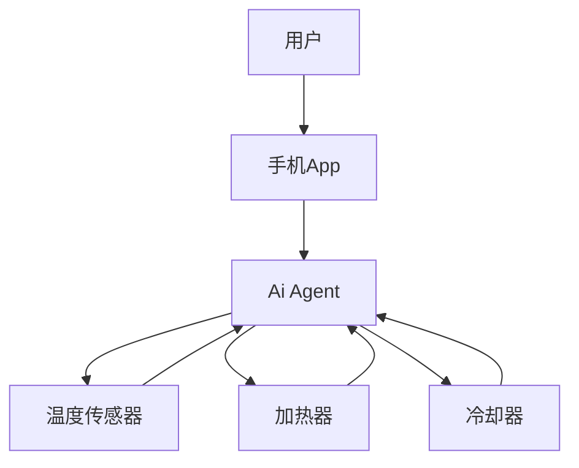
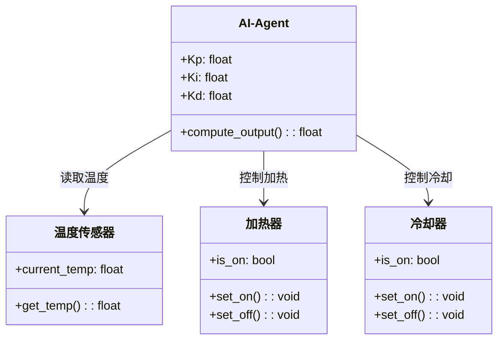
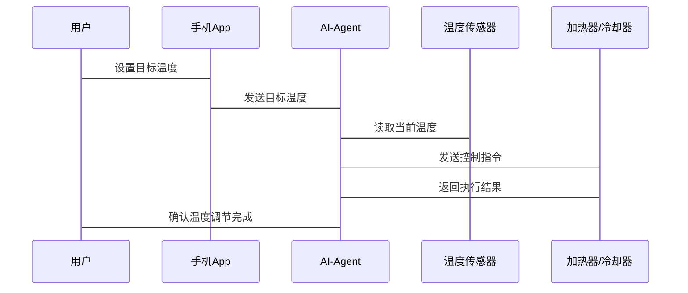

                 


# 智能浴室：AI Agent的水温调节系统

**关键词：**智能浴室, AI Agent, 水温调节, 自动化控制, 机器学习, PID控制, 系统设计

**摘要：**  
本文将探讨智能浴室中AI Agent在水温调节系统中的应用。通过分析水温调节的核心问题，介绍AI Agent的基本原理，设计基于PID控制和机器学习的水温调节算法，并展示系统的实际应用场景。文章将从背景介绍、核心概念、算法设计、系统架构到项目实战，逐步展开，最后总结系统的最佳实践与未来发展方向。

---

# 第一部分：背景介绍与问题分析

## 第1章：背景介绍与问题背景

### 1.1 问题背景与用户需求

#### 1.1.1 智能浴室的发展现状
智能浴室近年来成为智能家居的重要组成部分。随着物联网和人工智能技术的发展，浴室设备逐渐智能化，能够通过传感器和AI算法实现自动化控制。

#### 1.1.2 用户对智能浴室的核心需求
用户在使用浴室时，最关心的是舒适性和便捷性。水温调节是影响用户体验的关键因素之一。用户希望水温能够自动调整到最佳状态，无需手动操作。

#### 1.1.3 水温调节系统的重要性
水温调节系统是智能浴室的核心功能之一。通过智能调节水温，可以提升用户体验，同时节省水资源和能源。

### 1.2 问题描述与目标设定

#### 1.2.1 水温调节系统的核心问题
- 水温波动的稳定性问题：如何确保水温在设定范围内保持稳定？
- 系统的响应速度问题：如何快速响应用户的温度调整需求？
- 多环境因素的干扰问题：如何应对水压波动、环境温度变化等干扰因素？

#### 1.2.2 设定目标与功能需求
- 设定目标：设计一个基于AI Agent的水温调节系统，实现快速、精准的水温控制。
- 功能需求：实时采集水温数据，智能调整加热或冷却设备，确保水温恒定。

#### 1.2.3 边界与外延
- 系统边界：仅考虑水温调节部分，不涉及其他浴室设备（如照明、通风）。
- 外延：未来可扩展至其他智能设备的联动控制。

### 1.3 系统的核心概念与组成

#### 1.3.1 系统的核心要素
- **AI Agent**：负责数据采集、决策和执行。
- **温度传感器**：实时采集水温数据。
- **加热/冷却设备**：根据AI Agent的指令调整水温。
- **用户交互界面**：用户可以通过手机或语音助手设置目标温度。

#### 1.3.2 智能浴室的组成结构
1. **数据采集层**：温度传感器、水压传感器。
2. **计算层**：AI Agent负责数据处理和决策。
3. **执行层**：加热器、冷却器。
4. **交互层**：用户通过手机App或语音助手进行操作。

#### 1.3.3 系统的核心功能与流程
1. **数据采集**：传感器实时采集水温数据。
2. **数据处理**：AI Agent分析数据，判断是否需要调整水温。
3. **决策与执行**：根据算法计算结果，控制加热或冷却设备。
4. **反馈与优化**：系统根据执行结果调整参数，优化水温控制。

---

# 第二部分：AI Agent的核心原理与算法设计

## 第2章：AI Agent的核心原理

### 2.1 AI Agent的基本概念

#### 2.1.1 AI Agent的定义与分类
- **定义**：AI Agent是一种智能体，能够感知环境并采取行动以实现目标。
- **分类**：基于智能水平，可分为简单反射型、基于模型的反应型、目标驱动型和实用驱动型。

#### 2.1.2 AI Agent的核心属性与特征
| 属性       | 特征描述                                         |
|------------|------------------------------------------------|
| 感知能力   | 能够采集环境数据（如温度、水压）                 |
| 决策能力   | 基于数据进行分析和决策                           |
| 执行能力   | 能够通过执行器（如加热器）采取行动               |
| 学习能力   | 能够通过反馈优化算法                             |

#### 2.1.3 AI Agent与传统控制系统的区别
| 方面       | AI Agent                                | 传统控制系统                      |
|------------|----------------------------------------|----------------------------------|
| 数据处理   | 基于机器学习模型，能够处理复杂数据           | 基于简单的逻辑判断和数学模型       |
| 自适应性   | 具备自适应能力，能够根据环境变化优化控制策略 | 自适应能力较弱，需要人工调整参数   |
| 智能性     | 具备高度智能性，能够处理非线性问题             | 智能性较低，主要依赖预设规则       |

### 2.2 AI Agent的感知与决策机制

#### 2.2.1 感知模块的核心原理
- **传感器数据采集**：温度传感器实时采集水温数据。
- **数据预处理**：对采集到的数据进行去噪和归一化处理。

#### 2.2.2 决策模块的算法选择
- **PID控制算法**：适用于线性系统，能够快速响应温度变化。
- **机器学习算法**：适用于非线性系统，能够通过历史数据优化控制策略。

#### 2.2.3 执行模块的实现方式
- **执行器控制**：通过AI Agent的决策指令，控制加热器或冷却器的工作状态。

### 2.3 AI Agent的算法实现

#### 2.3.1 基于PID控制的水温调节算法
- **PID控制的数学表达式**
  $$ u(t) = K_p \cdot e(t) + K_i \cdot \int e(t) dt + K_d \cdot \frac{de(t)}{dt} $$
  其中，$u(t)$ 是控制输出，$e(t)$ 是误差，$K_p$、$K_i$、$K_d$ 是比例、积分和微分系数。

- **PID控制的流程图**
  ```mermaid
  graph TD
      A[目标温度] --> B[当前温度]
      B --> C[计算误差]
      C --> D[计算PID输出]
      D --> E[控制加热器/冷却器]
  ```

#### 2.3.2 基于机器学习的温度预测模型
- **模型选择**：使用LSTM（长短期记忆网络）进行时间序列预测。
- **训练数据**：历史温度数据和对应的操作指令。

#### 2.3.3 算法的优化与改进
- **自适应PID控制**：根据系统实时状态自动调整PID参数。
- **集成学习**：结合PID控制和机器学习模型，提升系统的鲁棒性和智能性。

### 2.4 本章小结
本章详细介绍了AI Agent的基本概念、感知与决策机制，以及基于PID控制和机器学习的水温调节算法。通过对比分析，展示了AI Agent在智能浴室中的优势和潜力。

---

# 第三部分：水温调节系统的数学模型与算法实现

## 第3章：数学模型与算法设计

### 3.1 水温调节系统的数学模型

#### 3.1.1 系统的动态方程
- **加热器的动态方程**
  $$ T_{\text{new}} = T_{\text{old}} + \Delta T = T_{\text{old}} + K_u \cdot u $$
  其中，$K_u$ 是加热器的增益系数，$u$ 是控制输入。

- **冷却器的动态方程**
  $$ T_{\text{new}} = T_{\text{old}} - \Delta T = T_{\text{old}} - K_d \cdot u $$
  其中，$K_d$ 是冷却器的增益系数，$u$ 是控制输入。

#### 3.1.2 PID控制的数学表达式
如前所述，PID控制的公式为：
$$ u(t) = K_p \cdot e(t) + K_i \cdot \int e(t) dt + K_d \cdot \frac{de(t)}{dt} $$

#### 3.1.3 温度预测模型的建立
- **LSTM模型**：通过训练历史温度数据，预测未来温度变化趋势。

### 3.2 算法的实现与优化

#### 3.2.1 PID控制的参数调整
- **比例系数（K_p）**：控制系统的响应速度。
- **积分系数（K_i）**：消除稳态误差。
- **微分系数（K_d）**：改善系统的稳定性。

#### 3.2.2 基于机器学习的温度预测算法
- **训练过程**：使用历史温度数据训练LSTM模型。
- **预测过程**：基于当前温度预测未来温度变化。

#### 3.2.3 算法的收敛性分析
- **PID控制**：在理想情况下，PID控制能够快速收敛到目标温度。
- **机器学习模型**：收敛速度取决于训练数据的质量和模型复杂度。

### 3.3 算法实现的代码示例

#### 3.3.1 PID控制算法的Python实现
```python
class PIDController:
    def __init__(self, Kp, Ki, Kd):
        self.Kp = Kp
        self.Ki = Ki
        self.Kd = Kd
        self.error_integral = 0
        self.error_derivative = 0

    def compute_output(self, current_temp, target_temp):
        error = target_temp - current_temp
        self.error_integral += error
        self.error_derivative = error - self.error_derivative
        output = self.Kp * error + self.Ki * self.error_integral + self.Kd * self.error_derivative
        return output
```

#### 3.3.2 温度预测模型的代码实现
```python
import numpy as np
from tensorflow.keras.models import Sequential
from tensorflow.keras.layers import LSTM, Dense

# 定义LSTM模型
model = Sequential()
model.add(LSTM(64, input_shape=(timesteps, 1)))
model.add(Dense(1))
model.compile(loss='mean_squared_error', optimizer='adam')

# 训练模型
model.fit(X_train, y_train, epochs=100, batch_size=32)
```

### 3.4 本章小结
本章详细介绍了水温调节系统的数学模型，并通过PID控制和机器学习算法展示了如何实现水温的智能调节。通过代码示例和数学公式，深入分析了算法的实现细节和优化方向。

---

# 第四部分：系统架构与功能设计

## 第4章：系统架构设计

### 4.1 系统架构设计

#### 4.1.1 系统整体架构


#### 4.1.2 功能模块划分
- **用户交互模块**：接收用户的温度设置指令。
- **数据采集模块**：采集水温和环境数据。
- **AI Agent模块**：处理数据并生成控制指令。
- **执行模块**：控制加热器或冷却器工作。

#### 4.1.3 系统接口设计
- **输入接口**：接收用户的温度设置和传感器数据。
- **输出接口**：控制加热器和冷却器的工作状态。

### 4.2 系统功能设计

#### 4.2.1 领域模型设计


#### 4.2.2 系统交互流程


### 4.3 本章小结
本章详细设计了智能浴室中水温调节系统的整体架构和功能模块，展示了系统各部分之间的交互关系和工作流程。

---

# 第五部分：项目实战与优化

## 第5章：项目实战与优化

### 5.1 项目环境安装

#### 5.1.1 安装Python和相关库
```bash
pip install numpy
pip install tensorflow
pip install mermaid
```

#### 5.1.2 硬件设备连接
- **温度传感器**：连接到Raspberry Pi，通过GPIO接口采集数据。
- **加热器/冷却器**：通过继电器模块连接到Raspberry Pi，控制设备的开关。

### 5.2 核心代码实现

#### 5.2.1 PID控制算法实现
```python
def pid_control(desired_temp, current_temp, Kp, Ki, Kd):
    error = desired_temp - current_temp
    integral += error
    derivative = error - previous_error
    output = Kp * error + Ki * integral + Kd * derivative
    return output
```

#### 5.2.2 温度预测模型实现
```python
def predict_temp(model, input_sequence):
    predicted_temp = model.predict(input_sequence)
    return predicted_temp
```

### 5.3 实际案例分析

#### 5.3.1 PID控制案例
- **目标温度**：37°C
- **初始温度**：25°C
- **PID参数**：Kp=2, Ki=0.5, Kd=1

#### 5.3.2 机器学习预测案例
- **输入数据**：过去10分钟的温度数据
- **预测结果**：未来5分钟的温度变化趋势

### 5.4 系统优化与改进

#### 5.4.1 PID参数优化
- 根据实际运行情况调整Kp、Ki、Kd参数，确保系统稳定性。

#### 5.4.2 机器学习模型优化
- 增加训练数据量，提升模型预测精度。
- 使用更复杂的模型（如更深的神经网络）提升预测能力。

### 5.5 本章小结
本章通过实际案例分析展示了系统的实现过程，并提出了优化建议，帮助读者进一步完善水温调节系统。

---

# 第六部分：最佳实践与未来展望

## 第6章：最佳实践与未来展望

### 6.1 最佳实践

#### 6.1.1 系统设计小结
- 系统设计需注重模块化和可扩展性。
- 确保硬件和软件的兼容性，方便后续升级。

#### 6.1.2 注意事项
- 确保系统安全性，防止传感器数据被恶意篡改。
- 注意数据隐私保护，避免用户信息泄露。

### 6.2 未来展望

#### 6.2.1 系统功能扩展
- 实现多设备联动控制（如联动淋浴头、毛巾架等）。
- 增加用户行为分析，提供个性化温度调节服务。

#### 6.2.2 技术发展与趋势
- 更智能的AI算法（如强化学习）的应用。
- 更高效的硬件设备（如低功耗传感器）的普及。

### 6.3 本章小结
本章总结了系统的最佳实践，并展望了未来的发展方向，为读者提供了进一步研究和优化的思路。

---

# 第七部分：总结与参考文献

## 第7章：总结与参考文献

### 7.1 总结
本文详细介绍了智能浴室中AI Agent的水温调节系统的设计与实现。通过背景分析、算法设计、系统架构和项目实战，展示了如何利用AI技术实现智能浴室的自动化控制。

### 7.2 参考文献
1. PID控制相关文献
2. 机器学习在温度控制中的应用
3. 智能家居系统设计参考资料
4. 相关技术标准与规范

---

以上是《智能浴室：AI Agent的水温调节系统》的技术博客文章的完整目录和内容框架。接下来，我可以根据上述结构，逐步展开每部分内容，撰写一篇详细的、逻辑清晰的技术博客文章。

