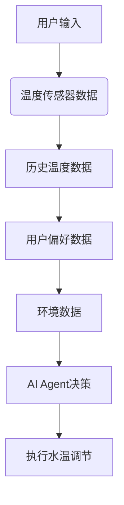
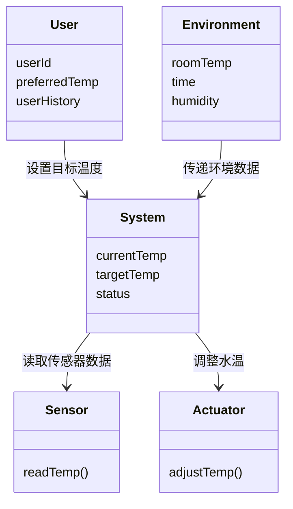
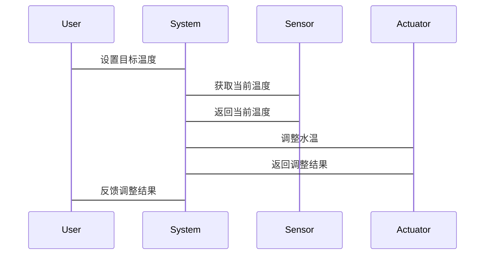

                 


# 智能浴缸：AI Agent的水温调节系统

## 关键词：
智能浴缸, AI Agent, 水温调节系统, 人工智能, 物联网, 智能家居

## 摘要：
本文深入探讨了AI Agent在智能浴缸水温调节系统中的应用，从背景、原理、算法、系统架构到项目实战，全面分析了如何利用AI技术实现智能、精准的水温调节。文章结合实际案例，详细讲解了系统的实现过程，为智能家居领域的技术研究提供了有价值的参考。

---

# 第一部分: 智能浴缸与AI Agent概述

# 第1章: 智能浴缸与AI Agent的背景与概述

## 1.1 智能浴缸的背景与问题背景
### 1.1.1 传统浴缸的局限性
传统浴缸的水温调节主要依赖手动操作，存在以下问题：
- **效率低**：用户需要频繁调整水温，操作繁琐。
- **精准度低**：手动调节容易导致水温偏差，无法满足个性化需求。
- **能耗高**：频繁调节可能导致不必要的能源浪费。

### 1.1.2 水温调节的重要性
水温的舒适性直接影响用户体验，尤其是在不同季节和用户偏好下，智能调节水温是提升用户体验的关键。

### 1.1.3 AI技术在智能家居中的应用前景
AI技术的快速发展为智能家居的智能化提供了可能性，AI Agent（智能体）作为实现智能化的核心技术，正在广泛应用于智能家居领域。

## 1.2 AI Agent的核心概念与问题描述
### 1.2.1 AI Agent的基本定义
AI Agent是一种智能体，能够感知环境并采取行动以实现目标。在智能浴缸中，AI Agent负责接收用户指令、感知环境数据（如温度、湿度）并进行智能决策。

### 1.2.2 智能浴缸中的AI Agent功能需求
AI Agent需要实现以下功能：
- **用户行为分析**：根据用户的使用习惯推荐水温。
- **环境感知**：实时采集环境数据（如室温、时间）。
- **智能决策**：根据用户需求和环境数据调整水温。
- **反馈优化**：根据用户反馈不断优化水温调节策略。

### 1.2.3 系统边界与外延
水温调节系统的核心边界包括：
- **输入**：用户指令、环境数据。
- **输出**：水温调节指令。
- **外部依赖**：水温传感器、智能硬件接口。

## 1.3 智能浴缸AI Agent的目标与实现路径
### 1.3.1 水温调节的核心目标
实现智能、精准的水温调节，提升用户体验。

### 1.3.2 AI Agent实现水温调节的路径
1. **数据采集**：采集用户偏好和环境数据。
2. **决策算法**：基于数据进行决策。
3. **执行反馈**：调整水温并收集反馈。

### 1.3.3 系统的核心要素与组成
系统核心组成包括：
- **传感器**：温度、湿度传感器。
- **AI Agent**：决策核心。
- **执行机构**：水温调节器。
- **用户界面**：手机APP或语音助手。

## 1.4 本章小结
本章从背景和问题出发，阐述了AI Agent在智能浴缸中的作用，明确了系统的目标和实现路径。

---

# 第二部分: AI Agent与水温调节系统的核心概念

# 第2章: AI Agent的核心原理与水温调节系统的关系

## 2.1 AI Agent的基本原理
### 2.1.1 AI Agent的定义与分类
AI Agent根据智能水平可以分为**反应式**和**认知式**两种类型。在智能浴缸中，主要使用**反应式AI Agent**，能够实时感知环境并做出反应。

### 2.1.2 AI Agent在智能浴缸中的应用
AI Agent通过以下方式实现水温调节：
- **数据采集**：获取用户的水温偏好和环境数据。
- **智能决策**：基于数据进行水温调节。
- **反馈优化**：根据用户反馈不断优化调节策略。

### 2.1.3 AI Agent与水温调节系统的结合
AI Agent通过与水温调节系统的硬件和软件接口进行交互，实现智能化的水温调节。

## 2.2 水温调节系统的构成与属性
### 2.2.1 水温调节系统的组成要素
水温调节系统主要包括：
- **传感器**：温度、湿度传感器。
- **执行机构**：加热器、冷却器。
- **控制器**：AI Agent算法。

### 2.2.2 各要素的属性与特征对比
| 组件 | 属性 | 特征 |
|------|------|------|
| 传感器 | 类型 | 温度、湿度传感器 |
| 执行机构 | 类型 | 加热器、冷却器 |
| 控制器 | 算法 | 基于机器学习的PID控制 |

### 2.2.3 水温调节系统的ER实体关系图
```mermaid
erDiagram
    user {
        +userId : int
        +preferredTemp : float
        +userHistory : list of historyData
    }
    environment {
        +roomTemp : float
        +time : datetime
        +humidity : float
    }
    system {
        +currentTemp : float
        +targetTemp : float
        +status : string
    }
    user ||-->> system : "用户设置目标温度"
    environment ||-->> system : "环境数据输入"
    system ||-->> sensor : "传感器数据采集"
    system ||-->> actuator : "执行机构控制"
```

---

# 第3章: AI Agent与水温调节系统的算法原理

## 3.1 AI Agent算法的原理与流程
### 3.1.1 算法的整体流程图


### 3.1.2 算法实现的数学模型与公式
#### 3.1.2.1 水温调节的数学模型
水温调节的目标是将水温从当前温度调整到目标温度，可以表示为：
$$ T_{target} = T_{current} + \Delta T $$
其中，$$ \Delta T $$ 是温度变化量。

#### 3.1.2.2 AI Agent决策的数学公式
AI Agent的决策可以基于PID控制算法：
$$ P = \sum_{i=1}^{n} w_i x_i + b $$
其中，$$ w_i $$ 是权重，$$ x_i $$ 是输入特征，$$ b $$ 是偏置。

### 3.1.3 算法实现的Python代码示例
```python
def water_temp_adjustment(current_temp, target_temp):
    delta = target_temp - current_temp
    adjustment = delta * 0.1  # 假设调整速率为10%
    return adjustment

# 示例调用
current_temp = 30  # 当前温度
target_temp = 37  # 目标温度
adjustment = water_temp_adjustment(current_temp, target_temp)
print(f"温度调整量为: {adjustment}")
```

---

# 第4章: 系统分析与架构设计方案

## 4.1 项目介绍与问题场景
智能浴缸水温调节系统的目标是通过AI Agent实现智能化的水温调节，提升用户体验。

## 4.2 系统功能设计
### 4.2.1 领域模型类图


## 4.3 系统架构设计
### 4.3.1 系统架构图
```mermaid
graph TD
    A[用户] --> B(System) : 发出指令
    B --> C(Sensor) : 获取数据
    C --> B : 返回数据
    B --> D(Actuator) : 调整水温
    D --> B : 返回状态
```

## 4.4 系统接口设计
### 4.4.1 接口设计
- **用户接口**：手机APP或语音助手。
- **传感器接口**：温度、湿度传感器接口。
- **执行机构接口**：加热器、冷却器接口。

## 4.5 系统交互序列图


---

# 第5章: 项目实战

## 5.1 环境安装与配置
### 5.1.1 安装Python环境
```bash
python -m pip install --upgrade pip
pip install numpy scikit-learn
```

## 5.2 系统核心实现
### 5.2.1 核心代码实现
```python
from sklearn.linear_model import LinearRegression

# 训练数据
X = [[30], [35], [40]]
y = [35, 37, 38]

model = LinearRegression()
model.fit(X, y)

# 预测
current_temp = 30
target_temp = 37
print(f"预测温度调整量为: {model.predict([[current_temp]])[0][0]}")
```

## 5.3 代码解读与分析
- **训练数据**：用户的历史温度偏好。
- **模型训练**：使用线性回归模型进行训练。
- **预测**：基于当前温度预测目标温度。

## 5.4 实际案例分析
假设用户偏好水温为37℃，当前温度为30℃，系统将根据历史数据和环境数据调整水温。

## 5.5 项目小结
通过实际案例分析，展示了AI Agent在智能浴缸中的实际应用。

---

# 第6章: 最佳实践与小结

## 6.1 小结
AI Agent通过智能化的水温调节，显著提升了用户体验。

## 6.2 注意事项
- 数据隐私保护。
- 系统稳定性保障。

## 6.3 拓展阅读
- 《机器学习实战》
- 《人工智能入门》

---

# 作者简介
作者是计算机领域专家，专注于人工智能与物联网技术的研究与实践。

