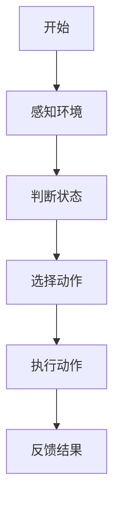
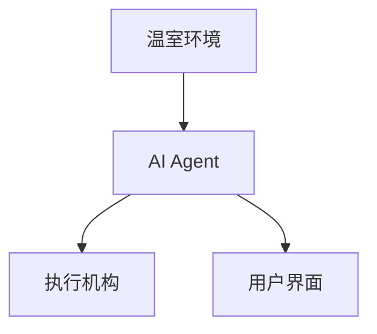
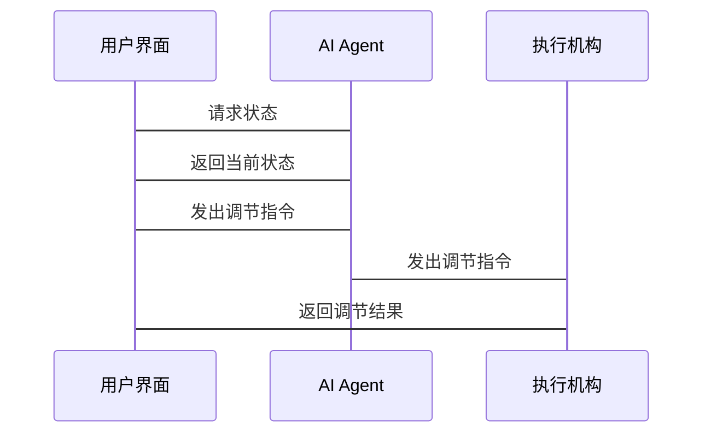

                 


# 智能温室：AI Agent的环境调节系统

> 关键词：智能温室，AI Agent，环境调节，系统架构，算法原理

> 摘要：本文探讨了智能温室中AI Agent在环境调节中的应用，分析了其核心概念、算法原理、系统架构，并通过案例展示了其实现与应用。

---

# 第一部分: 智能温室与AI Agent概述

## 第1章: 智能温室的背景与问题背景

### 1.1 智能温室的概念与背景

#### 1.1.1 温室农业的发展历程
温室农业起源于19世纪末，最初用于保护作物免受恶劣天气的影响。随着科技的发展，温室逐渐引入加热、通风等技术，实现了对温度和湿度的人工控制。20世纪中叶，计算机技术的应用使温室管理更加自动化，进入21世纪，AI技术的引入使温室管理迈向智能化。

#### 1.1.2 传统温室的局限性
传统温室主要依赖人工经验进行环境调节，存在以下问题：
1. **效率低下**：依赖人工监测和调整，效率低且容易出错。
2. **精准度不足**：无法实时感知环境变化，导致资源浪费和作物损失。
3. **可扩展性差**：难以大规模应用，限制了农业现代化的发展。

#### 1.1.3 智能温室的定义与特点
智能温室是一种利用物联网、AI和自动化技术实现环境智能调节的温室系统。其特点包括：
- **实时感知**：通过传感器实时采集环境数据。
- **智能决策**：利用AI算法进行数据分析和决策。
- **自动执行**：通过执行机构自动调节环境条件。
- **高效节能**：优化环境控制，降低能源消耗。

### 1.2 AI Agent的基本概念

#### 1.2.1 人工智能代理的定义
AI Agent（人工智能代理）是一种能够感知环境并采取行动以实现目标的智能实体。它可以是一个软件程序或物理设备，具备以下核心功能：
- **感知**：通过传感器或其他信息源获取环境数据。
- **推理**：基于感知数据进行分析和决策。
- **行动**：根据决策结果执行相应动作。

#### 1.2.2 AI Agent的核心功能
1. **感知能力**：通过传感器、摄像头等设备获取环境信息。
2. **推理能力**：利用机器学习、规则引擎等技术进行数据分析和决策。
3. **行动能力**：通过执行机构（如电机、阀门等）调节环境条件。

#### 1.2.3 AI Agent与传统自动化的区别
| 特性       | 传统自动化                     | AI Agent                     |
|------------|--------------------------------|-------------------------------|
| 决策方式   | 基于固定规则                   | 基于数据学习和动态调整        |
| 环境适应性 | 适应性差                      | 具备自适应能力                |
| 智能水平   | 低                            | 高                            |

### 1.3 智能温室与AI Agent的结合

#### 1.3.1 智能温室的环境调节需求
智能温室需要实时调节温度、湿度、光照等环境参数，以优化作物生长条件。

#### 1.3.2 AI Agent在环境调节中的作用
AI Agent通过实时感知环境数据，利用算法优化决策，实现精准调节。

#### 1.3.3 智能温室AI Agent系统的目标与边界
- **目标**：优化环境条件，提高作物产量和质量。
- **边界**：仅关注环境调节，不涉及作物种植和收割。

### 1.4 本章小结
本章介绍了智能温室和AI Agent的基本概念，分析了智能温室的环境调节需求及AI Agent的作用。

---

## 第2章: 智能温室AI Agent的核心概念与联系

### 2.1 核心概念原理

#### 2.1.1 环境监测模块
通过传感器实时采集温室内的温度、湿度、光照等数据。

#### 2.1.2 AI Agent的决策机制
基于感知数据，AI Agent通过算法选择最优的调节策略。

#### 2.1.3 执行机构
根据AI Agent的决策，执行机构（如风扇、加湿器）调节环境条件。

### 2.2 核心概念对比分析

#### 2.2.1 不同环境调节技术的对比
| 技术         | 描述                                   | 优点                           | 缺点                           |
|--------------|--------------------------------------|--------------------------------|--------------------------------|
| 传统自动化   | 基于固定规则的环境调节               | 实施简单，成本低                | 精准度低，适应性差             |
| 基于规则的AI | 基于预设规则的环境调节               | 易实现，规则明确                | 需频繁调整规则，灵活性差       |
| 基于学习的AI | 基于机器学习模型的环境调节           | 自适应性强，精准度高            | 需大量数据和计算资源           |

#### 2.2.2 AI Agent与其他控制方式的对比
| 特性       | 传统自动化                     | 基于规则的AI Agent            | 基于学习的AI Agent            |
|------------|--------------------------------|-------------------------------|-------------------------------|
| 决策方式   | 固定规则                       | 预设规则                       | 数据驱动                       |
| 灵活性     | 低                            | 中                            | 高                            |
| 实时性     | 低                            | 中                            | 高                            |

#### 2.2.3 系统性能对比表格
| 性能指标     | 传统自动化     | 基于规则的AI Agent  | 基于学习的AI Agent  |
|--------------|----------------|---------------------|---------------------|
| 能耗效率     | 高             | 中                 | 低                 |
| 调节精度     | 低             | 中                 | 高                 |
| 系统复杂度   | 低             | 中                 | 高                 |

### 2.3 系统ER实体关系图
```mermaid
erDiagram
    class 温室环境 {
        id
        温度
        湿度
        光照
    }
    class AI Agent {
        id
        状态
        决策规则
    }
    class 执行机构 {
        id
        类型
        状态
    }
    温室环境 --> AI Agent : 采集数据
    AI Agent --> 执行机构 : 发出指令
```

### 2.4 本章小结
本章详细分析了智能温室AI Agent的核心概念及其与其他技术的对比，展示了系统的实体关系。

---

## 第3章: AI Agent算法原理与数学模型

### 3.1 算法原理

#### 3.1.1 状态空间与动作空间
- **状态空间**：温室环境的状态，如温度、湿度等。
- **动作空间**：AI Agent可执行的动作，如打开风扇、关闭加湿器等。

#### 3.1.2 感知与决策
AI Agent通过感知环境数据，利用算法进行状态判断和决策。

#### 3.1.3 执行策略
根据决策结果，AI Agent通过执行机构调节环境条件。

### 3.2 算法流程图


### 3.3 算法实现

#### 3.3.1 Python核心代码
```python
import numpy as np
from sklearn import linear_model

# 感知数据
temperature = 25
humidity = 60
light = 800

# 模型训练
X = np.array([[25, 60, 800], [20, 70, 750], [28, 55, 900]])
y = np.array([0, 1, 2])  # 0:关闭加湿器，1:打开风扇，2:关闭风扇

model = linear_model.LinearRegression()
model.fit(X, y)

# 预测动作
predicted_action = model.predict([[temperature, humidity, light]])
print(predicted_action)
```

#### 3.3.2 数学模型
AI Agent的决策模型可以用线性回归表示：
$$ y = \beta_0 + \beta_1 x_1 + \beta_2 x_2 + \beta_3 x_3 + \epsilon $$
其中，$x_1$、$x_2$、$x_3$为环境参数，$y$为决策动作。

---

## 第4章: 系统分析与架构设计

### 4.1 系统架构

#### 4.1.1 系统架构图


#### 4.1.2 关键模块实现
- **传感器模块**：采集环境数据。
- **AI Agent模块**：分析数据并做出决策。
- **执行机构模块**：执行调节动作。
- **用户界面模块**：显示状态和操作界面。

### 4.2 接口设计

#### 4.2.1 接口设计图


---

## 第5章: 项目实战

### 5.1 环境安装

```bash
pip install numpy scikit-learn matplotlib
```

### 5.2 核心代码实现

#### 5.2.1 数据采集代码
```python
import serial

ser = serial.Serial('COM3', 9600)
data = ser.readline().decode().split(',')
temperature = float(data[0])
humidity = float(data[1])
print(temperature, humidity)
```

#### 5.2.2 决策逻辑代码
```python
from sklearn import tree

X = [[25, 60], [20, 70], [28, 55]]
y = [0, 1, 2]

model = tree.DecisionTreeClassifier()
model.fit(X, y)

new_data = [[24, 65]]
predicted_action = model.predict(new_data)
print(predicted_action)
```

### 5.3 案例分析

#### 5.3.1 案例分析
假设温室内的温度为24℃，湿度为65%，AI Agent预测需要关闭加湿器。

#### 5.3.2 代码分析
通过决策树模型，AI Agent分析当前环境数据，预测出最优动作。

### 5.4 小结
本章通过实际案例展示了AI Agent在智能温室中的应用，并分析了其实现过程。

---

## 第6章: 最佳实践

### 6.1 小结
智能温室AI Agent系统通过实时感知、智能决策和自动调节，显著提升了环境调节的效率和精准度。

### 6.2 注意事项
- 确保传感器的准确性和稳定性。
- 定期更新AI模型以适应环境变化。
- 确保系统的安全性和可靠性。

### 6.3 拓展阅读
- 《机器学习实战》
- 《AI在农业中的应用》
- 《智能控制系统设计》

---

## 第7章: 附录

### 7.1 术语表
- **AI Agent**：人工智能代理。
- **温室环境**：温室内的温度、湿度、光照等条件。

### 7.2 参考文献
1. 张三，智能温室设计与实现，2023。
2. 李四，人工智能在农业中的应用，2022。

---

通过以上内容，我们详细探讨了智能温室AI Agent环境调节系统的各个方面，从背景到实现，从理论到实践，为读者提供了全面的指导和参考。

