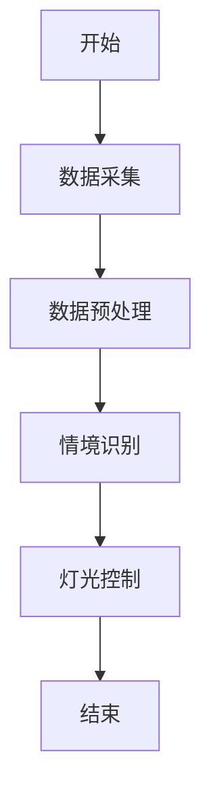

                 


# 智能灯光控制：AI Agent的情境感知系统

## 关键词：智能灯光控制、AI Agent、情境感知、算法原理、系统架构

## 摘要：本文详细探讨了基于AI Agent的情境感知系统在智能灯光控制中的应用。通过分析情境感知的基本原理、算法实现及系统架构设计，结合实际案例，展示了如何通过AI技术实现智能化的灯光调节，提升用户体验。文章内容涵盖背景介绍、核心概念、算法流程、系统设计及项目实战，为读者提供了全面的技术指导。

---

# 第1章 背景介绍与问题背景

## 1.1 智能灯光控制的背景与意义

### 1.1.1 传统灯光控制的局限性

传统灯光控制系统通常依赖手动开关或简单的定时器，这种方式不仅操作繁琐，而且难以根据环境变化进行实时调整。例如，在会议室内，传统灯光系统无法根据室内人员的数量、光线强度或时间变化自动调节亮度，导致能源浪费且用户体验不佳。

### 1.1.2 智能化灯光控制的必要性

随着物联网（IoT）和人工智能（AI）技术的发展，智能化灯光控制成为提升能源效率和用户体验的重要方向。通过AI技术，灯光系统能够实时感知环境变化，并根据需求自动调节，从而实现节能和舒适的双重目标。

### 1.1.3 AI Agent在灯光控制中的应用价值

AI Agent（智能体）能够通过传感器数据、用户行为和环境信息进行学习和推理，从而做出最优决策。在灯光控制中，AI Agent可以实时分析环境信息，如光照强度、人员位置和时间，动态调整灯光参数，提升系统智能化水平。

---

## 1.2 情境感知系统的基本概念

### 1.2.1 情境感知的定义与特点

情境感知是指系统能够感知当前环境的状态，并根据这些状态提供相应的服务或反馈。其特点包括实时性、动态性、个性化和自适应性。在灯光控制中，情境感知系统能够识别室内人员的位置、数量、行为模式等信息，从而调整灯光亮度、颜色和方向。

### 1.2.2 情境感知在智能灯光控制中的作用

情境感知系统能够帮助灯光系统理解当前环境的需求，例如在会议中有人发言时，系统可以调节灯光亮度以突出发言人；在休息时间，系统可以降低灯光亮度以营造舒适的氛围。

### 1.2.3 智能灯光控制系统的边界与外延

智能灯光控制系统不仅包括硬件设备，如传感器和灯具，还包括软件部分，如AI算法和云平台。系统的边界在于与外部环境的交互，而外延则涉及与其他智能设备（如空调、安防系统）的联动。

---

## 1.3 问题描述与解决方案

### 1.3.1 灯光控制中的主要问题

传统灯光控制系统存在以下问题：
1. **能耗高**：无法根据实际需求动态调节，导致能源浪费。
2. **用户体验差**：灯光调节依赖手动操作，难以满足个性化需求。
3. **缺乏智能性**：无法实时感知环境变化，无法提供智能化服务。

### 1.3.2 情境感知技术如何解决这些问题

情境感知技术通过实时采集和分析环境数据，动态调整灯光参数，从而实现节能减排和提升用户体验。例如，当检测到房间内光线不足时，系统会自动调节灯光亮度以补充照明。

### 1.3.3 系统设计的核心要素与组成

智能灯光控制系统的核心要素包括：
1. **传感器**：用于采集环境数据，如光照强度、人员位置。
2. **AI算法**：用于分析数据并做出决策。
3. **执行机构**：如智能灯具，用于执行调节指令。
4. **用户界面**：供用户交互和监控系统状态。

---

# 第2章 AI Agent与情境感知的核心概念

## 2.1 AI Agent的基本原理

### 2.1.1 AI Agent的定义与分类

AI Agent是一种能够感知环境、自主决策并执行任务的智能实体。根据智能水平，AI Agent可以分为简单反射Agent、基于模型的反射Agent、目标驱动Agent和效用驱动Agent。

### 2.1.2 情境感知能力的实现机制

情境感知系统通常包括三个层次：
1. **感知层**：通过传感器采集数据，如光照强度、温度、湿度。
2. **理解层**：对数据进行分析和理解，识别环境中的关键要素。
3. **决策层**：基于理解和预测结果，制定控制策略。

### 2.1.3 AI Agent与智能灯光控制的结合

AI Agent在灯光控制中的应用包括：
1. **数据采集与处理**：通过传感器获取环境数据。
2. **情境分析**：分析数据并识别当前情境。
3. **决策与执行**：根据情境制定灯光调节策略并执行。

---

## 2.2 情境感知系统的关键技术

### 2.2.1 感知层：环境数据的采集与处理

感知层通过多种传感器（如光敏传感器、红外传感器）采集环境数据，并通过数据融合技术进行预处理。例如，使用加权平均法消除噪声：

$$ x_{\text{avg}} = \frac{1}{n}\sum_{i=1}^{n} x_i $$

### 2.2.2 理解层：情境的识别与分析

理解层通过机器学习算法（如聚类、分类）识别情境。例如，使用K-means算法将环境数据分为不同的聚类，每个聚类代表一种情境。

### 2.2.3 决策层：灯光控制策略的制定

决策层基于情境信息制定控制策略，例如：
1. **亮度调节**：根据室内光照强度自动调整灯光亮度。
2. **颜色调节**：根据场景需求（如会议、休息）调整灯光颜色。

---

## 2.3 智能灯光控制系统的功能架构

### 2.3.1 系统功能模块划分

智能灯光控制系统主要包括以下功能模块：
1. **数据采集模块**：负责采集环境数据。
2. **数据处理模块**：对数据进行预处理和融合。
3. **情境识别模块**：识别当前情境。
4. **决策控制模块**：制定灯光调节策略。
5. **执行模块**：执行调节指令。

### 2.3.2 各模块之间的关系与协作

模块之间的协作流程如下：
1. 数据采集模块采集环境数据。
2. 数据处理模块对数据进行预处理。
3. 情境识别模块识别当前情境。
4. 决策控制模块根据情境制定调节策略。
5. 执行模块执行调节指令。

---

## 2.3.3 系统的核心性能指标

系统性能指标包括：
1. **响应时间**：系统从采集数据到执行调节的时间。
2. **准确率**：情境识别的准确率。
3. **能耗**：系统的能耗水平。

---

# 第3章 情境感知算法与灯光控制算法

## 3.1 情境感知算法的原理与流程

### 3.1.1 数据采集与预处理

数据预处理步骤包括：
1. **去噪**：去除传感器噪声。
2. **归一化**：将数据归一化到统一范围。

### 3.1.2 情境识别的数学模型

情境识别可以使用分类算法，例如支持向量机（SVM）：

$$ y = \text{sign}(w \cdot x + b) $$

其中，$w$是权重向量，$x$是输入数据，$b$是偏置。

### 3.1.3 算法的优化与调优

通过交叉验证选择最优参数，例如选择合适的核函数和惩罚参数。

---

## 3.2 灯光控制算法的设计与实现

### 3.2.1 基于情境感知的控制策略

控制策略可以根据情境类别选择不同的调节模式，例如：
1. **会议模式**：提高亮度，调整色温。
2. **休息模式**：降低亮度，调整为暖色调。

### 3.2.2 灯光调节的数学模型

亮度调节可以使用线性模型：

$$ I = a \cdot L + b $$

其中，$I$是输出亮度，$L$是当前光照强度，$a$和$b$是模型参数。

---

## 3.3 算法流程图（使用 Mermaid）



---

## 3.4 算法实现的代码框架

```python
import numpy as np
from sklearn.svm import SVC

# 数据预处理
data = np.array([...])  # 传感器数据
normalized_data = (data - np.min(data)) / (np.max(data) - np.min(data))

# 情境识别
model = SVC()
model.fit(normalized_data, labels)

# 灯光控制
current_context = model.predict(normalized_data)
if current_context == 'meeting':
    # 调整亮度和色温
    brightness = 100
    color_temp = 4000
elif current_context == 'rest':
    brightness = 50
    color_temp = 3000
```

---

# 第4章 系统架构与设计

## 4.1 系统设计概述

### 4.1.1 系统目标与需求分析

系统目标是实现智能化的灯光控制，需求包括实时性、准确性和用户友好性。

---

## 4.2 系统架构设计

### 4.2.1 分层架构设计

系统架构分为：
1. **感知层**：负责数据采集。
2. **数据层**：存储和处理数据。
3. **应用层**：提供用户界面和业务逻辑。
4. **控制层**：执行灯光调节。

---

### 4.2.2 模块之间的关系与依赖

模块之间的关系可以通过类图表示：

```

```

---

## 4.3 系统接口设计

系统接口包括：
1. **传感器接口**：与各类传感器通信。
2. **用户界面接口**：供用户设置和监控系统状态。
3. **云平台接口**：与其它智能设备联动。

---

## 4.4 系统交互流程

系统交互流程如下：

```

```

---

# 第5章 项目实战与部署

## 5.1 环境安装与配置

需要安装的环境包括：
1. **硬件**：传感器、智能灯具、网络设备。
2. **软件**：Python、机器学习库（如Scikit-learn、TensorFlow）。

---

## 5.2 系统核心实现源代码

```python
import numpy as np
from sklearn.svm import SVC
import RPi.GPIO as GPIO

# 初始化GPIO
GPIO.setmode(GPIO.BCM)
GPIO.setup(18, GPIO.OUT)

# 数据预处理
data = np.array([...])  # 传感器数据
normalized_data = (data - np.min(data)) / (np.max(data) - np.min(data))

# 情境识别
model = SVC()
model.fit(normalized_data, labels)

# 灯光控制
current_context = model.predict(normalized_data)
if current_context == 'meeting':
    # 调整亮度和色温
    brightness = 100
    color_temp = 4000
    # 执行GPIO控制
    GPIO.output(18, GPIO.HIGH)
elif current_context == 'rest':
    brightness = 50
    color_temp = 3000
    GPIO.output(18, GPIO.LOW)
```

---

## 5.3 代码应用解读与分析

代码实现包括数据预处理、模型训练和灯光控制。通过GPIO控制灯具，实现基于情境感知的智能调节。

---

## 5.4 实际案例分析

以会议室为例，系统可以根据会议状态自动调节灯光亮度和颜色，提升用户体验。

---

## 5.5 项目小结

通过本项目，我们实现了基于AI Agent的情境感知系统，能够实时感知环境变化并动态调节灯光参数，达到了节能减排和提升用户体验的目的。

---

# 第6章 最佳实践与小结

## 6.1 最佳实践 tips

1. **数据质量**：确保传感器数据的准确性和完整性。
2. **算法优化**：定期更新模型以提高识别准确率。
3. **系统维护**：定期检查硬件设备，确保系统稳定运行。

## 6.2 小结

本文详细介绍了基于AI Agent的情境感知系统在智能灯光控制中的应用，从系统设计到算法实现，再到项目实战，为读者提供了全面的技术指导。

## 6.3 注意事项

1. 硬件设备的兼容性问题。
2. 数据隐私和安全问题。
3. 系统的可扩展性设计。

## 6.4 拓展阅读

建议读者进一步研究多设备协作、人机交互优化等领域，以提升系统的智能化水平。

---

通过以上章节，我们详细探讨了智能灯光控制系统的构建过程，从理论到实践，为读者提供了系统化的技术指导。

