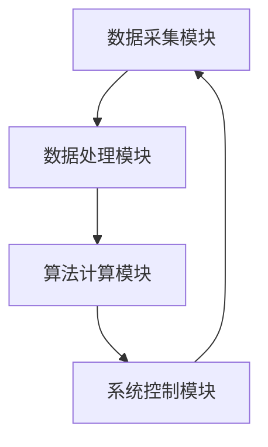
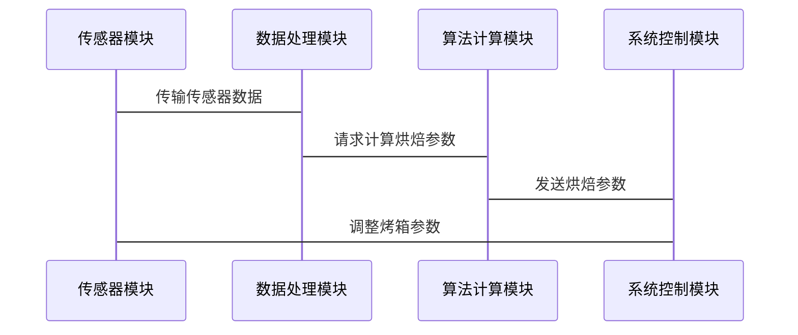

                 


```markdown
# 智能烤箱：AI Agent的烘焙参数自动调节

> 关键词：AI Agent, 智能烤箱, 烘焙参数, 自动调节, 机器学习, 神经网络, 系统架构

> 摘要：本文将详细探讨如何通过AI Agent实现智能烤箱中烘焙参数的自动调节。从AI Agent的基本概念到其在智能烤箱中的具体应用，从数学模型的建立到系统架构的设计，再到实际项目的实现与分析，我们将全面解析这一创新技术的核心原理与实际应用。

---

# 第一部分: 背景与概念

## 第1章: AI Agent与烘焙技术的结合

### 1.1 AI Agent的定义与核心概念

#### 1.1.1 AI Agent的基本定义
AI Agent（人工智能代理）是指能够感知环境、自主决策并执行任务的智能实体。在智能烤箱中，AI Agent负责接收外部输入（如用户指令、环境温度等），并通过算法计算出最优的烘焙参数（如温度、时间、湿度等），从而实现烘焙过程的自动化与智能化。

#### 1.1.2 智能烤箱中的AI Agent功能
- **传感器数据采集**：AI Agent通过内部传感器实时采集烤箱的温度、湿度、压力等数据。
- **参数调节**：基于采集的数据，AI Agent通过算法计算出最优的烘焙参数。
- **动态调整**：在烘焙过程中，AI Agent能够实时监控烤箱状态，并根据需要动态调整参数。

#### 1.1.3 烘焙参数调节的重要性
- 烘焙参数直接影响烘焙产品的质量和口感。
- 传统烤箱依赖人工经验调节参数，效率低且易出错。
- AI Agent通过自动化调节，能够显著提高烘焙效率和产品质量。

---

### 1.2 智能烤箱的烘焙参数调节问题

#### 1.2.1 烘焙过程中的关键参数
- **温度**：烘焙过程中温度的变化直接影响产品的膨胀、凝固和焦化过程。
- **时间**：烘焙时间的长短决定了产品的熟度和口感。
- **湿度**：湿度控制影响产品的水分蒸发和口感。

#### 1.2.2 参数调节的复杂性与挑战
- 不同种类的烘焙产品对参数的要求不同。
- 烘焙过程是一个动态变化的过程，参数需要实时调整。
- 环境因素（如室温、气压）对烘焙过程的影响难以预测。

#### 1.2.3 AI在烘焙参数调节中的应用前景
- AI能够通过机器学习算法，从大量历史数据中学习最佳的烘焙参数。
- AI能够实时分析传感器数据，动态调整参数。
- AI能够优化烘焙过程，提高效率和产品质量。

---

### 1.3 AI Agent在智能烤箱中的作用

#### 1.3.1 AI Agent的核心功能
- 数据采集与处理：AI Agent通过传感器采集烤箱的实时数据。
- 参数计算：AI Agent通过算法计算出最优的烘焙参数。
- 决策与执行：AI Agent根据计算结果调整烤箱的运行参数。

#### 1.3.2 AI Agent与传统烤箱的对比
| **功能特性**       | **传统烤箱**           | **智能烤箱中的AI Agent**       |
|--------------------|------------------------|----------------------------------|
| 数据采集           | 无传感器或简单传感器   | 高精度多传感器（温度、湿度、压力） |
| 参数调节           | 人工调节               | 自动调节，实时优化               |
| 决策方式           | 依赖人工经验           | 数据驱动，智能决策               |

#### 1.3.3 AI Agent在烘焙过程中的优化作用
- **提高效率**：AI Agent能够快速计算出最优参数，缩短烘焙时间。
- **提升质量**：通过实时调整参数，AI Agent能够保证烘焙产品的均匀性和一致性。
- **降低能耗**：AI Agent通过优化参数，减少能源浪费。

---

## 第2章: AI Agent的设计原理

### 2.1 AI Agent的基本原理

#### 2.1.1 传感器数据的采集与处理
AI Agent通过多种传感器（如温度传感器、湿度传感器等）实时采集烤箱的环境数据，并将这些数据进行预处理（如滤波、归一化等）。

#### 2.1.2 烘焙参数的动态调整机制
AI Agent根据当前传感器数据和历史数据，通过算法计算出最优的烘焙参数，并通过烤箱的控制系统进行调整。

#### 2.1.3 AI算法的实时计算与反馈
AI Agent采用机器学习算法（如回归算法、神经网络等）进行实时计算，并根据烘焙过程的反馈不断优化算法模型。

---

### 2.2 AI Agent的核心算法

#### 2.2.1 机器学习算法的选择与应用
- **线性回归**：用于预测烘焙时间与温度的关系。
- **支持向量机（SVM）**：用于分类烘焙产品的状态。
- **神经网络**：用于复杂的非线性关系建模。

#### 2.2.2 神经网络在烘焙参数调节中的应用
- **输入层**：接收传感器数据。
- **隐藏层**：进行特征提取和非线性变换。
- **输出层**：输出预测的烘焙参数。

#### 2.2.3 预测模型的构建与优化
- **数据准备**：收集和标注烘焙过程中的数据。
- **模型训练**：使用训练数据训练机器学习模型。
- **模型优化**：通过交叉验证和超参数调优提高模型性能。

---

### 2.3 AI Agent的系统架构

#### 2.3.1 系统功能模块划分
- **传感器模块**：负责采集环境数据。
- **计算模块**：负责数据处理和参数计算。
- **控制模块**：负责调整烤箱的运行参数。
- **反馈模块**：负责收集烘焙过程的反馈数据。

#### 2.3.2 各模块之间的交互
- 传感器模块将数据传输给计算模块。
- 计算模块根据数据计算出参数，并将结果传输给控制模块。
- 控制模块调整烤箱参数，并将反馈数据传输给反馈模块。
- 反馈模块将反馈数据传输给计算模块，用于模型优化。

---

## 第3章: 数学模型与算法实现

### 3.1 线性回归模型

#### 3.1.1 线性回归的基本原理
线性回归是一种统计学习方法，用于建立自变量和因变量之间的线性关系。

#### 3.1.2 线性回归的数学公式
$$ y = \beta_0 + \beta_1x + \epsilon $$
其中，$y$ 是目标变量，$x$ 是自变量，$\beta_0$ 和 $\beta_1$ 是回归系数，$\epsilon$ 是误差项。

#### 3.1.3 线性回归在烘焙参数调节中的应用
- 预测烘焙时间与温度的关系。

---

### 3.2 神经网络模型

#### 3.2.1 神经网络的基本结构
- **输入层**：接收传感器数据。
- **隐藏层**：进行特征提取和非线性变换。
- **输出层**：输出预测的烘焙参数。

#### 3.2.2 神经网络的训练过程
- **正向传播**：输入数据经过网络计算出输出值。
- **反向传播**：计算预测值与真实值之间的误差，并通过梯度下降优化网络参数。

#### 3.2.3 神经网络的数学公式
$$ y = \sigma(wx + b) $$
其中，$w$ 是权重，$b$ 是偏置，$\sigma$ 是激活函数（如ReLU、Sigmoid等）。

---

## 第4章: 系统架构设计

### 4.1 系统功能设计

#### 4.1.1 系统功能模块划分
- **数据采集模块**：负责采集传感器数据。
- **数据处理模块**：对数据进行预处理和特征提取。
- **算法计算模块**：基于机器学习算法计算烘焙参数。
- **系统控制模块**：调整烤箱的运行参数。

#### 4.1.2 系统功能流程
1. 数据采集模块采集传感器数据。
2. 数据处理模块对数据进行预处理。
3. 算法计算模块计算出烘焙参数。
4. 系统控制模块调整烤箱的运行参数。
5. 烘焙过程中的反馈数据传输到数据采集模块，用于模型优化。

---

### 4.2 系统架构设计

#### 4.2.1 系统架构图


#### 4.2.2 系统交互图


---

## 第5章: 项目实战

### 5.1 环境安装与配置

#### 5.1.1 环境要求
- **Python**：3.6+
- **TensorFlow**：2.0+
- **Mermaid**：用于绘制系统架构图
- **Jupyter Notebook**：用于算法实现与测试

---

### 5.2 系统核心实现

#### 5.2.1 数据采集模块实现
```python
import numpy as np

# 传感器数据模拟
def get_sensor_data():
    temp = np.random.normal(180, 10)
    humidity = np.random.uniform(20, 60)
    return temp, humidity

temp, humidity = get_sensor_data()
print(f"温度: {temp}, 湿度: {humidity}")
```

#### 5.2.2 数据处理模块实现
```python
import pandas as pd

# 数据预处理
def preprocess_data(temp, humidity):
    # 数据标准化
    temp_norm = (temp - np.mean(temp)) / np.std(temp)
    humidity_norm = (humidity - np.mean(humidity)) / np.std(humidity)
    return temp_norm, humidity_norm

temp_norm, humidity_norm = preprocess_data(temp, humidity)
print(f"标准化温度: {temp_norm}, 标准化湿度: {humidity_norm}")
```

#### 5.2.3 算法计算模块实现
```python
import tensorflow as tf
from tensorflow.keras import layers

# 神经网络模型
model = tf.keras.Sequential([
    layers.Dense(64, activation='relu'),
    layers.Dense(1, activation='linear')
])

model.compile(optimizer='adam', loss='mean_squared_error')
model.fit(X_train, y_train, epochs=100, batch_size=32)
```

---

### 5.3 案例分析与优化

#### 5.3.1 实际案例分析
- **案例背景**：某品牌蛋糕的烘焙参数优化。
- **数据准备**：收集不同温度和湿度下的烘焙时间数据。
- **模型训练**：使用神经网络模型进行训练。
- **模型预测**：预测最优烘焙参数。

#### 5.3.2 模型优化
- **超参数调整**：优化学习率、批次大小等参数。
- **模型结构优化**：增加或减少网络层数，调整节点数。
- **数据增强**：增加训练数据的多样性。

---

## 第6章: 最佳实践与小结

### 6.1 最佳实践

#### 6.1.1 数据采集与处理
- 确保传感器数据的准确性和完整性。
- 数据预处理是模型训练的关键，建议进行归一化或标准化处理。

#### 6.1.2 模型选择与优化
- 根据实际问题选择合适的算法。
- 通过交叉验证和超参数调优提高模型性能。

#### 6.1.3 系统架构设计
- 合理划分功能模块，确保模块之间的高效交互。
- 使用系统架构图和交互图清晰展示系统设计。

---

### 6.2 小结

本文详细探讨了AI Agent在智能烤箱中的烘焙参数自动调节技术。从AI Agent的基本概念到其在智能烤箱中的具体应用，从数学模型的建立到系统架构的设计，再到实际项目的实现与分析，我们全面解析了这一创新技术的核心原理与实际应用。通过本文的讲解，读者可以深入了解如何利用AI技术优化烘焙过程，提升烘焙产品的质量和效率。

---

### 6.3 拓展阅读

- **机器学习**：深入学习机器学习的基础知识。
- **神经网络**：研究神经网络的原理与应用。
- **系统架构设计**：学习如何设计高效的系统架构。

---

### 6.4 注意事项

- **数据隐私**：确保烘焙数据的安全与隐私。
- **系统稳定性**：确保AI Agent系统的稳定运行。
- **用户体验**：优化用户界面，提高用户体验。

---

通过本文的讲解，读者可以掌握AI Agent在智能烤箱中的烘焙参数自动调节技术的核心原理与实际应用。这一技术不仅能够提高烘焙效率和产品质量，还为未来的智能化厨房提供了重要的技术基础。
```

