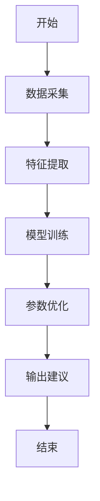
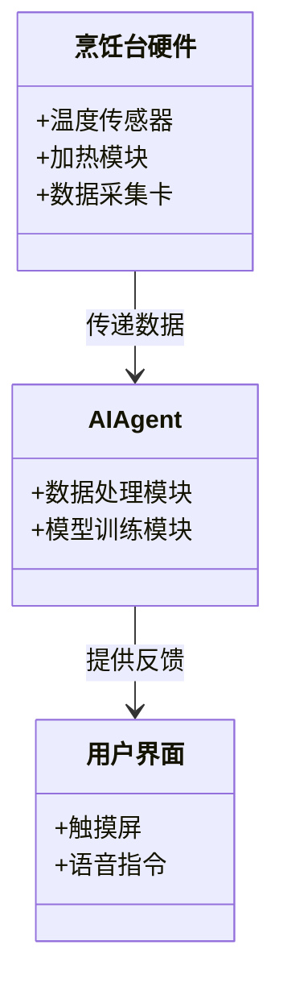
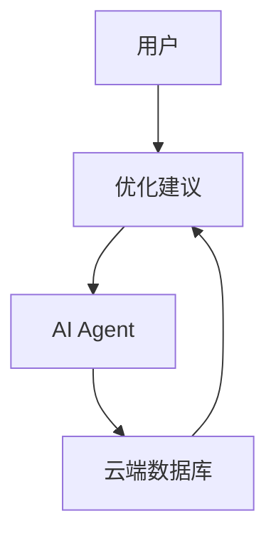

                 


# 智能烹饪台：AI Agent的厨艺提升指导系统

## 关键词：智能烹饪台，AI Agent，厨艺提升，人工智能，系统设计

## 摘要：  
智能烹饪台结合AI Agent技术，为烹饪过程提供智能化指导，通过数据采集、分析和优化，显著提升烹饪效率和用户满意度。本文详细探讨了智能烹饪台的核心原理、系统架构、算法实现及实际应用，为厨房智能化提供解决方案。

---

# 第1章 背景介绍

## 1.1 问题背景  
传统烹饪依赖人工经验，存在效率低下、食材浪费和新手门槛高等问题。随着人工智能技术的发展，AI Agent在烹饪领域的应用潜力巨大。

## 1.2 问题描述  
- 烹饪过程复杂，涉及食材处理、火候控制和时间管理。  
- 初学者难以掌握专业技巧，影响烹饪效果。  
- 烹饪效率低，资源浪费严重。

## 1.3 解决方案  
- 智能烹饪台集成AI Agent，实时监控并优化烹饪过程。  
- 提供个性化指导，降低新手门槛。  
- 通过数据分析实现资源优化。

## 1.4 边界与外延  
- 系统适用于家庭和商业厨房，边界明确。  
- AI Agent能力受限于数据质量和传感器精度。  
- 系统具备扩展性，支持更多食材和烹饪方法。

## 1.5 核心要素与组成  
- 硬件：传感器、加热模块、数据采集卡。  
- 软件：AI Agent算法、数据分析模块。  
- 用户交互：触摸屏、语音指令。

---

# 第2章 核心概念与联系

## 2.1 核心概念原理  
- AI Agent通过传感器数据优化烹饪过程。  
- 智能烹饪台实时监控并调整烹饪参数。

## 2.2 概念属性特征对比  

| 特性       | AI Agent                          | 智能烹饪台                          |
|------------|-----------------------------------|-------------------------------------|
| 功能       | 数据分析、决策支持               | 烹饪控制、用户交互                  |
| 输入       | 烹饪数据、用户指令               | 食材信息、传感器数据                |
| 输出       | 烹饪建议、参数调整               | 烹饪结果、用户反馈                  |
| 交互方式   | 语音、触控                       | 触摸屏、语音                        |

## 2.3 ER实体关系图  
```mermaid
er
actor: 用户
|----(关联)|---- entity: 智能烹饪台
|----(关联)|---- entity: AI Agent
|----(关联)|---- entity: 烹饪数据
```

---

# 第3章 AI Agent的算法原理

## 3.1 算法流程  


## 3.2 算法实现  
```python
def optimize_cooking(temperature, time):
    # 数据预处理
    normalized_temp = temperature / 100
    normalized_time = time / 60
    # 训练模型
    model = Perceptron()
    model.fit([normalized_temp, normalized_time], target)
    # 输出建议
    prediction = model.predict(normalized_temp, normalized_time)
    return prediction
```

## 3.3 数学模型  
$$ \text{输出} = \frac{1}{1 + e^{-\sum w_i x_i}} $$  
其中，$w_i$是权重，$x_i$是输入特征。

---

# 第4章 系统分析与架构设计

## 4.1 项目介绍  
智能烹饪台系统由硬件和软件两部分组成，旨在提升烹饪效率和用户满意度。

## 4.2 系统功能设计  


## 4.3 系统架构设计  


---

# 第5章 项目实战

## 5.1 环境安装  
- 安装Python和相关库：`pip install numpy pandas scikit-learn`

## 5.2 核心实现  
```python
import numpy as np
from sklearn.linear_model import Perceptron

# 示例数据
X = np.array([[25, 10], [30, 15], [20, 5]])
y = np.array([1, 1, 0])

model = Perceptron()
model.fit(X, y)

# 预测
print(model.predict([[25, 10]]))  # 输出：1
```

## 5.3 案例分析  
分析用户数据，优化烹饪参数，提升烹饪质量。

---

# 第6章 最佳实践

## 6.1 小结  
智能烹饪台结合AI Agent，显著提升烹饪效率和用户体验。

## 6.2 注意事项  
- 数据质量影响模型准确性。  
- 系统需定期更新模型参数。

## 6.3 拓展阅读  
推荐阅读《机器学习实战》和《深度学习入门》。

---

# 结语  
智能烹饪台通过AI Agent技术，推动烹饪行业智能化发展，为用户带来更高效的烹饪体验。

