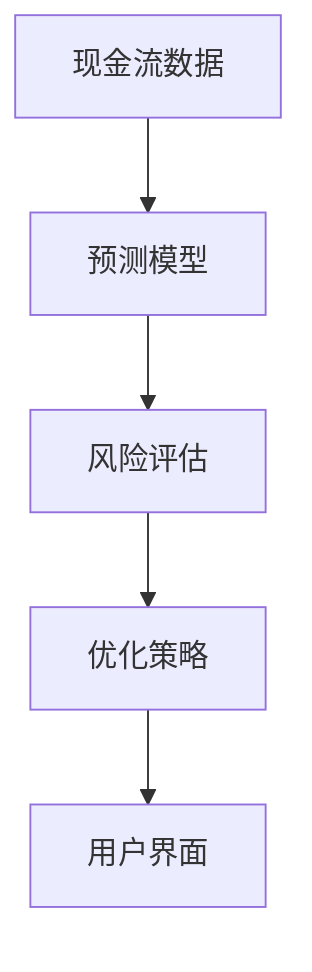
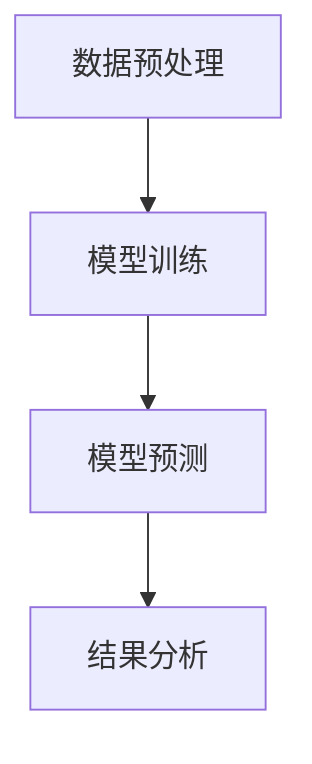
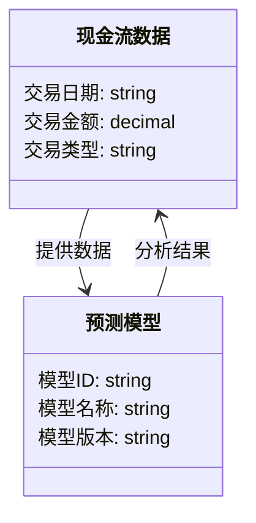

                 


# 智能现金流优化管理系统

## 关键词：
智能现金流管理、现金流预测、现金流优化、机器学习、系统架构设计

## 摘要：
智能现金流优化管理系统是一种结合人工智能和大数据分析的先进系统，旨在通过智能预测、风险评估和优化策略来提升企业现金流管理的效率和准确性。本文将从系统的背景、核心概念、算法原理、架构设计、项目实战到最佳实践进行全面阐述，帮助读者深入理解并掌握智能现金流优化管理的核心技术与应用。

---

# 第1章: 智能现金流优化管理系统的背景介绍

## 1.1 现金流管理的背景与重要性

### 1.1.1 现金流管理的基本概念
现金流是企业运营的血液，涉及资金的流入和流出。有效的现金流管理能够确保企业的正常运营，支持投资和扩张，避免资金链断裂。

### 1.1.2 现金流管理在企业运营中的作用
- 支持日常运营：支付账单、员工工资等。
- 支持投资决策：优化资本分配，提高投资回报率。
- 风险管理：降低现金流波动带来的风险。

### 1.1.3 智能化现金流管理的必要性
传统现金流管理依赖人工操作，效率低、误差大。随着大数据和人工智能的发展，智能化管理成为趋势，能够提高预测准确性，实时监控风险。

## 1.2 智能现金流优化管理系统的定义与目标

### 1.2.1 系统的定义
智能现金流优化管理系统是利用AI和大数据技术，对企业的现金流进行预测、分析和优化，辅助决策的系统。

### 1.2.2 系统的目标与核心功能
- **目标**：提高现金流预测的准确性，优化资金使用效率，降低财务风险。
- **核心功能**：
  - 现金流预测
  - 风险评估
  - 优化策略生成
  - 实时监控

### 1.2.3 系统的边界与外延
- **边界**：仅关注企业内部现金流管理，不涉及外部金融市场。
- **外延**：可扩展至供应链金融、投资决策等领域。

## 1.3 系统的核心要素与概念结构

### 1.3.1 核心要素分析
- 数据源：包括历史交易数据、市场数据等。
- 预测模型：基于机器学习的时间序列模型。
- 优化算法：动态规划或遗传算法。
- 用户界面：供用户查询和操作的界面。

### 1.3.2 概念结构图


---

# 第2章: 智能现金流优化管理系统的核心概念与联系

## 2.1 核心概念的原理与特点

### 2.1.1 现金流预测的原理
现金流预测基于历史数据，利用统计或机器学习模型预测未来的现金流。

### 2.1.2 现金流风险评估的特点
- **波动性**：现金流的不确定性。
- **相关性**：与其他财务指标的关系。
- **可预测性**：通过模型量化风险。

### 2.1.3 现金流优化的数学模型
优化模型通常采用线性规划或动态规划，目标是最小化风险或最大化收益。

## 2.2 核心概念的属性特征对比

| 概念       | 输入          | 输出          | 方法          |
|------------|---------------|---------------|---------------|
| 现金流预测 | 历史数据       | 预测值         | 时间序列模型  |
| 风险评估   | 数据波动性     | 风险等级       | 统计分析       |
| 优化策略   | 预测值和目标   | 最优策略       | 线性规划        |

## 2.3 系统的ER实体关系图

```mermaid
erDiagram
    用户 {
        +string 用户ID
        +string 用户名
        +string 密码
    }
    管理员 {
        +string 管理员ID
        +string 管理员名
        +string 密码
    }
    现金流数据 {
        +string 交易日期
        +decimal 交易金额
        +string 交易类型
    }
    预测模型 {
        +string 模型ID
        +string 模型名称
        +string 模型版本
    }
    用户 --> 现金流数据: 提供和查询
    管理员 --> 现金流数据: 管理和维护
    预测模型 --> 现金流数据: 数据分析
```

---

# 第3章: 现金流预测的算法原理

## 3.1 现金流预测的机器学习模型

### 3.1.1 基于时间序列的预测模型



### 3.1.2 基于回归分析的预测模型
- **线性回归**：适用于简单线性关系。
- **岭回归**：用于高维数据，防止过拟合。

### 3.1.3 时间序列模型的实现步骤

```python
import pandas as pd
from sklearn.model_selection import train_test_split
from sklearn.linear_model import LinearRegression

# 数据加载
data = pd.read_csv('cash_flow.csv')
# 特征与目标分离
X = data[['历史现金流']]
y = data['预测现金流']
# 划分训练集和测试集
X_train, X_test, y_train, y_test = train_test_split(X, y, test_size=0.2)
# 模型训练
model = LinearRegression()
model.fit(X_train, y_train)
# 预测
y_pred = model.predict(X_test)
```

## 3.2 现金流预测的数学模型

### 3.2.1 时间序列模型公式

$$ ARIMA(p, d, q) $$

其中：
- \( p \) 是自回归阶数。
- \( d \) 是差分阶数。
- \( q \) 是移动平均阶数。

### 3.2.2 线性回归模型公式

$$ y = \beta_0 + \beta_1x + \epsilon $$

其中：
- \( y \) 是目标变量。
- \( x \) 是特征变量。
- \( \beta_0 \) 和 \( \beta_1 \) 是回归系数。
- \( \epsilon \) 是误差项。

---

# 第4章: 系统分析与架构设计

## 4.1 系统分析

### 4.1.1 问题场景介绍
企业面临现金流波动大、预测不准确等问题，需要智能化的解决方案。

### 4.1.2 系统需求分析
- 用户需求：实时预测、风险评估。
- 管理需求：数据可视化、决策支持。

## 4.2 系统架构设计

### 4.2.1 领域模型类图



### 4.2.2 系统架构图

```mermaid
container 系统架构 {
    组件1: 数据采集模块
    组件2: 数据处理模块
    组件3: 预测模型模块
    组件4: 用户界面模块
}
```

### 4.2.3 接口设计与交互序列图

```mermaid
sequenceDiagram
    用户 -> 数据采集模块: 请求数据
    数据采集模块 -> 数据处理模块: 提供数据
    数据处理模块 -> 预测模型模块: 请求预测
    预测模型模块 -> 数据处理模块: 返回预测结果
    数据处理模块 -> 用户界面模块: 更新界面
    用户 <- 用户界面模块: 显示结果
```

---

# 第5章: 项目实战

## 5.1 环境安装与配置

### 5.1.1 安装Python环境
使用Anaconda安装Python 3.8以上版本。

### 5.1.2 安装依赖库
```bash
pip install pandas scikit-learn matplotlib
```

## 5.2 系统核心功能实现

### 5.2.1 数据采集模块

```python
import pandas as pd

def load_data():
    data = pd.read_csv('cash_flow.csv')
    return data
```

### 5.2.2 数据处理模块

```python
def preprocess(data):
    data['日期'] = pd.to_datetime(data['日期'])
    data.set_index('日期', inplace=True)
    return data
```

### 5.2.3 预测模型实现

```python
from sklearn.ensemble import RandomForestRegressor

def train_model(data):
    X = data[['历史现金流']]
    y = data['预测现金流']
    model = RandomForestRegressor()
    model.fit(X, y)
    return model
```

## 5.3 实际案例分析与解读

### 5.3.1 数据采集与预处理
假设我们有2023年1月到6月的现金流数据，进行清洗和格式化处理。

### 5.3.2 模型训练与优化
通过交叉验证选择最佳模型参数，提高预测准确性。

### 5.3.3 系统运行与测试
在测试数据上验证模型性能，评估预测误差。

---

# 第6章: 最佳实践与总结

## 6.1 小结与总结
智能现金流优化管理系统通过AI和大数据技术，显著提升了现金流管理的效率和准确性。

## 6.2 注意事项与常见问题
- 数据质量影响预测准确性。
- 模型需要定期更新，适应数据变化。
- 系统安全性需重视，防止数据泄露。

## 6.3 拓展阅读与学习资源
- 推荐书籍：《机器学习实战》、《大数据系统设计》。
- 在线资源：Coursera上的相关课程。

---

通过以上目录，我们可以系统地学习和构建智能现金流优化管理系统，从理论到实践，全面掌握其设计与实现的关键点。

