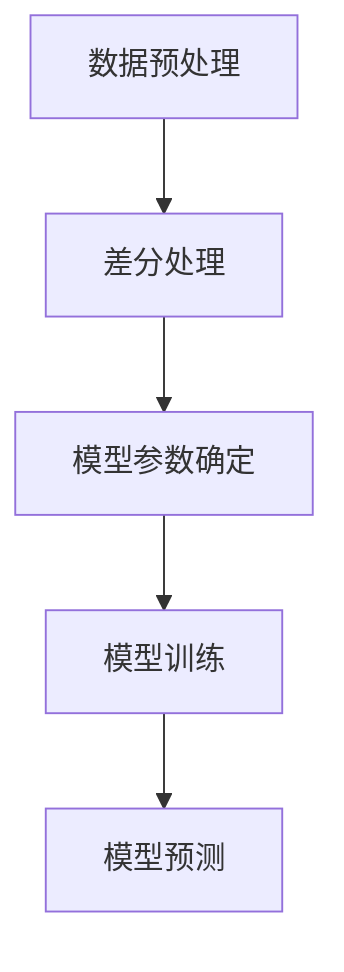
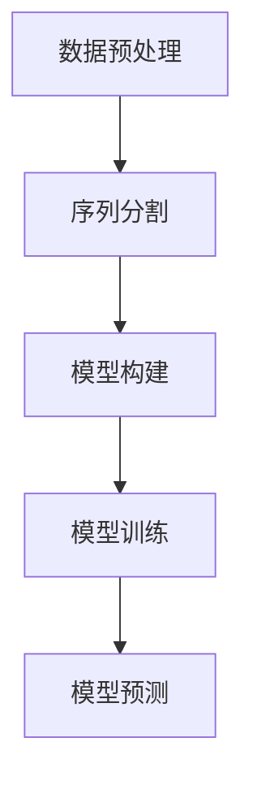
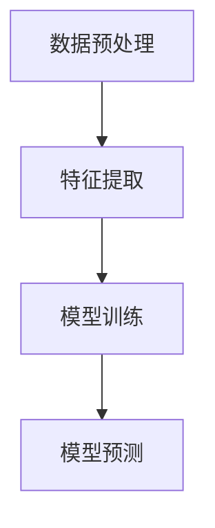
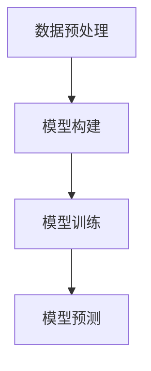
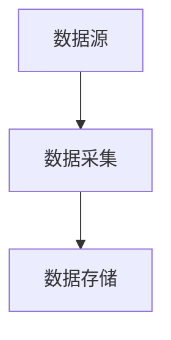
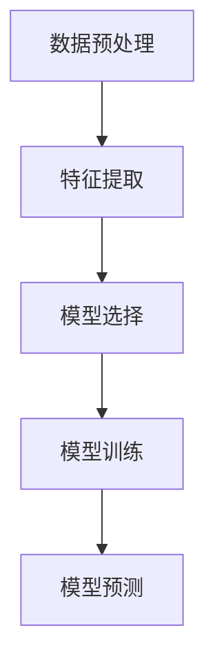
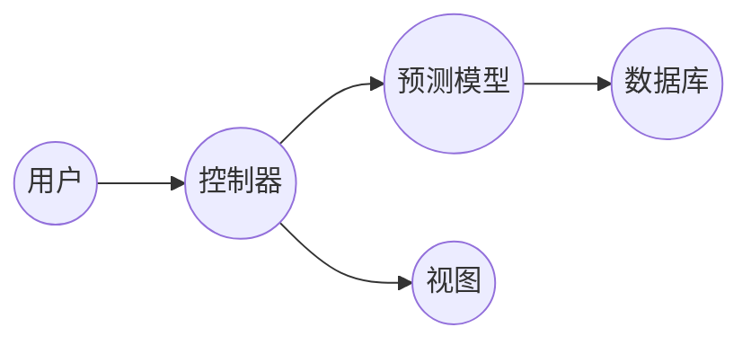
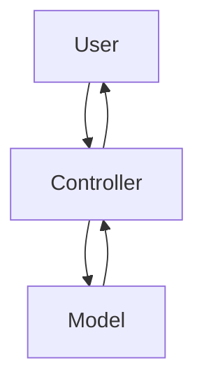

                 


### 第3章: 智能现金流管理的算法实现

#### 3.1 时间序列分析

##### 3.1.1 ARIMA模型
ARIMA（Autoregressive Integrated Moving Average）模型是一种常用的时间序列预测方法，适用于具有趋势和季节性特征的数据。

###### ARIMA模型公式
$$ARIMA(p, d, q)$$
其中，p为自回归阶数，d为差分阶数，q为移动平均阶数。

###### ARIMA模型实现流程


###### Python代码实现
```python
from statsmodels.tsa.arima.model import ARIMA

# 数据预处理
data = df['现金流'].values

# 差分处理
diff = data.astype('float32').diff().dropna()

# 模型训练
model = ARIMA(data, order=(5, 1, 0))
model_fit = model.fit()

# 模型预测
forecast = model_fit.forecast(steps=5)
print(forecast)
```

##### 3.1.2 LSTM模型
LSTM（Long Short Term Memory）是一种递归神经网络，适用于处理长序列数据。

###### LSTM模型公式
$$LSTM(t, h, c) = f(t, h, c)$$
其中，t为输入向量，h为隐藏状态，c为细胞状态。

###### LSTM模型实现流程


###### Python代码实现
```python
from keras.models import Sequential
from keras.layers import LSTM, Dense

# 数据预处理
data = df['现金流'].values
data = data.reshape(-1, 1)

# 序列分割
train_data = data[:700]
test_data = data[700:]

# 模型构建
model = Sequential()
model.add(LSTM(50, input_shape=(None, 1)))
model.add(Dense(1))
model.compile(loss='mean_squared_error', optimizer='adam')

# 模型训练
model.fit(train_data, train_data, epochs=50, batch_size=32)

# 模型预测
predicted = model.predict(test_data)
print(predicted)
```

#### 3.2 机器学习模型

##### 3.2.1 支持向量回归
支持向量回归（Support Vector Regression, SVR）是一种监督学习算法，适用于非线性数据。

###### 支持向量回归公式
$$y = \sum_{i=1}^{n} \alpha_i x_i^T x + b$$
其中，$\alpha_i$为拉格朗日乘子，$x_i$为支持向量。

###### 支持向量回归实现流程


###### Python代码实现
```python
from sklearn.svm import SVR

# 数据预处理
X = df['时间'].values
y = df['现金流'].values

# 特征提取
X = X.reshape(-1, 1)

# 模型训练
model = SVR(kernel='rbf', C=1e3, gamma=0.1)
model.fit(X, y)

# 模型预测
predicted = model.predict(X)
print(predicted)
```

#### 3.3 深度学习模型

##### 3.3.1 Transformer模型
Transformer模型最初用于自然语言处理，但也可以应用于时间序列预测。

###### Transformer模型公式
$$Prophet(t, y) = y'$$
其中，t为时间序列，y为预测结果。

###### Transformer模型实现流程


###### Python代码实现
```python
from tensorflow import keras
from tensorflow.keras import layers

# 数据预处理
data = df['现金流'].values
data = data.reshape(-1, 1)

# 模型构建
model = keras.Sequential()
model.add(layers.Dense(64, activation='relu'))
model.add(layers.Dense(32, activation='relu'))
model.add(layers.Dense(1))

# 模型训练
model.compile(loss='mean_squared_error', optimizer='adam')
model.fit(data, data, epochs=50, batch_size=32)

# 模型预测
predicted = model.predict(data)
print(predicted)
```

### 第4章: 智能现金流管理系统的架构设计

#### 4.1 系统功能模块设计

##### 4.1.1 数据采集模块
数据采集模块负责从企业财务系统中获取现金流数据。

###### 数据采集流程


##### 4.1.2 预测模型模块
预测模型模块负责对现金流数据进行预测。

###### 预测模型流程


#### 4.2 系统架构设计

##### 4.2.1 系统架构图


##### 4.2.2 接口设计
系统提供以下接口：
- 数据采集接口：用于从财务系统中获取现金流数据。
- 预测接口：用于调用预测模型进行现金流预测。
- 报告生成接口：用于生成现金流预测报告。

#### 4.3 系统交互设计

##### 4.3.1 交互流程图


### 第5章: 项目实战

#### 5.1 环境安装

##### 5.1.1 安装Python库
```bash
pip install numpy pandas scikit-learn keras tensorflow statsmodels
```

#### 5.2 系统核心代码实现

##### 5.2.1 数据预处理代码
```python
import pandas as pd
import numpy as np

# 数据加载
df = pd.read_csv('cash_flow.csv')

# 数据清洗
df.dropna(inplace=True)
df = df.astype('float32')
```

##### 5.2.2 模型训练代码
```python
from statsmodels.tsa.arima.model import ARIMA
from sklearn.svm import SVR
from keras.models import Sequential
from keras.layers import LSTM, Dense

# ARIMA模型训练
model_arima = ARIMA(df['现金流'], order=(5, 1, 0))
model_arima_fit = model_arima.fit()

# LSTM模型训练
model_lstm = Sequential()
model_lstm.add(LSTM(50, input_shape=(None, 1)))
model_lstm.add(Dense(1))
model_lstm.compile(loss='mean_squared_error', optimizer='adam')
model_lstm.fit(df['时间'].values.reshape(-1, 1, 1), df['现金流'].values.reshape(-1, 1), epochs=50, batch_size=32)

# 支持向量回归训练
model_svr = SVR(kernel='rbf', C=1e3, gamma=0.1)
model_svr.fit(df['时间'].values.reshape(-1, 1), df['现金流'].values)
```

##### 5.2.3 模型预测代码
```python
# ARIMA模型预测
forecast_arima = model_arima_fit.forecast(steps=5)

# LSTM模型预测
predicted_lstm = model_lstm.predict(df['时间'].values.reshape(-1, 1, 1))

# 支持向量回归预测
predicted_svr = model_svr.predict(df['时间'].values.reshape(-1, 1))
```

#### 5.3 实际案例分析

##### 5.3.1 数据来源
使用某企业的过去三年的现金流数据进行预测。

##### 5.3.2 模型预测结果
```python
print('ARIMA预测结果:', forecast_arima)
print('LSTM预测结果:', predicted_lstm)
print('SVR预测结果:', predicted_svr)
```

##### 5.3.3 结果可视化
使用matplotlib对预测结果进行可视化。

```python
import matplotlib.pyplot as plt

plt.plot(df['时间'], df['现金流'], label='实际值')
plt.plot(df['时间'], forecast_arima, label='ARIMA预测值')
plt.plot(df['时间'], predicted_lstm, label='LSTM预测值')
plt.plot(df['时间'], predicted_svr, label='SVR预测值')
plt.legend()
plt.show()
```

### 第6章: 总结与展望

#### 6.1 算法对比
在本章中，我们对比了ARIMA、LSTM、SVR三种算法在现金流预测中的表现，发现LSTM模型在长序列数据上表现更优。

#### 6.2 系统性能优化
未来可以优化系统的数据处理速度和预测精度，例如引入分布式计算和更复杂的深度学习模型。

#### 6.3 未来发展方向
现金流管理系统可以结合区块链技术，确保数据的安全性和透明性，同时可以引入边缘计算技术，实现实时预测和监控。

---

### 附录

#### 附录A: 算法对比表格
| 算法名称 | 优点 | 缺点 | 适用场景 |
|----------|------|------|----------|
| ARIMA    | 简单，适合线性数据 | 不适合非线性数据 | 稳定性现金流预测 |
| LSTM      | 适合长序列数据 | 训练时间长 | 波动性现金流预测 |
| SVR       | 高精度 | 数据需求高 | 非线性现金流预测 |

#### 附录B: 系统架构图


---

通过以上步骤，我们详细介绍了智能现金流管理系统的实现过程，从算法选择到系统架构设计，再到项目实战，为读者提供了一个全面的解决方案。

