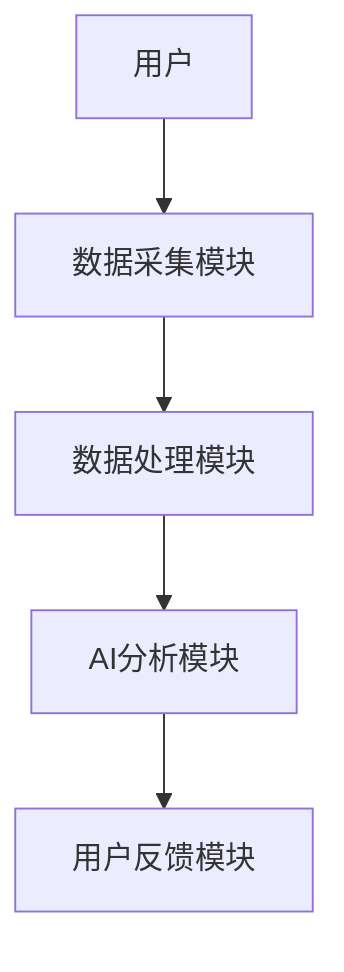
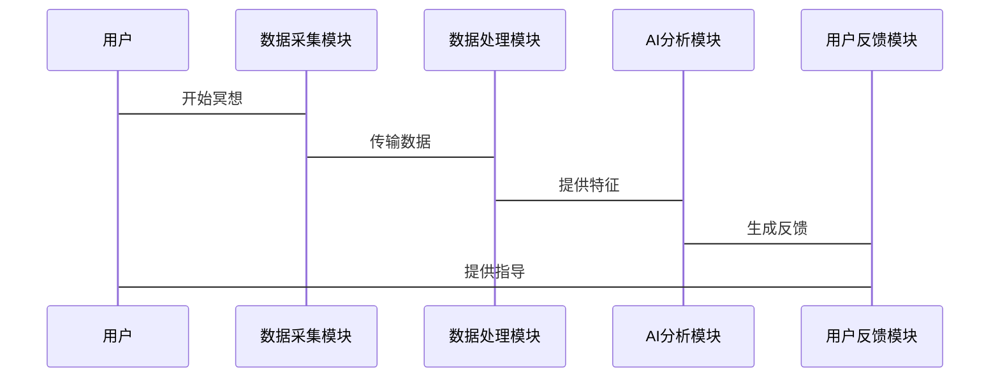

                 


# 智能瑜伽垫：AI Agent的冥想辅助系统

> 关键词：智能瑜伽垫，AI Agent，冥想辅助，传感器技术，机器学习，个性化健康

> 摘要：随着现代人对健康和心理状态的关注度不断提高，智能瑜伽垫作为一种结合了AI技术的创新健康产品，正在逐渐走入人们的生活。本文将详细介绍智能瑜伽垫的核心功能、技术实现、系统架构以及实际应用场景，探讨AI Agent在冥想辅助中的重要作用，为读者提供一个全面的技术视角。

---

## 第一部分: 背景与概念

### 第1章: 智能瑜伽垫的发展与AI Agent的引入

#### 1.1 智能瑜伽垫的背景与现状
现代生活中，人们面临着越来越大的压力，冥想和瑜伽作为一种有效的减压方式，受到广泛欢迎。然而，传统的瑜伽垫仅提供物理支撑，无法提供个性化的指导和反馈。随着人工智能技术的快速发展，智能瑜伽垫应运而生，通过集成传感器和AI算法，为用户提供智能化的冥想辅助服务。

#### 1.2 AI Agent的核心概念
AI Agent（智能代理）是一种能够感知环境、执行任务并提供决策支持的智能系统。在智能瑜伽垫中，AI Agent通过分析用户的动作、呼吸和心理状态，提供实时的反馈和指导，帮助用户达到最佳的冥想状态。

#### 1.3 智能瑜伽垫与AI Agent的结合方式
智能瑜伽垫通过集成多种传感器（如压力传感器、加速度传感器和心率传感器）收集用户的生理数据，并通过AI Agent进行数据处理和分析，最终为用户提供个性化的冥想指导。

### 第2章: 智能瑜伽垫的功能与应用场景

#### 2.1 智能瑜伽垫的核心功能
- **体式识别与矫正**：通过传感器数据，识别用户的瑜伽动作，并提供实时矫正建议。
- **呼吸监测与反馈**：实时监测用户的呼吸频率和深度，指导用户调整呼吸节奏。
- **瑜伽计划个性化推荐**：根据用户的健康状况和冥想目标，推荐适合的瑜伽练习计划。

#### 2.2 AI Agent在冥想辅助中的应用场景
- **瑜伽动作的实时指导**：AI Agent通过分析用户的动作数据，提供实时的体式矫正建议。
- **精神状态的实时监测**：通过分析用户的生理数据，评估用户的冥想状态，并提供相应的反馈。
- **瑜伽计划的动态调整**：根据用户的反馈和数据，动态调整瑜伽计划，以达到最佳的冥想效果。

---

## 第二部分: 技术基础

### 第3章: 智能瑜伽垫的传感器技术

#### 3.1 传感器类型与功能
| 传感器类型 | 功能描述 |
|------------|----------|
| 压力传感器 | 检测用户在瑜伽垫上的压力分布，用于体式识别。 |
| 加速度传感器 | 检测用户的动作变化，用于分析动作的流畅性。 |
| 心率传感器 | 监测用户的心率变化，用于评估冥想状态。 |

#### 3.2 传感器数据的采集与处理
- **数据采集**：通过多种传感器同步采集用户的生理数据，并通过无线通信技术将数据传输到AI Agent。
- **数据预处理**：对采集到的数据进行去噪、归一化处理，确保数据的准确性和一致性。
- **数据特征提取**：提取关键特征（如呼吸频率、动作幅度等），为后续的AI分析提供基础。

### 第4章: AI Agent的核心算法

#### 4.1 体式识别算法
- **基于深度学习的体式识别**：使用卷积神经网络（CNN）对用户的动作进行分类，识别出具体的瑜伽体式。
- **基于模板匹配的体式识别**：将用户动作与标准动作模板进行匹配，判断用户动作的准确度。

#### 4.2 呼吸监测与分析算法
- **呼吸频率计算**：通过分析用户的心率数据，计算呼吸频率。
- **呼吸深度估算**：通过分析用户的胸腹运动数据，估算呼吸深度。
- **呼吸与冥想状态的关联分析**：通过分析呼吸数据，判断用户的冥想状态（如放松、专注等）。

---

## 第三部分: 系统设计

### 第5章: 系统功能设计

#### 5.1 系统功能模块
- **数据采集模块**：负责采集用户的生理数据。
- **数据处理模块**：对采集到的数据进行预处理和特征提取。
- **AI分析模块**：通过AI算法分析用户的数据，提供实时反馈和指导。
- **用户反馈模块**：将AI分析结果反馈给用户，指导用户进行冥想练习。

#### 5.2 系统架构设计


### 第6章: 系统交互设计

#### 6.1 系统交互流程
- 用户开始冥想练习。
- 数据采集模块采集用户的生理数据。
- 数据处理模块对数据进行处理。
- AI分析模块分析数据并生成反馈。
- 用户反馈模块将反馈信息传递给用户。

#### 6.2 交互设计示例


---

## 第四部分: 项目实战

### 第7章: 项目环境与代码实现

#### 7.1 环境搭建
- 安装必要的传感器和开发工具。
- 配置AI算法的开发环境（如Python、TensorFlow）。

#### 7.2 核心代码实现
```python
# 示例代码：体式识别算法
import numpy as np
from sklearn.metrics import accuracy_score

def classify_posture(features):
    # 假设features为用户的动作特征
    # 使用机器学习模型进行分类
    model = load_model('posture_classifier.h5')
    prediction = model.predict(features)
    return prediction

# 示例代码：呼吸监测算法
def analyze_respiration(data):
    # 假设data为心率数据
    # 计算呼吸频率
    frequency = calculate_frequency(data)
    return frequency
```

#### 7.3 代码解读与分析
- **体式识别算法**：通过机器学习模型对用户的动作特征进行分类，识别出具体的瑜伽体式。
- **呼吸监测算法**：通过分析心率数据，计算用户的呼吸频率，评估用户的冥想状态。

### 第8章: 实际案例分析

#### 8.1 案例背景
- 用户A，25岁，长期压力较大，希望通过冥想缓解压力。

#### 8.2 案例分析
- 数据采集：采集用户A的生理数据。
- 数据处理：对数据进行预处理和特征提取。
- AI分析：通过AI算法分析数据，生成个性化的冥想指导方案。
- 反馈与调整：根据用户的反馈，动态调整瑜伽计划。

### 第8.3 项目小结
智能瑜伽垫通过AI Agent的强大功能，为用户提供了一种全新的冥想辅助方式。通过实时反馈和个性化指导，帮助用户达到最佳的冥想状态。

---

## 第五部分: 总结与展望

### 第9章: 总结与展望

#### 9.1 小结
智能瑜伽垫结合了先进的传感器技术和AI算法，为用户提供了一种智能化的冥想辅助方式。通过实时反馈和个性化指导，帮助用户达到最佳的冥想状态。

#### 9.2 展望
未来，智能瑜伽垫将进一步优化AI算法，提升用户体验。同时，随着物联网技术的发展，智能瑜伽垫将与其他健康设备无缝连接，为用户提供更加全面的健康服务。

---

通过以上内容，我们可以看到，智能瑜伽垫作为一种结合了AI技术的创新产品，正在为现代人的健康和冥想提供有力的支持。随着技术的不断发展，智能瑜伽垫的功能将更加完善，为用户带来更加优质的服务。

