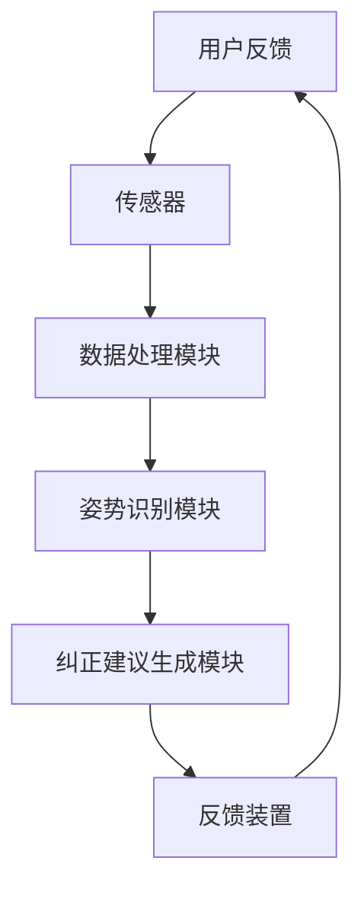
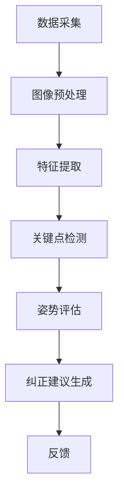
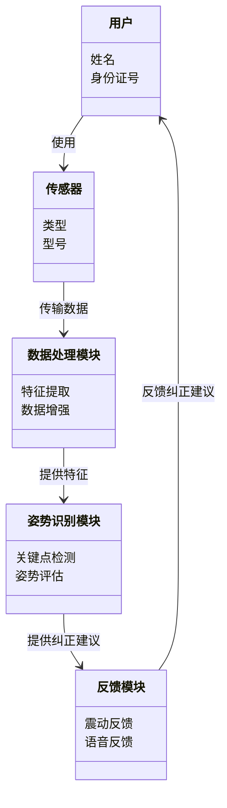
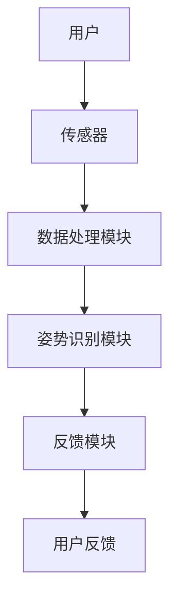

                 


# 智能瑜伽垫：AI Agent的实时姿势纠正系统

> 关键词：智能瑜伽垫，AI Agent，实时姿势纠正，人体姿态识别，深度学习，反馈系统

> 摘要：智能瑜伽垫通过结合AI技术与人体姿态识别，实现了对瑜伽练习者姿势的实时纠正。本文将从背景介绍、核心概念、算法原理、系统架构到项目实战，全面解析智能瑜伽垫的设计与实现过程。文章详细阐述了AI Agent的原理、实时反馈机制、人体姿态识别的算法流程，以及系统架构设计等关键内容。

---

# 第一部分: 智能瑜伽垫的背景与核心概念

## 第1章: 问题背景与需求分析

### 1.1 传统瑜伽教学的痛点

#### 1.1.1 瑜伽教学的现状与挑战
瑜伽作为一种流行的健身方式，其教学质量很大程度上依赖于教练的实时指导。然而，传统瑜伽教学存在以下问题：
- **教师资源有限**：学生数量多，教师难以逐一关注。
- **学生姿势错误**：学生在练习中容易出现姿势偏差，长期积累可能导致运动损伤。
- **反馈延迟**：教师的反馈通常是在课后或练习结束后，无法实时纠正错误动作。

#### 1.1.2 学生常见姿势错误与纠正难点
学生在瑜伽练习中常见的姿势错误包括：
- 弯曲膝盖
- 脊柱扭转不当
- 平衡不稳
这些错误动作不仅影响练习效果，还可能对学生的健康造成伤害。

#### 1.1.3 现有解决方案的局限性
现有的解决方案主要包括：
- **视频教学**：缺乏实时互动和个性化的指导。
- **镜像反馈**：依赖镜子的视觉反馈，学生难以自我纠正。
- **手动纠正**：依赖教师的实时指导，效率有限。

### 1.2 智能瑜伽垫的提出

#### 1.2.1 问题背景的重新定义
智能瑜伽垫是一种结合了人工智能（AI）技术的智能设备，能够实时监测用户的姿势，并提供即时反馈。

#### 1.2.2 智能瑜伽垫的核心目标
- 提供实时姿势纠正。
- 个性化教学。
- 提高练习效率和安全性。

#### 1.2.3 边界与外延的界定
智能瑜伽垫的边界包括：
- 数据采集：通过传感器和摄像头获取用户的姿势数据。
- 数据处理：利用AI算法分析姿势，提供纠正建议。
- 用户反馈：通过震动或语音提示反馈纠正建议。

### 1.3 核心概念与系统架构

#### 1.3.1 AI Agent的定义与特征
AI Agent是一种能够感知环境、做出决策并执行任务的智能实体。其特征包括：
- **自主性**：能够独立运行。
- **反应性**：能够实时响应环境变化。
- **学习能力**：能够通过数据优化自身的决策能力。

#### 1.3.2 实时姿势纠正系统的功能模块
实时姿势纠正系统包括以下功能模块：
- **数据采集模块**：通过传感器或摄像头采集用户的姿势数据。
- **姿势识别模块**：利用AI算法识别用户的姿势。
- **纠正建议生成模块**：根据识别结果生成纠正建议。
- **反馈模块**：通过震动或语音提示反馈纠正建议。

#### 1.3.3 系统的核心要素与组成
智能瑜伽垫的核心要素包括：
- **传感器**：用于采集用户的姿势数据。
- **AI算法**：用于姿势识别和纠正建议生成。
- **反馈装置**：用于实时反馈纠正建议。

## 第2章: 核心概念与系统联系

### 2.1 AI Agent的原理与机制

#### 2.1.1 AI Agent的基本原理
AI Agent通过感知环境、分析数据、做出决策并执行任务来实现智能化。其基本流程如下：
1. **感知环境**：通过传感器或摄像头采集数据。
2. **分析数据**：利用算法对数据进行分析和处理。
3. **做出决策**：基于分析结果生成纠正建议。
4. **执行任务**：通过反馈装置反馈纠正建议。

#### 2.1.2 实时反馈机制的实现方式
实时反馈机制的实现方式包括：
- **震动反馈**：通过震动提醒用户调整姿势。
- **语音反馈**：通过语音提示用户调整姿势。
- **视觉反馈**：通过显示屏幕提示用户调整姿势。

#### 2.1.3 多模态数据融合的技术特点
多模态数据融合是指将多种数据源（如图像、传感器数据）结合，以提高系统的准确性和鲁棒性。其特点包括：
- **数据多样性**：结合多种数据源。
- **准确性**：通过数据融合提高识别精度。
- **鲁棒性**：能够适应不同的环境和用户。

### 2.2 人体姿态识别的核心算法

#### 2.2.1 姿态识别的数学模型
人体姿态识别的数学模型通常基于深度学习，常用的模型包括：
- **卷积神经网络（CNN）**：用于图像特征提取。
- **图神经网络（GNN）**：用于处理人体关节之间的关系。
- **回归模型**：用于预测人体关节的位置。

#### 2.2.2 关键点检测的算法流程
关键点检测的算法流程如下：
1. **数据采集**：通过摄像头采集用户图像。
2. **图像预处理**：对图像进行归一化和增强。
3. **特征提取**：利用CNN提取图像特征。
4. **关键点预测**：基于特征预测人体关键点的位置。
5. **姿势评估**：根据关键点位置评估姿势是否正确。

#### 2.2.3 姿态评估的指标与标准
姿态评估的指标包括：
- **角度偏差**：关键点之间的角度偏差。
- **位置偏差**：关键点的位置偏差。
- **整体偏差**：整体姿势的偏差程度。

### 2.3 系统实体关系与架构图

#### 2.3.1 实体关系图（ER图）
以下是系统实体关系图：

```mermaid
erDiagram
    actor 用户 {
        string 姓名
        string 身份证号
    }
    actor 教练 {
        string 姓名
        string 教练证号
    }
    class 传感器 {
        string 类型
        string 型号
    }
    class AI算法 {
        string 类型
        string 版本
    }
    class 反馈装置 {
        string 类型
        string 型号
    }
    用户 --> 传感器 : 使用
    用户 --> AI算法 : 依赖
    用户 --> 反馈装置 : 使用
    教练 --> 传感器 : 配置
    教练 --> AI算法 : 优化
    教练 --> 反馈装置 : 调整
```

#### 2.3.2 系统架构图（Mermaid）



---

## 第3章: 算法原理与数学模型

### 3.1 人体姿态识别的算法流程

#### 3.1.1 数据采集与预处理
数据采集与预处理步骤包括：
1. **数据采集**：通过摄像头采集用户图像。
2. **图像归一化**：将图像归一化到统一尺寸。
3. **数据增强**：对图像进行旋转、缩放等变换，提高数据多样性。

#### 3.1.2 关键点检测算法
关键点检测算法基于深度学习，常用的模型包括：
- **YOLO**：用于目标检测。
- **CenterNet**：用于关键点检测。
- **PoseNet**：用于人体姿态识别。

#### 3.1.3 姿态评估与纠正算法
姿态评估与纠正算法包括：
1. **关键点检测**：检测人体关键点的位置。
2. **姿势评估**：根据关键点位置评估姿势是否正确。
3. **纠正建议生成**：基于评估结果生成纠正建议。

### 3.2 姿态识别的数学模型

#### 3.2.1 基于深度学习的模型
基于深度学习的模型包括：
- **卷积神经网络（CNN）**：用于图像特征提取。
- **图神经网络（GNN）**：用于处理人体关节之间的关系。

#### 3.2.2 姿态评估的数学公式
以下是一个简单的姿态评估公式：

$$
\text{姿势评分} = \sum_{i=1}^{n} w_i \cdot d_i
$$

其中，$w_i$ 是第$i$个关键点的权重，$d_i$ 是第$i$个关键点的偏差程度。

#### 3.2.3 实时反馈的计算模型
实时反馈的计算模型包括：
- **偏差程度计算**：计算关键点的偏差程度。
- **反馈强度计算**：根据偏差程度确定反馈强度。

### 3.3 算法流程图



---

## 第4章: 系统分析与架构设计

### 4.1 项目场景与需求分析

#### 4.1.1 系统目标与功能需求
系统目标包括：
- 实时监测用户的姿势。
- 提供即时反馈。
- 个性化教学。

功能需求包括：
- 数据采集模块。
- 数据处理模块。
- 姿势识别模块。
- 反馈模块。

#### 4.1.2 用户角色与权限划分
用户角色包括：
- **普通用户**：使用智能瑜伽垫进行练习。
- **教练**：配置和优化系统。

权限划分包括：
- 普通用户：使用系统。
- 教练：配置和优化系统。

#### 4.1.3 系统性能与稳定性要求
系统性能要求包括：
- 响应时间：实时反馈。
- 稳定性：长时间运行稳定。

### 4.2 系统功能设计

#### 4.2.1 领域模型设计（Mermaid类图）



#### 4.2.2 系统架构设计（Mermaid架构图）



### 4.3 系统接口设计

#### 4.3.1 数据接口
数据接口包括：
- **传感器接口**：用于采集数据。
- **数据处理模块接口**：用于处理数据。

#### 4.3.2 用户接口
用户接口包括：
- **图形界面**：用于显示反馈信息。
- **语音反馈**：用于提供语音提示。

### 4.4 系统交互流程图


---

## 第5章: 项目实战

### 5.1 环境安装

#### 5.1.1 安装Python
```bash
python --version
pip install --upgrade pip
```

#### 5.1.2 安装TensorFlow
```bash
pip install tensorflow
pip install numpy
pip install opencv-python
```

### 5.2 系统核心实现

#### 5.2.1 数据采集模块
```python
import cv2

cap = cv2.VideoCapture(0)
while cap.isOpened():
    ret, frame = cap.read()
    if not ret:
        break
    cv2.imshow('frame', frame)
    if cv2.waitKey(1) == ord('q'):
        break
cap.release()
cv2.destroyAllWindows()
```

#### 5.2.2 姿势识别模块
```python
import tensorflow as tf
from tensorflow.keras.models import load_model

model = load_model('pose_model.h5')
image = cv2.imread('input.jpg')
image = tf.image.resize(image, (224, 224))
image = tf.keras.preprocessing.image.img_to_array(image)
image = tf.expand_dims(image, axis=0)
prediction = model.predict(image)
print(prediction)
```

#### 5.2.3 反馈模块
```python
import winsound

def feedback(corrction):
    winsound.Beep(1000, 500)
    print(f"纠正建议：{correction}")
```

### 5.3 案例分析

#### 5.3.1 案例背景
用户在练习瑜伽时，姿势出现偏差，系统实时监测并提供纠正建议。

#### 5.3.2 系统运行
系统运行步骤如下：
1. **数据采集**：通过摄像头采集用户图像。
2. **数据处理**：对图像进行预处理。
3. **姿势识别**：利用模型识别姿势。
4. **纠正建议生成**：根据识别结果生成纠正建议。
5. **反馈**：通过震动或语音提示反馈纠正建议。

### 5.4 项目小结
智能瑜伽垫通过结合AI技术和人体姿态识别，实现了对瑜伽练习者姿势的实时纠正。系统的核心模块包括数据采集、姿势识别、纠正建议生成和反馈模块。通过深度学习算法，系统能够准确识别用户姿势，并提供个性化的纠正建议，帮助用户提高练习效果和安全性。

---

## 第6章: 最佳实践

### 6.1 小结
智能瑜伽垫通过结合AI技术和人体姿态识别，实现了对瑜伽练习者姿势的实时纠正。系统的核心模块包括数据采集、姿势识别、纠正建议生成和反馈模块。

### 6.2 注意事项
- **数据隐私**：保护用户数据隐私。
- **系统稳定性**：确保系统长时间运行稳定。
- **用户体验**：优化用户体验，提高反馈的及时性和准确性。

### 6.3 拓展阅读
- **深度学习**：进一步学习深度学习技术。
- **人体姿态识别**：深入研究人体姿态识别算法。
- **反馈系统**：探索更多反馈机制，如触觉反馈和视觉反馈。

---

# 结语

智能瑜伽垫通过结合AI技术和人体姿态识别，实现了对瑜伽练习者姿势的实时纠正。本文详细阐述了智能瑜伽垫的设计与实现过程，包括背景介绍、核心概念、算法原理、系统架构和项目实战。通过本文的学习，读者可以深入了解智能瑜伽垫的技术细节，并将其应用于实际场景中。

