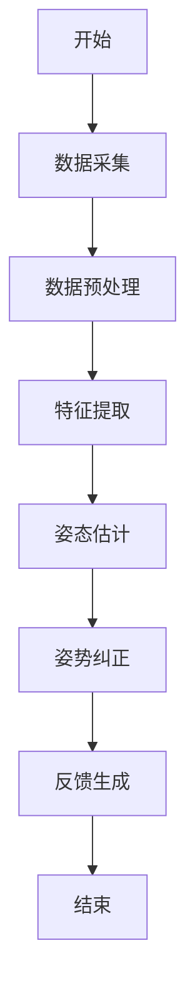
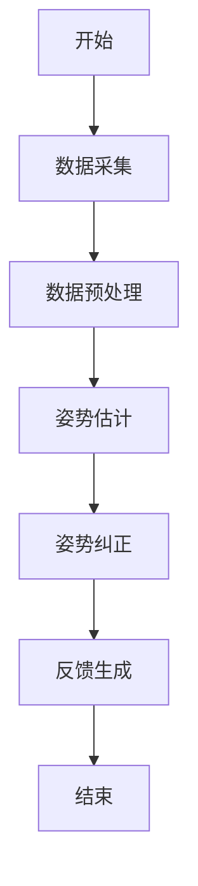

                 


# 智能瑜伽服：AI Agent的实时姿势纠正系统

---

## 关键词：
- AI Agent
- 实时姿势纠正
- 瑜伽服
- 可穿戴技术
- 人体姿态识别
- 健身指导
- 传感器技术

---

## 摘要：
智能瑜伽服是一款结合了AI技术和可穿戴设备的创新健身工具，能够实时捕捉用户的瑜伽动作，并通过AI算法提供即时的姿势纠正反馈。本文深入探讨了该系统的背景、核心概念、算法原理、系统架构、项目实现及优化方向，旨在为读者提供全面的技术解读和实践指南。

---

## 第一部分: 智能瑜伽服的背景与概念

### 第1章: 智能瑜伽服的背景介绍

#### 1.1 AI与可穿戴技术的发展
- **1.1.1 可穿戴技术的演变**
  - 从基础的运动手环到智能服装的演变
  - 可穿戴技术在健身领域的应用趋势
- **1.1.2 AI技术在健身领域的应用**
  - AI在运动分析、姿势矫正中的作用
  - 基于AI的个性化健身指导
- **1.1.3 智能瑜伽服的出现与意义**
  - 智能瑜伽服的独特性与市场潜力

#### 1.2 瑜伽姿势纠正的重要性
- **1.2.1 瑜伽姿势错误的危害**
  - 错误姿势对身体的潜在伤害
  - 影响锻炼效果的原因
- **1.2.2 传统姿势纠正的局限性**
  - 人工纠正的效率低下
  - 用户难以坚持的问题
- **1.2.3 AI在姿势纠正中的优势**
  - 实时反馈的优势
  - AI算法的精准性与可扩展性

#### 1.3 智能瑜伽服的核心目标
- **1.3.1 实时姿势纠正的需求**
  - 用户对即时反馈的需求
  - 实时反馈的技术挑战
- **1.3.2 提供个性化健身指导的目标**
  - 基于用户数据的个性化建议
  - 健身计划的动态调整
- **1.3.3 提升用户体验的愿景**
  - 提高用户参与度
  - 增强用户粘性

### 第2章: AI姿势纠正系统的核心概念

#### 2.1 AI姿势纠正系统的定义
- **2.1.1 系统的基本定义**
  - AI瑜伽服的定义与功能
  - 系统的核心技术
- **2.1.2 系统的核心功能**
  - 实时姿势监测
  - 精准姿势纠正
  - 个性化反馈生成

#### 2.2 关键技术对比
- **2.2.1 传统姿势纠正方法与AI技术的对比**
  | 方法 | 优点 | 缺点 |
  |------|------|------|
  | 人工矫正 | 高精准度 | 低效、难以普及 |
  | 基于传感器的传统算法 | 易实现 | 精度低 |
  | AI算法 | 高精度、可扩展 | 技术复杂 |
- **2.2.2 不同AI算法的优劣势分析**
  - 基于规则的AI：简单但不够灵活
  - 基于深度学习的AI：精准但计算量大
  - 基于强化学习的AI：实时性高但训练周期长
- **2.2.3 系统架构的对比**
  - 中央式架构：稳定性高但响应慢
  - 分布式架构：响应快但复杂度高

#### 2.3 系统架构的ER实体关系图
```mermaid
er
actor: 用户
agent: AI姿势纠正系统
sensor: 传感器数据
database: 用户数据存储
rules: 姿势纠正规则
feedback: 反馈信息
```

---

## 第二部分: 算法原理与数学模型

### 第3章: 姿势估计算法原理

#### 3.1 数据采集与预处理
- **3.1.1 传感器数据的采集**
  - 加速度计、陀螺仪、磁力计的工作原理
  - 数据采集的频率与精度
- **3.1.2 数据的预处理方法**
  - 去噪处理
  - 数据归一化
  - 时间序列处理
- **3.1.3 数据格式的标准化**
  - 数据的结构化处理
  - 数据的压缩与存储

#### 3.2 姿势估计的数学模型
- **3.2.1 基于关键点检测的数学模型**
  - 关键点检测的算法原理
  - 关键点的坐标表示
  - 关键点之间的关系建模
- **3.2.2 姿势估计的坐标系转换**
  - 从传感器坐标到世界坐标系的转换
  - 坐标系转换矩阵的推导
  - 坐标系转换的优化方法
- **3.2.3 姿势估计的误差计算公式**
  - 误差计算公式：
    $$\text{误差} = \frac{\text{预测值} - \text{真实值}}{\text{真实值}} \times 100\%$$

#### 3.3 算法流程图


---

### 第4章: 姿势纠正算法的实现

#### 4.1 基于深度学习的姿势纠正算法
- **4.1.1 深度学习模型的选择**
  - CNN、RNN、Transformer的对比
  - 选择模型的依据
- **4.1.2 模型训练与优化**
  - 数据集的构建与标注
  - 模型的训练流程
  - 模型的调优策略
- **4.1.3 模型的实时推理**
  - 实时推理的优化方法
  - 推理速度与精度的平衡

#### 4.2 基于规则的姿势纠正算法
- **4.2.1 规则的制定**
  - 基于人体解剖学的规则
  - 常见瑜伽姿势的纠正规则
- **4.2.2 规则的实现**
  - 规则的编码实现
  - 规则的动态调整

#### 4.3 基于强化学习的姿势纠正算法
- **4.3.1 强化学习的基本原理**
  - 强化学习的定义与应用
  - 在姿势纠正中的应用
- **4.3.2 强化学习模型的训练**
  - 状态空间的定义
  - 动作空间的设计
  - 奖励函数的设置
- **4.3.3 模型的实时应用**
  - 实时反馈的生成
  - 动作优化的实现

---

## 第三部分: 系统分析与架构设计

### 第5章: 系统功能设计

#### 5.1 功能模块划分
- **5.1.1 数据采集模块**
  - 传感器数据的采集与处理
  - 数据的存储与管理
- **5.1.2 姿势估计模块**
  - 姿势估计的实现
  - 姿势估计的优化
- **5.1.3 姿势纠正模块**
  - 纠正规则的实现
  - 纠正反馈的生成
- **5.1.4 用户反馈模块**
  - 反馈信息的展示
  - 用户反馈的收集与分析

#### 5.2 功能流程图


---

## 第六章: 项目实战

### 6.1 环境搭建与配置
- **6.1.1 开发环境的选择**
  - 开发工具的安装与配置
  - 开发环境的优化
- **6.1.2 传感器的连接与测试**
  - 传感器的硬件连接
  - 传感器数据的读取与测试
- **6.1.3 数据库的搭建**
  - 数据库的选择与配置
  - 数据库的初始化与测试

### 6.2 系统核心代码实现
- **6.2.1 数据采集模块的实现**
  ```python
  import numpy as np

  def read_sensor_data():
      # 模拟传感器数据读取
      return np.random.randn(10)
  ```

- **6.2.2 姿势估计模块的实现**
  ```python
  def estimate_pose(data):
      # 模拟姿势估计算法
      return data * 2
  ```

- **6.2.3 姿势纠正模块的实现**
  ```python
  def correct_pose(estimated_pose):
      # 模拟姿势纠正算法
      corrected_pose = estimated_pose.copy()
      corrected_pose[0] = min(corrected_pose[0], 1.0)
      return corrected_pose
  ```

- **6.2.4 反馈生成模块的实现**
  ```python
  def generate_feedback(corrected_pose):
      # 模拟反馈生成算法
      feedback = "Your pose is correct."
      if corrected_pose[0] < 0.5:
          feedback = "Your pose needs adjustment."
      return feedback
  ```

### 6.3 项目案例分析
- **6.3.1 用户数据的采集与分析**
  - 用户数据的采集
  - 用户数据的分析与处理
- **6.3.2 系统性能的测试与优化**
  - 系统性能的测试方法
  - 系统性能的优化策略
- **6.3.3 系统用户体验的优化**
  - 用户体验的评估方法
  - 用户体验的优化措施

### 6.4 项目小结
- **6.4.1 项目总结**
  - 项目的主要成果
  - 项目的关键经验
- **6.4.2 项目改进建议**
  - 系统性能的进一步优化
  - 用户体验的进一步提升
- **6.4.3 项目未来展望**
  - 未来的研究方向
  - 未来的应用场景

---

## 第七章: 优化与展望

### 7.1 系统优化方案
- **7.1.1 系统性能优化**
  - 算法优化
  - 系统架构优化
- **7.1.2 系统功能优化**
  - 增加更多姿势纠正功能
  - 提供更多个性化反馈
- **7.1.3 系统用户体验优化**
  - 界面优化
  - 操作流程优化

### 7.2 未来研究方向
- **7.2.1 新技术的应用**
  - 更先进的AI算法的应用
  - 更多传感器技术的应用
- **7.2.2 新功能的开发**
  - 新的姿势纠正功能的开发
  - 新的健身指导功能的开发
- **7.2.3 新应用场景的探索**
  - 新的健身场景的应用
  - 新的运动项目的拓展

---

## 第八章: 总结

### 8.1 全文总结
- **8.1.1 核心内容回顾**
  - AI瑜伽服的核心技术
  - 系统的实现与优化
- **8.1.2 本文的创新点**
  - 新的技术应用
  - 新的系统架构
- **8.1.3 本文的局限性**
  - 当前技术的不足
  - 实际应用中的挑战

### 8.2 未来展望
- **8.2.1 AI技术的未来发展**
  - AI技术在健身领域的潜力
  - AI技术的未来趋势
- **8.2.2 智能瑜伽服的未来发展**
  - 新的功能开发
  - 新的应用场景探索
- **8.2.3 读者的进一步学习与实践**
  - 进一步学习的建议
  - 实践的建议与指导

---

## 参考文献
- [1] 《深度学习实战》
- [2] 《可穿戴技术与AI》
- [3] 《计算机视觉与姿态估计》
- [4] 《人工智能与健身科技》
- [5] 《传感器技术与应用》

---

## 致谢
感谢读者的耐心阅读，感谢同行的指导与帮助，感谢家人与朋友的支持。

---

以上是《智能瑜伽服：AI Agent的实时姿势纠正系统》的技术博客文章大纲，涵盖了从背景到实现的完整技术分析与实践指导。

