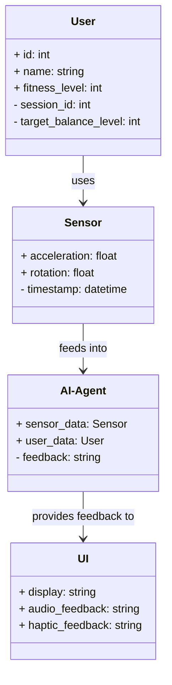
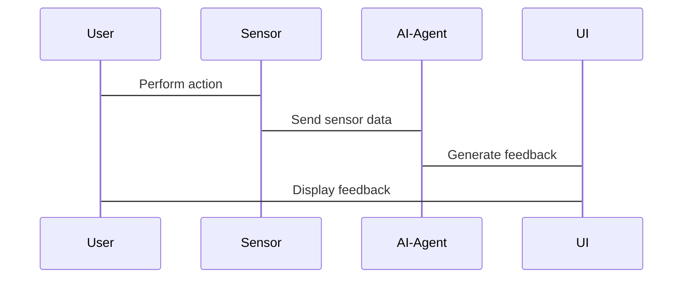

                 


# 智能瑜伽球：AI Agent的平衡训练指导

## 关键词：智能瑜伽球，AI Agent，平衡训练，传感器技术，算法实现，系统架构

## 摘要：智能瑜伽球是一种结合了人工智能技术的健身设备，通过AI Agent实时感知用户的动作并提供个性化指导，帮助用户提升平衡能力。本文详细介绍了智能瑜伽球的核心原理、技术实现、系统设计以及项目实战，为读者提供全面的技术指导。

---

# 第一章：智能瑜伽球的背景介绍

## 1.1 问题背景与描述

### 1.1.1 平衡训练的重要性
平衡训练是维持身体稳定性和预防跌倒的重要手段，尤其对老年人和运动员至关重要。传统瑜伽球虽然有效，但缺乏实时反馈和个性化指导。

### 1.1.2 传统瑜伽球的局限性
传统瑜伽球无法提供实时反馈，用户难以准确掌握正确的动作，且缺乏个性化的训练计划。

### 1.1.3 AI技术在健身领域的应用前景
AI技术可以通过实时感知和数据分析，为用户提供个性化的健身指导，提升训练效果。

## 1.2 智能瑜伽球的定义与特点

### 1.2.1 智能瑜伽球的定义
智能瑜伽球是一种结合了AI技术的健身设备，能够实时感知用户动作并提供个性化指导。

### 1.2.2 智能瑜伽球的核心功能
- 实时反馈：通过传感器和AI算法，实时分析用户的动作并提供反馈。
- 个性化训练：根据用户的 fitness level 提供定制化的训练计划。
- 多模态交互：支持语音、视觉和触觉等多种交互方式。

### 1.2.3 智能瑜伽球与传统瑜伽球的区别
智能瑜伽球通过AI技术实现了传统瑜伽球无法提供的实时反馈和个性化指导。

## 1.3 智能瑜伽球的边界与外延

### 1.3.1 平衡训练的边界
平衡训练主要关注身体的稳定性和协调性，不涉及力量训练。

### 1.3.2 智能瑜伽球的应用场景
- 健身房：提供个性化的训练指导。
- 家庭健身：用户可以在家中进行高效的训练。
- 康复训练：帮助用户恢复身体平衡能力。

### 1.3.3 智能瑜伽球的未来发展
随着AI技术的不断进步，智能瑜伽球将更加智能化，能够提供更精准的指导和更丰富的功能。

## 1.4 本章小结
本章介绍了智能瑜伽球的背景、定义、特点以及应用场景，为后续章节奠定了基础。

---

# 第二章：AI Agent的核心原理

## 2.1 AI Agent的定义与核心概念

### 2.1.1 AI Agent的定义
AI Agent是一种能够感知环境、做出决策并执行动作的智能体，广泛应用于各个领域。

### 2.1.2 AI Agent的核心要素
- 感知：通过传感器或摄像头等设备获取环境信息。
- 决策：基于感知信息，通过算法做出决策。
- 执行：根据决策结果执行相应的动作。

### 2.1.3 AI Agent与智能瑜伽球的关系
AI Agent是智能瑜伽球的核心技术，负责实时感知用户动作并提供反馈。

## 2.2 AI Agent的工作原理

### 2.2.1 感知与决策机制
AI Agent通过传感器获取用户的动作数据，经过分析后做出决策。

### 2.2.2 行为规划与执行
AI Agent根据决策结果，通过反馈机制指导用户完成动作。

### 2.2.3 自适应学习能力
AI Agent能够根据用户的反馈不断优化自身的算法，提升指导效果。

## 2.3 AI Agent的感知与决策机制

### 2.3.1 多模态感知
AI Agent通过多种传感器（如加速度计、陀螺仪）获取用户的动作数据。

### 2.3.2 数据处理与分析
AI Agent对获取的数据进行处理和分析，识别用户的动作并判断是否正确。

### 2.3.3 决策算法
AI Agent使用决策树或机器学习算法做出反馈决策。

## 2.4 AI Agent的多模态交互

### 2.4.1 语音交互
AI Agent通过语音助手与用户互动，提供实时反馈。

### 2.4.2 视觉交互
AI Agent通过摄像头捕捉用户的动作，提供视觉反馈。

### 2.4.3 动作反馈
AI Agent通过震动或灯光等方式，提供触觉反馈。

## 2.5 本章小结
本章详细讲解了AI Agent的核心原理及其在智能瑜伽球中的应用。

---

# 第三章：平衡训练的科学基础

## 3.1 人体平衡的生理机制

### 3.1.1 前庭系统的作用
前庭系统负责感知身体的平衡，通过接收头部和身体的运动信息来维持平衡。

### 3.1.2 肌肉协调与平衡
肌肉的协调运动是维持平衡的关键，大脑通过神经信号控制肌肉的收缩和放松。

### 3.1.3 视觉与平衡的关系
视觉系统在维持平衡中起辅助作用，帮助大脑判断身体的位置和环境的变化。

## 3.2 运动生物力学

### 3.2.1 动作的力学分析
分析用户动作的力学特性，帮助AI Agent提供更精准的反馈。

### 3.2.2 身体姿势与平衡的关系
正确的姿势是维持平衡的基础，AI Agent通过分析用户的姿势提供反馈。

### 3.2.3 动作的节奏与协调
动作的节奏和协调性直接影响平衡能力，AI Agent通过实时反馈帮助用户优化动作。

## 3.3 个性化训练方案

### 3.3.1 用户 fitness level 的评估
AI Agent通过评估用户的 fitness level 提供个性化的训练计划。

### 3.3.2 训练目标的设定
根据用户的 fitness level 设定具体的训练目标，帮助用户逐步提升平衡能力。

### 3.3.3 训练进度的跟踪
AI Agent实时跟踪用户的训练进度，动态调整训练计划。

## 3.4 本章小结
本章介绍了人体平衡的生理机制、运动生物力学以及个性化训练方案的制定。

---

# 第四章：智能瑜伽球的技术实现

## 4.1 传感器技术

### 4.1.1 加速度计
加速度计用于测量物体的加速度，帮助AI Agent判断用户的动作是否正确。

### 4.1.2 陀螺仪
陀螺仪用于测量物体的旋转角度，帮助AI Agent判断用户的姿势是否正确。

### 4.1.3 组合传感器
通过组合加速度计和陀螺仪，AI Agent能够更准确地判断用户的动作。

## 4.2 AI算法实现

### 4.2.1 数据预处理
对传感器数据进行清洗和特征提取，为后续分析做准备。

### 4.2.2 动作识别
使用机器学习算法，如决策树和随机森林，识别用户的动作是否正确。

### 4.2.3 反馈生成
根据动作识别结果，生成实时反馈，指导用户调整动作。

## 4.3 系统集成与测试

### 4.3.1 系统集成
将传感器、AI算法和用户界面集成到智能瑜伽球中。

### 4.3.2 测试与优化
通过测试发现系统中的问题，并进行优化，提升系统的稳定性和准确性。

## 4.4 本章小结
本章详细讲解了智能瑜伽球的技术实现，包括传感器技术、AI算法实现以及系统集成与测试。

---

# 第五章：智能瑜伽球的系统设计

## 5.1 需求分析

### 5.1.1 功能需求
- 实时反馈
- 个性化训练计划
- 多模态交互

### 5.1.2 性能需求
- 响应时间：实时反馈的延迟不超过500ms
- 系统稳定性：确保在高负载下系统仍能正常运行

## 5.2 功能设计

### 5.2.1 领域模型
使用Mermaid绘制领域模型类图，展示系统的各个组件及其关系。



### 5.2.2 系统架构设计
使用Mermaid绘制系统架构图，展示系统的各个模块及其交互。


### 5.2.3 系统接口设计
定义系统接口，如传感器数据接口、AI算法接口和用户界面接口。

### 5.2.4 系统交互设计
使用Mermaid绘制系统交互流程图，展示用户与系统之间的交互过程。



## 5.3 本章小结
本章详细介绍了智能瑜伽球的系统设计，包括需求分析、功能设计、系统架构设计以及系统交互设计。

---

# 第六章：智能瑜伽球的项目实战

## 6.1 环境搭建

### 6.1.1 开发环境
- 操作系统：Linux/Windows/MacOS
- 开发工具：Python、TensorFlow、ROS（机器人操作系统）

### 6.1.2 传感器驱动安装
安装并配置传感器驱动，确保传感器能够正常工作。

## 6.2 核心功能实现

### 6.2.1 动作识别算法
使用Python编写动作识别算法，如决策树和随机森林。

```python
import numpy as np
from sklearn.tree import DecisionTreeClassifier

# 示例数据集
X = np.array([[1, 2], [2, 3], [3, 4], [4, 5]])
y = np.array([0, 1, 2, 3])

# 训练决策树模型
model = DecisionTreeClassifier()
model.fit(X, y)

# 预测新数据
new_data = np.array([[5, 6]])
prediction = model.predict(new_data)
print("预测结果:", prediction)
```

### 6.2.2 反馈生成算法
基于动作识别结果生成实时反馈，如语音提示或震动反馈。

## 6.3 案例分析

### 6.3.1 案例背景
介绍一个具体的案例，如用户A在使用智能瑜伽球进行平衡训练。

### 6.3.2 数据分析
分析用户的动作数据，识别存在的问题并提供反馈。

### 6.3.3 优化建议
根据反馈结果，优化用户的训练计划，提升平衡能力。

## 6.4 代码解读与分析
详细解读核心功能实现的代码，分析算法的优缺点及优化方向。

## 6.5 本章小结
本章通过实际案例展示了智能瑜伽球的项目实战，帮助读者理解技术实现。

---

# 第七章：智能瑜伽球的优化与维护

## 7.1 性能优化

### 7.1.1 算法优化
优化动作识别算法，提升系统的响应速度和准确性。

### 7.1.2 系统优化
优化系统的资源利用率，降低延迟，提升用户体验。

## 7.2 数据安全与隐私保护

### 7.2.1 数据加密
对用户的敏感数据进行加密处理，确保数据安全。

### 7.2.2 隐私保护
制定隐私保护政策，确保用户数据不被滥用。

## 7.3 长期维护

### 7.3.1 系统更新
定期更新系统软件，修复漏洞，提升性能。

### 7.3.2 用户支持
提供用户支持服务，解决用户在使用过程中遇到的问题。

## 7.4 本章小结
本章讨论了智能瑜伽球的优化与维护，确保系统的安全性和稳定性。

---

# 第八章：智能瑜伽球的总结与展望

## 8.1 本章总结

### 8.1.1 核心内容回顾
回顾本文的核心内容，包括智能瑜伽球的背景、AI Agent的核心原理、技术实现、系统设计、项目实战以及优化与维护。

### 8.1.2 关键技术总结
总结智能瑜伽球的关键技术，如传感器技术、AI算法实现、系统架构设计等。

## 8.2 未来展望

### 8.2.1 技术发展趋势
随着AI技术的不断进步，智能瑜伽球将更加智能化，能够提供更精准的指导和更丰富的功能。

### 8.2.2 应用场景拓展
智能瑜伽球将拓展更多的应用场景，如医疗康复、运动训练等。

### 8.2.3 产品创新方向
未来，智能瑜伽球将朝着更加个性化、智能化和多功能化的方向发展。

## 8.3 学习建议

### 8.3.1 学习资源推荐
推荐相关的学习资源，如书籍、在线课程和开源项目。

### 8.3.2 实践建议
鼓励读者动手实践，参与智能瑜伽球的开发和优化。

## 8.4 本章小结
本章总结了本文的核心内容，并展望了智能瑜伽球的未来发展方向。

---

# 参考文献
（此处列出参考文献，如书籍、论文、技术文档等。）

---

# 附录
（此处可以放置额外的代码、数据表或其他补充材料。）

---

通过以上详细的内容，我们可以看到《智能瑜伽球：AI Agent的平衡训练指导》这篇文章不仅涵盖了智能瑜伽球的技术实现，还深入探讨了其在实际应用中的表现和未来的发展方向。通过结合AI技术，智能瑜伽球能够为用户提供更高效、更个性化的平衡训练体验，推动健身行业的智能化发展。

