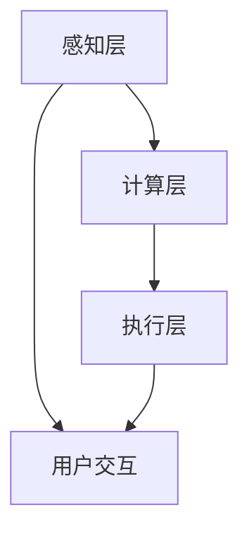

                 


# 智能瓦斯炉：AI Agent的烹饪安全监控

> 关键词：智能瓦斯炉，AI Agent，烹饪安全，物联网，深度学习

> 摘要：本文深入探讨了智能瓦斯炉与AI Agent结合的烹饪安全监控系统，从背景、原理到实现，全面分析了其技术细节与实际应用。通过详细的技术分析与项目实战，展示了如何利用AI技术提升烹饪安全。

---

# 第一部分: 智能瓦斯炉与AI Agent的背景与概念

# 第1章: 智能瓦斯炉的背景与现状

## 1.1 瓦斯炉的传统功能与局限性
### 1.1.1 瓦斯炉的基本功能
瓦斯炉作为厨房中的重要设备，主要用于烹饪食物。其基本功能包括火焰调节、温度控制和烹饪模式切换。

### 1.1.2 传统瓦斯炉的安全隐患
传统瓦斯炉存在以下安全隐患：
1. **漏气风险**：管道老化或连接不牢可能导致气体泄漏。
2. **火焰失控**：用户操作不当或意外熄火可能引发火灾。
3. **通风不足**：在密闭空间内使用可能导致一氧化碳中毒。

### 1.1.3 现代家庭对智能烹饪工具的需求
随着人们对厨房安全的重视，智能烹饪工具的需求逐渐增加。现代家庭需要一种既能保证烹饪效率，又能提供安全保障的智能设备。

## 1.2 AI Agent的核心概念
### 1.2.1 AI Agent的基本定义
AI Agent（人工智能代理）是一种能够感知环境、做出决策并执行任务的智能实体。它能够通过传感器获取信息，并根据预设的目标进行自主决策。

### 1.2.2 AI Agent的核心功能
AI Agent的核心功能包括：
1. **感知环境**：通过传感器获取环境数据。
2. **推理与决策**：基于感知数据进行推理，制定最优决策。
3. **执行任务**：根据决策结果执行相应的操作。

### 1.2.3 AI Agent与传统自动控制系统的区别
AI Agent与传统自动控制系统的主要区别在于其智能化和自主决策能力。AI Agent能够根据环境变化动态调整策略，而传统系统则基于固定的规则进行操作。

## 1.3 智能瓦斯炉与AI Agent的结合
### 1.3.1 智能瓦斯炉的定义
智能瓦斯炉是一种结合了AI技术的烹饪设备，能够通过AI Agent实现智能化的烹饪安全监控。

### 1.3.2 AI Agent在智能瓦斯炉中的作用
AI Agent在智能瓦斯炉中的作用包括：
1. **实时监控**：通过传感器实时监测烹饪过程中的温度、气体浓度等参数。
2. **异常检测**：识别烹饪过程中的异常情况，如火焰熄灭、气体泄漏等。
3. **智能控制**：根据监测结果自动调整烹饪参数，确保烹饪过程的安全性。

### 1.3.3 智能瓦斯炉的市场前景与用户需求
随着智能家居的普及，智能瓦斯炉的市场需求逐渐增加。用户对烹饪安全的关注度也在提高，智能瓦斯炉能够满足用户对安全、高效烹饪的需求。

## 1.4 本章小结
本章介绍了传统瓦斯炉的功能与局限性，提出了AI Agent的核心概念，并详细阐述了AI Agent在智能瓦斯炉中的应用及其市场前景。

---

# 第二部分: AI Agent在烹饪安全监控中的核心原理

# 第2章: AI Agent的核心技术与实现原理

## 2.1 AI Agent的感知与决策机制
### 2.1.1 多模态感知技术
多模态感知技术通过多种传感器（如温度传感器、烟雾传感器、摄像头等）获取烹饪环境中的多种信息。

### 2.1.2 基于深度学习的目标检测算法
目标检测算法用于识别烹饪过程中的目标物体，如锅、铲子等。常用的算法包括YOLO、Faster R-CNN等。

### 2.1.3 烹饪场景下的实时监控策略
实时监控策略包括动态调整监控范围、优先处理异常情况等。

## 2.2 AI Agent的推理与执行机制
### 2.2.1 基于规则的推理系统
基于规则的推理系统通过预设的规则进行推理，例如“如果检测到烟雾，则关闭瓦斯阀门”。

### 2.2.2 基于强化学习的执行策略
强化学习通过奖励机制优化AI Agent的执行策略，例如在烹饪过程中，AI Agent会根据实时反馈调整火焰大小。

### 2.2.3 烹饪安全的动态评估模型
动态评估模型根据实时监测数据评估烹饪过程的安全性，并动态调整监控策略。

## 2.3 AI Agent的安全监控算法
### 2.3.1 热量检测算法
热量检测算法通过红外传感器检测烹饪过程中的热量变化，用于识别火焰是否异常。

### 2.3.2 烟雾与气体检测算法
烟雾与气体检测算法通过烟雾传感器和气体传感器检测烹饪过程中产生的烟雾和有害气体。

### 2.3.3 异常行为识别算法
异常行为识别算法通过摄像头和行为识别模型识别用户的异常操作，如手离开烹饪区域等。

## 2.4 本章小结
本章详细介绍了AI Agent在烹饪安全监控中的核心技术与实现原理，包括感知与决策机制、推理与执行机制以及安全监控算法。

---

# 第三部分: 智能瓦斯炉的系统架构与实现

# 第3章: 系统架构设计

## 3.1 系统模块划分
### 3.1.1 感知层模块
感知层模块包括温度传感器、烟雾传感器、摄像头等，用于实时监测烹饪环境。

### 3.1.2 计算层模块
计算层模块包括AI Agent的核心算法和推理引擎，用于处理感知数据并制定决策。

### 3.1.3 执行层模块
执行层模块包括瓦斯阀门、报警装置等，用于执行决策结果。

## 3.2 系统功能设计
### 3.2.1 多模态数据采集功能
多模态数据采集功能通过多种传感器采集烹饪环境中的数据。

### 3.2.2 安全监控算法实现
安全监控算法实现包括异常检测、动态评估等核心算法。

### 3.2.3 用户交互界面设计
用户交互界面设计提供友好的人机交互界面，用户可以通过界面查看烹饪状态并进行操作。

## 3.3 系统架构图


## 3.4 本章小结
本章详细描述了智能瓦斯炉的系统架构设计，包括模块划分、功能设计和系统架构图。

---

# 第四部分: 项目实战与系统实现

# 第4章: 环境搭建与核心代码实现

## 4.1 环境搭建
### 4.1.1 硬件环境
硬件环境包括智能瓦斯炉、传感器、摄像头等设备。

### 4.1.2 软件环境
软件环境包括AI框架（如TensorFlow、PyTorch）、编程语言（如Python）和操作系统（如Linux）。

## 4.2 核心代码实现
### 4.2.1 多模态数据采集代码
```python
import numpy as np
import serial

# 读取温度传感器数据
def get_temperature():
    ser = serial.Serial('COM1', 9600)
    temperature = int(ser.readline().decode().strip())
    return temperature

# 读取烟雾传感器数据
def get_smoke():
    # 假设烟雾传感器通过ADC获取电压值
    voltage = 3.3  # 示例电压值
    smoke = voltage > 2.5  # 示例判断逻辑
    return smoke

# 读取摄像头数据
def get_camera_data():
    # 示例代码，实际需要使用OpenCV等库
    return "Camera data"
```

### 4.2.2 安全监控算法代码
```python
import cv2

def detect_flame(image):
    # 示例火焰检测算法
    gray = cv2.cvtColor(image, cv2.COLOR_BGR2GRAY)
    # 使用边缘检测识别火焰
    edges = cv2.Canny(gray, 100, 200)
    return edges.sum() > 100  # 示例判断逻辑
```

### 4.2.3 用户交互界面代码
```python
import tkinter as tk

def update_status(status):
    # 更新状态显示
    status_label.config(text=status)

root = tk.Tk()
status_label = tk.Label(root, text="正常")
status_label.pack()
root.mainloop()
```

## 4.3 本章小结
本章详细介绍了智能瓦斯炉的环境搭建和核心代码实现，包括多模态数据采集、安全监控算法和用户交互界面设计。

---

# 第五部分: 安全与优化

# 第5章: 系统安全性与优化策略

## 5.1 系统安全性分析
### 5.1.1 系统安全风险
系统可能面临的安全风险包括传感器被干扰、网络攻击等。

### 5.1.2 防止攻击的措施
防止攻击的措施包括数据加密、身份验证等。

## 5.2 系统性能优化
### 5.2.1 算法优化
算法优化包括优化目标检测算法的计算效率和准确性。

### 5.2.2 系统架构优化
系统架构优化包括减少不必要的模块调用、优化数据传输效率等。

## 5.3 本章小结
本章详细分析了智能瓦斯炉系统的安全性问题，并提出了相应的优化策略。

---

# 第六部分: 扩展与未来展望

# 第6章: 智能瓦斯炉的扩展应用与未来趋势

## 6.1 智能瓦斯炉的扩展应用
### 6.1.1 与其他智能家居设备的联动
智能瓦斯炉可以与其他智能家居设备联动，如智能音箱、智能灶具等。

### 6.1.2 与区块链技术的结合
通过区块链技术可以实现烹饪数据的不可篡改性，提高系统的可信度。

## 6.2 未来发展趋势
### 6.2.1 更智能化的烹饪辅助
未来的智能瓦斯炉将具备更智能化的烹饪辅助功能，如智能菜谱推荐、自动调整烹饪参数等。

### 6.2.2 更广泛的应用场景
智能瓦斯炉的应用场景将从家庭扩展到餐厅、酒店等商业领域。

## 6.3 本章小结
本章展望了智能瓦斯炉的扩展应用与未来发展趋势，为读者提供了更广阔的技术视野。

---

# 结语

智能瓦斯炉与AI Agent的结合为烹饪安全监控提供了新的解决方案。通过本文的详细介绍，读者可以全面了解智能瓦斯炉的技术原理、系统架构和实际应用。未来，随着人工智能技术的不断发展，智能瓦斯炉将具备更多智能化功能，为家庭烹饪安全提供更全面的保障。

---

# 参考文献
（此处列出相关参考文献）

---

# 附录

（此处列出附录内容，如代码、数据等）

---

通过以上目录大纲，您可以逐步撰写一篇详细的、结构清晰的技术博客文章，涵盖从背景介绍到系统实现的各个方面，确保内容详实、逻辑清晰。

