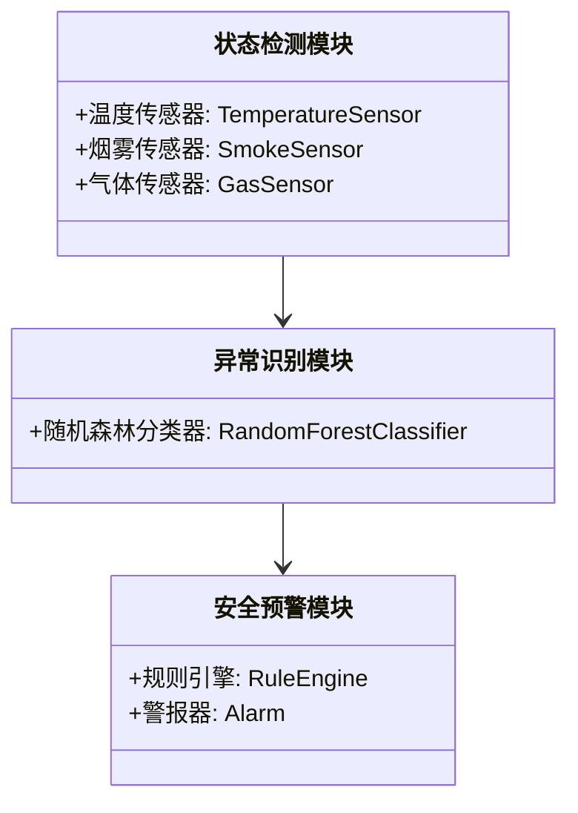
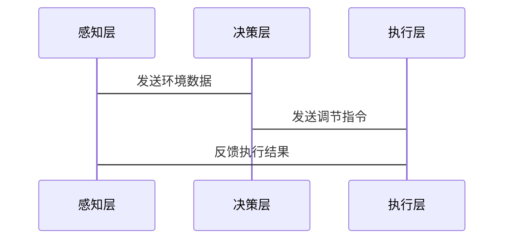

                 


# 智能瓦斯炉：AI Agent的烹饪安全监控系统

## 关键词：智能瓦斯炉, AI Agent, 烹饪安全, 物联网, 安全监控

## 摘要：
本文详细探讨了智能瓦斯炉结合AI Agent的烹饪安全监控系统的原理、设计与实现。通过分析烹饪安全的关键问题，提出了一种基于AI代理的解决方案，涵盖了系统架构、算法原理、项目实战等核心内容，为智能厨房的安全监控提供了新的思路。

---

# 第1章 智能瓦斯炉的发展背景

## 1.1 智能瓦斯炉的定义与特点

### 1.1.1 瓦斯炉的基本概念
瓦斯炉是一种利用天然气或液化石油气进行烹饪的厨房设备，广泛应用于家庭和商业厨房。传统瓦斯炉通过手动调节火焰大小来控制烹饪温度，但存在安全隐患，如气体泄漏、火焰过大或过小等问题。

### 1.1.2 智能瓦斯炉的核心特点
智能瓦斯炉通过集成传感器、物联网（IoT）技术和AI算法，实现了对烹饪过程的智能化监控。其核心特点包括：
- **实时监测**：通过温度、烟雾、气体传感器实时监控烹饪环境。
- **智能控制**：根据传感器数据自动调节火焰大小，确保烹饪过程的安全。
- **异常预警**：当检测到异常情况（如火焰过大、气体泄漏）时，立即发出警报并采取应急措施。

### 1.1.3 智能瓦斯炉与传统瓦斯炉的区别
与传统瓦斯炉相比，智能瓦斯炉的优势在于其智能化和安全性。它能够通过AI代理主动监控和干预烹饪过程，而传统瓦斯炉仅依赖手动操作，安全隐患较大。

## 1.2 AI Agent的基本概念

### 1.2.1 AI Agent的定义
AI Agent（智能代理）是一种能够感知环境并采取行动以实现目标的智能实体。它通过传感器获取环境信息，利用算法进行决策，并通过执行器与环境交互。

### 1.2.2 AI Agent的核心属性
AI Agent的核心属性包括：
- **感知能力**：通过传感器获取环境数据。
- **决策能力**：基于感知数据进行分析和决策。
- **执行能力**：根据决策结果采取行动。

### 1.2.3 AI Agent在智能瓦斯炉中的作用
在智能瓦斯炉中，AI Agent负责实时监控烹饪环境，分析传感器数据，并根据分析结果调节火焰或发出警报。例如，当检测到烟雾浓度过高时，AI Agent会立即关闭火焰并触发警报。

## 1.3 烹饪安全监控的重要性

### 1.3.1 烹饪安全监控的定义
烹饪安全监控是指通过技术手段实时监控烹饪过程，预防和减少烹饪过程中的安全隐患。

### 1.3.2 烹饪安全监控的关键指标
- **火焰状态**：火焰是否过大或过小。
- **气体泄漏**：检测瓦斯是否泄漏。
- **烟雾浓度**：烟雾浓度过高可能引发火灾。
- **温度控制**：确保烹饪温度在安全范围内。

### 1.3.3 智能瓦斯炉在烹饪安全监控中的优势
智能瓦斯炉通过AI Agent实现了主动监控和干预，能够快速响应异常情况，大大提高了烹饪过程的安全性。

## 1.4 智能瓦斯炉AI Agent系统的边界与外延

### 1.4.1 系统的边界
智能瓦斯炉AI Agent系统的边界包括：
- **输入**：来自传感器的环境数据（温度、烟雾、气体浓度）。
- **输出**：对火焰的调节或警报触发。

### 1.4.2 系统的外延
系统的外延包括与智能家居系统的集成，例如与烟雾报警器、智能音箱等设备联动。

### 1.4.3 系统的核心要素组成
- **传感器**：温度、烟雾、气体传感器。
- **AI Agent**：负责数据处理和决策。
- **执行器**：调节火焰或触发警报。

---

# 第2章 AI Agent在智能瓦斯炉中的核心原理

## 2.1 AI Agent的核心原理

### 2.1.1 状态检测与识别
AI Agent通过传感器获取环境数据，利用算法对数据进行分析，识别烹饪过程中的状态（如火焰正常、烟雾异常等）。

### 2.1.2 异常识别与预警
当检测到异常状态（如烟雾浓度过高或气体泄漏）时，AI Agent会触发警报，并采取应急措施（如关闭火焰）。

### 2.1.3 用户行为分析
AI Agent可以学习用户的烹饪习惯，优化烹饪过程中的安全监控策略。

## 2.2 AI Agent的系统架构

### 2.2.1 系统架构的分层
智能瓦斯炉AI Agent系统的架构可以分为三层：
1. **感知层**：负责数据采集（传感器）。
2. **决策层**：负责数据处理和决策（AI算法）。
3. **执行层**：负责采取行动（调节火焰或触发警报）。

### 2.2.2 各层之间的关系
- 感知层将环境数据传递给决策层。
- 决策层根据数据做出决策，并将指令传递给执行层。
- 执行层根据指令采取行动，并将结果反馈给决策层。

---

# 第3章 算法原理讲解

## 3.1 算法原理概述

### 3.1.1 状态检测算法
状态检测算法用于识别烹饪过程中的正常和异常状态。常用算法包括：
- **阈值检测**：设定烟雾浓度的阈值，当浓度超过阈值时触发警报。
- **概率模型**：基于历史数据建立概率模型，预测烹饪过程中的异常状态。

### 3.1.2 异常识别算法
异常识别算法用于检测烹饪过程中的异常情况。常用算法包括：
- **分类算法**：如决策树、随机森林等，用于分类正常和异常状态。
- **回归算法**：用于预测烹饪过程中的关键参数（如温度、烟雾浓度）。

### 3.1.3 安全预警算法
安全预警算法用于根据检测到的异常情况发出警报，并采取相应的应急措施。常用算法包括：
- **规则引擎**：基于预定义的规则触发警报。
- **机器学习模型**：基于机器学习模型预测异常情况并触发警报。

## 3.2 算法实现细节

### 3.2.1 状态检测算法实现
以下是基于阈值检测的状态检测算法的伪代码：

```python
def detect_state(temp, smoke):
    if temp > threshold_temp or smoke > threshold_smoke:
        return 'abnormal'
    else:
        return 'normal'
```

### 3.2.2 异常识别算法实现
以下是基于随机森林分类算法的异常识别代码：

```python
from sklearn.ensemble import RandomForestClassifier

# 训练数据
X_train = [[temp1, smoke1], [temp2, smoke2], ...]
y_train = ['normal', 'abnormal', ...]

# 训练模型
model = RandomForestClassifier()
model.fit(X_train, y_train)

# 预测
def predict_anomaly(temp, smoke):
    return model.predict([[temp, smoke]])
```

### 3.2.3 安全预警算法实现
以下是基于规则引擎的安全预警算法：

```python
def safety_alert(rule, status):
    if status == 'abnormal' and rule == 'smoke_high':
        return True
    else:
        return False
```

---

# 第4章 系统分析与架构设计方案

## 4.1 问题场景介绍

### 4.1.1 烹饪过程中的危险情况
- 火焰过大导致火灾。
- 气体泄漏引发爆炸。
- 烟雾浓度过高导致窒息。

### 4.1.2 AI Agent在危险情况下的应对策略
- **火焰过大**：自动调节火焰大小或关闭火焰。
- **气体泄漏**：关闭气阀并触发警报。
- **烟雾浓度过高**：触发烟雾报警器并通知用户。

## 4.2 系统功能设计

### 4.2.1 系统功能模块
- **状态检测模块**：检测烹饪过程中的火焰、烟雾、气体浓度等参数。
- **异常识别模块**：识别烹饪过程中的异常情况。
- **安全预警模块**：根据异常情况触发警报并采取应急措施。

### 4.2.2 系统功能设计的领域模型类图
以下是领域模型类图：



## 4.3 系统架构设计

### 4.3.1 系统架构图
以下是系统架构图：


### 4.3.2 数据流与模块交互
数据流从传感器流向状态检测模块，经过异常识别模块处理后，触发安全预警模块采取行动。

## 4.4 系统接口设计

### 4.4.1 接口定义
- **输入接口**：传感器数据。
- **输出接口**：火焰调节指令、警报触发指令。

### 4.4.2 接口交互流程
1. 传感器采集环境数据。
2. 状态检测模块处理数据。
3. 异常识别模块分析数据。
4. 安全预警模块根据分析结果采取行动。

## 4.5 系统交互序列图



---

# 第5章 项目实战

## 5.1 环境安装

### 5.1.1 安装Python
安装Python 3.8及以上版本。

### 5.1.2 安装依赖库
安装以下依赖库：
- `scikit-learn`：用于机器学习算法。
- `mermaid`：用于绘制图表。
- `tensorflow`：用于深度学习模型。

## 5.2 核心代码实现

### 5.2.1 状态检测模块实现

```python
import numpy as np
from sklearn.ensemble import RandomForestClassifier

# 训练数据
X_train = np.array([[80, 0.5], [70, 0.3], [90, 0.8], [85, 0.6]])
y_train = np.array(['normal', 'normal', 'abnormal', 'normal'])

# 训练模型
model = RandomForestClassifier()
model.fit(X_train, y_train)

# 预测
def predict_status(temp, smoke):
    return model.predict([[temp, smoke]])
```

### 5.2.2 异常识别模块实现

```python
import numpy as np
from sklearn.ensemble import RandomForestClassifier

# 训练数据
X_train = np.array([[80, 0.5], [70, 0.3], [90, 0.8], [85, 0.6]])
y_train = np.array(['normal', 'normal', 'abnormal', 'normal'])

# 训练模型
model = RandomForestClassifier()
model.fit(X_train, y_train)

# 预测
def predict_anomaly(temp, smoke):
    return model.predict([[temp, smoke]])
```

### 5.2.3 安全预警模块实现

```python
def safety_alert(temp, smoke):
    if temp > 90 or smoke > 0.7:
        return True
    else:
        return False
```

## 5.3 项目实战案例分析

### 5.3.1 案例1：正常烹饪状态
- **输入数据**：温度=85，烟雾=0.4
- **预测结果**：正常状态，无异常。

### 5.3.2 案例2：异常烹饪状态
- **输入数据**：温度=95，烟雾=0.9
- **预测结果**：异常状态，触发警报。

## 5.4 项目小结

---

# 第6章 最佳实践与总结

## 6.1 小结
智能瓦斯炉结合AI Agent的烹饪安全监控系统通过实时监控烹饪环境，主动识别和处理异常情况，显著提高了烹饪过程的安全性。本文详细探讨了系统的背景、核心原理、架构设计和项目实现，为智能厨房的安全监控提供了新的思路。

## 6.2 注意事项
- **数据隐私**：确保用户数据的安全和隐私。
- **系统稳定性**：确保系统的稳定性和可靠性，避免误报和漏报。
- **用户教育**：用户需要了解系统的使用方法和安全注意事项。

## 6.3 拓展阅读
- **相关技术**：进一步研究物联网技术、AI算法在厨房安全监控中的应用。
- **未来方向**：探索更高级的AI算法（如深度学习）在烹饪安全监控中的应用。

---

通过本文的详细讲解，读者可以深入了解智能瓦斯炉AI Agent烹饪安全监控系统的实现原理和实际应用。希望本文能够为智能厨房的安全监控提供有价值的参考和启发。

