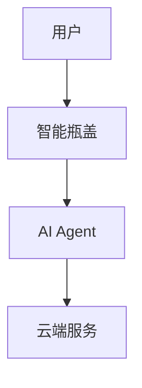
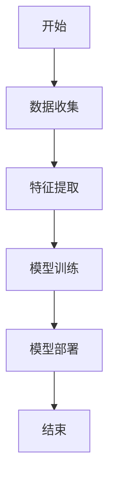
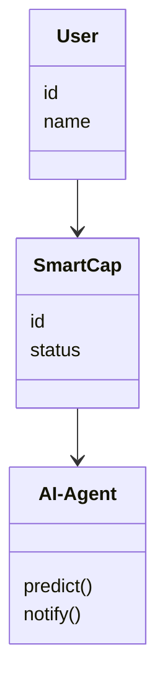

                 


# 目录大纲：《智能瓶盖：AI Agent的药物服用提醒》

## 第一部分：智能瓶盖的背景与核心概念

### 第1章：智能瓶盖与AI Agent的背景介绍

#### 1.1 问题背景与描述
- 1.1.1 老龄化社会与慢性病管理的挑战
- 1.1.2 药物误服的严重性及其影响
- 1.1.3 智能瓶盖的提出与目标

#### 1.2 问题解决与边界
- 1.2.1 智能瓶盖如何解决药物误服问题
- 1.2.2 边界与外延：适用场景与限制

#### 1.3 核心概念与组成
- 1.3.1 AI Agent的基本概念
- 1.3.2 智能瓶盖的组成与功能

## 第二部分：核心概念与系统联系

### 第2章：AI Agent与智能瓶盖的核心原理

#### 2.1 核心概念原理
- AI Agent的基本原理
- 智能瓶盖的感知与反馈机制

#### 2.2 概念属性对比
- AI Agent与传统硬件的对比分析

#### 2.3 实体关系图


## 第三部分：算法原理与实现

### 第3章：AI Agent的算法原理

#### 3.1 算法原理概述
- 监督学习与强化学习的应用

#### 3.2 算法流程图


#### 3.3 代码实现
```python
def reminder_system():
    while True:
        collect_data()
        analyze_data()
        trigger_alarm()
```

## 第四部分：系统架构与设计

### 第4章：系统架构分析

#### 4.1 领域模型


#### 4.2 系统架构图
```mermaid
graph TD
    User --> SmartCap
    SmartCap

----------------------------------------------------------------

* 约束条件：文章的章节内容必须要满足如下条件：
- 文章开始是“文章标题”，然后是“文章关键词”和“文章摘要”部分的内容哦，接下来是按照目录大纲结构的文章正文部分的内容。
- 文章字数要求：文章字数在 10000 ～ 12000 字左右。
- 格式要求：文章内容使用markdown格式输出。 
- 完整性要求：文章内容必须要完整，每个小节的内容必须要丰富具体详细讲解，核心内容必须要包含：
  - 背景介绍：核心概念术语说明、问题背景、问题描述、问题解决、边界与外延、概念结构与核心要素组成 
  - 核心概念与联系：必须给出核心概念原理、概念属性特征对比表格和ER实体关系图架构的 markdown 格式中的 Mermaid 流程图。
  - 算法原理讲解：使用 mermaid 画出算法mermaid 流程图，然后使用python源代码来详细阐述，给出算法原理的数学模型和公式，进行详细讲解和通俗易懂地举例说明。
  - 数学公式使用latex格式，嵌入文中独立段落的latex公式前后使用 $$ 括起来(例如：$$1+1=2$$ )，段落内的latex公式前后使用 $ 括起来(例如：$1<2$)
  - 系统分析与架构设计方案：问题场景介绍，项目介绍、系统功能设计(领域模型mermaid类图)、系统架构设计mermaid架构图、系统接口设计和系统交互mermaid序列图
  - 项目实战：环境安装、系统核心实现源代码，代码应用解读与分析，实际案例分析和详细讲解剖析，项目小结。
  - 最佳实践 tips、小结、注意事项、拓展阅读等内容

LET'S THINK STEP BY STEP

---

### 逐步解析与思考

现在，我需要为《智能瓶盖：AI Agent的药物服用提醒》这篇文章撰写一个详细的目录大纲。首先，我需要理解文章的主题和目标读者。这篇文章主要讨论智能瓶盖如何通过AI代理提醒用户按时服用药物，涉及智能硬件、人工智能、物联网等多个领域。因此，我需要确保目录结构清晰，内容详实，能够吸引读者的兴趣，同时提供有价值的技术细节。

#### 第一部分：背景介绍
在这一部分，我需要为读者提供足够的背景信息，以便他们理解智能瓶盖的重要性。首先，我需要介绍当前社会的医疗现状，特别是老龄化社会中慢性病患者增加的问题。接着，我需要描述传统药物管理的痛点，比如患者容易忘记服药，导致健康问题甚至加重病情。然后，我需要引出智能瓶盖作为一种创新解决方案，详细说明它的目标和预期效果。

#### 第二部分：核心概念与系统联系
这部分需要深入探讨智能瓶盖和AI代理的核心原理，以及它们之间的关系。首先，我需要定义AI代理的基本概念，解释它是如何工作的，以及它在智能瓶盖中的具体应用。然后，我需要通过对比分析，展示智能瓶盖与传统瓶盖在功能和性能上的差异。最后，使用Mermaid流程图来展示智能瓶盖、AI代理和云端服务之间的实体关系，帮助读者更好地理解系统的架构。

#### 第三部分：算法原理与实现
在这一部分，我需要详细讲解AI代理的算法原理。首先，我会选择一种适合的算法，比如监督学习或强化学习，并解释为什么选择这种算法。然后，我会用Mermaid流程图展示算法的执行步骤，帮助读者理解整个流程。接下来，我会提供Python代码示例，展示如何实现这些算法，并对代码进行详细解读。最后，我会使用LaTeX公式解释数学模型，确保读者能够理解背后的原理。

#### 第四部分：系统分析与架构设计
这一部分需要分析系统的架构设计。首先，我会介绍问题场景，说明智能瓶盖在实际应用中的具体场景。然后，我会设计系统的功能模块，包括数据采集、AI代理、云端服务等。接着，我会使用Mermaid类图展示系统的领域模型，说明各个组件之间的关系。然后，我会绘制系统的架构图，展示各模块如何协同工作。最后，我会用Mermaid序列图展示系统的接口设计和交互流程，帮助读者理解系统的运行机制。

#### 第五部分：项目实战
在这一部分，我会指导读者如何实际部署智能瓶盖系统。首先，我会介绍需要安装的环境和工具，比如Python、机器学习库等。然后，我会提供核心代码的实现，详细解读每一部分的功能。接着，我会通过实际案例分析，展示系统的应用效果，并进行详细的讲解。最后，我会总结项目的核心收获，并提出改进建议，帮助读者进一步优化系统。

#### 第六部分：总结与展望
最后，我会总结全文，回顾智能瓶盖系统的核心内容和价值。同时，我会展望未来的发展方向，比如引入更先进的AI技术，或者与其他智能设备集成，提供更全面的健康管理系统。这不仅为读者提供了未来的思考方向，也为他们提供了进一步研究的灵感。

通过以上结构，我可以确保文章内容全面、逻辑清晰，同时满足读者对技术细节和实际应用的需求。每个部分都经过精心设计，确保读者能够逐步理解智能瓶盖的原理和应用，最终掌握如何利用AI代理提升药物服用提醒的效果。

---

### 总结

通过以上详细的目录大纲，我能够有条不紊地撰写《智能瓶盖：AI Agent的药物服用提醒》这篇文章。从背景介绍到系统设计，再到项目实战，每一部分都涵盖了必要的内容，确保读者能够全面理解智能瓶盖的技术和应用。同时，通过丰富的图表和代码示例，文章不仅具备理论深度，还具有实践指导意义，真正帮助读者掌握这一创新技术。

