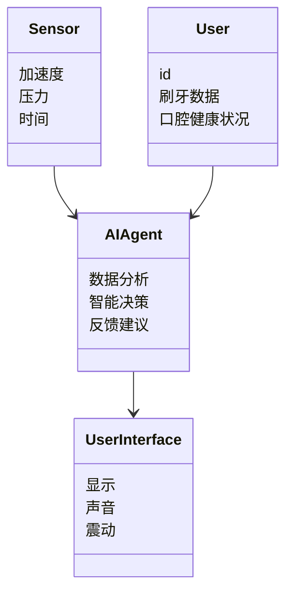
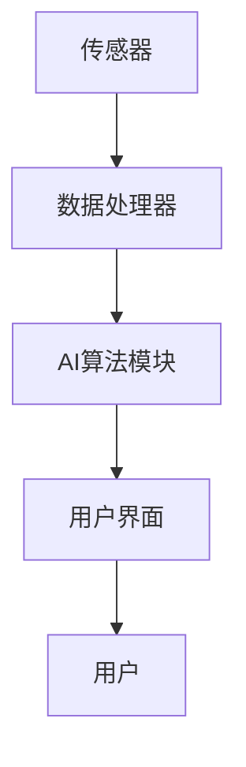
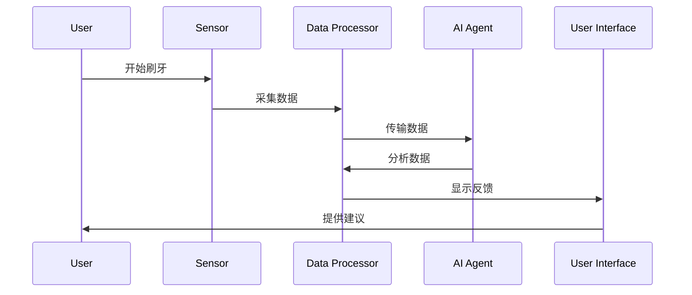

                 


# 智能电动牙刷：AI Agent的个性化刷牙指导

> 关键词：智能电动牙刷、AI Agent、个性化刷牙指导、传感器技术、机器学习、健康助手

> 摘要：本文深入探讨了智能电动牙刷结合AI Agent技术的创新应用，分析了AI Agent在个性化刷牙指导中的核心作用，从系统架构、算法原理到实际应用案例，全面解析了智能牙刷如何通过AI技术提升用户体验。

---

# 第一部分: 智能电动牙刷与AI Agent的背景介绍

## 第1章: 智能电动牙刷的发展史与AI技术的引入

### 1.1 传统电动牙刷的功能与局限性
#### 1.1.1 传统电动牙刷的功能特点
- 高频振动：传统电动牙刷通过电机驱动刷头高频振动，提供比手动刷牙更高效的清洁效果。
- 定时功能：内置定时器提醒用户完成每次刷牙2分钟的要求。
- 多种模式：如清洁模式、美白模式、牙龈护理模式等。

#### 1.1.2 传统牙刷在使用中的问题与不足
- 缺乏个性化：固定模式无法满足不同用户的刷牙需求。
- 数据缺失：无法记录用户的刷牙习惯和口腔健康状况。
- 交互单一：仅能提供简单的振动和时间提示，无法与用户进行有效互动。

#### 1.1.3 用户对智能牙刷的需求与期望
- 个性化刷牙指导：根据不同用户的口腔状况提供定制化建议。
- 实时反馈：通过AI分析用户的刷牙动作，即时提供改善建议。
- 数据记录与分析：记录刷牙数据，帮助用户了解自己的刷牙习惯并提供改进建议。

### 1.2 AI技术在智能硬件中的应用趋势
#### 1.2.1 AI技术在智能家居中的发展
- 智能音箱、智能灯泡、智能门锁等设备的普及，展示了AI技术在日常生活中的广泛应用。
- AI技术通过语音交互、自动化控制等方式，提升了智能家居的用户体验。

#### 1.2.2 AI在个人健康设备中的应用案例
- 智能手表：监测心率、步数、睡眠质量等健康数据，并通过AI算法提供健康建议。
- 智能体重秤：结合历史数据，提供体重变化趋势和健康建议。
- 智能镜子：通过图像识别技术，提供皮肤状况分析和健康建议。

#### 1.2.3 智能牙刷作为AI健康助手的潜力
- 智能牙刷可以通过AI技术，成为用户的口腔健康助手。
- 通过传感器采集刷牙数据，结合AI算法，提供个性化的刷牙指导和口腔健康建议。

### 1.3 AI Agent在智能牙刷中的角色与价值
#### 1.3.1 AI Agent的基本概念与功能
- AI Agent（智能代理）：一种能够感知环境、自主决策并执行任务的智能系统。
- 在智能牙刷中的功能包括：数据采集、智能分析、个性化推荐、实时反馈等。

#### 1.3.2 AI Agent在刷牙指导中的具体应用
- 智能识别：通过传感器识别用户的刷牙动作，分析刷牙的力度、时间、覆盖区域等。
- 个性化推荐：基于用户的刷牙数据，提供个性化的刷牙建议，如延长刷牙时间、调整刷牙角度等。
- 实时反馈：在刷牙过程中，通过AI算法实时分析用户的刷牙动作，并通过震动或语音反馈指导用户改进。

#### 1.3.3 AI Agent如何提升用户体验
- 提高刷牙效果：通过AI算法优化用户的刷牙方式，确保全面清洁。
- 个性化体验：根据用户的口腔状况提供定制化的刷牙建议，满足不同用户的需求。
- 数据驱动的健康管理：通过长期记录用户的刷牙数据，提供口腔健康分析和建议。

### 1.4 个性化刷牙指导的必要性与实现方式
#### 1.4.1 不同用户的刷牙需求差异
- 牙齿健康状况不同：如牙垢积累、牙龈出血、牙齿敏感等。
- 刷牙习惯差异：如刷牙时间不足、力度过大或过小、覆盖区域不全等。
- 个性化需求：如牙龈敏感用户需要柔和的清洁模式，烟瘾者需要深层清洁等。

#### 1.4.2 个性化刷牙指导的实现方法
- 数据采集：通过传感器采集用户的刷牙数据，包括时间、力度、频率等。
- 数据分析：利用AI算法分析数据，识别用户的刷牙问题。
- 个性化推荐：根据分析结果，提供定制化的刷牙建议。

#### 1.4.3 AI如何实现个性化的刷牙指导
- 数据驱动：AI通过分析用户的刷牙数据，提供个性化的建议。
- 实时反馈：在刷牙过程中实时指导用户改进动作。
- 持续优化：通过长期数据积累，不断优化用户的刷牙习惯。

### 1.5 本章小结
- 本章介绍了智能电动牙刷的发展史，分析了传统牙刷的局限性，探讨了AI技术在智能硬件中的应用趋势。
- 提出了AI Agent在智能牙刷中的角色与价值，并详细阐述了个性化刷牙指导的必要性和实现方式。

---

# 第二部分: AI Agent的核心概念与工作原理

## 第2章: AI Agent在智能牙刷中的核心概念

### 2.1 AI Agent的基本原理
#### 2.1.1 感知模块：传感器数据的采集与处理
- 传感器类型：加速度传感器、压力传感器、角度传感器等。
- 数据采集：通过传感器采集用户的刷牙动作数据，如振动频率、刷牙时间、力度大小等。
- 数据预处理：对采集的数据进行清洗、归一化处理，确保数据的有效性和准确性。

#### 2.1.2 决策模块：基于数据的智能决策
- 数据分析：利用机器学习算法对用户刷牙数据进行分析，识别存在的问题。
- 智能决策：根据分析结果，生成个性化的刷牙建议，如调整刷牙时间、力度、覆盖区域等。

#### 2.1.3 执行模块：反馈用户的操作建议
- 反馈方式：通过震动、语音、LED指示灯等方式，实时反馈用户的刷牙动作是否正确。
- 指导建议：提供具体的改进方法，如“请调整刷牙角度”、“请延长刷牙时间”等。

### 2.2 智能牙刷的AI Agent系统架构
#### 2.2.1 系统组成：传感器、处理器、AI算法、用户界面
- 传感器：采集用户的刷牙数据。
- 处理器：对数据进行处理和分析。
- AI算法：根据数据生成个性化建议。
- 用户界面：显示反馈信息，与用户交互。

#### 2.2.2 各模块之间的关系与数据流
- 数据流：传感器 → 处理器 → AI算法 → 用户界面。
- 模块关系：各模块协同工作，实现智能化的刷牙指导。

#### 2.2.3 系统的输入输出接口设计
- 输入接口：传感器接口、用户输入接口。
- 输出接口：反馈显示、声音反馈、震动反馈。

### 2.3 AI Agent的核心算法与数学模型
#### 2.3.1 基于规则的决策算法
- 规则定义：如“刷牙时间不足2分钟，则提醒延长刷牙时间”。
- 优点：简单易实现，适用于规则明确的场景。
- 缺点：无法处理复杂情况，缺乏灵活性。

#### 2.3.2 基于机器学习的个性化推荐算法
- 算法类型：监督学习、无监督学习或强化学习。
- 数据训练：利用用户刷牙数据，训练模型识别用户的刷牙问题。
- 推荐策略：根据模型预测结果，生成个性化建议。

#### 2.3.3 算法的数学模型与公式
- 例如：使用线性回归模型预测用户的刷牙时间。
- $$ \text{预测时间} = a \times \text{历史数据} + b $$

#### 2.3.4 算法实现案例
- 例如：利用K-均值聚类算法，将用户分为不同的刷牙习惯类别，提供针对性的建议。

### 2.4 AI Agent与传统牙刷的对比分析
#### 2.4.1 功能对比：传统牙刷 vs AI牙刷
- 传统牙刷：单一的清洁功能，缺乏个性化。
- AI牙刷：通过AI技术提供个性化指导，提升用户体验。

#### 2.4.2 数据处理能力对比
- 传统牙刷：无数据采集和处理能力。
- AI牙刷：具备数据采集、分析和反馈能力。

#### 2.4.3 用户体验对比
- 传统牙刷：用户体验单一，缺乏互动。
- AI牙刷：通过实时反馈和个性化建议，提升用户体验。

### 2.5 本章小结
- 本章详细介绍了AI Agent的基本原理，分析了智能牙刷的系统架构。
- 探讨了AI Agent的核心算法与数学模型，并通过对比分析，突出了AI牙刷的优势。

---

# 第三部分: AI Agent的系统分析与架构设计

## 第3章: 智能牙刷的系统分析与架构设计

### 3.1 问题场景介绍
- 用户刷牙习惯差，导致口腔健康问题。
- 传统牙刷无法提供有效的个性化指导。

### 3.2 项目介绍
- 项目目标：开发一款结合AI技术的智能牙刷，提供个性化的刷牙指导。
- 项目范围：从数据采集到算法实现，再到用户界面设计。

### 3.3 系统功能设计
#### 3.3.1 领域模型类图


#### 3.3.2 系统架构设计


#### 3.3.3 系统接口设计
- 传感器接口：采集用户的刷牙数据。
- 用户界面接口：显示反馈信息，与用户交互。

#### 3.3.4 系统交互流程


### 3.4 系统架构设计
#### 3.4.1 模块划分
- 传感器模块：负责采集用户的刷牙数据。
- 数据处理模块：对数据进行预处理和分析。
- AI算法模块：根据数据生成个性化建议。
- 用户界面模块：显示反馈信息，与用户交互。

#### 3.4.2 模块之间的交互流程
- 传感器采集数据 → 数据处理模块预处理 → AI算法模块分析 → 用户界面模块反馈。

### 3.5 本章小结
- 本章通过问题场景介绍，详细分析了智能牙刷的系统功能设计。
- 绘制了领域模型类图和系统架构图，描述了各模块之间的关系与交互流程。

---

# 第四部分: AI Agent的项目实战

## 第4章: 项目实战

### 4.1 环境安装
- 安装Python和相关库（如numpy、scikit-learn）。
- 安装开发环境（如PyCharm）。

### 4.2 系统核心实现源代码
#### 4.2.1 传感器数据处理代码
```python
import numpy as np

# 示例传感器数据
data = np.array([1.2, 1.5, 1.3, 1.4, 1.6, 1.7])
```

#### 4.2.2 AI决策算法代码
```python
from sklearn.cluster import KMeans

# 示例数据训练
X = data.reshape(-1, 1)
model = KMeans(n_clusters=2)
model.fit(X)
```

#### 4.2.3 反馈生成代码
```python
def generate_feedback(prediction):
    if prediction == 0:
        return "请调整刷牙角度"
    else:
        return "请延长刷牙时间"
```

### 4.3 代码应用解读与分析
- 数据处理代码：对传感器数据进行预处理，确保数据的准确性和一致性。
- AI决策算法代码：利用KMeans算法对用户刷牙数据进行聚类分析，识别用户的刷牙习惯。
- 反馈生成代码：根据模型预测结果，生成个性化的反馈建议。

### 4.4 实际案例分析
- 案例1：用户A的刷牙时间不足，AI Agent建议延长刷牙时间。
- 案例2：用户B的刷牙力度过大，AI Agent建议调整力度。

### 4.5 本章小结
- 本章通过实际案例，展示了AI Agent在智能牙刷中的应用。
- 提供了核心代码的实现，帮助读者理解AI技术在智能牙刷中的具体应用。

---

# 第五部分: 最佳实践与总结

## 第5章: 最佳实践

### 5.1 小结
- 本文详细介绍了AI Agent在智能电动牙刷中的应用，从系统架构到算法实现，再到实际应用案例，全面解析了智能牙刷的技术实现。

### 5.2 注意事项
- 数据隐私：用户刷牙数据的隐私保护。
- 传感器精度：传感器的精度直接影响数据的准确性。
- 用户体验：反馈方式的设计需要考虑用户的实际使用习惯。

### 5.3 拓展阅读
- 推荐书籍：《人工智能：一种现代的方法》、《机器学习实战》。
- 推荐资源：Coursera上的机器学习课程、Kaggle上的数据科学项目。

### 5.4 本章小结
- 本文总结了智能牙刷的开发经验，提出了实际应用中的注意事项，并为读者提供了进一步学习的资源。

---

# 结语

智能电动牙刷结合AI Agent技术，不仅提升了用户的刷牙效果，还为用户提供了个性化的口腔健康服务。随着AI技术的不断发展，智能牙刷将成为用户不可或缺的健康助手。

