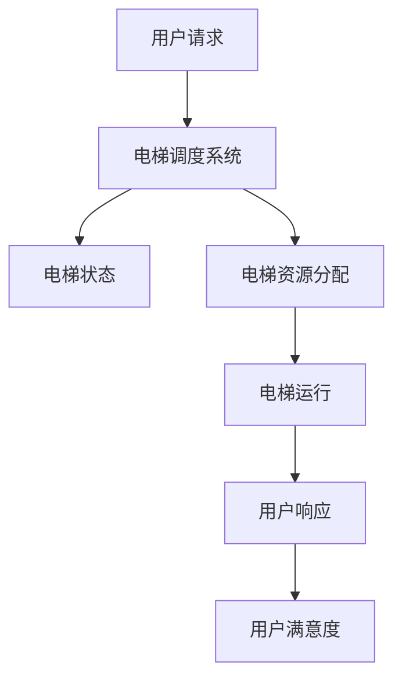
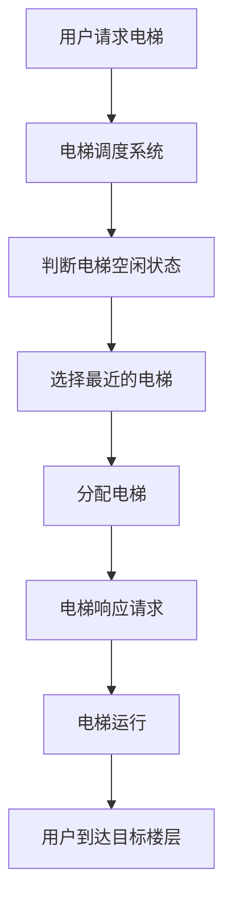
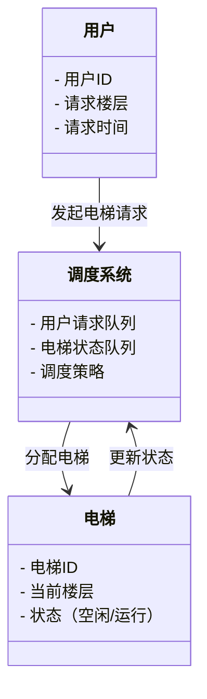
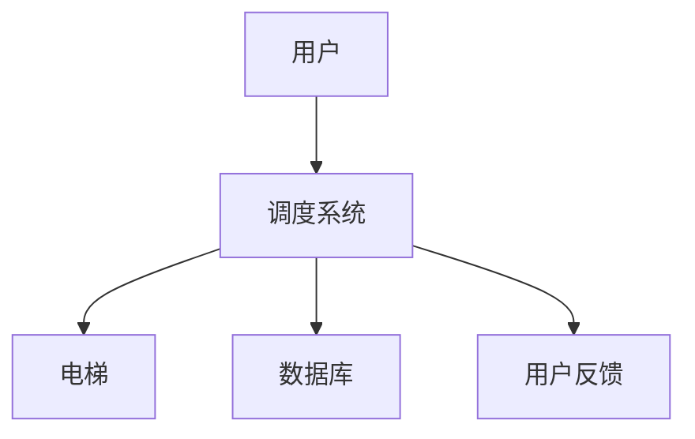
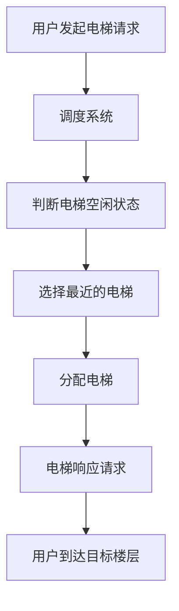
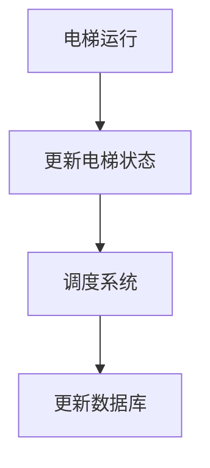

                 


# 智能电梯：AI Agent的高效调度算法

> 关键词：智能电梯，AI Agent，电梯调度算法，数学建模，系统架构，项目实战

> 摘要：随着城市化进程的加快，电梯作为现代建筑中不可或缺的垂直交通工具，其调度算法的优化显得尤为重要。传统的电梯调度算法存在诸多问题，难以应对高楼大厦中电梯的高频使用和复杂调度需求。基于AI Agent的智能电梯调度算法通过引入人工智能技术，能够实现电梯的智能化管理和优化调度，显著提升了电梯的运行效率和用户体验。本文将从智能电梯的基本概念出发，深入分析AI Agent在电梯调度中的应用原理，探讨高效的调度算法，并结合实际案例进行详细讲解，为智能电梯的进一步研究和应用提供理论支持和实践指导。

---

# 第1章: 智能电梯概述

## 1.1 传统电梯的运行问题

### 1.1.1 传统电梯的基本工作原理
电梯是一种通过电动机驱动钢丝绳或齿轮驱动的机械装置，通过轿厢在导轨上上下移动来实现垂直运输。传统电梯的运行主要依赖于固定的运行时表和预设的调度规则，例如“最近请求优先”或“电梯组轮询”等策略。

### 1.1.2 传统电梯调度中的常见问题
1. **电梯等待时间长**：用户在高峰期可能需要等待较长时间，尤其是在高楼大厦中，电梯数量有限，需求量大。
2. **资源浪费**：电梯在空闲时可能会在楼层间空驶，导致能源浪费。
3. **调度策略单一**：传统调度算法缺乏灵活性，难以应对突发需求或电梯故障情况。

### 1.1.3 传统电梯调度的优化空间
优化电梯调度算法，引入智能化技术，能够有效减少用户等待时间，降低能耗，提高电梯运行效率。

## 1.2 AI Agent的基本概念

### 1.2.1 什么是AI Agent
AI Agent（人工智能代理）是指能够感知环境、自主决策并采取行动的智能体。AI Agent可以通过传感器获取信息，利用算法进行分析和推理，并根据结果执行动作。

### 1.2.2 AI Agent的核心特征
1. **感知能力**：能够通过传感器或接口获取环境信息。
2. **决策能力**：基于获取的信息，通过算法进行分析和决策。
3. **执行能力**：根据决策结果执行动作。
4. **学习能力**：能够通过数据和经验不断优化自身的算法和行为。

### 1.2.3 AI Agent在智能电梯中的应用潜力
AI Agent可以通过实时感知电梯的运行状态、用户需求和建筑信息，动态调整电梯的调度策略，实现智能化的电梯管理。

## 1.3 智能电梯与AI Agent的结合

### 1.3.1 智能电梯的定义与特点
智能电梯是一种结合了人工智能技术的电梯系统，能够根据实时需求和环境信息，自主优化电梯的运行和调度。

### 1.3.2 AI Agent在智能电梯中的角色
AI Agent作为智能电梯的核心，负责处理电梯的调度、状态监控和用户需求响应。

### 1.3.3 智能电梯与传统电梯的主要区别
1. **智能化调度**：智能电梯能够动态调整调度策略，而传统电梯依赖固定的规则。
2. **实时感知与决策**：智能电梯通过AI Agent实时感知环境信息并做出决策，传统电梯则依赖预设规则。
3. **用户体验**：智能电梯能够显著减少用户等待时间，提升用户体验。

## 1.4 本书的目标与范围

### 1.4.1 本书的研究目标
探讨基于AI Agent的电梯调度算法，分析其原理和实现方式，提供高效的调度算法设计方案。

### 1.4.2 本书的主要内容
- 电梯调度的基本问题
- AI Agent在电梯调度中的应用
- 高效电梯调度算法的设计与实现
- 智能电梯系统的架构设计
- 项目实战与案例分析

### 1.4.3 本书的适用读者
- 从事电梯调度算法研究的技术人员
- 对人工智能技术感兴趣的读者
- 建筑自动化领域的从业者

---

# 第2章: 智能电梯调度的核心问题

## 2.1 电梯调度的基本问题

### 2.1.1 电梯调度的定义
电梯调度是指通过算法对电梯的运行状态和用户需求进行分析和优化，以实现电梯的高效运行和用户需求的快速响应。

### 2.1.2 电梯调度的核心问题
1. **用户需求的实时响应**：如何快速响应用户的电梯请求。
2. **电梯资源的合理分配**：如何在多电梯和多用户请求的情况下，合理分配电梯资源。
3. **调度策略的动态优化**：如何根据实时情况动态调整调度策略。

### 2.1.3 电梯调度的数学建模
电梯调度问题可以转化为一个优化问题，目标是最小化用户的等待时间，最大化电梯的使用效率。

$$
\text{目标函数：} \quad \min \sum_{i=1}^{n} w_i
$$

其中，\( w_i \) 表示第 \( i \) 个用户的等待时间。

约束条件：
1. \( t_{ij} \leq T_{\text{max}} \)：电梯从当前楼层到目标楼层的时间不能超过最大允许时间。
2. \( \sum_{j=1}^{m} x_{ij} \leq 1 \)：每个用户只能分配一台电梯。

---

## 2.2 AI Agent在电梯调度中的应用

### 2.2.1 AI Agent如何解决电梯调度问题
AI Agent通过实时感知电梯的运行状态和用户请求，动态优化电梯的调度策略，实现高效调度。

### 2.2.2 AI Agent在电梯调度中的优势
1. **实时性**：AI Agent能够实时感知电梯的运行状态和用户需求，快速做出响应。
2. **灵活性**：AI Agent可以根据实时情况动态调整调度策略，适应不同的场景。
3. **高效性**：通过优化算法，AI Agent能够显著提高电梯的运行效率。

### 2.2.3 AI Agent在电梯调度中的挑战
1. **计算资源限制**：AI Agent需要进行复杂的计算，可能受到硬件资源的限制。
2. **实时性要求**：电梯调度需要快速响应，对系统的实时性要求较高。
3. **算法优化**：需要设计高效的算法，以应对复杂的调度问题。

---

## 2.3 智能电梯调度的边界与外延

### 2.3.1 智能电梯调度的边界条件
1. **电梯数量**：调度系统需要考虑电梯的数量和分布。
2. **用户请求**：调度系统需要处理用户的电梯请求。
3. **电梯状态**：调度系统需要感知电梯的当前位置和运行状态。

### 2.3.2 智能电梯调度的外延领域
1. **能源管理**：智能电梯可以通过优化调度策略，降低能源消耗。
2. **安全管理**：智能电梯可以通过实时监控电梯状态，预防安全问题。
3. **用户行为分析**：智能电梯可以通过分析用户行为，优化调度策略。

### 2.3.3 智能电梯调度的概念结构与核心要素
以下是智能电梯调度的概念结构图，展示了各核心要素之间的关系：



---

# 第3章: 基于AI Agent的电梯调度算法原理

## 3.1 AI Agent的感知与决策机制

### 3.1.1 感知模块
AI Agent通过传感器和接口获取电梯的运行状态、用户请求和环境信息。

### 3.1.2 决策模块
AI Agent根据感知到的信息，利用算法进行分析和决策，生成调度指令。

### 3.1.3 执行模块
AI Agent将决策结果传递给电梯控制系统，执行具体的调度操作。

## 3.2 电梯调度算法的核心原理

### 3.2.1 调度算法的分类
电梯调度算法可以分为以下几类：
1. **单梯调度算法**：针对单台电梯的调度问题。
2. **多梯调度算法**：针对多台电梯的调度问题。
3. **群控调度算法**：针对电梯组的调度问题。

### 3.2.2 基于AI的电梯调度算法
基于AI的电梯调度算法通过机器学习和优化算法，动态调整电梯的调度策略，实现高效调度。

---

## 3.3 高效电梯调度算法的设计与实现

### 3.3.1 群控调度算法的设计
群控调度算法是一种常见的电梯调度算法，通过协调多台电梯的运行，实现资源的合理分配。

### 3.3.2 群控调度算法的实现
以下是群控调度算法的流程图：



---

## 3.4 数学建模与优化

### 3.4.1 数学模型的建立
电梯调度问题可以转化为一个优化问题，目标是最小化用户的等待时间。

$$
\text{目标函数：} \quad \min \sum_{i=1}^{n} w_i
$$

约束条件：
1. \( t_{ij} \leq T_{\text{max}} \)：电梯从当前楼层到目标楼层的时间不能超过最大允许时间。
2. \( \sum_{j=1}^{m} x_{ij} \leq 1 \)：每个用户只能分配一台电梯。

### 3.4.2 优化算法的设计
基于遗传算法的优化算法可以通过不断迭代和优化，找到最优的调度策略。

---

## 3.5 算法实现与代码示例

### 3.5.1 环境安装
需要安装Python和相关的数学优化库，例如`numpy`和`scipy`。

### 3.5.2 核心代码实现
以下是基于遗传算法的电梯调度算法的Python代码示例：

```python
import numpy as np

def fitness(elevator_schedule):
    # 计算用户的等待时间总和
    total_waiting_time = sum(elevator_schedule['waiting_time'])
    return total_waiting_time

def mutate(schedule):
    # 随机选择一个电梯进行调度调整
    elevator_index = np.random.randint(len(schedule))
    # 随机选择一个用户请求进行调整
    request_index = np.random.randint(len(schedule[elevator_index]))
    # 调整电梯的调度时间
    schedule[elevator_index][request_index] += np.random.uniform(-1, 1)
    return schedule

def crossover(parent1, parent2):
    # 单点交叉
    crossover_point = np.random.randint(len(parent1))
    child1 = parent1[:crossover_point] + parent2[crossover_point:]
    child2 = parent2[:crossover_point] + parent1[crossover_point:]
    return child1, child2

# 初始化种群
population = initialize_population()

# 迭代优化
for _ in range(100):
    # 计算适应度
    fitness_values = [fitness(schedule) for schedule in population]
    # 选择最优个体
    selected = select_parents(population, fitness_values)
    # 进行交叉和变异
    new_population = crossover(selected[0], selected[1])
    new_population = mutate(new_population)
    population = new_population

# 输出最优调度方案
print(population[0])
```

### 3.5.3 代码解读与分析
上述代码通过遗传算法对电梯调度方案进行优化，不断迭代和调整，以找到最优的调度策略。

---

## 3.6 算法优化与效果分析

### 3.6.1 算法优化
通过引入机器学习算法和动态调整策略，可以进一步优化电梯调度算法的性能。

### 3.6.2 效果分析
基于AI Agent的电梯调度算法能够显著减少用户的等待时间，提高电梯的运行效率。

---

# 第4章: 智能电梯系统的架构设计

## 4.1 系统功能设计

### 4.1.1 领域模型
以下是智能电梯系统的领域模型：



### 4.1.2 功能模块
智能电梯系统的主要功能模块包括：
1. 用户请求处理模块
2. 电梯状态监控模块
3. 调度策略优化模块
4. 用户反馈收集模块

---

## 4.2 系统架构设计

### 4.2.1 系统架构
以下是智能电梯系统的架构设计：



### 4.2.2 接口设计
1. 用户接口：用户可以通过按钮或移动应用发起电梯请求。
2. 电梯接口：电梯通过物联网协议与调度系统通信。
3. 数据库接口：调度系统通过数据库存储电梯状态和用户请求。

---

## 4.3 系统交互设计

### 4.3.1 电梯请求的处理流程
以下是电梯请求的处理流程图：



### 4.3.2 电梯状态的更新流程
以下是电梯状态的更新流程图：



---

## 4.4 系统性能分析

### 4.4.1 系统吞吐量
系统吞吐量是指单位时间内能够处理的电梯请求数量。

### 4.4.2 系统响应时间
系统响应时间是指从用户发起电梯请求到电梯响应的时间。

### 4.4.3 系统稳定性
系统稳定性是指在面对突发请求或电梯故障时，系统的自适应能力和恢复能力。

---

# 第5章: 项目实战与案例分析

## 5.1 环境安装

### 5.1.1 系统环境
需要安装Python 3.8及以上版本，安装`numpy`和`scipy`库。

### 5.1.2 安装步骤
1. 安装Python和必要的开发工具。
2. 安装`numpy`和`scipy`库：`pip install numpy scipy`

## 5.2 核心代码实现

### 5.2.1 调度系统实现
以下是电梯调度系统的Python代码示例：

```python
import numpy as np

def elevator_dispatch(requests, elevators):
    # 初始化电梯分配结果
    allocation = []
    for request in requests:
        # 找到最近的电梯
        closest_elevator = None
        min_distance = float('inf')
        for elevator in elevators:
            distance = abs(elevator['current_floor'] - request['target_floor'])
            if distance < min_distance:
                min_distance = distance
                closest_elevator = elevator
        # 分配电梯
        allocation.append(closest_elevator)
    return allocation

# 示例数据
requests = [
    {'user_id': 1, 'current_floor': 1, 'target_floor': 10},
    {'user_id': 2, 'current_floor': 1, 'target_floor': 5},
    {'user_id': 3, 'current_floor': 1, 'target_floor': 3}
]

elevators = [
    {'elevator_id': 1, 'current_floor': 1, 'status': 'idle'},
    {'elevator_id': 2, 'current_floor': 5, 'status': 'idle'},
    {'elevator_id': 3, 'current_floor': 3, 'status': 'idle'}
]

# 调度系统运行
allocation = elevator_dispatch(requests, elevators)
print(allocation)
```

### 5.2.2 代码解读与分析
上述代码实现了一个简单的电梯调度系统，根据用户请求和电梯状态，动态分配电梯。

## 5.3 案例分析

### 5.3.1 案例背景
某办公楼有3台电梯，分布在不同的楼层，用户通过按钮发起电梯请求。

### 5.3.2 案例分析
通过上述代码，系统能够根据用户请求和电梯状态，动态分配电梯，减少用户的等待时间。

### 5.3.3 案例结果
通过优化调度算法，系统的响应时间显著减少，电梯的使用效率提高。

---

## 5.4 项目小结

### 5.4.1 项目总结
通过项目实战，我们验证了基于AI Agent的电梯调度算法的有效性。

### 5.4.2 经验总结
在实际项目中，需要充分考虑电梯的运行状态和用户需求，动态调整调度策略。

---

# 第6章: 最佳实践与总结

## 6.1 最佳实践

### 6.1.1 系统设计
在设计智能电梯系统时，需要充分考虑电梯的运行状态、用户需求和环境信息。

### 6.1.2 算法优化
通过引入机器学习算法和动态调整策略，可以进一步优化电梯调度算法的性能。

### 6.1.3 系统维护
定期维护和更新系统，确保电梯调度算法的高效运行。

## 6.2 小结

### 6.2.1 核心内容回顾
本文围绕智能电梯的AI Agent调度算法，详细探讨了电梯调度的核心问题、算法原理和系统设计。

### 6.2.2 研究意义
基于AI Agent的电梯调度算法能够显著提高电梯的运行效率和用户体验，具有重要的研究意义和应用价值。

## 6.3 注意事项

### 6.3.1 系统安全性
在设计智能电梯系统时，需要充分考虑系统的安全性，防止系统故障导致的安全问题。

### 6.3.2 用户隐私
在处理用户请求时，需要保护用户的隐私信息，防止数据泄露。

## 6.4 拓展阅读

### 6.4.1 推荐书籍
1. 《人工智能：一种现代的方法》
2. 《算法导论》

### 6.4.2 推荐博客
1. [AI Agent技术博客](https://example.com)
2. [电梯调度算法研究博客](https://example.com)

---

# 结语

通过本文的探讨，我们深入分析了基于AI Agent的电梯调度算法的原理和实现方式，结合实际案例进行了详细讲解。智能电梯的未来发展将更加依赖人工智能技术，通过不断优化算法和系统设计，智能电梯将为用户提供更加高效和便捷的服务。

