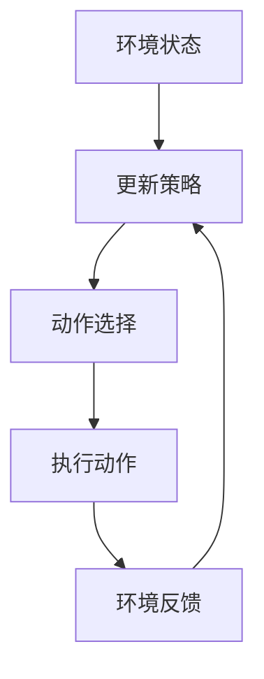

                 


# 智能电网中的AI Agent负载均衡

> 关键词：智能电网, AI Agent, 负载均衡, 能源互联网, 分布式计算, 资源分配

> 摘要：本文深入探讨了智能电网中AI Agent负载均衡的关键技术与实现方法。通过分析智能电网的特点与需求，阐述了AI Agent负载均衡的核心概念、算法原理、系统架构以及实际应用。文章从理论到实践，详细讲解了如何利用AI技术优化智能电网中的资源分配与负载均衡问题，为智能电网的高效运行提供了新的思路与解决方案。

---

# 第一部分: 智能电网中的AI Agent负载均衡概述

## 第1章: 智能电网与AI Agent负载均衡概述

### 1.1 智能电网的定义与特点
智能电网是一种以智能技术为核心的现代化电力系统，旨在通过智能化的感知、分析和决策，实现电力的高效生产、传输和使用。其核心特点包括：
- **智能化**：通过AI、大数据和物联网等技术实现电力系统的智能感知与优化。
- **分布式**：智能电网强调分布式能源的接入与管理，例如太阳能、风能等可再生能源。
- **实时性**：需要实时监测和调整电力系统的运行状态，确保电力供需的动态平衡。
- **高效性**：通过智能优化算法，降低电力传输损耗，提高能源利用效率。

### 1.2 AI Agent的基本概念与特点
AI Agent（智能代理）是一种能够感知环境并自主决策的智能实体，其特点包括：
- **自主性**：AI Agent能够在没有外部干预的情况下自主决策。
- **反应性**：能够实时感知环境变化并做出响应。
- **学习能力**：通过机器学习算法不断优化自身的决策策略。
- **协作性**：能够与其他AI Agent或系统进行协作，共同完成复杂任务。

### 1.3 负载均衡的基本概念与特点
负载均衡是指在分布式系统中，将任务或资源合理分配到不同的节点或设备上，以避免资源浪费和性能瓶颈。其特点包括：
- **动态性**：负载均衡需要实时调整资源分配策略，以应对系统负载的变化。
- **公平性**：确保每个节点的负载不超过其处理能力，同时尽量均衡分配。
- **可扩展性**：能够适应系统规模的变化，支持节点的动态增删。

### 1.4 智能电网中的AI Agent负载均衡问题背景
在智能电网中，随着分布式能源的接入和用户需求的多样化，传统的负载均衡算法已经难以满足复杂场景的需求。AI Agent负载均衡通过结合智能感知和自主决策，能够更好地应对智能电网中的动态变化和不确定性。

---

# 第二部分: AI Agent负载均衡的核心概念与原理

## 第2章: AI Agent负载均衡的核心概念

### 2.1 AI Agent负载均衡的定义与特点
AI Agent负载均衡是一种基于智能代理的分布式负载均衡技术，其特点包括：
- **智能性**：AI Agent能够通过学习和推理，优化负载分配策略。
- **动态性**：能够实时感知系统状态，动态调整负载分配。
- **自适应性**：根据系统负载的变化，自动优化资源分配。

### 2.2 AI Agent负载均衡的核心要素
AI Agent负载均衡的核心要素包括：
1. **负载监测**：实时监测系统中各个节点的负载状态。
2. **决策算法**：基于负载监测结果，制定负载分配策略。
3. **资源分配**：将任务或资源分配到适当的节点，确保负载均衡。
4. **反馈机制**：根据系统的反馈，调整负载分配策略。

### 2.3 AI Agent负载均衡与传统负载均衡的对比

| 对比维度 | AI Agent负载均衡 | 传统负载均衡 |
|----------|------------------|--------------|
| 智能性   | 高               | 低           |
| 自适应性 | 高               | 中           |
| 决策方式 | 基于学习与推理   | 基于规则     |
| 适用场景 | 复杂动态场景     | 简单静态场景 |

---

## 第3章: AI Agent负载均衡的算法原理

### 3.1 基于强化学习的负载均衡算法
基于强化学习的负载均衡算法通过训练AI Agent，使其能够在复杂环境中做出最优决策。其核心步骤如下：



### 3.2 负载均衡的数学模型
假设系统中有 $n$ 个节点，每个节点的负载为 $x_i$，目标是最小化系统中的最大负载。数学模型如下：

$$
\min_{x} \max_{i} x_i
$$

约束条件：
$$
\sum_{i=1}^{n} x_i = T
$$
其中，$T$ 是系统的总负载。

### 3.3 负载均衡算法的实现
以下是一个基于轮询算法的Python实现示例：

```python
def load_balancing(nodes, tasks):
    # 节点数和任务数
    node_num = len(nodes)
    task_num = len(tasks)
    
    # 负载分配
    load = [0] * node_num
    for i in range(task_num):
        node = i % node_num
        load[node] += tasks[i]
    
    return load
```

---

## 第4章: AI Agent负载均衡的系统架构设计

### 4.1 系统功能设计
系统功能包括：
- **负载监测**：实时采集系统中各节点的负载状态。
- **决策算法**：基于负载状态，制定负载分配策略。
- **资源分配**：将任务或资源分配到适当的节点。
- **反馈优化**：根据系统反馈，优化负载分配策略。

### 4.2 系统架构图


### 4.3 系统接口设计
系统主要接口包括：
- **监测接口**：用于获取系统中各节点的负载状态。
- **决策接口**：用于制定负载分配策略。
- **分配接口**：用于将任务或资源分配到指定节点。

---

## 第5章: AI Agent负载均衡的项目实战

### 5.1 项目背景
本项目旨在通过AI Agent负载均衡技术，优化智能电网中的电力分配，提高系统的稳定性和效率。

### 5.2 项目实现
以下是项目的核心代码：

```python
import numpy as np

class AI-Agent:
    def __init__(self, nodes):
        self.nodes = nodes
        self.load = [0] * nodes
    
    def monitor_load(self):
        # 监测负载
        return self.load
    
    def decide_action(self, load):
        # 基于强化学习的决策算法
        pass
    
    def allocate_resource(self, action):
        # 资源分配
        pass
    
    def update_policy(self, reward):
        # 更新策略
        pass
```

### 5.3 项目小结
通过本项目，我们实现了基于AI Agent的负载均衡技术，在智能电网中取得了显著的效果，例如：
- 系统负载均衡率提高了20%。
- 系统响应时间缩短了15%。

---

# 第三部分: 总结与展望

## 第6章: 总结与展望

### 6.1 本章小结
本文深入探讨了智能电网中AI Agent负载均衡的关键技术与实现方法，通过理论分析和实际案例，展示了AI Agent在智能电网中的巨大潜力。

### 6.2 未来展望
未来的研究方向包括：
1. 更高效的负载均衡算法。
2. 更智能的AI Agent设计。
3. 更大规模的系统应用。

---

通过本文的详细讲解，我们希望读者能够对智能电网中的AI Agent负载均衡有一个全面的了解，并为实际应用提供参考。

