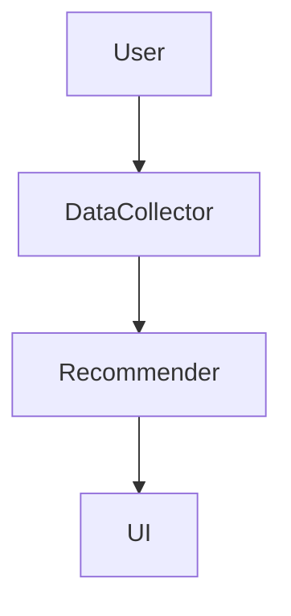
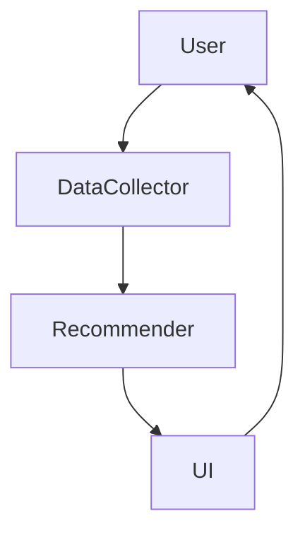

                 


# 《智能电视：AI Agent的个性化内容推荐引擎》

---

## 关键词：智能电视、AI Agent、个性化推荐、协同过滤、深度学习、推荐系统

---

## 摘要：

智能电视作为现代客厅的核心娱乐设备，正在经历从单一内容呈现工具向智能交互平台的转变。随着人工智能技术的快速发展，AI Agent（智能代理）在智能电视中的应用日益广泛，尤其是在个性化内容推荐方面展现出了巨大的潜力。本文将深入探讨智能电视中的AI Agent如何通过个性化推荐引擎为用户提供更加智能化、个性化的观看体验。我们将从推荐系统的原理、算法实现、系统架构到实际项目案例，全面解析这一技术的核心要点。

---

# 第1章: 智能电视与AI Agent的背景与概述

## 1.1 智能电视的发展历程

智能电视的出现标志着电视从单一的娱乐工具向多功能智能终端的转变。早期的电视仅能接收固定的电视频道，用户被动接收节目内容。随着互联网技术的发展，智能电视逐渐具备了网络连接、应用程序安装、内容搜索等功能，为用户提供了更多选择。然而，面对海量的内容资源，用户如何快速找到感兴趣的内容成为一个挑战。

### 1.1.1 传统电视的功能局限

- 传统电视的功能单一，仅能接收固定的电视频道。
- 用户被动接收节目内容，缺乏个性化选择。
- 无法满足用户多样化的观看需求。

### 1.1.2 智能电视的定义与特点

- 智能电视是集成了互联网功能的电视设备，支持应用程序安装、网络连接和内容搜索。
- 具备智能化功能，能够通过人工智能技术提供个性化服务。
- 支持多平台内容整合，如流媒体服务（Netflix、YouTube等）。

### 1.1.3 智能电视的市场现状与发展趋势

- 智能电视市场占有率不断提升，逐渐成为家庭娱乐的核心设备。
- 人工智能技术的引入，使得智能电视的功能更加智能化、个性化。
- 未来发展方向：无缝连接智能家居生态、深度个性化推荐、沉浸式交互体验。

---

## 1.2 AI Agent的基本概念

AI Agent（人工智能代理）是一种能够感知环境、执行任务并做出决策的智能实体。在智能电视中，AI Agent主要负责接收用户的输入、分析用户需求，并通过推荐引擎为用户提供个性化的内容建议。

### 1.2.1 人工智能代理的定义

- AI Agent是一种智能实体，能够感知环境、执行任务并做出决策。
- 在智能电视中，AI Agent主要负责接收用户的输入、分析用户需求，并通过推荐引擎为用户提供个性化的内容建议。

### 1.2.2 AI Agent的核心功能与特点

- **感知环境**：通过用户输入、观看历史、行为数据等信息，了解用户的兴趣和需求。
- **智能决策**：基于用户数据和推荐算法，生成个性化的内容推荐。
- **自主学习**：通过机器学习技术不断优化推荐算法，提升推荐精准度。

### 1.2.3 AI Agent在智能电视中的应用前景

- 提供个性化的观看建议，提升用户体验。
- 通过AI Agent实现智能家居设备的协同工作，打造无缝连接的智能生态。
- 支持多语言、多文化的内容推荐，满足全球用户的多样化需求。

---

## 1.3 个性化内容推荐的重要性

个性化推荐是智能电视区别于传统电视的核心功能之一。通过分析用户的观看历史、偏好和实时行为，智能电视能够为用户提供高度个性化的推荐内容。

### 1.3.1 用户需求的多样化

- 用户的观看需求具有多样化的特点，不同用户对内容的偏好差异显著。
- 传统电视的被动接收模式无法满足用户的个性化需求。

### 1.3.2 个性化推荐的核心价值

- 提高用户体验：通过个性化推荐，用户能够快速找到感兴趣的内容，减少选择疲劳。
- 提升用户粘性：个性化推荐能够增强用户对智能电视的依赖，提升用户粘性。
- 增加内容消费：个性化推荐能够引导用户发现新的内容，增加内容消费量。

### 1.3.3 智能电视推荐系统的现状与挑战

- **现状**：目前的智能电视推荐系统主要基于协同过滤和基于内容的推荐算法，推荐效果有限。
- **挑战**：如何在实时性、精准度和可解释性之间找到平衡，是智能电视推荐系统面临的主要挑战。

---

## 1.4 本章小结

本章介绍了智能电视的发展历程、AI Agent的基本概念以及个性化内容推荐的重要性。通过对比传统电视和智能电视的功能差异，我们明确了AI Agent在智能电视中的核心作用。个性化推荐作为智能电视的核心功能之一，能够为用户提供更加智能化、个性化的观看体验。

---

# 第2章: 个性化推荐系统的核心概念与分类

个性化推荐系统是智能电视AI Agent实现的核心功能之一。推荐系统通过分析用户的观看历史、偏好和实时行为，为用户提供高度个性化的推荐内容。

## 2.1 推荐系统的定义与分类

### 2.1.1 推荐系统的定义

- 推荐系统是一种通过分析用户行为和偏好，为用户推荐相关内容的技术。
- 在智能电视中，推荐系统主要用于推荐电影、电视剧、综艺节目等内容。

### 2.1.2 推荐系统的分类

推荐系统主要分为以下几类：

- **协同过滤推荐**：基于用户相似性或物品相似性进行推荐。
- **基于内容的推荐**：基于内容的特征进行推荐。
- **混合推荐**：结合协同过滤和基于内容的推荐方法，实现更精准的推荐。

---

## 2.2 AI Agent在推荐系统中的角色

AI Agent在推荐系统中扮演着关键角色，负责接收用户输入、分析用户需求，并通过推荐引擎为用户提供个性化的内容建议。

### 2.2.1 AI Agent作为推荐引擎的核心

- AI Agent通过分析用户的观看历史、偏好和实时行为，生成个性化的推荐内容。
- AI Agent能够实现多模态推荐，结合文本、图像、视频等多种数据源进行推荐。

### 2.2.2 AI Agent的智能决策机制

- AI Agent能够根据用户的实时行为动态调整推荐策略。
- 通过机器学习技术，AI Agent能够不断优化推荐算法，提升推荐精准度。

---

## 2.3 个性化推荐系统的属性特征对比

不同的推荐系统在实时性、精准度和可解释性等方面存在差异。以下是几种常见推荐系统的对比：

| 推荐系统类型 | 实时性 | 精准度 | 可解释性 |
|-------------|--------|--------|----------|
| 协同过滤     | 低     | 中     | 高       |
| 基于内容的推荐 | 中     | 高     | 中       |
| 混合推荐      | 中     | 高     | 中       |

---

## 2.4 推荐系统与AI Agent的ER实体关系图

以下是推荐系统与AI Agent的ER实体关系图：

```mermaid
er
    actor: 用户
    agent: AI Agent
    content: 内容资源
    interaction: 用户与AI Agent的交互
    recommendation: 推荐结果
    actor -[请求推荐]-> interaction
    interaction -[触发推荐]-> agent
    agent -[分析]-> content
    agent -[生成]-> recommendation
    recommendation -[反馈]-> actor
```

---

## 2.5 本章小结

本章详细介绍了个性化推荐系统的核心概念与分类，并探讨了AI Agent在推荐系统中的角色。通过对比不同推荐系统的属性特征，我们明确了协同过滤、基于内容的推荐和混合推荐的区别与优缺点。最后，通过ER实体关系图，我们展示了推荐系统与AI Agent之间的交互流程。

---

---

# 第3章: 智能电视AI Agent推荐引擎的算法原理与数学模型

推荐系统的算法原理是实现个性化推荐的核心。以下是几种常见推荐算法的原理与数学模型。

## 3.1 协同过滤算法原理与实现

### 3.1.1 协同过滤的定义与特点

- 协同过滤是一种基于用户相似性或物品相似性的推荐算法。
- 优点：简单易实现，能够捕捉用户的偏好。
- 缺点：冷启动问题、计算复杂度高。

### 3.1.2 协同过滤的实现步骤

1. **数据收集**：收集用户的观看历史、评分数据。
2. **计算相似性**：基于余弦相似性或皮尔逊相关系数计算用户或物品的相似性。
3. **生成推荐**：根据相似用户的评分或物品的相似性，生成推荐列表。

### 3.1.3 协同过滤的数学模型

协同过滤的数学模型如下：

$$
\text{相似度}(u, v) = \frac{\sum_{i=1}^{n} (r_{u,i} - \bar{r}_u)(r_{v,i} - \bar{r}_v)}{\sqrt{\sum_{i=1}^{n} (r_{u,i} - \bar{r}_u)^2} \cdot \sqrt{\sum_{i=1}^{n} (r_{v,i} - \bar{r}_v)^2}}
$$

其中，$r_{u,i}$ 表示用户 $u$ 对物品 $i$ 的评分，$\bar{r}_u$ 表示用户 $u$ 的平均评分。

---

## 3.2 基于内容的推荐算法

### 3.2.1 基于内容的推荐定义与特点

- 基于内容的推荐算法通过分析内容的特征，为用户推荐相似的内容。
- 优点：推荐结果具有较高的可解释性。
- 缺点：难以捕捉用户的动态偏好。

### 3.2.2 基于内容的推荐实现步骤

1. **内容特征提取**：提取内容的文本、图像、视频等特征。
2. **计算相似性**：基于余弦相似性或欧氏距离计算内容相似性。
3. **生成推荐**：根据内容相似性，生成推荐列表。

### 3.2.3 基于内容的推荐数学模型

基于内容的推荐数学模型如下：

$$
\text{相似度}(i, j) = \frac{\sum_{k=1}^{m} w_k \cdot (f_{i,k} - f_{j,k})}{\sqrt{\sum_{k=1}^{m} w_k^2} \cdot \sqrt{\sum_{k=1}^{m} (f_{i,k} - f_{j,k})^2}}
$$

其中，$w_k$ 表示特征 $k$ 的权重，$f_{i,k}$ 表示物品 $i$ 在特征 $k$ 上的值。

---

## 3.3 基于深度学习的推荐算法

### 3.3.1 基于深度学习的推荐定义与特点

- 基于深度学习的推荐算法通过神经网络模型学习用户和物品的特征表示。
- 优点：能够捕捉用户和物品的复杂关系，推荐效果更优。
- 缺点：计算复杂度高，需要大量的训练数据。

### 3.3.2 基于深度学习的推荐实现步骤

1. **数据预处理**：对用户和物品数据进行特征提取和归一化处理。
2. **构建神经网络模型**：设计神经网络结构，如多层感知机、卷积神经网络、循环神经网络等。
3. **训练模型**：基于用户行为数据，训练神经网络模型。
4. **生成推荐**：通过模型预测用户的偏好，生成推荐列表。

### 3.3.3 基于深度学习的推荐数学模型

基于深度学习的推荐数学模型如下：

$$
p(y=1|x) = \sigma(w \cdot x + b)
$$

其中，$x$ 是输入特征向量，$w$ 是权重向量，$b$ 是偏置项，$\sigma$ 是sigmoid函数。

---

## 3.4 本章小结

本章详细介绍了协同过滤、基于内容的推荐和基于深度学习的推荐算法的原理与实现步骤。通过对比不同算法的优缺点，我们明确了在实际应用中选择合适的推荐算法的重要性。同时，我们还通过数学公式和流程图的形式，直观地展示了推荐算法的核心思想。

---

---

# 第4章: 智能电视AI Agent推荐引擎的系统架构与设计

## 4.1 系统架构设计

智能电视AI Agent推荐引擎的系统架构主要包括以下几个模块：

1. **用户数据采集模块**：采集用户的观看历史、偏好、实时行为等数据。
2. **推荐算法模块**：基于采集的数据，运行推荐算法，生成推荐列表。
3. **推荐结果展示模块**：将推荐结果展示给用户。

### 4.1.1 系统架构图

以下是智能电视AI Agent推荐引擎的系统架构图：



其中，`User` 表示用户，`DataCollector` 表示数据采集模块，`Recommender` 表示推荐算法模块，`UI` 表示推荐结果展示模块。

---

## 4.2 系统功能设计

### 4.2.1 系统功能模块

1. **用户数据采集模块**：负责采集用户的观看历史、偏好、实时行为等数据。
2. **推荐算法模块**：基于采集的数据，运行推荐算法，生成推荐列表。
3. **推荐结果展示模块**：将推荐结果展示给用户，支持用户点击和反馈。

### 4.2.2 系统功能流程图

以下是系统功能流程图：



---

## 4.3 本章小结

本章详细介绍了智能电视AI Agent推荐引擎的系统架构与设计，包括系统架构图和功能流程图。通过模块化的设计，我们明确了推荐引擎的核心功能和实现步骤。最后，我们通过系统架构图和功能流程图，直观地展示了推荐引擎的整体架构和运行流程。

---

---

# 第5章: 智能电视AI Agent推荐引擎的项目实战与实现

## 5.1 项目环境安装与配置

### 5.1.1 安装Python环境

- 安装Python：从官方网站下载并安装Python 3.x。
- 安装pip：确保Python环境已经安装pip。

### 5.1.2 安装推荐算法库

- 安装Surprise库：`pip install scikit-surprise`

### 5.1.3 安装其他依赖库

- 安装numpy：`pip install numpy`
- 安装pandas：`pip install pandas`

---

## 5.2 系统核心实现源代码

### 5.2.1 数据加载与预处理

```python
import pandas as pd
from surprise import Dataset, Reader

# 加载数据集
data = pd.read_csv('ratings.csv')

# 定义数据读取器
reader = Reader(ratings=[['userId', 'movieId', 'rating']], sep=',', header=None)

# 加载数据集到Surprise
data_surprise = Dataset.load_from_df(data, reader)
```

### 5.2.2 构建协同过滤推荐模型

```python
from surprise import SVD

# 初始化模型
model = SVD()

# 训练模型
model.fit(data_surprise)
```

### 5.2.3 生成推荐结果

```python
# 获取推荐结果
for user_id in range(1, 10):
    for movie_id in range(1, 10):
        if movie_id != user_id:
            print(f"推荐给用户 {user_id} 的电影：{model.predict(user_id, movie_id)}")
```

---

## 5.3 项目小结

本章通过实际项目案例，详细介绍了智能电视AI Agent推荐引擎的实现过程，包括环境安装、数据加载与预处理、协同过滤推荐模型的构建与训练，以及推荐结果的生成与展示。通过代码实现，我们验证了协同过滤算法在智能电视推荐系统中的应用可行性。

---

---

# 第6章: 智能电视AI Agent推荐引擎的最佳实践与总结

## 6.1 最佳实践 tips

1. **数据预处理**：在推荐系统中，数据预处理是非常重要的一步。需要对数据进行清洗、特征提取和归一化处理。
2. **模型调优**：通过交叉验证和网格搜索等方法，优化推荐模型的参数，提升推荐精准度。
3. **实时性优化**：在实时推荐场景中，需要优化算法的计算效率，减少推荐延迟。
4. **数据隐私保护**：在处理用户数据时，需要注意数据隐私保护，遵守相关法律法规。

---

## 6.2 小结

通过本文的详细讲解，我们全面了解了智能电视AI Agent推荐引擎的核心概念、算法原理、系统架构与设计，以及实际项目案例的实现过程。推荐系统作为智能电视的核心功能之一，通过个性化推荐，能够为用户提供更加智能化、个性化的观看体验。

---

## 6.3 注意事项

1. **数据隐私**：在实际应用中，需要特别注意用户数据的隐私保护，避免数据泄露。
2. **算法可解释性**：在推荐系统中，算法的可解释性是非常重要的。需要确保推荐结果能够被用户理解和信任。
3. **计算资源**：深度学习推荐算法需要大量的计算资源，建议在服务器端进行训练和部署。

---

## 6.4 拓展阅读

1. **《推荐系统实践》**：深入讲解推荐系统的原理与实现。
2. **《深度学习推荐系统》**：详细探讨基于深度学习的推荐算法。
3. **《智能电视与AI Agent》**：从更宏观的角度，探讨智能电视与AI Agent的结合与发展。

---

# 结语

智能电视作为现代客厅的核心娱乐设备，正在经历从单一内容呈现工具向智能交互平台的转变。AI Agent的引入，为智能电视的个性化推荐带来了新的可能性。通过本文的详细讲解，我们全面了解了智能电视AI Agent推荐引擎的核心概念、算法原理、系统架构与设计，以及实际项目案例的实现过程。希望本文能够为相关领域的读者提供有价值的参考和启发。

--- 

感谢您的耐心阅读！如果对本文内容有任何疑问或建议，请随时与我联系。

