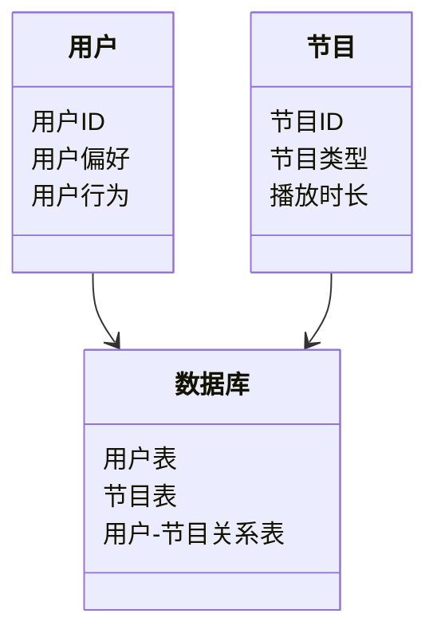
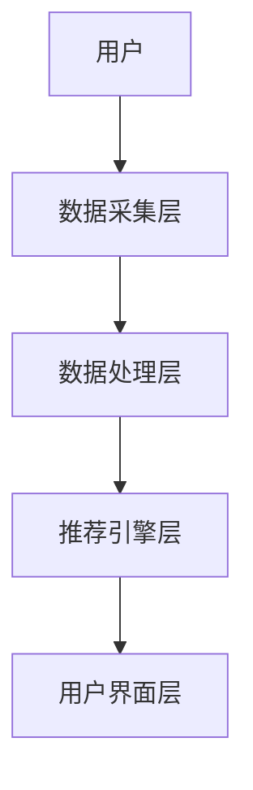

                 


# 智能电视：AI Agent的观看习惯分析

> 关键词：智能电视，AI Agent，观看习惯，推荐算法，协同过滤，用户行为分析

> 摘要：本文探讨了AI Agent在智能电视中的应用，重点分析了基于AI的观看习惯分析技术。通过详细阐述协同过滤算法、用户行为分析模型以及系统架构设计，本文为智能电视的个性化推荐提供了理论基础和实践指导。文章还结合实际案例，展示了如何通过AI Agent优化用户的观看体验。

---

# 第一部分: 智能电视与AI Agent的背景与概念

## 第1章: 智能电视的发展历程

### 1.1 传统电视的局限性

#### 1.1.1 传统电视的功能局限
- 传统电视的功能单一，仅限于接收电视台的节目。
- 缺乏互动性和个性化推荐能力。
- 无法根据用户偏好调整内容推荐。

#### 1.1.2 数字电视的初步发展
- 数字电视引入了数字信号处理技术，提升了画质和音质。
- 支持基本的节目指南和简单的用户交互。
- 但仍然未能实现真正的个性化推荐。

#### 1.1.3 智能电视的定义与特点
- 智能电视是集成了操作系统、应用程序和互联网功能的电视设备。
- 具备多任务处理能力，支持应用程序扩展。
- 可以连接互联网，提供丰富的在线内容。

---

## 第2章: AI Agent的基本概念

### 2.1 人工智能的基本概念

#### 2.1.1 人工智能的定义与特点
- 人工智能（AI）是模拟人类智能的技术，包括学习、推理和自适应能力。
- AI的核心在于数据处理和模式识别。

#### 2.1.2 机器学习与深度学习的区别
- 机器学习：基于数据训练模型，通过经验改进性能。
- 深度学习：一种机器学习方法，利用多层神经网络进行特征提取。

#### 2.1.3 AI Agent的核心原理
- AI Agent是一个智能实体，能够感知环境并执行任务。
- 在智能电视中，AI Agent用于数据采集、分析和推荐。

---

## 第3章: 智能电视观看习惯分析的背景与意义

### 3.1 观看习惯分析的定义

#### 3.1.1 观看习惯分析的内涵
- 观看习惯分析是指通过对用户的观看行为进行数据挖掘，识别用户的偏好和行为模式。

#### 3.1.2 观看习惯分析的外延
- 包括观看时间、观看内容、暂停/快进频率等多维度分析。

### 3.2 AI Agent在观看习惯分析中的优势

#### 3.2.1 数据采集的高效性
- AI Agent可以实时采集用户的观看数据，无需人工干预。

#### 3.2.2 数据分析的精准性
- 基于机器学习的算法，AI Agent能够准确识别用户的偏好。

#### 3.2.3 个性化推荐的可能性
- 通过分析观看习惯，AI Agent可以为用户提供个性化的节目推荐。

---

# 第二部分: AI Agent观看习惯分析的核心概念与联系

## 第4章: 观看习惯分析的核心概念

### 4.1 数据采集与处理

#### 4.1.1 数据采集的多维度性
- 包括用户的观看时间、观看内容、互动行为（如评分、收藏）等。

#### 4.1.2 数据处理的流程
1. 数据采集：通过电视遥控器、应用程序日志等方式获取数据。
2. 数据清洗：去除噪声数据，确保数据质量。
3. 数据预处理：将数据转换为适合分析的格式。

#### 4.1.3 数据清洗与预处理
- 数据清洗：去除重复、错误或无效的数据。
- 数据预处理：对数据进行标准化、归一化处理。

---

## 第5章: AI Agent与观看习惯分析的关系

### 5.1 AI Agent在观看习惯分析中的作用

#### 5.1.1 数据采集的智能化
- AI Agent能够实时采集并分析用户的观看数据。

#### 5.1.2 数据分析的自动化
- 通过机器学习算法，AI Agent能够自动识别用户的偏好。

#### 5.1.3 个性化推荐的实现
- AI Agent根据分析结果，为用户推荐相关节目。

### 5.2 核心概念的联系

#### 5.2.1 数据采集与AI Agent的结合
- AI Agent通过传感器和日志采集用户行为数据。

#### 5.2.2 用户行为分析与AI Agent的结合
- AI Agent利用机器学习模型分析用户的观看模式。

#### 5.2.3 个性化推荐与观看习惯分析的结合
- 通过分析观看习惯，AI Agent实现精准的节目推荐。

---

# 第三部分: AI Agent观看习惯分析的算法原理

## 第6章: 基于协同过滤的推荐算法

### 6.1 协同过滤的原理

#### 6.1.1 协同过滤的定义
- 协同过滤是一种基于用户相似性进行推荐的算法。

#### 6.1.2 协同过滤的实现步骤
1. 数据预处理：去除噪声数据。
2. 用户相似度计算：使用余弦相似度或欧氏距离。
3. 推荐生成：基于相似用户的评分，预测当前用户的偏好。

#### 6.1.3 协同过滤的优缺点
- 优点：简单易实现，适合数据稀疏场景。
- 缺点：计算复杂度高，冷启动问题。

---

## 第7章: 基于用户的协同过滤算法

### 7.1 用户相似度的计算

#### 7.1.1 余弦相似度的计算公式
$$ \text{相似度} = \frac{\sum_{i=1}^{n} x_i y_i}{\sqrt{\sum_{i=1}^{n} x_i^2} \cdot \sqrt{\sum_{i=1}^{n} y_i^2}} $$

#### 7.1.2 用户行为分析的特征提取
- 提取用户的观看时长、观看频率、暂停次数等特征。

#### 7.1.3 用户行为分析的数学模型
- 使用矩阵分解技术，将用户行为表示为低维向量。

---

## 第8章: 基于内容的推荐算法

### 8.1 内容特征提取

#### 8.1.1 节目内容的特征表示
- 包括节目类型、演员阵容、制作公司等。

#### 8.1.2 内容特征的相似度计算
- 使用TF-IDF或Word2Vec提取文本特征。

#### 8.1.3 内容相似度的数学模型
$$ \text{相似度} = \sum_{i=1}^{n} w_i \cdot x_i \cdot y_i $$

---

## 第9章: 混合推荐算法

### 9.1 混合推荐的定义

#### 9.1.1 混合推荐的优势
- 结合协同过滤和内容推荐的优点，提升推荐精度。

#### 9.1.2 混合推荐的实现步骤
1. 生成协同过滤推荐列表。
2. 生成基于内容的推荐列表。
3. 根据用户偏好融合两个推荐列表。

#### 9.1.3 混合推荐的数学模型
$$ \text{最终推荐} = \alpha \cdot \text{协同推荐} + (1-\alpha) \cdot \text{内容推荐} $$

---

# 第四部分: 系统分析与架构设计

## 第10章: 系统功能设计

### 10.1 领域模型设计

#### 10.1.1 领域模型的定义
- 领域模型描述系统的功能模块及其交互。

#### 10.1.2 领域模型的类图


---

## 第11章: 系统架构设计

### 11.1 系统架构的定义

#### 11.1.1 分层架构设计
- 数据采集层：负责采集用户的观看数据。
- 数据处理层：对数据进行清洗和预处理。
- 推荐引擎层：基于算法生成推荐结果。
- 用户界面层：展示推荐结果。

#### 11.1.2 系统架构的流程图


---

## 第12章: 系统接口设计

### 12.1 接口定义

#### 12.1.1 数据接口
- 数据采集接口：用于获取用户的观看数据。
- 数据处理接口：用于清洗和预处理数据。

#### 12.1.2 推荐接口
- 推荐请求接口：用户发送推荐请求。
- 推荐结果接口：返回推荐节目列表。

---

## 第13章: 系统交互设计

### 13.1 交互流程

#### 13.1.1 用户登录与数据采集
- 用户登录智能电视，系统开始采集观看数据。

#### 13.1.2 数据分析与推荐生成
- 系统分析用户行为，生成推荐列表。

#### 13.1.3 推荐结果展示
- 推荐结果以列表形式展示在电视界面上。

---

# 第五部分: 项目实战与案例分析

## 第14章: 项目环境搭建

### 14.1 开发环境

#### 14.1.1 系统要求
- 操作系统：Linux/Windows/MacOS
- 开发工具：Python、Jupyter Notebook
- 依赖库：NumPy、Pandas、Scikit-learn

#### 14.1.2 安装步骤
1. 安装Python：`python --version`
2. 安装依赖库：`pip install numpy pandas scikit-learn`

---

## 第15章: 核心代码实现

### 15.1 协同过滤算法实现

#### 15.1.1 数据预处理代码
```python
import numpy as np
import pandas as pd

# 读取数据
data = pd.read_csv('watch_history.csv')

# 数据清洗
data.dropna(inplace=True)
data['rating'] = data['rating'].astype(int)
```

#### 15.1.2 用户相似度计算
```python
from sklearn.metrics.pairwise import cosine_similarity

# 计算用户相似度矩阵
user_similarity = cosine_similarity(data[['rating']], data[['rating']])
```

#### 15.1.3 推荐生成
```python
def get_recommendations(user_id, user_similarity, data):
    similar_users = np.argsort(user_similarity[user_id])[::-1]
    recommended_movies = []
    for user in similar_users:
        recommended_movies.extend(data.iloc[user]['movie'].values)
    return recommended_movies[:10]
```

---

## 第16章: 项目实战案例

### 16.1 数据分析与案例解读

#### 16.1.1 数据分析
- 分析用户的观看时长和频率，提取用户偏好。
- 使用协同过滤算法生成推荐列表。

#### 16.1.2 案例解读
- 用户A喜欢观看动作片，系统推荐类似的电影。
- 用户B喜欢喜剧片，系统推荐其他喜剧片。

---

## 第17章: 项目小结

### 17.1 核心代码总结

#### 17.1.1 协同过滤算法总结
- 通过用户相似度计算，实现个性化推荐。
- 推荐结果基于用户行为数据。

---

# 第六部分: 最佳实践与展望

## 第18章: 最佳实践

### 18.1 实践建议

#### 18.1.1 数据采集与处理
- 确保数据的完整性和准确性。
- 定期更新和优化数据处理流程。

#### 18.1.2 算法优化
- 使用混合推荐算法提升推荐精度。
- 优化计算效率，减少资源消耗。

---

## 第19章: 未来展望

### 19.1 技术发展

#### 19.1.1 AI Agent的未来发展
- 更智能的推荐算法。
- 更多的多模态数据融合。

#### 19.1.2 智能电视的未来趋势
- 更高的智能化水平。
- 更丰富的交互方式。

---

# 结语

通过本文的分析，我们可以看到AI Agent在智能电视中的应用前景广阔。基于协同过滤和内容推荐的算法，结合系统的架构设计，智能电视的观看体验将得到显著提升。未来，随着技术的发展，AI Agent将更加智能化，为用户提供更优质的服务。

---

感谢您的耐心阅读！如果对本文内容有任何疑问或建议，请随时与我联系。

