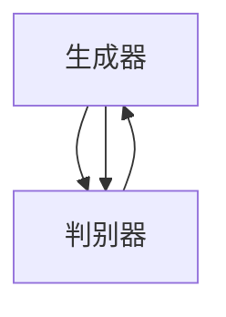
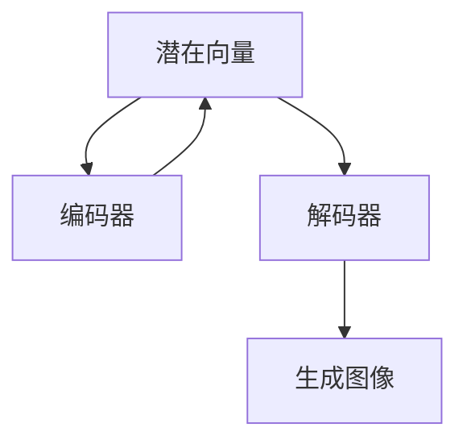
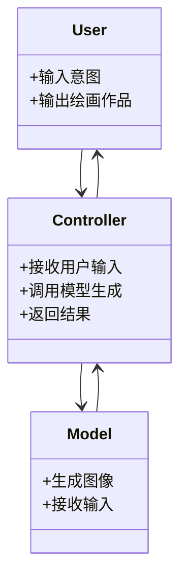

                 


# 智能画架：AI Agent的绘画技巧指导

**关键词**：AI绘画、生成对抗网络、变分自编码器、深度学习、图像生成、艺术创作

**摘要**：本文将探讨AI Agent在绘画技巧指导中的应用。通过分析AI绘画的背景、核心算法、系统架构以及实际案例，我们将深入理解AI如何辅助艺术家创作，从生成对抗网络到实际项目实现，全面解析AI绘画的技术与实践。

---

## 第1章: AI绘画的背景与核心概念

### 1.1 AI绘画的背景介绍

#### 1.1.1 AI绘画的定义与问题背景
AI绘画是一种利用人工智能技术生成或辅助绘画的艺术形式。随着深度学习模型的发展，AI绘画逐渐从理论走向实际应用，为艺术家提供了新的创作工具和灵感。

#### 1.1.2 AI绘画的核心概念与问题描述
AI绘画的核心在于通过算法生成图像，解决传统绘画中效率低下、灵感受限等问题。AI绘画的目标是帮助用户快速生成高质量的绘画作品，并提供个性化的修改建议。

#### 1.1.3 AI绘画的边界与外延
AI绘画不仅限于生成图像，还包括对图像的风格迁移、修复、增强等功能。它与图像处理、计算机视觉等领域密切相关。

#### 1.1.4 AI绘画的概念结构与核心要素组成
AI绘画的概念结构包括输入（用户意图）、生成模型、输出（绘画作品），核心要素包括数据集、模型算法、用户交互。

### 1.2 AI绘画的核心概念与联系

#### 1.2.1 AI绘画的核心概念原理
AI绘画依赖于生成模型，如生成对抗网络（GAN）和变分自编码器（VAE）。这些模型通过学习数据分布，生成逼真的图像。

#### 1.2.2 AI绘画核心概念的属性特征对比表格

| 模型类型 | 参数量 | 生成效果 | 训练复杂度 | 应用场景 |
|----------|--------|----------|------------|----------|
| GAN      | 高     | 高       | 高          | 高质量图像生成 |
| VAE      | 中     | 中       | 中          | 数据压缩与生成 |

#### 1.2.3 AI绘画核心概念的ER实体关系图

```mermaid
er
actor: 用户
model: 模型
painting: 绘画作品
role: 用户与模型交互
```

---

## 第2章: AI绘画的核心算法与数学模型

### 2.1 AI绘画的核心算法原理

#### 2.1.1 生成对抗网络（GAN）的原理



GAN由生成器和判别器组成，生成器生成图像，判别器判断图像真伪，两者通过对抗训练优化模型。

#### 2.1.2 变分自编码器（VAE）的原理



VAE通过编码器将图像压缩为潜在向量，解码器将其还原为图像，适用于风格迁移和图像修复。

### 2.2 AI绘画的数学模型与公式

#### 2.2.1 GAN的损失函数

$$ \mathcal{L}_\text{GAN}(G, D) = \mathbb{E}_{z, x}[ -\log D(x) - \log(1 - D(G(z)))] $$

判别器D的目标是区分真实图像和生成图像，生成器G的目标是使D无法区分两者。

#### 2.2.2 VAE的重构损失与KL散度

$$ \mathcal{L}_\text{VAE} = \mathbb{E}_{x}[ \mathcal{L}_\text{recon}(x, G(z))] + \mathbb{E}_{z}[ \text{KL}(q(z|x) || p(z))] $$

重构损失衡量生成图像与真实图像的差异，KL散度衡量潜在向量的分布。

#### 2.2.3 Python代码实现简单GAN模型

```python
import torch
import torch.nn as nn

class Generator(nn.Module):
    def __init__(self, latent_dim=100, img_size=64):
        super(Generator, self).__init__()
        self.latent_dim = latent_dim
        self.img_size = img_size
        self.model = nn.Sequential(
            nn.Linear(latent_dim, img_size * img_size),
            nn.ReLU(),
            nn.Unflatten(2, (img_size, img_size)),
        )

    def forward(self, z):
        return self.model(z)

class Discriminator(nn.Module):
    def __init__(self, img_size=64):
        super(Discriminator, self).__init__()
        self.model = nn.Sequential(
            nn.Flatten(),
            nn.Linear(img_size * img_size, 1),
            nn.Sigmoid(),
        )

    def forward(self, x):
        return self.model(x)
```

---

## 第3章: AI绘画系统分析与架构设计方案

### 3.1 问题场景介绍

AI绘画系统适用于艺术创作、设计辅助和教育领域，帮助用户快速生成绘画作品。

### 3.2 系统功能设计

#### 3.2.1 系统功能模块



#### 3.2.2 系统架构设计


---

## 第4章: 项目实战

### 4.1 环境安装与配置

安装PyTorch、Numpy、Matplotlib等库。

### 4.2 系统核心实现源代码

#### 4.2.1 GAN模型实现

```python
import torch
from torch import optim
from torch.utils.data import DataLoader

# 定义生成器和判别器
generator = Generator(latent_dim=100)
discriminator = Discriminator()

# 定义损失函数和优化器
criterion = nn.BCELoss()
optimizer_G = optim.Adam(generator.parameters(), lr=0.0002)
optimizer_D = optim.Adam(discriminator.parameters(), lr=0.0002)

# 训练循环
for epoch in range(num_epochs):
    for batch in dataloader:
        # 生成假图像
        z = torch.randn(batch_size, latent_dim)
        fake = generator(z)
        
        # 判别器在真实图像上的输出
        real_output = discriminator(batch)
        
        # 判别器在假图像上的输出
        fake_output = discriminator(fake)
        
        # 计算损失
        loss_D = criterion(real_output, torch.ones_like(real_output)) + criterion(fake_output, torch.zeros_like(fake_output))
        loss_G = criterion(fake_output, torch.ones_like(fake_output))
        
        # 反向传播和优化
        optimizer_D.zero_grad()
        loss_D.backward()
        optimizer_D.step()
        
        optimizer_G.zero_grad()
        loss_G.backward()
        optimizer_G.step()
```

### 4.3 项目总结

通过项目实战，我们掌握了AI绘画的核心算法和系统架构设计，能够实际应用这些技术生成绘画作品。

---

## 第5章: 最佳实践与总结

### 5.1 小结

AI绘画通过生成对抗网络和变分自编码器等算法，为艺术家提供了强大的工具，帮助他们实现创作目标。

### 5.2 注意事项

选择合适的模型和超参数，确保生成图像的质量和多样性。同时，注意保护知识产权，避免侵权问题。

### 5.3 拓展阅读

推荐阅读《生成对抗网络：算法与实现》和《深度学习与计算机视觉》等书籍，深入理解AI绘画的技术细节。

---

通过本文的系统介绍，读者可以全面了解AI Agent在绘画技巧指导中的应用，从理论到实践，掌握AI绘画的核心技术。

