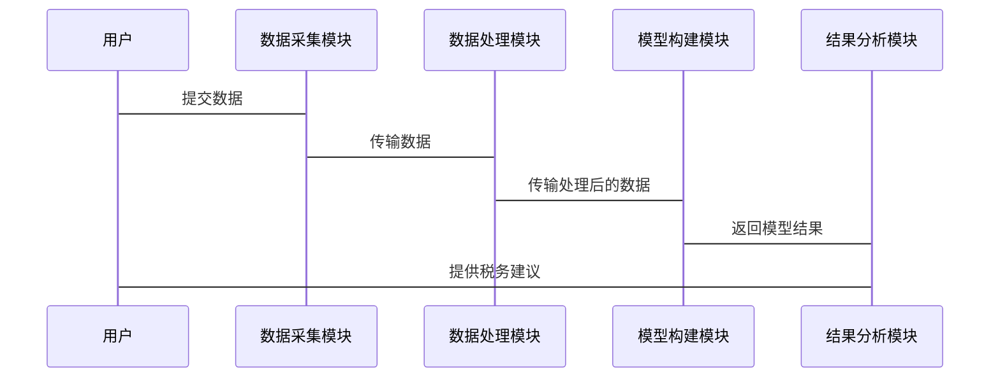

                 


# 智能税务规划与建议

> 关键词：智能税务规划、人工智能、大数据、税务优化、机器学习

> 摘要：智能税务规划是结合人工智能和大数据技术，通过数据驱动的方式实现税务优化和合规性管理的新兴领域。本文系统地介绍智能税务规划的核心概念、算法原理、系统架构设计以及实际应用案例，帮助读者理解如何利用技术手段提升税务规划的效率和准确性。

---

# 第一部分: 智能税务规划与建议的背景与核心概念

## 第1章: 智能税务规划与建议概述

### 1.1 税务规划的基本概念
#### 1.1.1 税务规划的定义
税务规划是通过合法合规的方式优化纳税人的税务负担，实现税务最小化或利益最大化的过程。它涉及对税收政策的理解、收入与支出的合理分配，以及税务风险的规避。

#### 1.1.2 税务规划的核心目标
1. 税收最小化：通过合理分配收入和支出，降低纳税人的税负。
2. 合规性：确保税务规划符合相关法律法规，避免税务风险。
3. 财务优化：通过税务优化提升整体财务状况，实现资产的保值与增值。

#### 1.1.3 税务规划的实施原则
1. 合法性原则：税务规划必须在法律允许的范围内进行。
2. 综合性原则：结合纳税人的收入、支出、资产和负债等多方面因素进行规划。
3. 灵活性原则：根据税收政策的变化和个人财务状况的变动，及时调整税务规划。

### 1.2 智能税务规划的背景
#### 1.2.1 人工智能与大数据技术的发展
随着人工智能和大数据技术的快速发展，税务规划领域也开始引入这些技术手段，以提高规划的效率和准确性。

#### 1.2.2 税务政策的复杂化与个性化需求
现代税收政策日益复杂，不同纳税人的需求也呈现多样化，传统的手动税务规划方式难以满足个性化需求。

#### 1.2.3 智能税务规划的兴起
智能税务规划利用人工智能技术，通过自动化数据处理和模型构建，为纳税人提供个性化的税务优化建议，成为税务领域的一大趋势。

### 1.3 智能税务规划的边界与外延
#### 1.3.1 税务规划的边界
智能税务规划仅限于合法合规的范围内，不能涉及逃税、避税等违法行为。

#### 1.3.2 智能税务规划的外延
智能税务规划不仅包括传统的税务优化，还包括税务风险管理、税务数据分析等更广泛的应用。

#### 1.3.3 税务规划与财务规划的关系
税务规划是财务规划的重要组成部分，但两者的目标和范围有所不同。财务规划更注重整体财务目标的实现，而税务规划则是实现这些目标的重要手段之一。

### 1.4 本章小结
本章从税务规划的基本概念出发，介绍了智能税务规划的背景和核心目标，分析了其边界和外延，并强调了智能税务规划在现代税务管理中的重要性。

---

# 第二部分: 智能税务规划的核心概念与联系

## 第2章: 智能税务规划的核心概念

### 2.1 智能税务规划的核心原理
#### 2.1.1 数据驱动的税务优化
智能税务规划依赖于大量高质量的税务数据，通过数据分析和建模，为纳税人提供优化建议。

#### 2.1.2 人工智能在税务规划中的应用
人工智能技术（如机器学习、自然语言处理）被广泛应用于税务数据的分析、模型构建和税务建议生成。

#### 2.1.3 智能税务规划的算法基础
智能税务规划依赖于多种算法，包括回归分析、分类算法、聚类算法等，用于预测、分类和优化。

### 2.2 智能税务规划的核心要素
#### 2.2.1 税务数据的采集与处理
智能税务规划的第一步是数据采集，包括收入、支出、资产、负债等财务数据，以及税收政策、经济环境等外部数据。

#### 2.2.2 税务模型的构建与优化
基于采集到的数据，构建数学模型（如回归模型、决策树模型）进行优化，生成税务建议。

#### 2.2.3 税务建议的生成与反馈
根据模型的计算结果，生成个性化的税务建议，并通过反馈机制不断优化模型。

### 2.3 智能税务规划的概念属性对比
#### 2.3.1 传统税务规划与智能税务规划的对比
| 属性 | 传统税务规划 | 智能税务规划 |
|------|--------------|--------------|
| 数据来源 | 有限，依赖手动收集 | 大数据驱动，多源数据 |
| 处理方式 | 手动计算，规则导向 | 自动化计算，数据驱动 |
| 结果 | 单一化，缺乏优化 | 个性化，动态优化 |

#### 2.3.2 数据驱动与规则驱动的对比
| 属性 | 数据驱动 | 规则驱动 |
|------|----------|----------|
| 依赖性 | 依赖大量数据 | 依赖预先设定的规则 |
| 灵活性 | 高 | 低 |
| 适用性 | 复杂场景 | 简单场景 |

#### 2.3.3 个性化与批量化的对比
| 属性 | 个性化 | 批量化 |
|------|--------|--------|
| 适用场景 | 高净值客户、复杂需求 | 中小型企业、简单需求 |
| 效率 | 较低 | 较高 |
| 成本 | 较高 | 较低 |

### 2.4 智能税务规划的ER实体关系图
```mermaid
erDiagram
    纳税人 : N
    税务政策 : P
    收入支出 : I
    税务建议 : S
    纳税人 --> P : 受影响的政策
    纳税人 --> I : 产生的收入支出
    纳税人 --> S : 生成的建议
```

### 2.5 本章小结
本章深入分析了智能税务规划的核心概念，通过对比传统税务规划和智能税务规划的差异，明确了智能税务规划的优势和适用场景，并通过ER图展示了税务规划的实体关系。

---

# 第三部分: 智能税务规划的算法原理

## 第3章: 智能税务规划的核心算法

### 3.1 税务优化算法的选择
#### 3.1.1 线性回归模型
线性回归模型适用于简单的优化问题，如预测税负变化。

#### 3.1.2 支持向量机（SVM）
SVM适用于分类问题，可用于税务风险评估。

#### 3.1.3 随机森林
随机森林常用于特征重要性分析和复杂场景的预测。

### 3.2 基于线性回归的税务优化算法
#### 3.2.1 算法流程


#### 3.2.2 算法实现
以下是基于线性回归的税务优化算法的Python实现示例：

```python
import pandas as pd
from sklearn.linear_model import LinearRegression
from sklearn.model_selection import train_test_split
from sklearn.metrics import mean_squared_error

# 数据加载与预处理
data = pd.read_csv('tax_data.csv')
X = data[['income', 'expenses', 'assets']]
y = data['tax']

# 数据分割
X_train, X_test, y_train, y_test = train_test_split(X, y, test_size=0.2, random_state=42)

# 模型训练
model = LinearRegression()
model.fit(X_train, y_train)

# 模型预测
y_pred = model.predict(X_test)

# 模型评估
mse = mean_squared_error(y_test, y_pred)
print(f'均方误差: {mse}')
print(f'回归系数: {model.coef_}')
print(f'截距: {model.intercept_}')
```

#### 3.2.3 算法原理的数学公式
线性回归模型的数学公式如下：
$$ y = \beta_0 + \beta_1 x_1 + \beta_2 x_2 + ... + \beta_n x_n $$

其中：
- $y$ 是预测的税负
- $\beta_0$ 是截距
- $\beta_1, \beta_2, ..., \beta_n$ 是回归系数
- $x_1, x_2, ..., x_n$ 是自变量（如收入、支出等）

### 3.3 本章小结
本章介绍了几种常用的税务优化算法，并详细讲解了线性回归模型的实现和数学原理，为后续的系统设计和项目实战打下基础。

---

# 第四部分: 智能税务规划的系统分析与架构设计

## 第4章: 智能税务规划系统设计

### 4.1 系统功能设计
#### 4.1.1 数据采集模块
数据采集模块负责收集纳税人的收入、支出、资产等数据，以及相关的税收政策信息。

#### 4.1.2 数据处理模块
数据处理模块对采集到的数据进行清洗、转换和特征提取，确保数据的准确性和可用性。

#### 4.1.3 模型构建模块
模型构建模块基于处理后的数据，选择合适的算法构建税务优化模型，并进行模型训练和优化。

#### 4.1.4 结果分析模块
结果分析模块对模型的预测结果进行分析和解读，生成个性化的税务建议。

### 4.2 系统架构设计
#### 4.2.1 系统架构图


#### 4.2.2 系统接口设计
- 用户接口：提供数据输入和结果查看的界面。
- 数据接口：与税务数据源（如税务局系统）进行数据交互。
- 模型接口：与其他模块共享模型的训练结果和预测结果。

#### 4.2.3 系统交互流程


### 4.3 本章小结
本章详细设计了智能税务规划系统的功能模块和架构，并通过系统架构图和交互流程图展示了系统的整体结构和工作流程。

---

# 第五部分: 智能税务规划的项目实战

## 第5章: 项目实战

### 5.1 环境安装与配置
#### 5.1.1 安装Python和相关库
```bash
pip install numpy pandas scikit-learn matplotlib
```

#### 5.1.2 数据集准备
下载税务相关数据集，例如包含收入、支出、税负等信息的CSV文件。

### 5.2 系统核心实现
#### 5.2.1 数据预处理
```python
import pandas as pd
from sklearn.preprocessing import StandardScaler

# 加载数据
data = pd.read_csv('tax_data.csv')

# 数据清洗
data.dropna(inplace=True)

# 特征提取
features = data[['income', 'expenses', 'assets']]
labels = data['tax']

# 标准化处理
scaler = StandardScaler()
features_scaled = scaler.fit_transform(features)
```

#### 5.2.2 模型训练
```python
from sklearn.linear_model import LinearRegression
from sklearn.model_selection import train_test_split
from sklearn.metrics import r2_score

# 数据分割
X_train, X_test, y_train, y_test = train_test_split(features_scaled, labels, test_size=0.2, random_state=42)

# 模型训练
model = LinearRegression()
model.fit(X_train, y_train)

# 模型预测
y_pred = model.predict(X_test)

# 模型评估
print(f'R²得分: {r2_score(y_test, y_pred)}')
```

#### 5.2.3 案例分析
以一个高净值客户为例，通过模型生成税务优化建议，分析其税前和税后收益的变化。

### 5.3 项目小结
本章通过实际项目展示了智能税务规划系统的实现过程，包括环境配置、数据预处理、模型训练和案例分析，帮助读者理解智能税务规划的实际应用。

---

# 第六部分: 智能税务规划的最佳实践

## 第6章: 最佳实践

### 6.1 项目经验总结
#### 6.1.1 数据质量的重要性
高质量的数据是智能税务规划的基础，数据清洗和特征工程尤为重要。

#### 6.1.2 模型选择的注意事项
根据具体场景选择合适的算法，避免过度拟合和欠拟合。

#### 6.1.3 系统性能优化
通过并行计算、缓存优化等技术提升系统的运行效率。

### 6.2 项目开发 tips
1. 数据隐私保护：确保纳税人的数据安全，遵守相关法律法规。
2. 模型定期更新：根据税收政策的变化和数据的变化，定期更新模型。
3. 用户友好性：设计直观易用的用户界面，提升用户体验。

### 6.3 本章小结
本章总结了智能税务规划项目的开发经验，提出了数据质量、模型选择和系统性能优化等方面的注意事项，并给出了项目开发的实用建议。

---

# 结语

智能税务规划与建议是人工智能和大数据技术在税务领域的深度应用，通过数据驱动的方式为纳税人提供个性化的税务优化方案。本文从背景、核心概念、算法原理、系统设计到项目实战，全面系统地介绍了智能税务规划的各个方面，帮助读者掌握这一领域的核心技术与实践方法。

---

# 参考文献
1. [书籍或论文1]
2. [书籍或论文2]
3. [书籍或论文3]

---

# 附录
1. 代码实现细节
2. 数据预处理步骤
3. 模型评估指标

