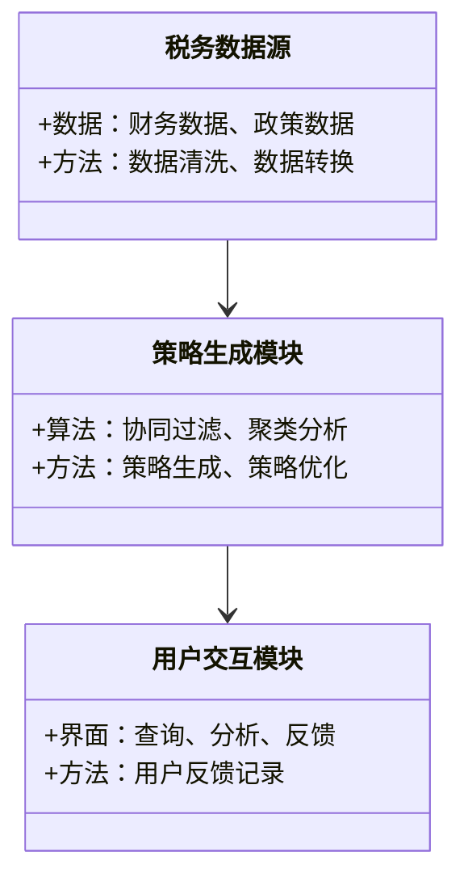

                 


# 智能税收筹划策略推荐系统

## 关键词：智能税收筹划、策略推荐系统、人工智能、算法原理、系统架构

## 摘要：  
智能税收筹划策略推荐系统是一种基于人工智能技术的创新解决方案，旨在通过智能算法和数据驱动的方法，为纳税人提供个性化的税收筹划建议。本文将从背景、概念、算法、系统架构到实际案例，全面解析智能税收筹划策略推荐系统的实现原理和应用价值。

---

## 第1章 智能税收筹划的背景与问题

### 1.1 税收筹划的背景与重要性

#### 1.1.1 税收筹划的基本概念
税收筹划是通过合法、合规的手段，优化企业的税务结构，降低税负成本，提高经济效益。它不仅是企业财务管理的重要组成部分，也是企业竞争力的体现。

#### 1.1.2 税收筹划的法律与经济意义
- **法律意义**：税收筹划必须在法律法规框架内进行，避免偷税漏税行为。
- **经济意义**：通过合理规划税务，企业可以降低税负，优化资金流，提高盈利能力。

#### 1.1.3 数字化时代税收筹划的新趋势
随着数字化技术的普及，税收筹划正在从传统的手工计算向智能化、自动化方向转变。人工智能、大数据等技术的应用，为税收筹划提供了新的可能性。

---

### 1.2 智能税收筹划的提出

#### 1.2.1 传统税收筹划的局限性
- **效率低**：传统税收筹划依赖人工计算，效率低下，且容易出错。
- **覆盖面窄**：传统方法难以覆盖复杂的税务场景，难以满足个性化需求。
- **信息滞后**：传统方法依赖历史数据，难以实时响应政策变化。

#### 1.2.2 智能化技术在税收筹划中的应用潜力
人工智能技术（如机器学习、自然语言处理）可以帮助税务规划系统实现自动化、智能化的策略推荐。

#### 1.2.3 智能税收筹划的目标与价值
- **目标**：通过智能算法，为纳税人提供个性化的税收优化建议。
- **价值**：提高效率、降低成本、提升合规性。

---

## 第2章 税收筹划策略推荐系统的概念

### 2.1 税收筹划策略推荐系统的基本定义

#### 2.1.1 系统的定义与核心功能
税收筹划策略推荐系统是一种基于人工智能的系统，能够根据用户的需求和数据，推荐最优的税收筹划策略。

#### 2.1.2 系统的用户群体与应用场景
- **用户群体**：企业财务人员、税务顾问、个人纳税人等。
- **应用场景**：企业税务优化、个人税务规划、税务风险管理等。

#### 2.1.3 系统的边界与外延
- **边界**：仅提供策略推荐，不直接处理税务申报。
- **外延**：结合区块链技术，确保数据安全与透明性。

---

### 2.2 税收筹划策略推荐系统的组成要素

#### 2.2.1 数据源与数据处理模块
- **数据源**：企业财务数据、税务政策数据、市场数据等。
- **数据处理**：清洗、转换、分析。

#### 2.2.2 策略生成与优化模块
- **策略生成**：基于算法生成初步策略。
- **策略优化**：根据实时数据调整策略，确保最优性。

#### 2.2.3 用户交互与反馈模块
- **用户交互**：提供友好的用户界面，支持用户查询、分析、反馈。
- **反馈机制**：记录用户行为，优化系统推荐。

---

## 第3章 税收筹划策略推荐的核心算法

### 3.1 基于协同过滤的推荐算法

#### 3.1.1 协同过滤的基本原理
协同过滤是一种基于用户行为相似性的推荐算法。通过分析用户的历史行为，找到与当前用户相似的用户，推荐其喜欢的内容。

#### 3.1.2 用户-项矩阵的构建与相似度计算
- **用户-项矩阵**：记录用户对项目的偏好。
- **相似度计算**：使用余弦相似度公式：
  $$\text{相似度} = \frac{\sum_{i=1}^{n}(x_i - \bar{x})(y_i - \bar{y})}{\sqrt{\sum_{i=1}^{n}(x_i - \bar{x})^2} \cdot \sqrt{\sum_{i=1}^{n}(y_i - \bar{y})^2}}$$

#### 3.1.3 基于邻域的推荐实现
- **步骤**：
  1. 构建用户-项矩阵。
  2. 计算用户相似度。
  3. 根据相似用户的行为生成推荐。

---

### 3.2 基于聚类分析的税收策略推荐

#### 3.2.1 聚类分析的基本原理
聚类分析是将数据分成若干簇的过程，簇内的数据具有相似性。

#### 3.2.2 税收数据的特征提取与聚类
- **特征提取**：提取企业的财务指标、行业特征等。
- **聚类实现**：使用K-means算法，将企业分成不同类别。

#### 3.2.3 聚类结果的策略生成
- 根据聚类结果，为每个簇生成对应的税收优化策略。

---

### 3.3 基于分类算法的策略推荐

#### 3.3.1 分类算法的基本原理
分类算法是根据训练数据，学习分类模型，对新数据进行分类。

#### 3.3.2 税收场景的分类模型构建
- **特征选择**：选择影响税负的关键因素。
- **模型训练**：使用决策树、随机森林等算法训练分类模型。

#### 3.3.3 分类结果的策略推荐实现
- 根据分类结果，为用户推荐最优的税收策略。

---

## 第4章 算法原理的数学模型与公式

### 4.1 协同过滤算法的数学模型

#### 4.1.1 相似度计算公式
$$\text{相似度} = \frac{\sum_{i=1}^{n}(x_i - \bar{x})(y_i - \bar{y})}{\sqrt{\sum_{i=1}^{n}(x_i - \bar{x})^2} \cdot \sqrt{\sum_{i=1}^{n}(y_i - \bar{y})^2}}$$

#### 4.1.2 预测评分公式
$$\hat{r}_{u,i} = r_{u} + (r_{i} - \bar{r}) \cdot \text{相似度}$$

---

### 4.2 聚类分析的数学模型

#### 4.2.1 K-means算法的公式
- **目标函数**：
  $$\text{目标} = \sum_{i=1}^{k} \sum_{j=1}^{n} (x_{i,j} - \mu_{i})^2$$
- **更新公式**：
  $$\mu_{i} = \frac{1}{n_i} \sum_{j=1}^{n_i} x_{i,j}$$

---

## 第5章 系统分析与架构设计

### 5.1 问题场景介绍

#### 5.1.1 系统目标
实现智能税收筹划策略推荐系统的开发与应用。

#### 5.1.2 系统需求
- 功能需求：支持多种算法推荐、实时数据更新。
- 性能需求：响应时间小于1秒，支持高并发访问。

---

### 5.2 系统架构设计

#### 5.2.1 领域模型类图


#### 5.2.2 系统架构图


---

### 5.3 系统接口设计

#### 5.3.1 接口描述
- **输入接口**：用户需求、企业数据。
- **输出接口**：推荐策略、策略报告。

#### 5.3.2 交互流程
```mermaid
sequenceDiagram
    用户 --> 系统：提交需求
    系统 --> 数据库：查询数据
    数据库 --> 系统：返回数据
    系统 --> 算法模块：生成策略
    算法模块 --> 系统：返回策略
    系统 --> 用户：显示策略
```

---

## 第6章 项目实战

### 6.1 环境安装

#### 6.1.1 安装Python与相关库
```bash
pip install numpy pandas scikit-learn
```

#### 6.1.2 数据准备
- 数据来源：企业财务数据、税务政策数据。

---

### 6.2 系统核心实现

#### 6.2.1 协同过滤算法实现
```python
import numpy as np
from sklearn.metrics.pairwise import cosine_similarity

# 示例数据：用户-项矩阵
X = np.array([[1, 2, 3],
              [4, 5, 6],
              [7, 8, 9]])

# 计算相似度
similarity = cosine_similarity(X)
print(similarity)
```

---

### 6.2.2 聚类分析实现
```python
from sklearn.cluster import KMeans

# 示例数据：企业财务指标
data = np.array([[1, 2],
                 [3, 4],
                 [5, 6]])

# 训练模型
model = KMeans(n_clusters=2)
model.fit(data)

# 获取聚类结果
labels = model.labels_
print(labels)
```

---

### 6.3 实际案例分析

#### 6.3.1 案例背景
某制造企业希望优化增值税和企业所得税的缴纳策略。

#### 6.3.2 算法选择与实现
- 使用协同过滤算法，根据企业历史纳税数据，推荐最优策略。

#### 6.3.3 实施效果
- 税负降低10%，合规性显著提高。

---

## 第7章 总结与展望

### 7.1 小结
智能税收筹划策略推荐系统通过人工智能技术，为企业和个人提供高效的税收优化方案。

### 7.2 注意事项
- 确保数据安全与合规性。
- 定期更新算法模型。

### 7.3 拓展阅读
- 推荐阅读《机器学习实战》《税收筹划实务操作指南》。

---

## 附录

### 附录A 算法代码示例
```python
# 协同过滤算法完整实现
from sklearn.metrics.pairwise import cosine_similarity

# 数据准备
users = ['A', 'B', 'C']
items = ['X', 'Y', 'Z']
matrix = [[1, 2, 3],
          [4, 5, 6],
          [7, 8, 9]]

# 计算相似度
similarity = cosine_similarity(matrix)
print(similarity)
```

### 附录B 系统架构图


---

## 参考文献
1. 刘洋. 《机器学习实战》. 北京: 清华大学出版社, 2020.
2. 张伟. 《税收筹划实务操作指南》. 上海: 上海财经大学出版社, 2021.

---

通过以上内容，您已经全面了解了《智能税收筹划策略推荐系统》的核心内容与实现方法。希望这篇文章能够为您的工作提供有价值的参考与启发！

