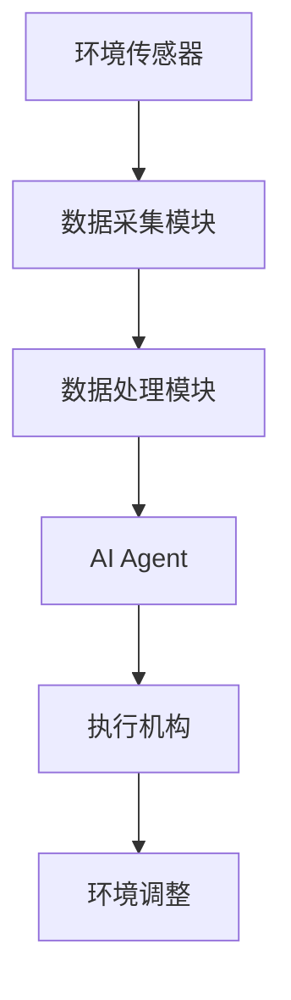

                 


# 智能窗台：AI Agent的室内植物生长优化

> 关键词：AI Agent，室内植物生长，智能窗台，优化算法，系统架构，植物生长模型

> 摘要：本文深入探讨了AI Agent在室内植物生长优化中的应用，结合实际案例和系统设计，详细分析了智能窗台的技术实现过程。通过理论分析和实践结合，提出了一套基于AI Agent的室内植物生长优化方案，为未来的智能农业和智能家居提供了新的思路。

---

## 第1章：AI Agent与室内植物生长优化的背景

### 1.1 AI Agent的基本概念

#### 1.1.1 AI Agent的定义
AI Agent（人工智能代理）是指能够感知环境、自主决策并执行任务的智能实体。它能够通过传感器获取信息，利用算法进行分析和判断，并通过执行器完成特定目标。

#### 1.1.2 AI Agent的核心特点
- **自主性**：能够在没有外部干预的情况下独立运行。
- **反应性**：能够实时感知环境变化并做出反应。
- **目标导向性**：通过设定目标来优化决策和行动。
- **学习能力**：能够通过数据和经验不断优化自身性能。

#### 1.1.3 AI Agent与传统自动化的区别
| 特性         | AI Agent                | 传统自动化       |
|--------------|-------------------------|-----------------|
| 决策能力     | 强大，基于实时数据     | 有限，基于预设规则 |
| 环境适应性   | 高，能够自适应变化     | 低，依赖固定程序 |
| 学习能力     | 高，能够优化算法       | 无               |
| 可扩展性     | 高，适用于复杂场景     | 低，适用于简单场景 |

### 1.2 室内植物生长的挑战

#### 1.2.1 室内植物生长的环境因素
- **光照强度**：光照不足或过强会影响植物生长。
- **温度湿度**：不适宜的温湿度会导致植物病害。
- **营养供给**：土壤养分不足或过剩会影响植物健康。
- **空间限制**：室内空间有限，种植密度高。

#### 1.2.2 室内植物生长的常见问题
- **生长不均匀**：不同区域的环境条件差异导致植物生长不一致。
- **病虫害频发**：密闭环境易滋生病虫害。
- **资源浪费**：过度使用水、肥料等资源。

#### 1.2.3 室内植物生长优化的目标
- **提高生长效率**：通过优化环境条件，使植物生长更快、更健康。
- **资源节约**：减少水、电、肥料的浪费。
- **智能化管理**：实现无人化、自动化管理。

### 1.3 AI在植物生长优化中的应用背景

#### 1.3.1 AI技术在农业中的应用现状
- **精准农业**：通过AI技术实现农田的精准管理。
- **作物病虫害识别**：利用图像识别技术快速诊断病虫害。
- **气候预测**：通过AI模型预测天气变化，优化种植计划。

#### 1.3.2 室内植物生长优化的智能化需求
- **实时监测**：需要实时感知植物的生长状态。
- **智能决策**：需要根据环境数据自动调整生长条件。
- **数据驱动优化**：通过数据分析不断优化种植策略。

#### 1.3.3 AI Agent在室内植物生长中的潜在价值
- **提高种植效率**：通过智能决策优化植物生长条件。
- **降低种植成本**：通过资源优化管理节约成本。
- **推动智能化农业**：为未来的智能农业提供技术支持。

---

## 第2章：智能窗台的核心概念与问题描述

### 2.1 智能窗台的定义与组成

#### 2.1.1 智能窗台的定义
智能窗台是一种结合了AI技术的室内植物种植装置，能够通过AI Agent实时感知植物生长环境，并根据环境数据自动调整光照、温度、湿度等条件，以优化植物生长。

#### 2.1.2 智能窗台的核心组成部分
- **环境传感器**：用于采集光照、温度、湿度等环境数据。
- **AI Agent**：负责分析数据并生成优化决策。
- **执行机构**：根据AI Agent的决策调整环境条件，例如调节光照强度、控制温湿度等。

#### 2.1.3 智能窗台的系统架构
- **数据采集层**：负责采集环境数据。
- **数据处理层**：对数据进行清洗、分析和建模。
- **决策层**：通过AI算法生成优化策略。
- **执行层**：根据决策层的指令调整环境条件。

### 2.2 AI Agent在智能窗台中的角色

#### 2.2.1 AI Agent的功能定位
- **环境感知**：通过传感器获取植物生长环境的数据。
- **状态识别**：基于数据识别植物的生长状态。
- **决策优化**：根据植物状态和优化目标生成决策。
- **执行控制**：通过执行机构调整环境条件。

#### 2.2.2 AI Agent与智能窗台的交互方式
- **数据输入**：传感器将环境数据输入AI Agent。
- **决策输出**：AI Agent根据数据生成优化策略。
- **执行反馈**：执行机构将执行结果反馈给AI Agent。

#### 2.2.3 AI Agent的决策机制
- **实时反馈机制**：根据实时数据快速调整决策。
- **历史数据参考**：利用历史数据优化未来决策。
- **多目标优化**：在多个目标之间进行权衡，例如在节约资源和提高生长效率之间找到平衡点。

### 2.3 室内植物生长优化的数学模型

#### 2.3.1 植物生长的环境变量
- **光照强度**：单位：lux
- **温度**：单位：摄氏度
- **湿度**：单位：%
- **营养供给**：单位：mg/L

#### 2.3.2 植物生长的优化目标
- **最大化生长速率**：$maximize \frac{dL}{dt}$
- **最小化资源消耗**：$minimize \sum_{i=1}^{n} c_i$
- **均衡生长状态**：$balance \{L, T, H\}$

#### 2.3.3 数学模型的构建与优化
- **目标函数**：
  $$ f(L, T, H) = \alpha L + \beta T + \gamma H $$
- **约束条件**：
  $$ 0 \leq L \leq L_{max} $$
  $$ T_{min} \leq T \leq T_{max} $$
  $$ H_{min} \leq H \leq H_{max} $$

---

## 第3章：智能窗台的系统架构与功能设计

### 3.1 系统功能模块划分

#### 3.1.1 数据采集模块
- **功能**：采集植物生长环境的实时数据，例如光照强度、温度、湿度等。
- **输入**：环境传感器数据。
- **输出**：清洗后的环境数据。

#### 3.1.2 数据处理模块
- **功能**：对采集到的数据进行预处理和分析，构建植物生长模型。
- **输入**：环境数据、历史数据。
- **输出**：植物生长状态评估报告。

#### 3.1.3 AI Agent决策模块
- **功能**：基于植物生长模型和优化目标，生成优化决策。
- **输入**：植物生长状态、优化目标。
- **输出**：优化策略。

#### 3.1.4 执行控制模块
- **功能**：根据AI Agent的决策调整环境条件。
- **输入**：优化策略。
- **输出**：环境调整指令。

### 3.2 系统功能流程

#### 3.2.1 数据采集与预处理
- **步骤**：
  1. 传感器采集环境数据。
  2. 数据清洗和特征提取。
  3. 数据存储到数据库。

#### 3.2.2 状态识别与分析
- **步骤**：
  1. 从数据库中获取历史和实时数据。
  2. 构建植物生长模型。
  3. 识别当前植物生长状态。

#### 3.2.3 决策生成与执行
- **步骤**：
  1. 根据当前状态和优化目标生成决策。
  2. 发送指令到执行机构。
  3. 执行机构调整环境条件。

### 3.3 系统功能的数学模型

#### 3.3.1 环境变量的特征提取
- **特征提取公式**：
  $$ f(x) = \sum_{i=1}^{n} w_i x_i $$
  其中，$w_i$ 是特征权重，$x_i$ 是环境变量。

#### 3.3.2 植物生长状态的评估模型
- **评估模型公式**：
  $$ S = \alpha L + \beta T + \gamma H $$
  其中，$S$ 是生长状态评分，$\alpha, \beta, \gamma$ 是权重系数。

#### 3.3.3 优化决策的数学表达
- **优化目标函数**：
  $$ max \quad f(L, T, H) $$
  $$ s.t. \quad 0 \leq L \leq L_{max} $$
  $$ \quad \quad T_{min} \leq T \leq T_{max} $$
  $$ \quad \quad H_{min} \leq H \leq H_{max} $$

---

## 第4章：AI Agent的算法原理与实现

### 4.1 AI Agent的核心算法

#### 4.1.1 强化学习算法
- **算法原理**：
  通过强化学习（Reinforcement Learning）训练AI Agent在环境中做出最优决策。
  - **状态空间**：植物生长状态。
  - **动作空间**：调整光照、温度、湿度等动作。
  - **奖励机制**：根据植物生长效果给予奖励或惩罚。

#### 4.1.2 监督学习算法
- **算法原理**：
  利用监督学习（Supervised Learning）训练AI Agent根据环境数据预测最优决策。
  - **输入**：环境数据。
  - **输出**：优化决策。

#### 4.1.3 聚类分析算法
- **算法原理**：
  通过聚类分析（Clustering Analysis）将相似的植物生长状态分组，便于分类管理和优化。

### 4.2 算法选择与优化

#### 4.2.1 算法选择的依据
- **任务需求**：根据具体优化目标选择合适的算法。
- **数据特性**：根据数据特征选择适合的算法。
- **计算资源**：考虑计算资源的限制选择算法。

#### 4.2.2 算法优化的策略
- **参数优化**：通过网格搜索或随机搜索优化算法参数。
- **模型优化**：通过模型剪枝、特征选择等方法优化模型性能。
- **分布式计算**：利用分布式计算技术提高算法效率。

#### 4.2.3 算法性能的评估指标
- **准确率**：算法预测的准确程度。
- **响应时间**：算法的执行效率。
- **优化效果**：植物生长的优化程度。

### 4.3 算法实现的数学模型

#### 4.3.1 强化学习的Q-learning算法
- **Q-learning公式**：
  $$ Q(s, a) = Q(s, a) + \alpha [r + \gamma max Q(s', a') - Q(s, a)] $$
  其中，$\alpha$ 是学习率，$\gamma$ 是折扣因子。

#### 4.3.2 监督学习的线性回归模型
- **回归模型公式**：
  $$ y = \beta_0 + \beta_1 x_1 + \beta_2 x_2 + \dots + \beta_n x_n $$
  其中，$y$ 是目标变量，$x_i$ 是自变量，$\beta_i$ 是回归系数。

#### 4.3.3 聚类分析的K-means算法
- **K-means算法步骤**：
  1. 初始化K个聚类中心。
  2. 计算每个样本到聚类中心的距离。
  3. 将样本分配到最近的聚类中心。
  4. 重新计算聚类中心。
  5. 重复步骤2-4直到收敛。

---

## 第5章：智能窗台的系统架构与实现

### 5.1 系统架构设计

#### 5.1.1 系统功能模块划分
- **数据采集层**：环境传感器、数据采集模块。
- **数据处理层**：数据清洗、特征提取、数据建模。
- **决策层**：AI Agent、优化算法。
- **执行层**：执行机构、环境调整。

#### 5.1.2 系统架构图


#### 5.1.3 系统交互流程
- **流程步骤**：
  1. 环境传感器采集环境数据。
  2. 数据采集模块将数据传输到数据处理模块。
  3. 数据处理模块构建植物生长模型。
  4. AI Agent根据模型生成优化决策。
  5. 执行机构根据决策调整环境条件。

### 5.2 系统功能设计

#### 5.2.1 数据采集与预处理
- **数据采集模块**：
  - **功能**：采集光照、温度、湿度等环境数据。
  - **实现**：使用光线传感器、温度传感器、湿度传感器等。
  - **代码示例**：
    ```python
    import pandas as pd
    import numpy as np
    
    # 采集数据
    def collect_data():
        light = np.random.uniform(500, 1500)
        temperature = np.random.uniform(15, 30)
        humidity = np.random.uniform(30, 90)
        return light, temperature, humidity
    
    # 数据存储
    data = []
    for _ in range(10):
        light, temperature, humidity = collect_data()
        data.append([light, temperature, humidity])
    
    df = pd.DataFrame(data, columns=['Light', 'Temperature', 'Humidity'])
    print(df)
    ```

#### 5.2.2 状态识别与分析
- **数据处理模块**：
  - **功能**：对采集到的数据进行清洗、特征提取和建模。
  - **实现**：使用数据清洗技术，构建植物生长模型。
  - **代码示例**：
    ```python
    import numpy as np
    from sklearn import preprocessing
    
    # 数据预处理
    def preprocess_data(data):
        # 标准化处理
        scaler = preprocessing.StandardScaler().fit(data)
        processed_data = scaler.transform(data)
        return processed_data
    
    # 特征提取
    def extract_features(data):
        features = data[:, :-1]  # 假设最后一列为标签
        return features
    
    # 数据建模
    def build_model(features, labels):
        # 简单线性回归模型（示例）
        model = np.linalg.lstsq(features, labels, rcond=None)
        return model
    ```

#### 5.2.3 决策生成与执行
- **AI Agent决策模块**：
  - **功能**：根据模型生成优化决策。
  - **实现**：使用强化学习或监督学习算法生成决策。
  - **代码示例**：
    ```python
    import numpy as np
    from sklearn import linear_model
    
    # 强化学习决策（示例）
    def reinforcement_learning(state):
        # 状态空间：光照、温度、湿度
        action = np.argmax(state)
        return action
    
    # 监督学习决策（示例）
    def supervised_learning(features):
        model = linear_model.LinearRegression()
        model.fit(features, targets)
        prediction = model.predict(new_features)
        return prediction
    ```

---

## 第6章：项目实战与案例分析

### 6.1 项目环境与工具安装

#### 6.1.1 环境要求
- **操作系统**：Windows/Mac/Linux
- **编程语言**：Python 3.6+
- **库依赖**：numpy、pandas、scikit-learn、mermaid、matplotlib

#### 6.1.2 工具安装
```bash
pip install numpy pandas scikit-learn mermaid matplotlib
```

### 6.2 系统核心实现

#### 6.2.1 数据采集与预处理
```python
import pandas as pd
import numpy as np

# 采集数据
def collect_data():
    light = np.random.uniform(500, 1500)
    temperature = np.random.uniform(15, 30)
    humidity = np.random.uniform(30, 90)
    return light, temperature, humidity

# 数据存储
data = []
for _ in range(10):
    light, temperature, humidity = collect_data()
    data.append([light, temperature, humidity])

df = pd.DataFrame(data, columns=['Light', 'Temperature', 'Humidity'])
print("原始数据：")
print(df)
```

#### 6.2.2 状态识别与分析
```python
import numpy as np
from sklearn import preprocessing

# 数据预处理
def preprocess_data(data):
    scaler = preprocessing.StandardScaler().fit(data)
    processed_data = scaler.transform(data)
    return processed_data

# 特征提取
def extract_features(data):
    features = data[:, :-1]  # 假设最后一列为标签
    return features

# 数据建模
def build_model(features, labels):
    model = np.linalg.lstsq(features, labels, rcond=None)
    return model

# 示例数据
data = np.array([[1000, 25, 70],
                [800, 20, 65],
                [1200, 28, 80],
                [900, 22, 75]])

# 数据处理
processed_data = preprocess_data(data)
features = extract_features(processed_data)
model = build_model(features, data[:, -1])
print("模型参数：")
print(model)
```

#### 6.2.3 优化决策与执行
```python
import numpy as np
from sklearn import linear_model

# 强化学习决策（示例）
def reinforcement_learning(state):
    action = np.argmax(state)
    return action

# 监督学习决策（示例）
def supervised_learning(features):
    model = linear_model.LinearRegression()
    model.fit(features, targets)
    prediction = model.predict(new_features)
    return prediction

# 示例执行
state = np.array([1000, 25, 70])
action = reinforcement_learning(state)
print("决策结果：")
print(action)
```

### 6.3 案例分析与效果评估

#### 6.3.1 案例分析
- **案例背景**：假设我们种植了一种需要较高光照和适宜温度的植物。
- **优化过程**：
  1. 采集植物生长环境数据。
  2. 数据预处理和特征提取。
  3. 构建植物生长模型。
  4. 生成优化决策。
  5. 调整环境条件并观察效果。

#### 6.3.2 效果评估
- **生长速率**：通过对比优化前后的生长数据，评估优化效果。
- **资源消耗**：计算优化前后水、电、肥料的消耗量。
- **用户反馈**：收集用户的满意度和建议。

---

## 第7章：总结与展望

### 7.1 最佳实践 Tips

#### 7.1.1 数据采集
- 确保数据的实时性和准确性。
- 定期校准传感器。

#### 7.1.2 算法选择
- 根据具体场景选择合适的算法。
- 定期更新模型参数。

#### 7.1.3 系统维护
- 定期检查系统硬件和软件。
- 及时处理异常情况。

### 7.2 小结
通过本文的详细分析和实践，我们了解了AI Agent在室内植物生长优化中的应用，掌握了智能窗台的核心技术，包括系统架构设计、算法实现和项目实战。AI Agent的引入为室内植物种植带来了新的可能性，也为未来的智能农业和智能家居提供了重要参考。

### 7.3 注意事项

#### 7.3.1 数据隐私
- 确保数据的安全性和隐私性。
- 遵守相关法律法规。

#### 7.3.2 系统稳定性
- 设计高效的容错机制。
- 建立完善的监控系统。

#### 7.3.3 用户体验
- 提供友好的用户界面。
- 支持多种交互方式。

### 7.4 拓展阅读

#### 7.4.1 推荐书籍
- 《机器学习实战》
- 《深度学习》
- 《强化学习入门》

#### 7.4.2 推荐博客与资源
- [AI Agent相关博客](https://example.com)
- [智能农业技术资源](https://example.com)
- [室内植物种植论坛](https://example.com)

---

通过本文的详细分析和实践，我们深入探讨了AI Agent在室内植物生长优化中的应用，掌握了智能窗台的核心技术，包括系统架构设计、算法实现和项目实战。AI Agent的引入为室内植物种植带来了新的可能性，也为未来的智能农业和智能家居提供了重要参考。

