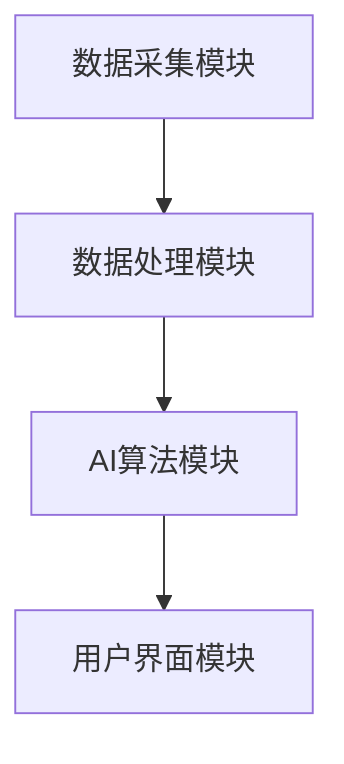

                 


# 智能窗台：AI Agent的室内植物生长监测

---

## 关键词：
智能窗台，AI Agent，室内植物生长，图像识别，传感器数据，系统架构，植物监测

---

## 摘要：
本文探讨了如何利用AI Agent技术实现室内植物生长的智能化监测。通过分析植物生长的关键因素，结合图像识别和传感器数据，构建了一个智能窗台系统，能够实时监测植物的生长状态，并通过AI算法优化监测效果。文章详细介绍了系统的架构设计、核心算法实现、项目实战案例以及优化建议，为实现高效的植物生长监测提供了理论和实践指导。

---

## 第一部分：背景与核心概念

### 第1章：智能窗台与AI Agent概述

#### 1.1 问题背景与需求分析
- **问题背景**：室内植物生长监测的需求日益增长，传统人工监测方法效率低下，难以满足大规模种植和精准管理的需求。
- **技术现状**：现有技术在数据采集、分析和反馈方面存在不足，无法实现智能化和自动化监测。
- **核心需求**：通过AI Agent技术实现对植物生长状态的实时监测、智能分析和自动反馈。

#### 1.2 核心概念与定义
- **AI Agent**：智能代理，能够感知环境、自主决策并执行任务的智能系统。
- **室内植物生长监测**：通过传感器和图像识别技术，实时采集植物生长数据并进行分析。
- **智能窗台系统**：集成AI Agent、图像识别和传感器技术的智能化植物监测系统。

#### 1.3 系统的核心要素与关系
- **核心要素**：
  - 植物：监测对象。
  - 传感器：数据采集设备。
  - 图像识别：图像数据处理技术。
  - AI算法：数据分析与决策核心。
  - 用户：系统操作者。
- **关系图**：
```mermaid
er
  actor: 用户
  system: 智能窗台系统
  plant: 植物
  sensor: 传感器
  database: 数据库
  rules: 监测规则
  notification: 通知
  actor --> system: 用户操作
  system --> sensor: 系统驱动传感器
  sensor --> database: 传感器数据存入数据库
  database --> rules: 数据与规则匹配
  rules --> notification: 触发通知
```

### 第2章：AI Agent的基本原理

#### 2.1 AI Agent的工作原理
- **信息感知**：通过传感器和图像识别技术采集植物生长数据。
- **数据分析**：利用机器学习算法对数据进行分析和分类。
- **决策执行**：根据分析结果生成反馈，驱动执行机构（如补光灯、浇水设备）。

#### 2.2 图像识别与植物特征提取
- **图像采集与预处理**：使用摄像头采集植物图像，进行去噪、增强等预处理。
- **特征提取**：利用卷积神经网络（CNN）提取植物的关键特征，如叶片形状、颜色变化。
- **分类识别**：通过训练好的模型对植物生长状态进行分类，如健康、枯萎、病虫害等。

#### 2.3 传感器数据融合
- **多源数据采集**：整合光照、温度、湿度、土壤pH值等多种传感器数据。
- **数据融合方法**：使用加权融合、主成分分析等方法，提升数据的准确性和可靠性。
- **生长状态评估**：基于融合后的数据，评估植物的生长健康状况。

### 第3章：系统架构与功能设计

#### 3.1 系统功能模块划分
- **数据采集模块**：负责采集图像和传感器数据。
- **数据处理模块**：对采集的数据进行预处理和特征提取。
- **AI算法模块**：利用机器学习算法对数据进行分类和分析。
- **用户界面模块**：提供直观的用户操作界面，显示监测结果和反馈信息。

#### 3.2 系统架构设计
- **分层架构**：系统分为数据采集层、数据处理层、AI算法层和用户界面层。
- **模块交互**：数据采集层将数据传递给数据处理层，处理后传递给AI算法层进行分析，最后通过用户界面层展示结果。
- **系统架构图**：


#### 3.3 系统接口设计
- **传感器接口**：与光照、温度等传感器连接，获取实时数据。
- **图像采集接口**：与摄像头连接，获取植物图像数据。
- **用户界面接口**：提供友好的操作界面，显示监测结果和反馈信息。

---

## 第二部分：系统实现与优化

### 第4章：项目实战

#### 4.1 环境搭建
- **硬件设备**：摄像头、光照传感器、温湿度传感器、土壤pH传感器等。
- **软件工具**：Python、OpenCV、TensorFlow、Flask等。
- **开发环境**：安装必要的库和工具，配置开发环境。

#### 4.2 核心代码实现
- **图像采集与预处理**：
  ```python
  import cv2
  def preprocess_image(image_path):
      img = cv2.imread(image_path)
      # 图像去噪处理
      img = cv2.fastNlMeansDenoise(img, h=10, templateWindowSize=5, searchWindowSize=21)
      return img
  ```
- **特征提取与分类**：
  ```python
  import tensorflow as tf
  model = tf.keras.models.load_model('plant_classifier.h5')
  def predict_health(image):
      processed_img = preprocess_image(image)
      prediction = model.predict(processed_img)
      return prediction.argmax(axis=1)[0]
  ```
- **传感器数据融合**：
  ```python
  import numpy as np
  def fuse_data(light, temp, humidity, soil_ph):
      # 加权融合
      weights = [0.4, 0.3, 0.2, 0.1]
      fused_value = np.dot([light, temp, humidity, soil_ph], weights)
      return fused_value
  ```

#### 4.3 案例分析与结果展示
- **案例分析**：通过实际案例展示系统在不同光照、温度条件下的监测结果。
- **结果展示**：通过图表和图像展示植物生长状态的变化和监测效果。

#### 4.4 项目总结
- **实现成果**：成功构建了一个智能化的室内植物生长监测系统。
- **经验总结**：传感器数据融合和图像识别算法的优化是系统实现的关键。

### 第5章：优化与维护

#### 5.1 系统优化
- **算法优化**：改进特征提取算法，提升分类准确率。
- **硬件优化**：选择更高精度的传感器，提升数据采集的准确性。
- **系统性能优化**：优化数据处理流程，提升系统的响应速度。

#### 5.2 常见问题与解决方案
- **传感器漂移问题**：定期校准传感器，确保数据的准确性。
- **图像识别误识别问题**：优化算法模型，增加训练数据量。

#### 5.3 系统维护与升级
- **定期维护**：定期检查系统硬件和软件，确保系统稳定运行。
- **版本升级**：根据用户反馈和实际需求，不断优化系统功能。

### 第6章：扩展与展望

#### 6.1 技术扩展
- **深度学习模型优化**：探索更先进的深度学习模型，如Transformer结构，提升图像识别的准确性。
- **多模态数据融合**：结合图像、文本等多种数据源，实现更全面的植物生长监测。

#### 6.2 应用场景扩展
- **家庭用户**：为家庭用户提供个性化的植物养护建议。
- **农业大棚**：在农业大棚中实现大规模植物监测和精准管理。

#### 6.3 对AI Agent技术的深入思考
- **智能决策优化**：AI Agent在植物监测中的应用前景广阔，未来可以通过强化学习实现更智能的决策。
- **可持续发展**：通过智能化监测，减少资源浪费，推动可持续农业的发展。

---

## 总结

通过本文的详细阐述，我们展示了如何利用AI Agent技术构建一个智能化的室内植物生长监测系统。从系统架构设计到核心算法实现，从项目实战到优化建议，为读者提供了全面的技术指导。未来，随着AI技术的不断发展，智能窗台系统将在更多领域发挥重要作用，为植物监测带来更多的创新和突破。

