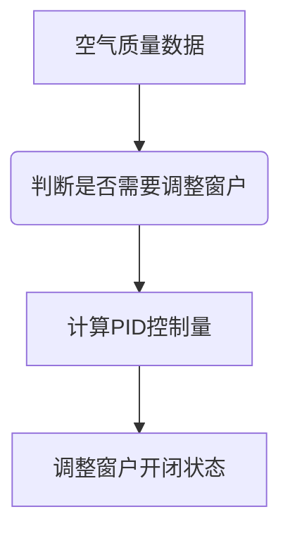
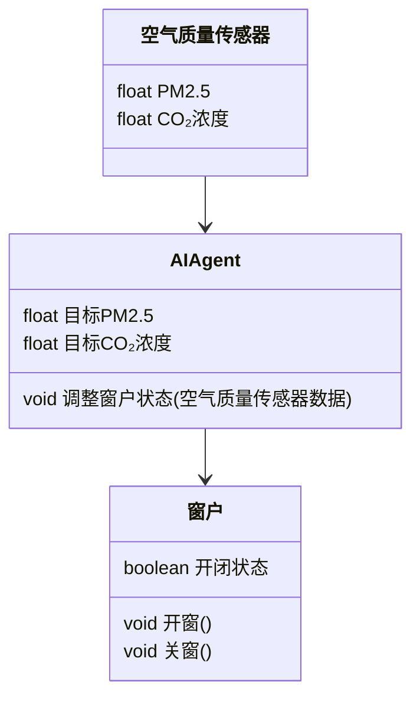
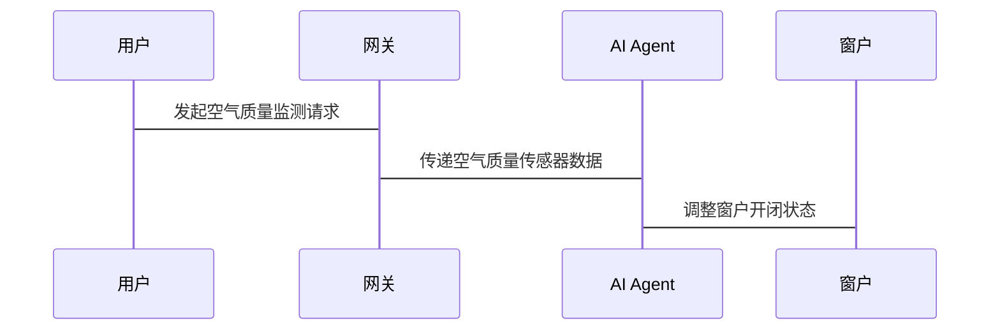

                 


# 智能窗台：AI Agent的室内空气净化

---

## 关键词：
智能窗台、AI Agent、室内空气净化、PID控制、环境监测

---

## 摘要：
本文将探讨如何通过AI Agent技术实现智能窗台的室内空气净化系统。通过分析室内空气污染的现状与挑战，结合AI Agent的核心算法与空气净化技术，提出一种基于PID控制的智能窗台设计方案。文章详细阐述了系统的架构设计、算法实现、项目实战以及最佳实践，为读者提供一个全面的解决方案。

---

# 第一部分：背景介绍

## 第1章：智能窗台的背景与问题背景

### 1.1 问题背景
#### 1.1.1 室内空气污染的现状与挑战
随着城市化进程的加快，室内空气质量问题日益严重。研究表明，室内空气污染物种类繁多，包括PM2.5、甲醛、CO₂等，这些污染物对人类健康造成严重威胁。传统空气净化设备虽然能够解决部分问题，但缺乏智能化和实时性。

#### 1.1.2 智能窗台的定义与目标
智能窗台是一种结合了AI技术的空气净化装置，通过实时监测室内空气质量，自动调整窗户的开闭状态，从而优化室内空气流通，达到净化空气的目的。其目标是实现智能化、自动化、高效的室内空气净化。

#### 1.1.3 AI Agent在智能窗台中的作用
AI Agent（智能代理）是一种能够感知环境并采取行动以实现目标的计算机系统。在智能窗台中，AI Agent负责实时监测室内空气质量数据，分析污染物浓度变化，并通过调整窗户的开闭状态来优化空气质量。

---

## 第2章：AI Agent与室内空气净化的核心概念

### 2.1 AI Agent的基本原理
#### 2.1.1 AI Agent的定义与特点
AI Agent是一种能够感知环境、自主决策并执行任务的智能系统。其特点包括：
- **自主性**：能够在没有人工干预的情况下独立运行。
- **反应性**：能够实时感知环境并做出反应。
- **目标导向性**：通过设定目标来优化行动。

#### 2.1.2 AI Agent的核心算法
AI Agent的核心算法包括：
- **机器学习算法**：用于模式识别和预测。
- **模糊逻辑算法**：用于处理不确定性问题。
- **PID控制算法**：用于实时调节系统参数。

#### 2.1.3 AI Agent与智能窗台的结合
在智能窗台中，AI Agent通过传感器获取室内空气质量数据（如PM2.5、CO₂浓度），并根据预设的阈值调整窗户的开闭状态，从而实现空气质量的优化。

---

### 2.2 室内空气净化的技术原理
#### 2.2.1 空气净化的基本原理
空气净化的基本原理包括：
- **过滤**：通过物理过滤去除空气中的颗粒物。
- **化学反应**：通过化学反应去除有害气体。
- **空气循环**：通过空气流动促进污染物的扩散和稀释。

#### 2.2.2 常见的空气净化技术
常见的空气净化技术包括：
- **HEPA过滤技术**：用于去除颗粒物。
- **光催化技术**：用于去除有害气体。
- **负离子技术**：用于改善空气质量。

#### 2.2.3 AI Agent在空气净化中的应用
AI Agent可以通过实时监测空气质量数据，优化空气净化设备的工作状态，从而提高净化效率和能效。

---

### 2.3 核心概念对比与联系
#### 2.3.1 AI Agent与传统控制系统的对比
| 对比维度 | AI Agent | 传统控制系统 |
|----------|----------|--------------|
| **自主性** | 高       | 低           |
| **适应性** | 高       | 低           |
| **决策能力** | 强       | 弱           |

#### 2.3.2 实体关系图（ER图）
```mermaid
er
  actor 用户 {
    role: 用户
    attribute: 用户ID, 用户名称
  }
  window 窗户 {
    role: 被控制
    attribute: 窗户ID, 窗户状态
  }
  air_quality 空气质量传感器 {
    role: 数据提供者
    attribute: PM2.5, CO₂浓度
  }
  ai_agent AI Agent {
    role: 控制者
    attribute: 状态, 策略
  }
  用户 --> ai_agent
  ai_agent --> 窗户
  air_quality --> ai_agent
```

---

## 第3章：算法原理讲解

### 3.1 PID控制算法
PID（比例-积分-微分）控制是一种常用的控制算法，适用于实时调节系统参数。其基本原理如下：

#### 3.1.1 算法流程


#### 3.1.2 算法实现
```python
class PIDController:
    def __init__(self, Kp, Ki, Kd, setpoint):
        self.Kp = Kp
        self.Ki = Ki
        self.Kd = Kd
        self.setpoint = setpoint
        self.error_sum = 0
        self.last_error = 0
        self.current_error = 0

    def calculate(self, current_value, dt):
        self.current_error = self.setpoint - current_value
        self.error_sum += self.current_error * dt
        d_error = (self.current_error - self.last_error) / dt
        output = self.Kp * self.current_error + self.Ki * self.error_sum + self.Kd * d_error
        return output

    def update_last_error(self):
        self.last_error = self.current_error
```

#### 3.1.3 数学模型
PID控制的数学模型如下：
$$
u(t) = K_p \cdot e(t) + K_i \cdot \int e(t) dt + K_d \cdot \frac{de(t)}{dt}
$$
其中：
- \( u(t) \) 是控制输出
- \( e(t) \) 是误差
- \( K_p \)、\( K_i \)、\( K_d \) 是比例、积分、微分系数

---

## 第4章：系统分析与架构设计

### 4.1 系统功能设计
#### 4.1.1 领域模型（Mermaid类图）


#### 4.1.2 系统架构设计（Mermaid架构图）


#### 4.1.3 系统接口设计
- **空气质量传感器接口**：提供PM2.5和CO₂浓度数据。
- **窗户控制接口**：提供开窗和关窗功能。

#### 4.1.4 系统交互设计（Mermaid序列图）


---

## 第5章：项目实战

### 5.1 环境安装
#### 5.1.1 硬件设备
- 空气质量传感器（如PM2.5传感器）
- 窗户电机控制器
- 微控制器（如Arduino或Raspberry Pi）

#### 5.1.2 软件环境
- Python编程环境
- 控制器驱动库

---

### 5.2 核心代码实现
#### 5.2.1 PID控制器实现
```python
# PIDController.py
class PIDController:
    def __init__(self, Kp, Ki, Kd, setpoint):
        self.Kp = Kp
        self.Ki = Ki
        self.Kd = Kd
        self.setpoint = setpoint
        self.error_sum = 0
        self.last_error = 0
        self.current_error = 0

    def calculate(self, current_value, dt):
        self.current_error = self.setpoint - current_value
        self.error_sum += self.current_error * dt
        d_error = (self.current_error - self.last_error) / dt
        output = self.Kp * self.current_error + self.Ki * self.error_sum + self.Kd * d_error
        return output

    def update_last_error(self):
        self.last_error = self.current_error
```

#### 5.2.2 系统主程序实现
```python
# main.py
from PIDController import PIDController
import time

def main():
    Kp = 1
    Ki = 0.5
    Kd = 0.1
    setpoint = 50  # 目标PM2.5浓度（单位：ug/m³）
    controller = PIDController(Kp, Ki, Kd, setpoint)
    while True:
        current_pm25 = get_pm25()  # 获取当前PM2.5浓度
        dt = 1  # 时间步长
        output = controller.calculate(current_pm25, dt)
        controller.update_last_error()
        if output > 0.5:
            open_window()  # 开窗
        else:
            close_window()  # 关窗
        time.sleep(1)

if __name__ == "__main__":
    main()
```

---

### 5.3 案例分析
假设当前PM2.5浓度为60，目标浓度为50。根据PID控制算法，计算输出值为：
$$
u(t) = 1 \cdot (50-60) + 0.5 \cdot \int (50-60) dt + 0.1 \cdot \frac{d(50-60)}{dt} = -1 + (-0.5) + 0 = -1.5
$$
由于输出为负数，系统将关闭窗户以减少PM2.5浓度。

---

## 第6章：最佳实践

### 6.1 小结
本文详细介绍了智能窗台的背景、核心概念、算法原理、系统架构设计以及项目实战。通过AI Agent和PID控制算法的结合，实现了一种高效的室内空气净化系统。

### 6.2 注意事项
- 硬件设备的选择需要考虑精度和稳定性。
- 算法参数需要根据实际环境进行调整。
- 系统运行时需要考虑能耗问题。

### 6.3 拓展阅读
- 《智能控制系统设计》
- 《AI在环境监测中的应用》

---

## 第7章：总结
通过本文的介绍，读者可以全面了解智能窗台的实现过程和关键技术。未来，随着AI技术的不断发展，智能窗台将在室内空气净化领域发挥更大的作用。

