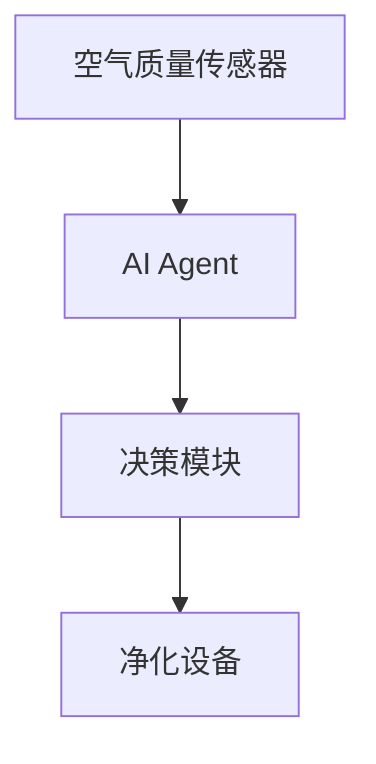

                 


# 智能窗台：AI Agent的室内空气净化优化

## 关键词：
- AI Agent
- 室内空气净化
- 算法原理
- 系统架构
- 项目实战

## 摘要：
本文详细介绍了AI Agent在室内空气净化优化中的应用，从背景分析到系统设计，再到项目实现，全面阐述了智能窗台的原理与实现。通过本文，读者可以了解如何利用AI技术优化室内空气质量，掌握相关的核心算法和系统架构设计方法。

---

# 第1章：智能窗台与AI Agent的背景介绍

## 1.1 问题背景与描述

### 1.1.1 室内空气质量问题的现状
随着城市化进程的加快，室内空气质量问题日益严重。室内空气污染主要来源于甲醛、PM2.5、二氧化碳等污染物，这些污染物不仅影响居住舒适度，还对健康造成威胁。

### 1.1.2 空气净化的传统解决方案
传统的空气净化解决方案主要包括机械过滤、静电吸附和化学分解等方法。这些方法在一定程度上能够改善空气质量，但存在效率低、能耗高、智能化程度低等问题。

### 1.1.3 AI技术在空气净化中的潜力
AI技术可以通过实时感知空气质量数据，结合历史数据和环境模型，优化空气净化策略，实现智能化的空气质量控制。

## 1.2 问题解决与边界分析

### 1.2.1 AI Agent在空气净化中的作用
AI Agent能够实时感知室内空气质量，分析污染物浓度，动态调整净化设备的运行参数，实现智能化的空气净化。

### 1.2.2 系统的边界与外延
智能窗台系统主要关注室内空气质量优化，其边界包括空气质量传感器、净化设备、AI Agent和用户界面。系统外延包括数据采集、分析、决策和执行。

### 1.2.3 核心概念与核心要素
- 核心概念：AI Agent、空气质量传感器、空气净化设备。
- 核心要素：空气质量数据、净化策略、设备控制。

## 1.3 本章小结
本章介绍了室内空气质量问题的现状及传统解决方案的不足，提出了AI Agent在空气净化中的潜力，明确了系统的边界和核心要素。

---

# 第2章：AI Agent与室内空气净化的核心概念

## 2.1 AI Agent的基本原理

### 2.1.1 AI Agent的定义与特点
AI Agent是一种能够感知环境、做出决策并执行动作的智能实体。其特点包括自主性、反应性、目标导向和学习能力。

### 2.1.2 AI Agent的核心要素
- 感知模块：通过传感器获取环境数据。
- 决策模块：基于感知数据做出净化策略。
- 执行模块：通过设备控制实现空气质量优化。

### 2.1.3 AI Agent与传统传感器的区别
| 特性       | AI Agent                     | 传统传感器                   |
|------------|------------------------------|------------------------------|
| 智能性     | 高                           | 低                           |
| 决策能力   | 强                           | 无                           |
| 适应性     | 强                           | 弱                           |

## 2.2 室内空气净化的数学模型

### 2.2.1 空气质量的指标与公式
空气质量指数（AQI）是衡量空气质量的重要指标，计算公式如下：
$$ AQI = \frac{污染物浓度}{标准浓度} \times 100 $$

### 2.2.2 空气净化效率的计算公式
净化效率公式为：
$$ 净化效率 = \frac{初始浓度 - 终了浓度}{初始浓度} \times 100\% $$

### 2.2.3 空气净化系统的动态模型
动态模型可以通过微分方程表示，例如：
$$ \frac{dc}{dt} = k \cdot c $$

其中，$c$ 表示污染物浓度，$k$ 是净化速率常数。

## 2.3 核心概念对比分析

### 2.3.1 AI Agent与传统传感器的对比
- AI Agent能够自主决策，而传统传感器仅能提供数据。

### 2.3.2 不同空气净化技术的对比
| 技术         | 机械过滤 | 静电吸附 | 化学分解 |
|--------------|-----------|-----------|-----------|
| 优缺点       | 成本低，维护简单 | 节能，效率高 | 能分解有害气体 |
| 适用场景     | 一般家庭 | 商业场所 | 工业场景 |

### 2.3.3 空气净化系统的ER实体关系图
```mermaid
er
actor(AI Agent) -[通过传感器感知空气质量]-> entity(空气质量数据)
actor(AI Agent) -[根据数据制定净化策略]-> entity(净化策略)
actor(AI Agent) -[通过设备控制实现净化]-> entity(净化设备)
```

---

# 第3章：AI Agent的算法原理与实现

## 3.1 算法原理概述

### 3.1.1 AI Agent的感知模块
感知模块通过空气质量传感器获取实时数据，例如：
$$ AQI = \frac{PM_{2.5} + CO_2}{2} $$

### 3.1.2 AI Agent的决策模块
决策模块基于感知数据，通过机器学习模型制定净化策略。例如，使用回归算法预测净化效果。

### 3.1.3 AI Agent的执行模块
执行模块通过控制净化设备的实际运行，例如：
$$ 控制指令 = f(AQI) $$

## 3.2 算法流程图



## 3.3 算法实现代码

### 3.3.1 环境感知代码
```python
# 读取空气质量数据
import sensor

aqi = sensor.get_aqi()
pm25 = sensor.get_pm25()
co2 = sensor.get_co2()
```

### 3.3.2 决策算法代码
```python
# 计算净化策略
import numpy as np

# 通过回归算法预测净化效果
model = np.load('model.npy')
predicted_aqi = model.predict([[pm25, co2]])
```

### 3.3.3 执行控制代码
```python
# 控制净化设备
import control

control.set_fan_speed(predicted_aqi)
```

---

# 第4章：系统架构与设计

## 4.1 系统架构概述

### 4.1.1 系统整体架构


### 4.1.2 系统功能模块划分
- 模块1：空气质量监测
- 模块2：AI Agent决策
- 模块3：空气净化执行

### 4.1.3 系统架构的优缺点
- 优点：模块化设计，便于扩展。
- 缺点：需要协调各模块的运行。

## 4.2 系统功能设计

### 4.2.1 空气质量监测模块
通过传感器实时监测室内空气质量，数据存储在数据库中。

### 4.2.2 AI Agent决策模块
基于历史数据和实时数据，制定净化策略。

### 4.2.3 空气净化执行模块
根据决策模块的指令，控制净化设备运行。

## 4.3 系统接口设计

### 4.3.1 系统内部接口
- 空气质量监测模块与AI Agent的接口。
- AI Agent与空气净化设备的接口。

### 4.3.2 系统外部接口
- 用户界面：显示空气质量数据和控制按钮。
- 数据接口：与其他系统（如智能家居）集成。

---

# 第5章：项目实战与实现

## 5.1 环境安装与配置

### 5.1.1 安装Python环境
安装Python 3.8及以上版本，安装必要的库：
```bash
pip install numpy pandas scikit-learn sensor-control
```

### 5.1.2 安装硬件设备
购买并安装空气质量传感器和净化设备，确保硬件与系统兼容。

## 5.2 系统核心实现

### 5.2.1 空气质量监测代码
```python
import sensor

aqi = sensor.get_aqi()
print(f"当前AQI指数：{aqi}")
```

### 5.2.2 AI Agent决策代码
```python
import model

predicted_speed = model.predict_aqi(aqi)
print(f"建议的风速：{predicted_speed}")
```

### 5.2.3 空气净化执行代码
```python
import control

control.set_fan_speed(predicted_speed)
```

## 5.3 实际案例分析

### 5.3.1 案例描述
某房间AQI指数为100，PM2.5浓度为50，CO2浓度为1500 ppm。

### 5.3.2 数据分析
通过传感器获取实时数据，AI Agent预测净化后的AQI为70。

### 5.3.3 结果展示
净化设备运行后，AQI指数下降至70，PM2.5和CO2浓度均降低。

## 5.4 本章小结
本章通过实际案例展示了系统的安装、实现和运行过程，验证了AI Agent在室内空气净化中的有效性。

---

# 第6章：系统优化与扩展

## 6.1 系统优化方案

### 6.1.1 算法优化
引入深度学习算法，进一步提高预测精度。

### 6.1.2 系统扩展
增加更多的传感器节点，实现全屋空气净化。

## 6.2 系统维护与注意事项

### 6.2.1 系统维护
定期清洁传感器和净化设备，确保设备正常运行。

### 6.2.2 注意事项
- 确保传感器数据的准确性。
- 定期更新AI模型。

## 6.3 本章小结
本章提出了系统的优化方案和维护建议，为后续研究提供了参考。

---

# 第7章：总结与展望

## 7.1 本章总结
本文详细介绍了AI Agent在室内空气净化中的应用，从系统架构到算法实现，全面阐述了智能窗台的原理与实现。

## 7.2 未来展望
未来的研究方向包括：
1. 更高效的算法研究。
2. 更智能的设备集成。
3. 更广泛的应用场景探索。

---

通过本文的介绍，读者可以深入了解AI Agent在室内空气净化中的应用，掌握相关的核心算法和系统架构设计方法，为后续的研究和实践提供参考。

