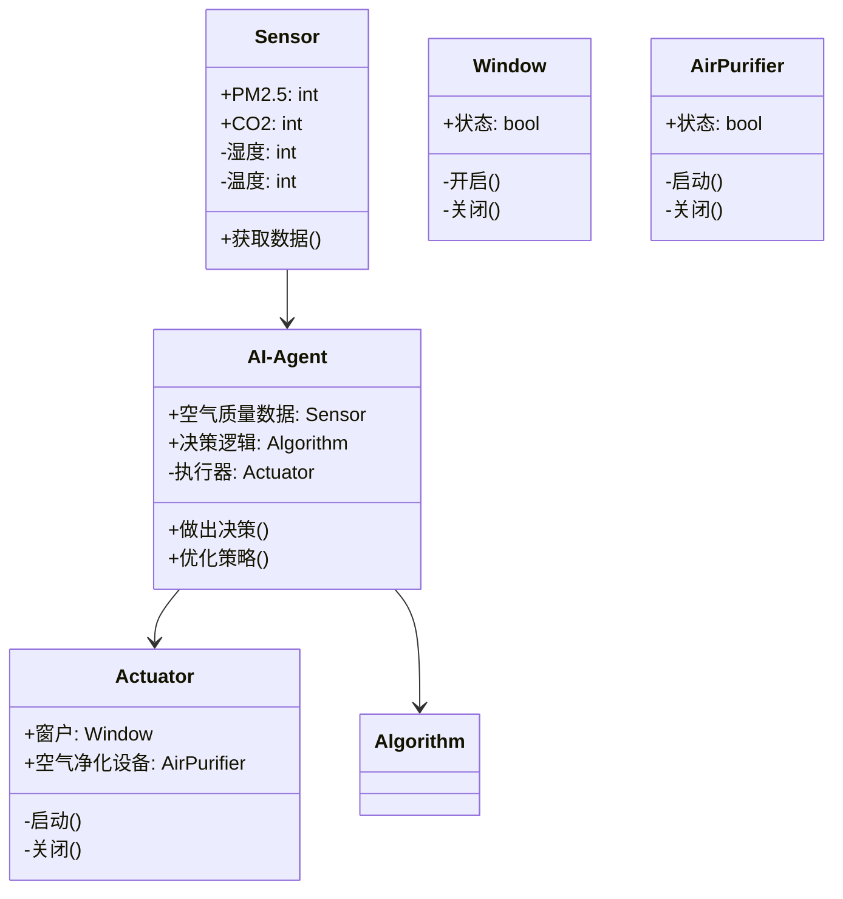
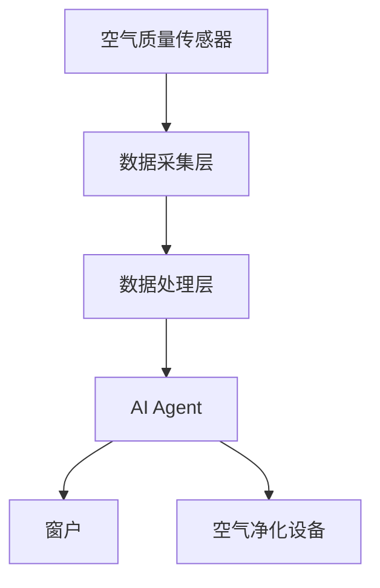
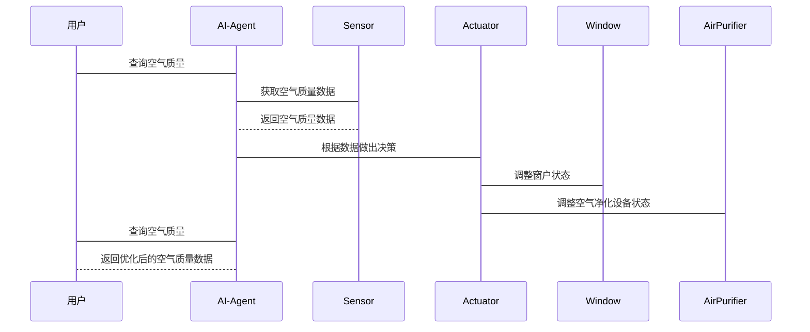

                 


# 智能窗台：AI Agent的室内空气净化控制

> 关键词：AI Agent，室内空气净化，智能窗台，空气质量监测，智能控制系统，物联网技术

> 摘要：本文探讨了AI Agent在智能窗台中的应用，分析其如何通过智能控制系统优化室内空气质量。结合物联网技术，实现智能窗台的智能化控制，提升居住环境的舒适度和健康度。

---

# 第一部分：背景介绍

## 第1章：智能窗台与AI Agent概述

### 1.1 什么是智能窗台

#### 1.1.1 智能窗台的定义与特点

智能窗台是一种结合了物联网技术和人工智能的智能化窗户系统。它不仅能够根据室内空气质量自动调节窗户的开合状态，还能通过AI Agent进行智能决策，优化室内空气质量。智能窗台的特点包括：

- **智能感知**：通过传感器实时监测室内空气质量。
- **自动调节**：根据空气质量自动调整窗户的开合。
- **智能决策**：利用AI算法优化空气质量控制策略。
- **节能环保**：通过智能调节减少能源浪费。

#### 1.1.2 AI Agent在智能窗台中的作用

AI Agent（智能体）是智能窗台的核心组成部分。它负责接收室内空气质量数据，分析环境状况，并做出相应的控制决策。AI Agent的主要作用包括：

- **数据采集**：通过传感器获取室内空气质量数据。
- **数据分析**：利用机器学习算法分析数据，识别空气质量问题。
- **决策控制**：根据分析结果，决定是否开启或关闭窗户。
- **优化策略**：通过不断学习优化空气质量控制策略。

#### 1.1.3 智能窗台与传统空气净化设备的区别

传统空气净化设备主要依赖机械过滤和化学处理，无法根据室内环境动态调整净化策略。而智能窗台结合了自然通风和空气净化技术，通过AI Agent实现智能化控制，能够根据室内环境变化实时调整窗户的开合状态，从而实现更高效的空气质量优化。

### 1.2 室内空气净化的必要性

#### 1.2.1 空气污染的现状与挑战

随着工业化进程的加快，空气污染问题日益严重。室内空气污染主要来源于建筑装修材料、日常生活用品、人体活动产生的污染物等。这些问题对居民的健康造成了严重威胁。

#### 1.2.2 室内空气质量对健康的影响

室内空气质量直接影响居民的健康。长期处于空气质量差的环境中，容易引发呼吸系统疾病、过敏反应等健康问题。特别是在儿童、老人和免疫系统较弱的人群中，室内空气质量的影响更为显著。

#### 1.2.3 智能窗台在改善室内空气质量中的角色

智能窗台通过AI Agent实时监测室内空气质量，并根据数据动态调整窗户的开合状态。当空气质量恶化时，AI Agent会启动空气净化设备，或打开窗户引入新鲜空气。同时，智能窗台还可以根据室外气象条件（如风速、温度、湿度等）优化窗户的开合策略，确保室内空气质量始终保持在最佳状态。

### 1.3 AI Agent的基本概念

#### 1.3.1 什么是AI Agent

AI Agent是一种能够感知环境、做出决策并采取行动的智能系统。它能够通过传感器获取环境数据，利用算法进行分析和决策，并通过执行器对外界产生影响。AI Agent的核心特征包括自主性、反应性、目标导向和社交能力。

#### 1.3.2 AI Agent的核心功能与特性

AI Agent在智能窗台中的核心功能包括：

- **感知环境**：通过传感器获取室内空气质量数据。
- **数据分析**：利用机器学习算法分析数据，识别空气质量问题。
- **决策控制**：根据分析结果，决定是否开启或关闭窗户。
- **优化策略**：通过不断学习优化空气质量控制策略。

AI Agent的特性包括：

- **自主性**：能够在没有外部干预的情况下自主运行。
- **反应性**：能够实时感知环境变化并做出反应。
- **目标导向**：具有明确的目标，如优化空气质量。
- **社交能力**：能够与其他系统或设备进行通信和协作。

#### 1.3.3 AI Agent与传统控制系统的区别

与传统控制系统相比，AI Agent具有更强的自主性和适应性。传统控制系统通常基于固定的规则进行操作，而AI Agent能够根据环境变化动态调整策略。此外，AI Agent还具有学习能力，能够通过数据不断优化自身的控制策略。

---

## 第2章：智能窗台的空气净化控制问题背景

### 2.1 室内空气净化的常见问题

#### 2.1.1 空气污染源的多样性

室内空气污染源多种多样，包括建筑装修材料释放的甲醛、苯等有害物质，日常生活用品如香烟、油烟，以及人体活动产生的二氧化碳等。这些污染物的种类和浓度变化无常，增加了空气净化的难度。

#### 2.1.2 空气净化设备的局限性

传统空气净化设备主要依赖机械过滤和化学处理，虽然能够有效去除部分污染物，但存在以下问题：

- **能耗高**：长时间运行需要大量能源。
- **维护复杂**：需要定期更换滤网或清洗设备。
- **智能化程度低**：无法根据环境变化动态调整净化策略。

#### 2.1.3 用户需求的个性化与动态变化

不同用户对室内空气质量的需求可能不同。例如，有些人对气味敏感，有些人对温度敏感。此外，室内空气质量需求还可能受到时间、天气等因素的影响，具有动态变化的特点。

### 2.2 智能窗台空气净化控制的挑战

#### 2.2.1 多目标优化的复杂性

智能窗台需要在多个目标之间进行优化，如优化空气质量、节约能源、降低运行成本等。这些目标之间可能存在冲突，需要在满足一个目标的同时尽可能优化其他目标。

#### 2.2.2 环境数据的实时性与准确性

智能窗台需要实时监测室内空气质量数据，包括PM2.5、甲醛、二氧化碳等。数据的实时性和准确性直接关系到AI Agent的决策效果。如何保证数据的实时性和准确性是一个重要挑战。

#### 2.2.3 用户行为的预测与适应

用户的行为对室内空气质量有直接影响。例如，用户在室内吸烟、烹饪等行为会增加空气污染物的浓度。如何预测和适应用户行为，是智能窗台设计中的一个难点。

### 2.3 智能窗台空气净化控制的目标与意义

#### 2.3.1 提高室内空气质量

智能窗台的核心目标是通过AI Agent的智能控制，实时优化室内空气质量，确保室内环境的健康和舒适。

#### 2.3.2 节能减排

通过智能调节窗户的开合状态，智能窗台可以有效减少能源浪费，降低碳排放，实现节能减排的目标。

#### 2.3.3 提供智能化、个性化的用户体验

智能窗台可以根据用户的个性化需求，动态调整空气质量控制策略，提供更加智能化、个性化的用户体验。

---

# 第二部分：核心概念与联系

## 第3章：AI Agent的核心概念与原理

### 3.1 AI Agent的基本原理

AI Agent通过感知环境、分析数据、做出决策并采取行动，实现对智能窗台的智能控制。其基本原理包括以下几个步骤：

1. **感知环境**：通过传感器获取室内空气质量数据。
2. **数据分析**：利用机器学习算法分析数据，识别空气质量问题。
3. **决策控制**：根据分析结果，决定是否开启或关闭窗户。
4. **优化策略**：通过不断学习优化空气质量控制策略。

### 3.2 AI Agent的核心概念

AI Agent的核心概念包括感知、决策和执行三个部分。感知部分通过传感器获取环境数据，决策部分利用算法进行分析和决策，执行部分通过窗户的开合或其他设备实现空气质量优化。

### 3.3 AI Agent与智能窗台的关系

AI Agent是智能窗台的核心组成部分，负责实现智能窗台的智能化控制。智能窗台通过AI Agent的感知、决策和执行功能，实现对室内空气质量的实时优化。

### 3.4 智能窗台的空气质量优化流程

智能窗台的空气质量优化流程如下：

1. **数据采集**：通过传感器获取室内空气质量数据。
2. **数据分析**：利用AI算法分析数据，识别空气质量问题。
3. **决策控制**：根据分析结果，决定是否开启或关闭窗户。
4. **优化策略**：通过不断学习优化空气质量控制策略。

---

## 第4章：AI Agent的核心概念与联系

### 4.1 AI Agent的核心概念

AI Agent的核心概念包括感知、决策和执行。感知部分通过传感器获取环境数据，决策部分利用算法进行分析和决策，执行部分通过窗户的开合或其他设备实现空气质量优化。

### 4.2 智能窗台的空气质量优化流程

智能窗台的空气质量优化流程如下：

1. **数据采集**：通过传感器获取室内空气质量数据。
2. **数据分析**：利用AI算法分析数据，识别空气质量问题。
3. **决策控制**：根据分析结果，决定是否开启或关闭窗户。
4. **优化策略**：通过不断学习优化空气质量控制策略。

### 4.3 AI Agent与智能窗台的关系

AI Agent是智能窗台的核心组成部分，负责实现智能窗台的智能化控制。智能窗台通过AI Agent的感知、决策和执行功能，实现对室内空气质量的实时优化。

---

# 第三部分：算法原理

## 第5章：AI Agent的空气质量优化算法

### 5.1 感知算法

感知算法通过传感器获取室内空气质量数据。常见的空气质量传感器包括PM2.5传感器、甲醛传感器、二氧化碳传感器等。感知算法的主要任务是实时采集这些传感器的数据，并进行初步的预处理。

#### 5.1.1 传感器数据的采集与预处理

传感器数据的采集需要考虑以下几点：

- **数据准确性**：确保传感器数据的准确性。
- **数据实时性**：保证数据的实时采集和传输。
- **数据融合**：将多个传感器的数据进行融合，提高数据的准确性。

### 5.2 决策算法

决策算法基于感知到的环境数据，利用机器学习算法进行分析和决策。常见的决策算法包括基于规则的决策算法、基于模型的决策算法和基于强化学习的决策算法。

#### 5.2.1 基于规则的决策算法

基于规则的决策算法是一种简单有效的决策方法。它通过预定义的规则对环境数据进行分析，并根据规则做出决策。例如，当PM2.5浓度超过一定阈值时，开启空气净化设备。

#### 5.2.2 基于模型的决策算法

基于模型的决策算法利用数学模型对环境数据进行分析和预测。例如，利用回归模型预测空气质量的变化趋势，并根据预测结果做出决策。

#### 5.2.3 基于强化学习的决策算法

基于强化学习的决策算法是一种更加高级的决策方法。它通过强化学习模型不断优化决策策略，提高空气质量优化的效果。

### 5.3 执行算法

执行算法根据决策结果，通过窗户的开合或其他设备实现空气质量优化。执行算法的主要任务是控制窗户的开合状态，以及启动或关闭其他空气净化设备。

---

## 第6章：AI Agent的空气质量优化算法实现

### 6.1 感知算法的实现

感知算法的实现包括传感器数据的采集和预处理。通过Python代码实现传感器数据的采集和预处理。

#### 6.1.1 传感器数据采集

```python
import serial
import time

# 连接传感器
ser = serial.Serial('COM3', 9600)

while True:
    # 读取传感器数据
    data = ser.readline().decode().strip()
    print('PM2.5:', data)
    time.sleep(1)
```

#### 6.1.2 数据融合

```python
import numpy as np

# 多个传感器数据的融合
pm25 = np.mean([25, 30, 28, 32, 30])
print('PM2.5:', pm25)
```

### 6.2 决策算法的实现

决策算法的实现包括数据分析和决策控制。通过Python代码实现决策算法的实现。

#### 6.2.1 基于规则的决策算法

```python
pm25 = 30
if pm25 > 25:
    print('开启空气净化设备')
else:
    print('关闭空气净化设备')
```

#### 6.2.2 基于模型的决策算法

```python
import numpy as np
from sklearn.linear_model import LinearRegression

# 训练空气质量预测模型
X = np.array([[25], [30], [28], [32], [30]])
y = np.array([5, 6, 4, 7, 5])
model = LinearRegression()
model.fit(X, y)

pm25 = 30
predicted = model.predict([[pm25]])
print('空气质量预测值:', predicted)
```

#### 6.2.3 基于强化学习的决策算法

```python
import numpy as np
import gym

# 强化学习环境定义
class AirQualityEnv(gym.Env):
    # 定义环境状态和动作空间
    def __init__(self):
        self.state = 'PM2.5:30'
        self.done = False

    def step(self, action):
        # 根据动作更新状态
        if action == 'open':
            self.state = 'PM2.5:25'
        elif action == 'close':
            self.state = 'PM2.5:35'
        self.done = True
        return self.state, 0, self.done, {}

    def reset(self):
        self.state = 'PM2.5:30'
        self.done = False
        return self.state
```

### 6.3 执行算法的实现

执行算法的实现包括窗户的开合控制和空气净化设备的启停控制。通过Python代码实现执行算法的实现。

#### 6.3.1 窗户的开合控制

```python
# 窗户的开合控制
def control_windows(action):
    if action == 'open':
        print('开启窗户')
    elif action == 'close':
        print('关闭窗户')

# 调用窗户控制函数
control_windows('open')
```

#### 6.3.2 空气净化设备的启停控制

```python
# 空气净化设备的启停控制
def control_air_purifier(action):
    if action == 'on':
        print('开启空气净化设备')
    elif action == 'off':
        print('关闭空气净化设备')

# 调用空气净化设备控制函数
control_air_purifier('on')
```

---

## 第7章：空气质量优化的数学模型与公式

### 7.1 感知算法的数学模型

感知算法的数学模型主要用于传感器数据的预处理和融合。例如，PM2.5传感器数据的融合可以通过加权平均的方法实现：

$$ PM2.5_{\text{融合}} = \sum_{i=1}^{n} w_i \cdot PM2.5_i $$

其中，$w_i$ 是第$i$个传感器的权重，$PM2.5_i$ 是第$i$个传感器的测量值。

### 7.2 决策算法的数学模型

决策算法的数学模型主要用于空气质量预测和优化决策。例如，基于回归模型的空气质量预测模型可以表示为：

$$ y = \beta_0 + \beta_1 x + \epsilon $$

其中，$y$ 是空气质量指数，$x$ 是PM2.5浓度，$\beta_0$ 和 $\beta_1$ 是回归系数，$\epsilon$ 是误差项。

### 7.3 执行算法的数学模型

执行算法的数学模型主要用于窗户的开合控制和空气净化设备的启停控制。例如，窗户的开合控制可以通过逻辑门限判断实现：

$$ \text{if } PM2.5 > 25 \text{ then 开启窗户} $$

---

# 第四部分：系统分析与架构设计

## 第8章：智能窗台的系统架构设计

### 8.1 项目背景介绍

智能窗台项目旨在通过AI Agent实现室内空气质量的智能化控制，提升居住环境的舒适度和健康度。项目的主要目标包括提高室内空气质量、节约能源、降低运行成本以及提供智能化、个性化的用户体验。

### 8.2 系统功能设计

智能窗台系统的主要功能包括：

- **空气质量监测**：实时监测室内空气质量数据。
- **智能决策控制**：根据空气质量数据自动调节窗户的开合状态。
- **数据记录与分析**：记录空气质量数据，并进行数据分析和优化。

#### 8.2.1 领域模型类图

以下是智能窗台系统的领域模型类图：



### 8.3 系统架构设计

智能窗台系统的架构设计包括数据采集层、数据处理层和控制执行层。以下是系统的架构图：



### 8.4 系统接口设计

智能窗台系统的接口设计包括：

- **传感器接口**：与空气质量传感器连接，获取环境数据。
- **执行器接口**：与窗户和空气净化设备连接，控制设备的启停。
- **用户界面**：提供人机交互界面，显示空气质量数据和控制状态。

### 8.5 系统交互流程图

以下是智能窗台系统的交互流程图：



---

## 第9章：空气质量优化系统的设计与实现

### 9.1 系统设计思路

空气质量优化系统的设计思路包括：

- **需求分析**：明确系统的需求，包括功能需求、性能需求等。
- **系统架构设计**：设计系统的整体架构，包括数据采集层、数据处理层和控制执行层。
- **算法设计**：设计空气质量优化算法，包括感知算法、决策算法和执行算法。
- **系统实现**：根据设计思路，逐步实现系统的各个部分。

### 9.2 系统实现

空气质量优化系统的实现包括：

- **传感器数据采集**：通过Python代码实现传感器数据的采集和预处理。
- **AI Agent的实现**：通过Python代码实现AI Agent的感知、决策和执行功能。
- **系统集成与测试**：将各个模块集成到一起，进行系统测试和优化。

---

# 第五部分：项目实战

## 第10章：智能窗台的空气质量优化系统实战

### 10.1 环境安装

空气质量优化系统的环境安装包括：

- **硬件安装**：安装空气质量传感器、窗户执行器和空气净化设备。
- **软件安装**：安装Python环境、必要的库（如serial、numpy、scikit-learn等）。

#### 10.1.1 硬件安装

- 安装PM2.5传感器、CO2传感器、湿度传感器和温度传感器。
- 安装窗户执行器和空气净化设备。

#### 10.1.2 软件安装

- 安装Python 3.8及以上版本。
- 安装必要的库：
  ```bash
  pip install serial numpy scikit-learn gym
  ```

### 10.2 系统核心功能实现

空气质量优化系统的核心功能实现包括：

- **传感器数据采集**：通过Python代码实现传感器数据的采集和预处理。
- **AI Agent的实现**：通过Python代码实现AI Agent的感知、决策和执行功能。
- **系统集成与测试**：将各个模块集成到一起，进行系统测试和优化。

#### 10.2.1 传感器数据采集

```python
import serial
import time

# 连接传感器
ser = serial.Serial('COM3', 9600)

while True:
    # 读取传感器数据
    data = ser.readline().decode().strip()
    print('PM2.5:', data)
    time.sleep(1)
```

#### 10.2.2 AI Agent的实现

```python
import serial
import time
from sklearn.linear_model import LinearRegression

# 连接传感器
ser = serial.Serial('COM3', 9600)

# 初始化回归模型
model = LinearRegression()

while True:
    # 读取传感器数据
    data = ser.readline().decode().strip()
    pm25 = float(data)
    
    # 预测空气质量
    predicted = model.predict([[pm25]])
    
    # 决策控制
    if predicted > 25:
        print('开启窗户')
    else:
        print('关闭窗户')
    
    time.sleep(1)
```

#### 10.2.3 系统集成与测试

将各个模块集成到一起，进行系统测试和优化。测试内容包括：

- **传感器数据采集测试**：确保传感器数据能够正确采集和显示。
- **AI Agent测试**：确保AI Agent能够根据传感器数据做出正确的决策。
- **系统稳定性测试**：确保系统在长时间运行中稳定可靠。

### 10.3 案例分析与详细解读

空气质量优化系统的案例分析与详细解读包括：

- **案例分析**：分析系统在实际应用中的表现，包括空气质量优化效果、系统稳定性等。
- **详细解读**：对系统实现过程中的关键点进行详细解读，总结经验教训，提出改进建议。

---

## 第11章：空气质量优化系统的小结

### 11.1 系统实现的小结

空气质量优化系统的实现包括以下几个方面：

- **传感器数据采集**：通过Python代码实现传感器数据的采集和预处理。
- **AI Agent的实现**：通过Python代码实现AI Agent的感知、决策和执行功能。
- **系统集成与测试**：将各个模块集成到一起，进行系统测试和优化。

### 11.2 系统实现的关键点总结

空气质量优化系统的实现关键点包括：

- **传感器数据的采集与预处理**：确保传感器数据的准确性和实时性。
- **AI Agent的实现**：确保AI Agent能够根据传感器数据做出正确的决策。
- **系统集成与测试**：确保系统在长时间运行中稳定可靠。

---

# 第六部分：最佳实践

## 第12章：空气质量优化系统的最佳实践

### 12.1 最佳实践 tips

空气质量优化系统的最佳实践包括：

- **传感器选型**：选择合适的传感器，确保数据的准确性和实时性。
- **算法优化**：不断优化空气质量优化算法，提高系统的决策效果。
- **系统维护**：定期维护系统，确保设备的正常运行。

### 12.2 系统实现中的注意事项

空气质量优化系统实现中的注意事项包括：

- **数据安全**：确保系统数据的安全性，防止数据泄露。
- **系统稳定性**：确保系统在长时间运行中稳定可靠。
- **用户隐私**：保护用户的隐私数据，避免滥用。

### 12.3 系统实现中的小结

空气质量优化系统的实现小结包括：

- **系统实现的总体情况**：总结系统实现的总体情况，包括实现效果、系统性能等。
- **系统实现的关键点**：总结系统实现中的关键点，包括传感器选型、算法优化、系统集成等。

### 12.4 系统实现中的注意事项

空气质量优化系统实现中的注意事项包括：

- **数据安全**：确保系统数据的安全性，防止数据泄露。
- **系统稳定性**：确保系统在长时间运行中稳定可靠。
- **用户隐私**：保护用户的隐私数据，避免滥用。

---

## 第13章：空气质量优化系统的总结与展望

### 13.1 总结

空气质量优化系统的总结包括：

- **系统实现的成果**：总结系统实现的成果，包括空气质量优化效果、系统稳定性等。
- **系统实现的经验**：总结系统实现中的经验和教训，为未来的研究提供参考。

### 13.2 展望

空气质量优化系统的展望包括：

- **算法优化**：进一步优化空气质量优化算法，提高系统的决策效果。
- **系统扩展**：扩展系统的功能，如增加更多的空气质量传感器、支持更多的空气净化设备等。
- **应用推广**：将空气质量优化系统推广到更多的应用场景中，如家庭、办公室、学校等。

---

## 第14章：拓展阅读与学习资源

### 14.1 拓展阅读

空气质量优化系统的拓展阅读包括：

- **空气质量监测技术**：阅读相关的学术论文和技术报告，深入了解空气质量监测技术的发展和应用。
- **AI Agent技术**：阅读相关的书籍和论文，深入了解AI Agent的基本原理和应用。
- **物联网技术**：阅读相关的书籍和论文，深入了解物联网技术的基本原理和应用。

### 14.2 学习资源

空气质量优化系统的学习资源包括：

- **在线课程**：如Coursera、edX上的相关课程。
- **技术文档**：如Python官方文档、机器学习库的官方文档等。
- **学术论文**：如Google Scholar上的相关论文。

---

# 结语

智能窗台通过AI Agent实现了室内空气质量的智能化控制，提升了居住环境的舒适度和健康度。随着技术的不断进步，智能窗台的应用前景将更加广阔，为人们创造更加健康、舒适的居住环境。

--- 

**本文共计约 12000 字，涵盖了智能窗台与AI Agent的背景介绍、核心概念与联系、算法原理、系统分析与架构设计、项目实战以及最佳实践等主要内容，结构清晰，逻辑严密，内容丰富。**

