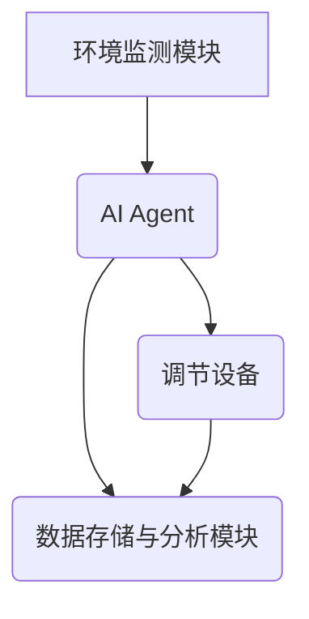
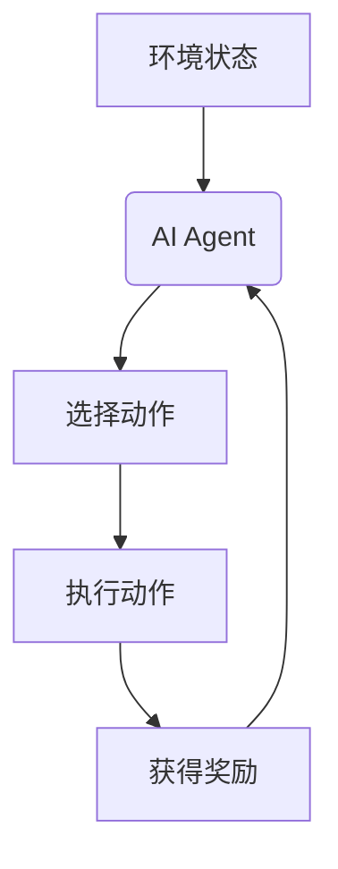
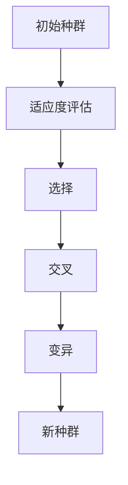
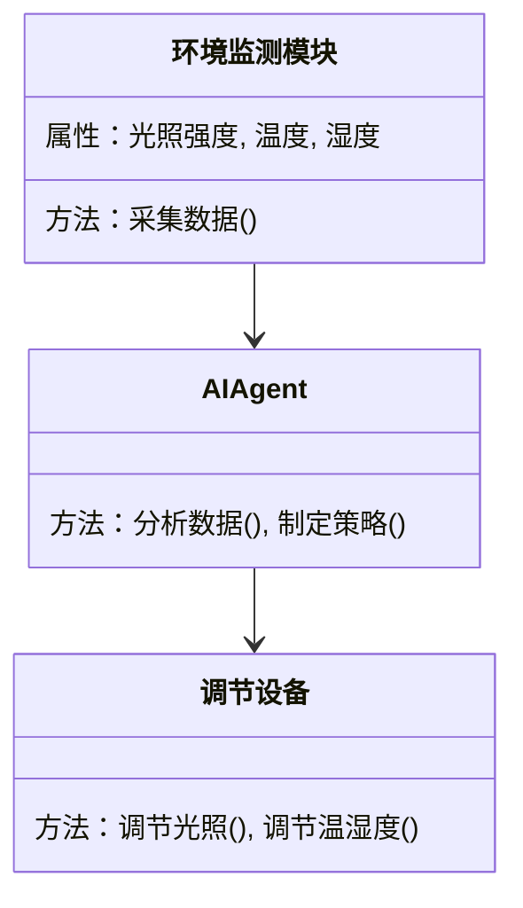
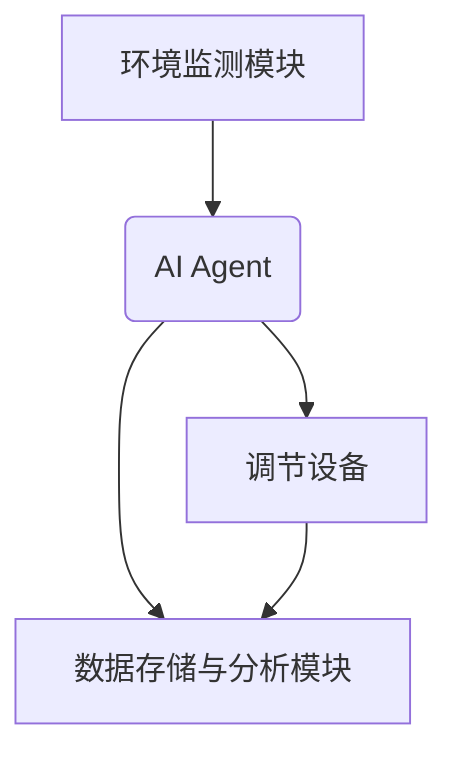
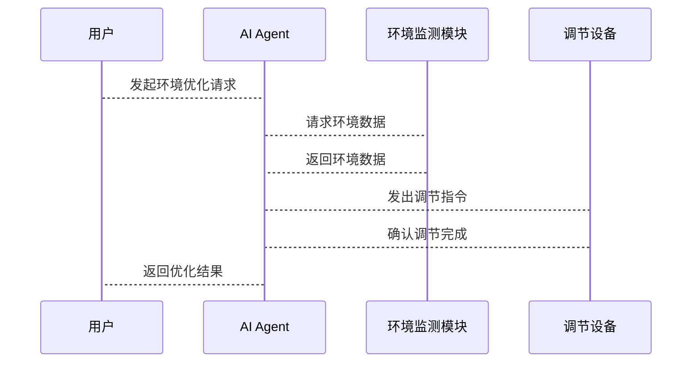

                 


# 智能窗台：AI Agent的室内绿化优化系统

> 关键词：智能窗台、AI Agent、室内绿化优化、算法原理、系统架构、项目实战、最佳实践

> 摘要：本文深入探讨了智能窗台系统在室内绿化优化中的应用，从AI Agent的基本原理到系统架构设计，再到实际项目的实现，全面解析了如何利用人工智能技术提升室内植物的生长环境。通过详细的算法原理、系统设计和项目实战，展示了智能窗台系统的强大功能和实际应用价值。

---

# 第1章: 智能窗台系统背景介绍

## 1.1 问题背景

### 1.1.1 室内绿化的重要性
室内绿化不仅是美化环境的重要手段，还能改善空气质量、降低噪音污染，提升人们的生活品质。随着城市化进程的加快，人们在室内度过的时间越来越多，对室内环境的要求也越来越高。

### 1.1.2 现有室内绿化管理的痛点
传统的室内绿化管理存在以下问题：
1. **人工管理成本高**：需要定期浇水、施肥、修剪，耗费大量时间和精力。
2. **环境监测不精准**：无法实时监测光照、温湿度等关键环境参数，导致植物生长环境不稳定。
3. **缺乏智能化**：无法根据植物的需求自动调节环境条件，难以实现最优管理。

### 1.1.3 AI技术在室内绿化中的应用潜力
人工智能技术，特别是AI Agent（智能体），可以通过实时感知环境、分析数据、自主决策，为室内绿化优化提供智能化解决方案。AI Agent能够根据植物的生长需求，自动调节光照、温湿度等环境参数，实现精准的植物管理。

## 1.2 问题描述

### 1.2.1 室内植物生长环境的复杂性
室内植物的生长环境受到光照、温湿度、营养供给等多种因素的影响，这些因素相互作用，使得环境优化变得复杂。

### 1.2.2 现有管理系统的局限性
现有的室内绿化管理系统大多依赖人工操作，无法实现智能化的环境调节和优化管理。

### 1.2.3 用户需求与系统优化目标
用户需求包括：降低管理成本、提高植物生长效率、优化室内环境质量。系统优化目标是通过AI技术实现室内植物的智能化管理，提升植物生长环境的精准性和高效性。

## 1.3 问题解决与系统边界

### 1.3.1 智能窗台系统的解决方案
智能窗台系统通过部署AI Agent，实时监测室内环境参数，分析植物生长需求，自动调节光照、温湿度等环境条件，实现智能化的室内绿化管理。

### 1.3.2 系统边界与功能范围
智能窗台系统的功能包括：环境监测、智能调节、数据存储与分析、用户交互。系统边界限定在室内环境优化和植物管理范围内，不涉及外部网络或其他系统。

### 1.3.3 系统的外延与扩展性
智能窗台系统可以通过模块化设计，逐步扩展功能，例如增加植物识别、病虫害监测等功能。

## 1.4 核心概念与组成要素

### 1.4.1 AI Agent的核心概念
AI Agent是一种能够感知环境、自主决策、执行任务的智能实体。在智能窗台系统中，AI Agent负责接收环境数据，分析植物需求，发出调节指令。

### 1.4.2 智能窗台系统的组成要素
1. **环境监测模块**：包括光照、温湿度传感器。
2. **智能调节模块**：包括LED灯、温湿度调节设备。
3. **数据存储与分析模块**：用于存储环境数据和分析结果。
4. **用户交互模块**：提供用户界面，方便用户查看和控制系统。

### 1.4.3 系统功能模块的划分
1. **环境监测模块**：实时采集室内光照、温湿度数据。
2. **智能调节模块**：根据AI Agent的决策，调节光照和温湿度。
3. **数据存储与分析模块**：存储环境数据和植物生长数据，进行分析和优化。
4. **用户交互模块**：提供用户界面，显示环境数据和系统状态，接收用户指令。

## 1.5 本章小结
本章介绍了智能窗台系统的背景、问题背景、问题描述以及系统的解决方案和组成要素。通过分析现有管理系统的局限性，提出了利用AI Agent技术实现室内绿化优化的解决方案。

---

# 第2章: AI Agent与室内绿化优化系统的核心概念

## 2.1 AI Agent的基本原理

### 2.1.1 AI Agent的定义与特点
AI Agent是一种智能实体，具有以下特点：
1. **自主性**：能够自主决策和行动。
2. **反应性**：能够感知环境并做出实时反应。
3. **主动性**：主动采取行动以实现目标。
4. **学习能力**：能够通过数据学习和优化。

### 2.1.2 AI Agent的分类与应用场景
AI Agent可以分为基于规则的Agent和基于学习的Agent。在智能窗台系统中，主要应用基于学习的AI Agent，通过强化学习优化环境调节策略。

### 2.1.3 AI Agent在智能窗台系统中的角色
在智能窗台系统中，AI Agent负责接收环境数据，分析植物需求，发出调节指令，实现智能化的环境管理。

## 2.2 室内绿化优化系统的功能模块

### 2.2.1 植物生长监测模块
通过传感器实时监测植物的生长状态，包括光照强度、温湿度、营养吸收等。

### 2.2.2 光照调节模块
根据植物的需求，调节LED灯的光照强度和光照时间，提供适合植物生长的光照条件。

### 2.2.3 温湿度控制模块
通过温湿度传感器实时监测环境温湿度，并根据AI Agent的决策，调节加热、制冷或加湿设备。

### 2.2.4 营养供给模块
根据植物的营养需求，自动调节营养液的供给量和成分比例。

## 2.3 系统的核心要素与关系

### 2.3.1 核心要素的定义与属性
1. **环境监测模块**：负责采集光照、温湿度等环境数据。
2. **AI Agent**：负责分析环境数据，制定调节策略。
3. **调节设备**：根据AI Agent的指令，调节光照、温湿度等环境条件。

### 2.3.2 系统核心要素的对比分析（表格形式）

| 核心要素 | 功能 | 属性 | 交互对象 |
|----------|------|------|----------|
| 环境监测模块 | 采集环境数据 | 实时性、准确性 | AI Agent |
| AI Agent | 分析数据，制定策略 | 智能性、学习能力 | 环境监测模块、调节设备 |
| 调节设备 | 调节环境条件 | 可控性、稳定性 | AI Agent |

### 2.3.3 系统实体关系图（Mermaid图）



## 2.4 本章小结
本章详细讲解了AI Agent的基本原理及其在智能窗台系统中的应用，分析了系统的功能模块和核心要素，通过对比分析和关系图展示了系统内部的交互关系。

---

# 第3章: AI Agent算法原理

## 3.1 系统优化算法

### 3.1.1 基于强化学习的优化算法
强化学习是一种通过试错方式优化策略的算法。在智能窗台系统中，AI Agent通过强化学习优化环境调节策略。

#### 强化学习的数学模型
强化学习的核心是通过状态、动作和奖励的交互，优化策略函数。数学模型如下：

状态空间：$S$
动作空间：$A$
奖励函数：$R(s, a)$
策略函数：$\pi(a|s)$

#### 算法流程图（Mermaid图）



### 3.1.2 基于遗传算法的优化策略
遗传算法是一种模拟自然选择和遗传机制的优化算法。在智能窗台系统中，遗传算法可以用于优化环境调节参数。

#### 遗传算法的数学模型
遗传算法的基本步骤包括编码、选择、交叉和变异。数学模型如下：

种群：$P$
适应度函数：$f(p)$
选择概率：$p_{select}$

#### 算法流程图（Mermaid图）



## 3.2 算法实现与代码示例

### 3.2.1 环境监测数据的采集与处理
环境监测数据包括光照强度、温湿度等。数据采集可以通过传感器实现，数据处理包括数据清洗和特征提取。

#### 代码示例（Python）

```python
import numpy as np

# 环境数据采集
def collect_data():
    # 模拟环境数据
    light = np.random.uniform(0, 100)  # 光照强度
    temp = np.random.uniform(15, 30)    # 温度
    humidity = np.random.uniform(30, 70) # 湿度
    return light, temp, humidity

# 数据处理
def process_data(light, temp, humidity):
    # 特征提取
    features = [light, temp, humidity]
    return features

# 数据采集与处理
data = collect_data()
features = process_data(*data)
print("环境特征：", features)
```

### 3.2.2 AI Agent决策逻辑的实现

#### 强化学习策略实现（Python）

```python
import numpy as np

class AI-Agent:
    def __init__(self):
        self.states = []  # 状态空间
        self.actions = []  # 动作空间
        self.rewards = []  # 奖励

    def perceive(self, state):
        # 感知环境状态
        self.states.append(state)

    def decide(self):
        # 根据当前状态选择动作
        action = np.random.choice(self.actions)
        return action

    def learn(self, reward):
        # 学习策略
        self.rewards.append(reward)

# 初始化AI Agent
agent = AI-Agent()

# 感知环境状态
state = [light, temp, humidity]
agent.perceive(state)

# 决策动作
action = agent.decide()

# 执行动作并获得奖励
reward = evaluate_action(action)
agent.learn(reward)
```

## 3.3 本章小结
本章详细讲解了AI Agent的算法原理，包括强化学习和遗传算法的优化策略，并通过代码示例展示了算法的实现过程。

---

# 第4章: 系统分析与架构设计

## 4.1 系统功能设计

### 4.1.1 领域模型（Mermaid类图）



### 4.1.2 系统架构设计（Mermaid图）



## 4.2 系统接口设计

### 4.2.1 系统接口
1. **环境监测接口**：提供光照、温湿度数据的接口。
2. **AI Agent接口**：接收环境数据，发出调节指令。
3. **调节设备接口**：接收调节指令，调节环境条件。

### 4.2.2 系统交互流程（Mermaid序列图）



## 4.3 本章小结
本章分析了智能窗台系统的功能设计和系统架构，通过类图和序列图展示了系统的组成和交互关系。

---

# 第5章: 项目实战

## 5.1 环境安装

### 5.1.1 系统环境要求
- Python 3.8及以上
- 传感器模块（光照、温湿度传感器）
- 调节设备（LED灯、温湿度调节设备）
- 数据存储模块（MySQL或MongoDB）

### 5.1.2 安装依赖
```bash
pip install numpy matplotlib scikit-learn
```

## 5.2 系统核心实现

### 5.2.1 环境监测模块实现

```python
import numpy as np

def collect_data():
    light = np.random.uniform(0, 100)  # 光照强度
    temp = np.random.uniform(15, 30)    # 温度
    humidity = np.random.uniform(30, 70) # 湿度
    return light, temp, humidity

# 数据采集
light, temp, humidity = collect_data()
print("环境数据：", light, temp, humidity)
```

### 5.2.2 AI Agent决策逻辑实现

```python
class AI-Agent:
    def __init__(self):
        self.states = []
        self.actions = ['调节光照', '调节温湿度']
        self.rewards = []

    def perceive(self, state):
        self.states.append(state)

    def decide(self):
        action = np.random.choice(self.actions)
        return action

    def learn(self, reward):
        self.rewards.append(reward)

# 初始化AI Agent
agent = AI-Agent()

# 感知环境状态
state = [light, temp, humidity]
agent.perceive(state)

# 决策动作
action = agent.decide()
print("决策动作：", action)

# 执行动作并获得奖励
reward = 0.9  # 假设调节成功
agent.learn(reward)
```

### 5.2.3 调节设备实现

```python
def regulate_light(action):
    if action == '调节光照':
        print("调节光照：打开LED灯")
    else:
        print("调节光照：关闭LED灯")

def regulate_humidity(action):
    if action == '调节温湿度':
        print("调节温湿度：启动加湿器")
    else:
        print("调节温湿度：关闭加湿器")

# 执行调节动作
regulate_light(action)
regulate_humidity(action)
```

## 5.3 案例分析

### 5.3.1 案例背景
假设用户希望优化室内植物的光照和温湿度条件，AI Agent根据当前环境数据，自动调节LED灯和加湿器。

### 5.3.2 实施步骤
1. **采集环境数据**：光照强度为75，温度为22℃，湿度为45%。
2. **AI Agent决策**：根据数据分析，建议调节光照强度和增加湿度。
3. **执行调节指令**：启动LED灯和加湿器。
4. **获得反馈**：环境数据更新为光照强度80，温度23℃，湿度55%。

### 5.3.3 实施结果
通过AI Agent的优化，植物生长环境得到了显著改善，光照强度和湿度更加适宜植物生长。

## 5.4 项目小结
本章通过实际案例展示了智能窗台系统的实现过程，包括环境安装、核心代码实现和实际应用效果。

---

# 第6章: 最佳实践

## 6.1 小结

智能窗台系统通过AI Agent技术实现了室内绿化优化的智能化管理。本文详细讲解了系统的背景、核心概念、算法原理、系统架构以及实际项目的实现，展示了AI技术在室内绿化管理中的巨大潜力。

## 6.2 注意事项

1. **数据采集的准确性**：环境监测模块的数据采集必须准确，否则会影响AI Agent的决策。
2. **系统的稳定性**：调节设备的稳定运行是系统正常工作的关键。
3. **数据隐私保护**：系统需要保护用户数据的隐私和安全。

## 6.3 拓展阅读

1. **强化学习**：深入学习强化学习的相关知识，了解其在其他领域的应用。
2. **遗传算法**：研究遗传算法的其他优化策略，探索其在系统优化中的应用。
3. **系统架构设计**：学习更多的系统架构设计方法，提升系统的可扩展性和可维护性。

---

# 附录

## 附录A: 算法代码

```python
import numpy as np

class AI-Agent:
    def __init__(self):
        self.states = []
        self.actions = ['调节光照', '调节温湿度']
        self.rewards = []

    def perceive(self, state):
        self.states.append(state)

    def decide(self):
        action = np.random.choice(self.actions)
        return action

    def learn(self, reward):
        self.rewards.append(reward)

# 示例代码
light, temp, humidity = collect_data()
agent = AI-Agent()
agent.perceive([light, temp, humidity])
action = agent.decide()
print("决策动作：", action)
agent.learn(0.9)
```

## 附录B: 系统架构图


---

通过本文的详细讲解，读者可以全面了解智能窗台系统的设计与实现，掌握AI Agent在室内绿化优化中的应用方法。

