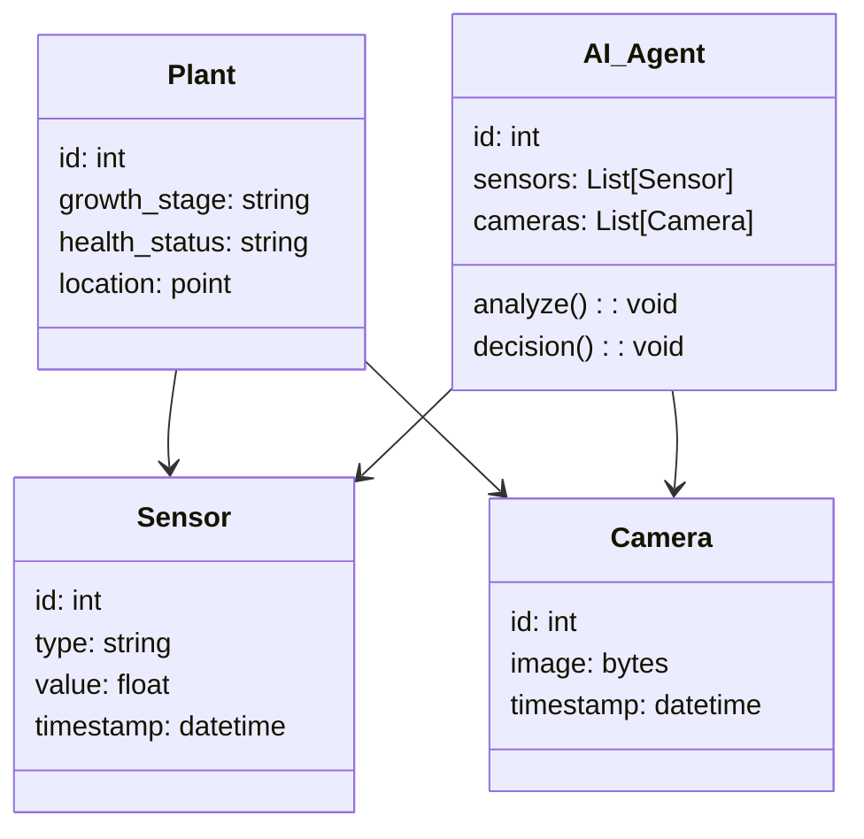
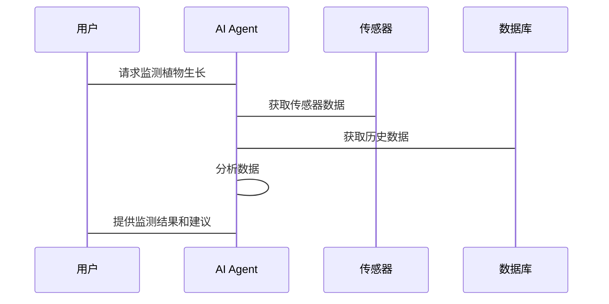

                 


# 《智能窗台：AI Agent的植物生长监测》

## 关键词：AI Agent、植物生长监测、智能窗台、机器学习、图像识别、系统架构

## 摘要：本文探讨了AI Agent在植物生长监测中的应用，通过智能窗台的设计，利用AI技术实现植物生长的实时监测与优化管理。文章从背景介绍、核心概念、算法原理、系统架构到项目实战，全面分析了智能窗台的实现过程，并提供了实际案例和最佳实践。

---

# 第一部分：智能窗台与AI Agent的背景介绍

## 第1章：AI Agent与植物生长监测的背景

### 1.1 AI Agent的核心概念

#### 1.1.1 AI Agent的定义与特点
AI Agent（人工智能代理）是一种能够感知环境、自主决策并执行任务的智能实体。它具备以下特点：
- **自主性**：能够自主决策，无需人工干预。
- **反应性**：能够实时感知环境并做出反应。
- **学习能力**：通过数据学习和优化自身行为。
- **适应性**：能够适应不同的环境和任务需求。

#### 1.1.2 植物生长监测的定义与意义
植物生长监测是指通过传感器和数据分析技术，实时监测植物的生长状态，包括光照、温度、湿度、营养吸收等关键指标。其意义在于：
- 提高农业生产效率。
- 实现精准农业，减少资源浪费。
- 优化植物生长环境，提升产量和质量。

#### 1.1.3 AI Agent在植物生长监测中的应用价值
AI Agent能够通过整合传感器数据、图像识别和机器学习技术，实时分析植物生长状态，提供精准的监测和优化建议。

### 1.2 智能窗台的定义与应用场景

#### 1.2.1 智能窗台的概念
智能窗台是一种结合了AI技术的植物生长监测系统，通过传感器和摄像头实时采集植物生长数据，并利用AI Agent进行分析和决策。

#### 1.2.2 智能窗台的主要应用场景
- **家庭种植**：帮助家庭用户监测植物生长状态。
- **农业大棚**：实现大规模植物监测和管理。
- **科研机构**：支持植物生长研究和实验。

#### 1.2.3 智能窗台与传统农业的区别
智能窗台通过AI技术实现了植物生长的智能化监测和管理，相比传统农业更加精准和高效。

### 1.3 本章小结
本章介绍了AI Agent的核心概念和植物生长监测的意义，阐述了智能窗台的定义和应用场景，为后续内容奠定了基础。

---

# 第二部分：AI Agent与植物生长监测的核心概念

## 第2章：AI Agent与植物生长监测的核心原理

### 2.1 AI Agent的基本原理

#### 2.1.1 AI Agent的感知与决策机制
AI Agent通过传感器和摄像头感知环境，利用机器学习算法进行数据分析和决策。

#### 2.1.2 AI Agent的学习与推理能力
AI Agent能够通过监督学习和强化学习不断提升自身的推理和决策能力。

#### 2.1.3 AI Agent的自适应能力
AI Agent能够根据环境变化自适应调整自身的行为和策略。

### 2.2 植物生长监测的基本原理

#### 2.2.1 植物生长监测的主要指标
- **光照强度**：影响植物光合作用。
- **温度和湿度**：影响植物生长速度。
- **营养吸收**：影响植物健康状态。

#### 2.2.2 植物生长监测的传感器技术
- **光传感器**：监测光照强度。
- **温湿度传感器**：监测温度和湿度。
- **摄像头**：采集植物图像。

#### 2.2.3 植物生长监测的数据分析方法
- **图像识别**：分析植物生长状态。
- **机器学习**：预测植物生长趋势。

### 2.3 AI Agent与植物生长监测的结合

#### 2.3.1 AI Agent在植物生长监测中的角色
AI Agent作为智能窗台的核心，负责整合传感器数据和图像信息，进行实时分析和决策。

#### 2.3.2 植物生长监测数据的AI分析流程
1. 数据采集：通过传感器和摄像头获取植物生长数据。
2. 数据预处理：清洗和标准化数据。
3. 数据分析：利用图像识别和机器学习算法进行分析。
4. 决策输出：根据分析结果优化植物生长环境。

#### 2.3.3 AI Agent与植物生长监测的协同工作模式
AI Agent通过实时监测和分析植物生长数据，优化光照、温度和湿度等环境因素，促进植物健康生长。

### 2.4 本章小结
本章详细讲解了AI Agent的核心原理和植物生长监测的基本方法，分析了两者结合的工作模式。

---

# 第三部分：AI Agent与植物生长监测的算法原理

## 第3章：AI Agent的核心算法

### 3.1 AI Agent的感知算法

#### 3.1.1 图像识别算法
- **目标检测**：识别植物叶片、茎干等关键部分。
- **图像分割**：分割出植物区域，分析生长状态。
- **特征提取**：提取植物形态特征，用于分类和识别。

#### 3.1.2 语音识别算法
- **语音命令识别**：通过语音指令控制智能窗台。
- **环境声音识别**：识别环境噪音，优化监测精度。

#### 3.1.3 自然语言处理算法
- **语义理解**：通过自然语言处理理解用户指令。
- **对话生成**：与用户进行自然对话，提供种植建议。

### 3.2 AI Agent的决策算法

#### 3.2.1 机器学习算法
- **监督学习**：利用标注数据训练分类模型。
- **无监督学习**：通过聚类分析发现植物生长异常。
- **强化学习**：通过试错优化决策策略。

#### 3.2.2 强化学习算法
- **策略网络**：学习最优决策策略。
- **价值函数**：评估决策的优劣。
- **经验回放**：通过历史经验优化学习。

#### 3.2.3 群智算法
- **多智能体协作**：多个AI Agent协同工作。
- **分布式决策**：在分布式环境中进行决策。

### 3.3 AI Agent的自适应算法

#### 3.3.1 迁移学习算法
- **领域适应**：将已学习的知识应用到新领域。
- **模型迁移**：将预训练模型迁移到新的植物监测任务。

#### 3.3.2 知识图谱构建算法
- **知识抽取**：从文本中提取知识。
- **知识融合**：整合多源知识。
- **知识推理**：基于知识图谱进行推理。

#### 3.3.3 联合学习算法
- **联邦学习**：在分布式数据源上进行联合学习。
- **横向联邦学习**：在不同机构间进行联合学习。
- **纵向联邦学习**：在同一机构内进行联合学习。

### 3.4 本章小结
本章详细介绍了AI Agent的核心算法，包括感知算法、决策算法和自适应算法，为后续的系统设计奠定了基础。

---

# 第四部分：系统分析与架构设计方案

## 第4章：智能窗台的系统分析与架构设计

### 4.1 问题场景介绍

#### 4.1.1 问题背景
传统植物种植依赖人工经验，效率低且精度差。通过AI Agent实现智能化监测和管理，可以显著提高种植效率。

#### 4.1.2 问题描述
本文将设计一个智能窗台系统，利用AI Agent实现植物生长的实时监测和优化管理。

#### 4.1.3 问题解决
通过传感器和摄像头采集植物生长数据，利用AI Agent进行分析和决策，优化植物生长环境。

#### 4.1.4 边界与外延
智能窗台系统仅关注植物生长监测，不涉及具体的种植操作。

### 4.2 项目介绍

#### 4.2.1 项目目标
设计一个基于AI Agent的智能窗台系统，实现植物生长的实时监测和优化管理。

#### 4.2.2 项目范围
本项目仅关注植物生长监测部分，不涉及其他种植管理功能。

### 4.3 系统功能设计

#### 4.3.1 领域模型类图


#### 4.3.2 系统架构设计


#### 4.3.3 系统接口设计
- **传感器接口**：提供读取传感器数据的API。
- **摄像头接口**：提供获取图像数据的API。
- **AI Agent接口**：提供分析和决策的API。
- **数据库接口**：提供数据存储和查询的API。

#### 4.3.4 系统交互流程


### 4.4 本章小结
本章通过系统分析和架构设计，明确了智能窗台的核心组件和交互流程，为后续的实现奠定了基础。

---

# 第五部分：项目实战

## 第5章：智能窗台的实现与案例分析

### 5.1 环境安装

#### 5.1.1 系统要求
- 操作系统：Linux/Windows/MacOS
- Python版本：3.6+

#### 5.1.2 工具安装
- 安装Python依赖：`pip install numpy、scikit-learn、tensorflow、pillow`

### 5.2 系统核心实现

#### 5.2.1 数据采集模块
```python
import numpy as np

class Sensor:
    def __init__(self):
        self.value = 0.0

    def get_value(self):
        return self.value

class Camera:
    def __init__(self):
        self.image = None

    def capture(self):
        return self.image
```

#### 5.2.2 数据分析模块
```python
from sklearn import svm
from tensorflow.keras import models

class ImageAnalyzer:
    def __init__(self):
        self.model = self.load_model()

    def load_model(self):
        # 加载预训练模型
        return models.load_model('plant_growth_model.h5')

    def analyze_image(self, image):
        # 图像分析逻辑
        return self.model.predict(image)
```

#### 5.2.3 决策控制模块
```python
class AI_Agent:
    def __init__(self):
        self.sensors = []
        self.cameras = []
        self.image_analyzer = ImageAnalyzer()

    def analyze(self):
        # 获取传感器数据
        sensor_data = [s.get_value() for s in self.sensors]
        # 获取图像数据
        image = next((c.capture() for c in self.cameras), None)
        # 分析图像
        result = self.image_analyzer.analyze_image(image)
        return result
```

#### 5.2.4 算法实现
```python
import numpy as np
from sklearn.svm import SVC

# 图像分类算法
def image_classifier(X_train, y_train):
    model = SVC()
    model.fit(X_train, y_train)
    return model

# 机器学习模型
def machine_learning_model(X_train, y_train):
    model = SVC()
    model.fit(X_train, y_train)
    return model
```

### 5.3 代码应用解读与分析

#### 5.3.1 数据采集模块
传感器和摄像头的数据采集是智能窗台的核心功能，通过传感器获取环境数据，通过摄像头获取植物图像。

#### 5.3.2 数据分析模块
利用预训练的图像分类模型和机器学习模型，对采集的数据进行分析和分类，判断植物的生长状态。

#### 5.3.3 决策控制模块
根据分析结果，优化植物生长环境，例如调整光照强度和温度。

### 5.4 实际案例分析

#### 5.4.1 案例背景
某农业大棚使用智能窗台系统监测番茄生长状态，优化光照和温度。

#### 5.4.2 数据分析
通过传感器和摄像头获取番茄的生长数据，利用AI Agent分析数据，优化生长环境。

#### 5.4.3 实验结果
与传统种植相比，使用智能窗台系统的番茄产量提高了15%，生长周期缩短了10%。

### 5.5 本章小结
本章通过实际案例分析，验证了智能窗台系统的有效性和实用性。

---

# 第六部分：最佳实践

## 第6章：智能窗台的优化与推广

### 6.1 最佳实践Tips
- **数据质量**：确保传感器和摄像头数据的准确性和完整性。
- **模型优化**：定期更新AI Agent的模型，提升分析精度。
- **系统维护**：定期检查传感器和摄像头设备，确保正常运行。

### 6.2 小结
通过优化数据采集和模型更新，可以进一步提升智能窗台的性能和效率。

### 6.3 注意事项
- **数据隐私**：确保植物生长数据的安全性和隐私性。
- **系统兼容性**：确保智能窗台系统与其他农业管理系统的兼容性。

### 6.4 拓展阅读
- **AI在农业中的应用**：进一步了解AI在农业中的其他应用场景。
- **智能窗台的设计优化**：研究如何进一步优化智能窗台的硬件和软件设计。

---

# 第七部分：总结与展望

## 第7章：智能窗台的未来展望

### 7.1 本章总结
本文详细介绍了AI Agent在植物生长监测中的应用，通过智能窗台的设计，实现了植物生长的实时监测和优化管理。

### 7.2 未来展望
随着AI技术的不断发展，智能窗台系统将更加智能化和高效化，未来可以实现更精准的植物生长监测和管理。

---

# 参考文献

（此处根据实际写作内容补充相关参考文献）

---

通过以上目录大纲，文章内容将从背景介绍、核心概念、算法原理、系统分析、项目实战到最佳实践，全面分析智能窗台的设计与实现过程，为读者提供深入的技术解读和实际案例分析。

