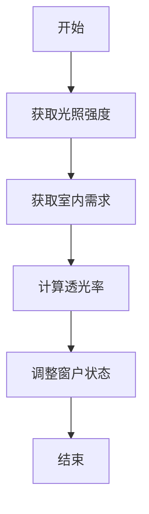
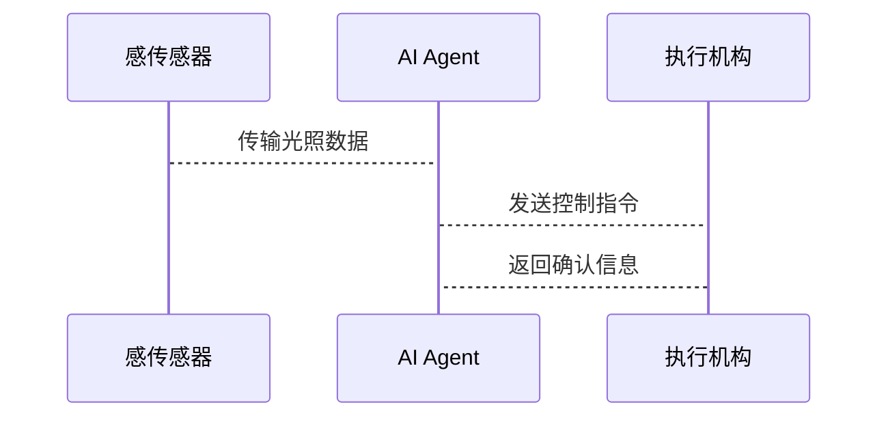

                 


# 智能窗台：AI Agent的自然光摄入优化

## 关键词：智能窗台，AI Agent，自然光优化，建筑节能，光照控制

## 摘要

随着城市化进程的加快，建筑能耗问题日益突出，而自然光的合理利用是降低建筑能耗的重要途径之一。智能窗台通过AI Agent优化自然光的摄入，不仅提升了室内环境的舒适度，还实现了节能减排的目标。本文将从背景、原理、算法、系统设计、项目实战等多个方面详细探讨AI Agent在自然光优化中的应用，为智能窗台的设计提供理论支持和实践指导。

---

## 第1章 智能窗台与AI Agent概述

### 1.1 问题背景与描述

#### 1.1.1 自然光在建筑中的作用

自然光不仅为建筑提供照明，还能显著提升室内环境的舒适度和 occupants 的健康水平。然而，过度或不足的自然光都会对室内环境造成负面影响。

#### 1.1.2 问题描述

传统窗户的光照调节能力有限，无法根据光照强度、室内需求和时间变化自动调整。这导致了能源浪费和舒适度问题。

#### 1.1.3 问题解决

AI Agent通过实时感知环境数据，动态调整窗户的透光率或遮光率，实现自然光的智能优化。

#### 1.1.4 边界与外延

- **边界**：仅考虑自然光的优化，不涉及温度调节等其他功能。
- **外延**：可扩展至更复杂的建筑能源管理系统。

---

### 1.2 AI Agent的核心概念与作用

AI Agent是一种智能体，能够感知环境、自主决策并执行操作。在智能窗台中，AI Agent负责实时分析光照数据，优化窗户的透光性能。

---

## 第2章 自然光优化的数学模型与算法原理

### 2.1 数学模型

光照优化的目标函数如下：

$$
\text{目标：最大化光照强度，同时最小化能耗}
$$

约束条件包括：

$$
0 \leq \text{透光率} \leq 1
$$

$$
\text{光照强度} = \text{透光率} \times \text{外部光照强度}
$$

### 2.2 AI Agent的算法实现

以下是AI Agent的优化算法流程：



---

## 第3章 系统设计与实现

### 3.1 系统架构设计

系统架构包括以下几个部分：


### 3.2 系统功能设计

- **传感器**：采集光照强度和室内环境数据。
- **AI Agent**：分析数据并制定优化策略。
- **执行机构**：调整窗户的透光率。

### 3.3 系统交互设计



---

## 第4章 项目实战

### 4.1 环境安装

需要安装光照传感器、AI Agent 控制模块和窗户驱动器。

### 4.2 核心代码实现

以下是AI Agent的核心代码：

```python
class AIAgent:
    def __init__(self):
        self.sensor = LightSensor()
        self.controller = WindowController()

    def optimize_light(self):
        light_intensity = self.sensor.get_intensity()
        target_intensity = self.calculate_target(light_intensity)
        self.controller.set_transmittance(target_intensity)

    def calculate_target(self, intensity):
        # 示例算法：根据时间调整透光率
        time = get_current_time()
        if 8 <= time.hour < 18:
            return max(0.5, intensity / 2)
        else:
            return 0.0
```

---

## 第5章 最佳实践与总结

### 5.1 小结

AI Agent通过动态调整窗户透光率，显著提升了自然光的利用效率，降低了能源消耗。

### 5.2 注意事项

- 确保传感器的准确性。
- 定期更新优化算法。

### 5.3 拓展阅读

- 《智能建筑与能源管理》
- 《机器学习在环境优化中的应用》

---

通过以上章节的详细阐述，我们全面探讨了AI Agent在智能窗台中的应用，从理论到实践，为未来的智能建筑优化提供了有益的参考。

