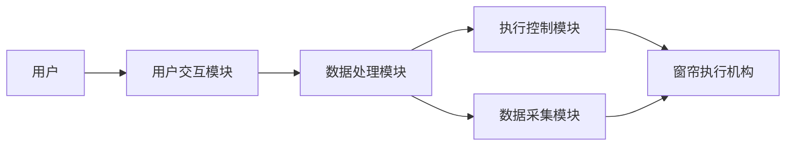
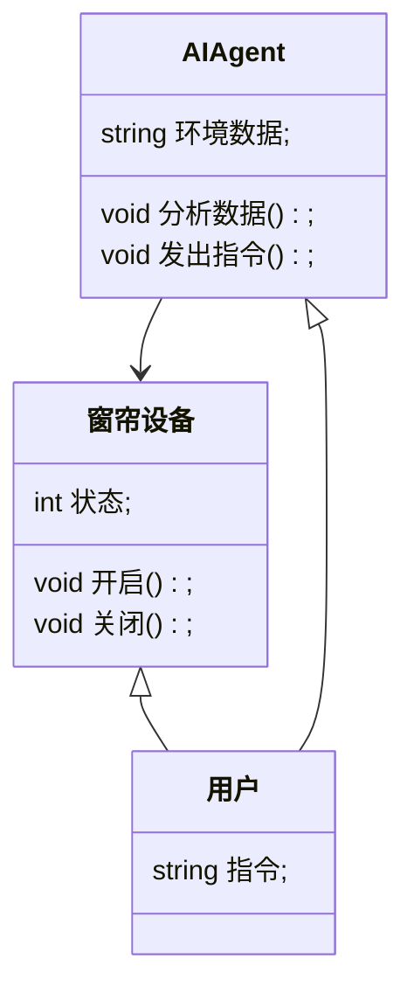

                 


# 智能窗帘：AI Agent的室内环境全面调节

## 关键词：
智能窗帘，AI Agent，物联网，智能家居，环境调节，自动化控制

## 摘要：
智能窗帘作为智能家居的重要组成部分，通过AI Agent实现室内环境的全面调节，结合物联网技术，提供智能化、个性化的家居体验。本文详细探讨智能窗帘的设计原理、算法实现、系统架构及实际应用，为读者提供全面的技术解析。

---

# 第1章 智能窗帘概述

## 1.1 智能窗帘的概念与背景

### 1.1.1 传统窗帘的局限性
传统窗帘主要依赖手动操作，存在以下问题：
- 手动调节效率低下，难以满足现代生活的便捷需求。
- 无法根据环境变化自动调整，例如光线变化、温度调节等。
- 缺乏智能化功能，无法与其他智能家居设备联动。

### 1.1.2 智能化时代的到来
随着人工智能和物联网技术的快速发展，智能家居成为现代生活的趋势。智能窗帘作为智能家居的重要组成部分，逐渐被普及。

### 1.1.3 智能窗帘的定义与特点
智能窗帘是一种结合了AI Agent和物联网技术的智能化家居设备，能够根据用户需求和环境变化自动调节窗帘的开合状态。

### 1.1.4 AI Agent在智能窗帘中的作用
AI Agent（智能代理）通过感知环境、分析数据并执行操作，实现对窗帘的智能化控制。

## 1.2 智能窗帘的发展现状

### 1.2.1 市场现状分析
智能窗帘市场增长迅速，主要厂商包括Sonos、Apple、Google Nest等。

### 1.2.2 技术发展趋势
- AI算法优化
- 物联网设备联动
- 用户体验提升

## 1.3 本书的核心内容与目标

### 1.3.1 本书的核心目标
通过详细的技术分析和实际案例，探讨智能窗帘的设计与实现。

### 1.3.2 本书的结构安排
从概念到技术，从理论到实践，全面解析智能窗帘的设计与实现。

---

# 第2章 智能窗帘的技术基础

## 2.1 AI Agent的基本原理

### 2.1.1 AI Agent的定义与分类
AI Agent是一种智能代理，能够感知环境并执行任务。根据智能水平可分为简单反射型、基于模型的反应型、目标驱动型和实用驱动型。

### 2.1.2 AI Agent的核心技术
- 感知与推理
- 决策与执行
- 学习与优化

## 2.2 物联网技术在智能窗帘中的应用

### 2.2.1 物联网的基本概念
物联网（IoT）通过传感器、通信技术和数据处理系统，实现设备间的互联。

### 2.2.2 物联网在智能窗帘中的应用场景
- 数据采集：光线传感器、温湿度传感器
- 数据传输：Wi-Fi、蓝牙
- 数据处理：云端计算

## 2.3 智能家居系统概述

### 2.3.1 智能家居的概念与特点
智能家居通过物联网技术实现家居设备的智能控制。

### 2.3.2 智能家居的核心技术
- 物联网技术
- AI技术
- 云计算

## 2.4 AI Agent与智能窗帘的结合

### 2.4.1 信息感知
AI Agent通过传感器获取环境数据。

### 2.4.2 信息处理
AI Agent利用机器学习算法分析数据，做出决策。

### 2.4.3 执行操作
AI Agent通过控制电机调整窗帘状态。

---

# 第3章 AI Agent在智能窗帘中的设计与实现

## 3.1 AI Agent的设计原则

### 3.1.1 智能性原则
AI Agent应具备环境感知和自主决策能力。

### 3.1.2 可扩展性原则
系统应支持功能扩展和升级。

## 3.2 AI Agent的核心算法

### 3.2.1 机器学习算法
- 窗帘开合状态预测模型
- 使用历史数据训练模型

### 3.2.2 自然语言处理算法
- 处理用户的语音指令
- 支持多语言识别

### 3.2.3 规则引擎算法
- 设置日程规则：例如每天早上自动开启窗帘
- 根据天气情况自动调整

## 3.3 AI Agent与智能窗帘的交互方式

### 3.3.1 用户输入与反馈
- 语音指令：例如“早上好，拉开窗帘”
- 手势控制：通过手机APP操作

### 3.3.2 系统输出与执行
- 自动调节窗帘
- 发送反馈信息：例如“窗帘已开启”

## 3.4 算法实现

### 3.4.1 机器学习算法实现
使用Python的scikit-learn库训练模型。

```python
from sklearn.tree import DecisionTreeClassifier
model = DecisionTreeClassifier()
model.fit(X_train, y_train)
```

### 3.4.2 自然语言处理算法实现
使用自然语言处理库如spaCy进行文本处理。

```python
import spacy
nlp = spacy.load("en_core_web_sm")
doc = nlp("Close the窗帘")
for token in doc:
    print(token.text, token.pos_)
```

---

# 第4章 系统架构与设计

## 4.1 系统架构设计

### 4.1.1 系统功能模块
- 数据采集模块
- 数据处理模块
- 用户交互模块
- 执行控制模块

### 4.1.2 系统架构图
使用Mermaid图展示系统架构。



## 4.2 系统功能设计

### 4.2.1 领域模型设计
使用Mermaid类图展示领域模型。



## 4.3 系统接口设计

### 4.3.1 接口设计
- 用户输入接口：语音、手势、APP
- 系统输出接口：窗帘执行机构

---

# 第5章 项目实战

## 5.1 环境搭建

### 5.1.1 开发环境
- Python 3.8+
- 物联网开发板（如Raspberry Pi）
- 相关库的安装：例如paho-mqtt用于mqtt通信

## 5.2 核心代码实现

### 5.2.1 机器学习模型训练
使用scikit-learn训练窗帘状态预测模型。

```python
from sklearn.tree import DecisionTreeClassifier
import numpy as np

# 假设X_train和y_train已经准备好
model = DecisionTreeClassifier()
model.fit(X_train, y_train)
```

### 5.2.2 自然语言处理实现
使用spaCy进行指令解析。

```python
import spacy

nlp = spacy.load("en_core_web_sm")
text = "Open the窗帘"
doc = nlp(text)
for token in doc:
    print(token.text, token.pos_)
```

### 5.2.3 系统实现
编写主程序，整合各个模块。

```python
import paho.mqtt.client as mqtt
import json

# 连接 MQTT 代理
client = mqtt.Client()
client.connect("localhost", 1883, 60)

# 发布消息
client.publish("窗帘状态", json.dumps({"state": "开启"}))
```

---

# 第6章 优化与扩展

## 6.1 系统优化

### 6.1.1 性能优化
- 提升算法效率
- 优化数据处理流程

## 6.2 功能扩展

### 6.2.1 新增功能
- 声纹识别：识别不同用户身份
- 智能联动：与其他智能家居设备联动

## 6.3 用户体验优化

### 6.3.1 界面优化
- 提供更直观的用户界面
- 支持更多交互方式

---

# 第7章 总结与展望

## 7.1 本章总结
智能窗帘通过AI Agent实现智能化控制，结合物联网技术，为用户带来便捷体验。

## 7.2 未来展望
- 更多智能化功能的开发
- 更多场景的应用

## 7.3 注意事项与建议
- 确保系统安全性
- 定期更新软件和模型

---

# 结语

智能窗帘作为智能家居的重要组成部分，通过AI Agent实现室内环境的全面调节，未来将更加智能化和人性化。希望本文能够为读者提供有价值的技术见解。

