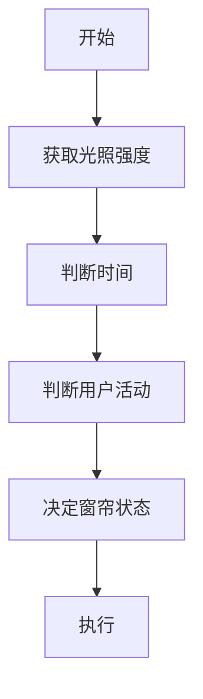
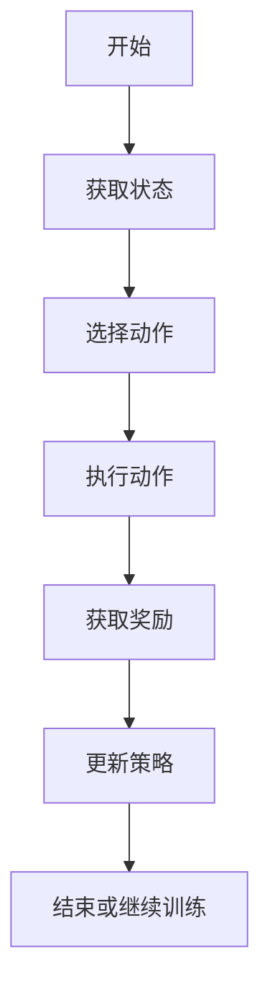
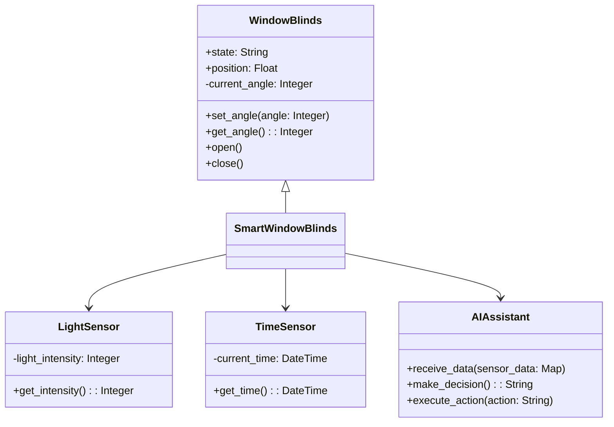
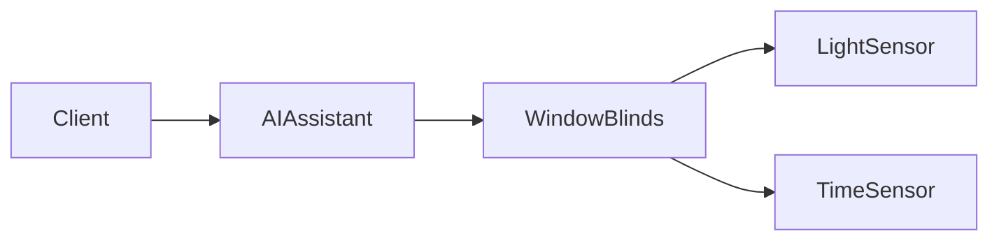
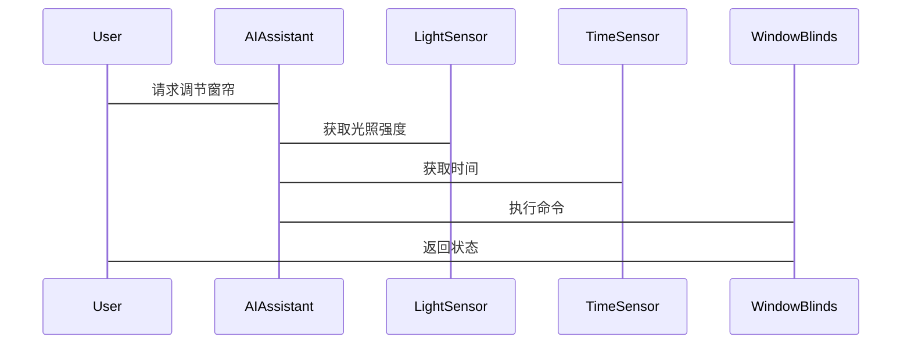

                 


# 智能窗帘：AI Agent的昼夜节律调节助手

> 关键词：智能窗帘，AI Agent，昼夜节律，生物钟，智能家居，算法实现

> 摘要：本文探讨了智能窗帘作为AI Agent在调节昼夜节律中的作用，分析了其核心概念、算法原理、系统架构，并通过项目实战展示了其实现过程，最后提出了优化建议。

---

## 第一部分：背景介绍

### 第1章：智能窗帘与AI Agent概述

#### 1.1 问题背景
现代生活节奏加快，许多人面临昼夜节律失调的问题，影响健康。智能家居的发展为解决这一问题提供了可能，而智能窗帘作为关键设备，结合AI技术，能够有效调节光照，辅助昼夜节律的正常运转。

#### 1.2 问题描述
昼夜节律失调会导致睡眠问题和健康隐患。传统窗帘无法根据个人需求自动调节，而智能窗帘通过AI Agent可以实时分析用户需求和环境数据，提供个性化的光照调节方案。

#### 1.3 问题解决
AI Agent通过分析光照强度、时间、用户习惯等数据，智能调整窗帘开合，帮助用户建立健康的昼夜节律。同时，智能窗帘可与其他智能家居设备协同工作，提升生活质量。

#### 1.4 边界与外延
智能窗帘的功能包括光照调节、自动化控制，但不涉及声音或温度调节。其适用场景主要在家庭环境中，与其他智能家居设备区分明确。

#### 1.5 概念结构与核心要素
- 核心概念：AI Agent、昼夜节律、智能窗帘
- 关键要素：光照强度、时间、用户习惯
- 系统架构：传感器、AI Agent、执行机构

---

## 第二部分：核心概念与联系

### 第2章：AI Agent与昼夜节律调节原理

#### 2.1 AI Agent的基本原理
AI Agent通过数据采集、分析和决策，执行相应动作。其决策基于规则推理和强化学习，确保智能窗帘根据用户需求调整光照。

#### 2.2 昼夜节律调节的科学依据
生物钟通过光照调节，影响人体激素分泌。AI Agent分析光照数据，调整窗帘以模拟自然光照，帮助用户建立健康节律。

#### 2.3 AI Agent与智能窗帘的结合
AI Agent整合传感器数据，分析用户行为模式，制定个性化调节策略，通过执行机构调整窗帘开合，实现昼夜节律调节。

---

## 第三部分：算法原理讲解

### 第3章：AI Agent的算法实现

#### 3.1 基于规则的推理算法
**流程图：**

**Python代码示例：**
```python
def rule_based_decision(light_intensity, time, user_activity):
    if light_intensity < 50 and time.between(6, 22) and user_activity == 'active':
        return 'open'
    elif light_intensity > 80 and time.between(0, 6) and user_activity == 'inactive':
        return 'close'
    else:
        return '保持当前状态'
```
**数学模型：**
$$
决策 = \begin{cases}
'open' & \text{if } intensity < 50 \text{ 且 时间在6-22，且活动=active} \\
'close' & \text{if } intensity > 80 \text{ 且 时间在0-6，且活动=inactive} \\
\text{保持} & \text{其他情况}
\end{cases}
$$

#### 3.2 强化学习算法
**流程图：**

**Python代码示例：**
```python
import numpy as np

class ReinforcementLearningAgent:
    def __init__(self, states, actions, learning_rate=0.1):
        self.states = states
        self.actions = actions
        self.learning_rate = learning_rate
        self.Q = np.zeros((len(states), len(actions)))

    def choose_action(self, state):
        return np.argmax(self.Q[state])

    def update_Q(self, state, action, reward):
        self.Q[state][action] += self.learning_rate * (reward + np.max(self.Q[state]))

    def get_action(self, state):
        return self.choose_action(state)
```

---

## 第四部分：系统分析与架构设计

### 第4章：系统架构设计

#### 4.1 问题场景介绍
用户希望智能窗帘根据光照、时间和活动状态自动调整，改善昼夜节律。

#### 4.2 项目介绍
智能窗帘系统结合AI Agent，通过传感器采集数据，分析并调整窗帘状态，帮助用户建立健康节律。

#### 4.3 系统功能设计（领域模型Mermaid类图）


#### 4.4 系统架构设计（Mermaid架构图）


#### 4.5 系统接口设计
- 输入接口：传感器数据、用户指令
- 输出接口：窗帘状态、反馈信息

#### 4.6 系统交互（Mermaid序列图）


---

## 第五部分：项目实战

### 第5章：智能窗帘系统实现

#### 5.1 环境安装
安装Raspberry Pi和必要的传感器，配置Python环境，安装依赖库。

#### 5.2 核心代码实现
```python
import RPi.GPIO as GPIO
import time

# 初始化GPIO
GPIO.setmode(GPIO.BCM)
GPIO.setup(17, GPIO.OUT)  # 窗帘电机控制

def open_curtain():
    GPIO.output(17, GPIO.HIGH)
    time.sleep(5)
    GPIO.output(17, GPIO.LOW)

def close_curtain():
    GPIO.output(17, GPIO.HIGH)
    time.sleep(2)
    GPIO.output(17, GPIO.LOW)

# 示例使用
open_curtain()
close_curtain()
```

#### 5.3 案例分析与解读
通过分析用户的睡眠数据，AI Agent调整窗帘状态，改善用户的睡眠质量。

#### 5.4 项目总结
项目展示了AI在智能家居中的应用潜力，证明了智能窗帘在调节昼夜节律方面的有效性。

---

## 第六部分：最佳实践

### 第6章：优化建议与注意事项

#### 6.1 优化建议
- 定期更新AI模型，适应用户习惯变化。
- 优化传感器精度，提升数据准确性。

#### 6.2 注意事项
- 确保系统安全，防止未经授权的访问。
- 处理好用户隐私问题，避免数据泄露。

#### 6.3 未来展望
探索AI Agent在更多智能家居设备中的应用，推动智能生活的普及。

---

## 结语

通过本文的详细分析，智能窗帘作为AI Agent的昼夜节律调节助手，展示了其在改善现代生活质量中的巨大潜力。希望本文能为相关领域的研究和实践提供有价值的参考。

