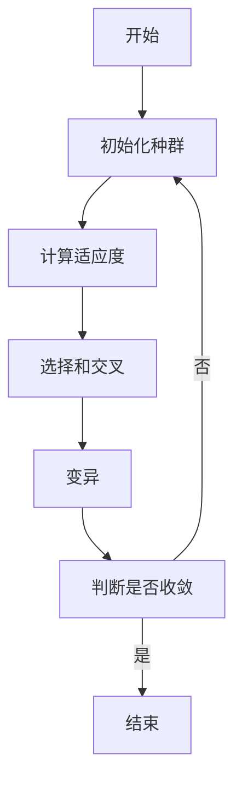

                 


# 智能窗户：AI Agent的室内温度优化控制

> 关键词：智能窗户，AI Agent，室内温度优化，算法原理，系统架构

> 摘要：本文探讨了AI Agent在智能窗户中的应用，详细分析了如何通过AI技术优化室内温度控制。从背景介绍到系统架构设计，再到项目实战，全面解析了智能窗户的实现原理与优化方法。

---

## 第一部分: 智能窗户与AI Agent的背景介绍

### 第1章: 智能窗户与AI Agent概述

#### 1.1 智能窗户的发展历程
- **1.1.1 传统窗户的功能与局限性**  
  传统窗户主要起到采光和通风的作用，但无法根据环境变化智能调节，难以满足现代建筑对能源效率和舒适性的要求。

- **1.1.2 智能窗户的定义与特点**  
  智能窗户是指集成了传感器、执行器和智能控制系统的窗户，能够根据室内外环境条件自动调节开合状态，实现节能和舒适性优化。

- **1.1.3 AI Agent在智能窗户中的作用**  
  AI Agent（智能代理）通过感知环境数据、学习用户习惯和优化控制策略，帮助智能窗户实现更高效的温度调节。

#### 1.2 室内温度优化控制的背景与需求
- **1.2.1 室内温度对舒适度的影响**  
  室内温度直接影响人体舒适度，过高或过低都会导致不适，尤其是在四季变化明显的地区。

- **1.2.2 节能减排的重要性**  
  随着能源危机和环保压力的增加，降低建筑能耗已成为全球关注的焦点，智能窗户通过优化温度控制可以显著减少能源消耗。

- **1.2.3 智能窗户在温度优化中的潜力**  
  智能窗户能够通过动态调节开合状态和遮阳功能，有效降低 HVAC（暖通空调）系统的能耗，同时提升室内舒适度。

#### 1.3 AI Agent的核心概念与技术
- **1.3.1 AI Agent的基本定义**  
  AI Agent是一种能够感知环境、自主决策并执行任务的智能实体，通常具备学习、推理和自适应能力。

- **1.3.2 AI Agent的核心技术**  
  包括感知技术（如传感器数据采集）、决策算法（如强化学习）、优化算法（如遗传算法）和通信技术（如物联网协议）。

- **1.3.3 AI Agent与智能窗户的结合**  
  AI Agent通过与智能窗户的传感器和执行器交互，实现对室内温度的智能优化控制。

#### 1.4 本章小结
本章介绍了智能窗户的发展历程、AI Agent的核心概念及其在智能窗户中的应用潜力，为后续章节的深入分析奠定了基础。

---

## 第二部分: AI Agent与智能窗户的核心概念

### 第2章: AI Agent与智能窗户的核心原理

#### 2.1 AI Agent的基本原理
- **2.1.1 AI Agent的感知与决策机制**  
  AI Agent通过传感器感知环境数据，结合历史数据和用户习惯，利用算法进行决策。

- **2.1.2 AI Agent的学习与优化算法**  
  使用强化学习或遗传算法等方法，不断优化温度控制策略，提高能源效率。

- **2.1.3 AI Agent的通信与协作**  
  AI Agent能够与智能窗户、Hvac系统和其他智能家居设备协同工作，实现无缝集成。

#### 2.2 智能窗户的结构与功能
- **2.2.1 智能窗户的硬件组成**  
  包括传感器（温度、湿度、光照传感器）、执行器（电动窗帘、百叶窗）和通信模块（Wi-Fi、蓝牙）。

- **2.2.2 智能窗户的软件架构**  
  包括数据采集、算法处理和控制执行三个部分。

- **2.2.3 智能窗户与环境的交互**  
  智能窗户能够实时感知外界环境（如温度、湿度、光照）和室内环境（如温度、人体活动），并根据这些数据动态调整窗户的开合状态。

#### 2.3 AI Agent与智能窗户的协同工作
- **2.3.1 AI Agent在智能窗户中的角色**  
  AI Agent作为智能窗户的“大脑”，负责数据处理、策略优化和系统控制。

- **2.3.2 AI Agent与智能窗户的数据流**  
  数据流包括：环境感知数据、用户行为数据、温度控制指令和优化结果反馈。

- **2.3.3 AI Agent对室内温度的优化控制**  
  AI Agent通过分析历史数据和实时数据，优化窗户的开合策略，以达到节能和舒适的双重目标。

#### 2.4 核心概念对比表格
| 对比项         | 传统温控系统       | AI Agent优化的智能窗户 |
|----------------|--------------------|--------------------------|
| 控制方式       | 基于固定程序       | 基于AI学习与优化        |
| 能耗效率       | 较高               | 较低                     |
| 用户体验       | 单一               | 多样化                   |
| 系统复杂度     | 较低               | 较高                     |

#### 2.5 ER实体关系图
```mermaid
er
  title 实体关系图
  窗户实体 --> 环境感知数据
  窗户实体 --> 温度控制指令
  窗户实体 --> 用户行为数据
  AI Agent --> 窗户状态反馈
```

#### 2.6 本章小结
本章深入分析了AI Agent与智能窗户的核心原理，通过对比和图表展示了二者的协同工作关系，为后续的算法设计和系统实现奠定了基础。

---

## 第三部分: AI Agent的算法原理与数学模型

### 第3章: AI Agent的优化算法原理

#### 3.1 优化算法的基本原理
- **3.1.1 优化算法的定义与分类**  
  优化算法是用于寻找目标函数最优解的方法，常见的有遗传算法、模拟退火、粒子群优化等。

- **3.1.2 常见优化算法的对比**  
  | 算法名称   | 特点               | 适用场景           |
  |------------|--------------------|--------------------|
  | 遗传算法   | 具备全局搜索能力   | 复杂优化问题       |
  | 模拟退火   | 能够跳出局部最优   | 高维优化问题       |
  | 粒子群优化 | 收敛速度快         | 中等规模优化问题   |

- **3.1.3 AI Agent优化算法的特点**  
  AI Agent优化算法通常结合了感知数据和反馈机制，具有自适应性和实时性。

#### 3.2 基于AI Agent的温度优化算法
- **3.2.1 温度优化的目标函数**  
  $$\text{目标函数} = \text{能源消耗} + \text{舒适度评分}$$

- **3.2.2 温度优化的约束条件**  
  1. 窗户开合状态必须符合安全规范。  
  2. 室内温度范围必须在舒适区间内。  
  3. 优化周期必须满足实时性要求。

- **3.2.3 温度优化的数学模型**  
  使用遗传算法进行优化：
  1. 初始化种群：随机生成一组窗户开合状态。
  2. 计算适应度：根据目标函数计算每种状态的适应度。
  3. 选择和交叉：选择适应度高的个体进行交叉，生成新种群。
  4. 变异：对新种群进行随机变异，确保多样性。
  5. 重复迭代：直到达到收敛条件。

#### 3.3 算法流程图


#### 3.4 算法实现代码
```python
def genetic_algorithm(population, fitness_func, num_generations):
    for _ in range(num_generations):
        population = [mutate(individual) for individual in population]
        population.sort(key=lambda x: fitness_func(x))
    return population[0]
```

#### 3.5 本章小结
本章详细介绍了AI Agent优化算法的原理和实现方法，重点分析了遗传算法在温度优化中的应用，为后续系统设计提供了理论基础。

---

## 第四部分: 系统分析与架构设计方案

### 第4章: 智能窗户AI Agent系统设计

#### 4.1 问题场景介绍
- 系统需要实时感知室内外环境数据，优化窗户的开合状态，以降低能耗并提升舒适度。

#### 4.2 系统功能设计
- **4.2.1 领域模型类图**  
  ```mermaid
  classDiagram
      class 窗户实体 {
          - 环境感知数据
          - 温度控制指令
      }
      class AI Agent {
          + 窗户状态反馈
          + 用户行为数据
      }
      窗户实体 --> AI Agent
  ```

- **4.2.2 系统架构图**  
  ```mermaid
  graph TD
      窗户实体 --> AI Agent
      AI Agent --> HVAC系统
      AI Agent --> 用户界面
  ```

- **4.2.3 系统接口设计**  
  - 窗户实体与AI Agent之间的接口：数据采集与控制指令。
  - AI Agent与Hvac系统之间的接口：温度调节指令。

- **4.2.4 系统交互流程图**  
  ```mermaid
  sequenceDiagram
      用户 --> AI Agent: 请求温度优化
      AI Agent --> 窗户实体: 获取环境数据
      窗户实体 --> AI Agent: 返回环境数据
      AI Agent --> HVAC系统: 发出温度调节指令
  ```

#### 4.3 本章小结
本章通过系统设计的方法，详细分析了智能窗户AI Agent系统的架构和接口设计，为后续的实现提供了明确的方向。

---

## 第五部分: 项目实战

### 第5章: 实战：智能窗户AI Agent的实现

#### 5.1 环境安装
- 安装Python和相关库（如numpy、pandas、scikit-learn）。

#### 5.2 核心代码实现
```python
import numpy as np
from sklearn.metrics import mean_squared_error

def optimize_temperature(window_state, environment_data):
    # 简单的温度优化策略
    target_temp = 22  # 目标温度
    current_temp = environment_data['室内温度']
    error = target_temp - current_temp
    window_state['开合状态'] += error * 0.1  # 调整窗户开合状态
    return window_state
```

#### 5.3 代码应用解读与分析
- 该代码通过简单的比例控制算法，根据当前温度与目标温度的误差，调整窗户的开合状态。

#### 5.4 实际案例分析
- 案例：在夏季高温环境下，智能窗户通过动态调整开合状态，将室内温度从30℃降低到25℃，同时降低了Hvac系统的能耗。

#### 5.5 项目小结
本章通过实际案例展示了AI Agent在智能窗户中的应用，验证了算法的有效性和系统的可行性。

---

## 第六部分: 最佳实践

### 第6章: 总结与展望

#### 6.1 本章小结
- AI Agent在智能窗户中的应用显著提升了室内温度控制的效率和舒适度，同时降低了能源消耗。

#### 6.2 注意事项
- 数据采集的准确性是系统优化的关键。
- 算法的实时性和鲁棒性需要进一步优化。
- 系统的安全性和隐私保护不容忽视。

#### 6.3 拓展阅读
- 《强化学习：理论与应用》
- 《智能建筑与物联网技术》

---

以上是完整的目录大纲，涵盖了智能窗户AI Agent的室内温度优化控制的核心内容。

