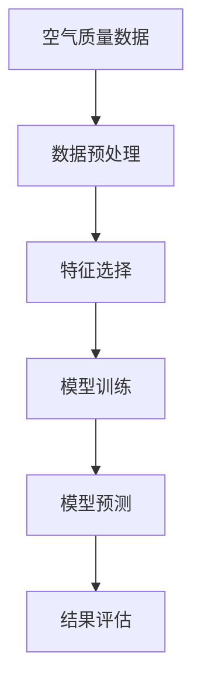
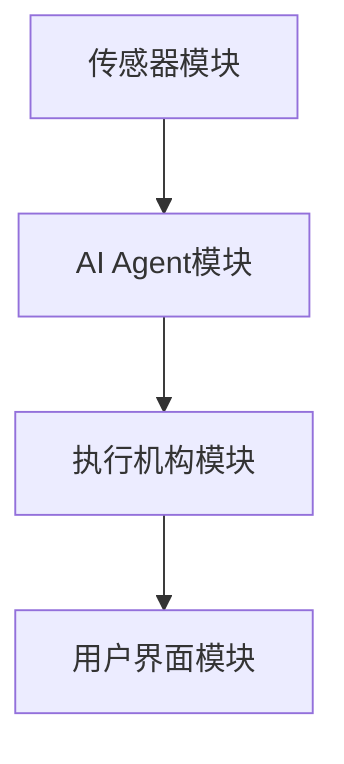
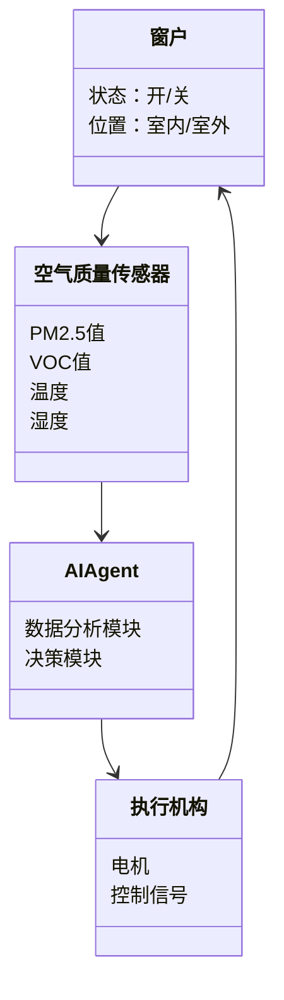
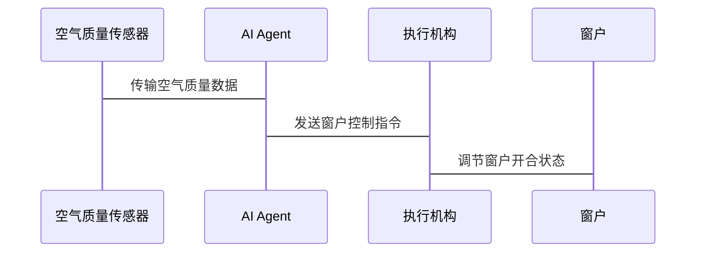

                 


# 智能窗户：AI Agent的空气质量控制

## 关键词：智能窗户、AI代理、空气质量控制、环境监测、物联网

## 摘要：本文探讨了AI代理在智能窗户中的应用，重点分析了其如何通过空气质量监测和优化控制改善室内环境。文章从背景介绍、核心概念、算法原理到系统架构、项目实战，全面解析了智能窗户在空气质量控制中的实现过程。

---

# 第一部分: 背景介绍

## 第1章: 智能窗户与AI Agent的背景概述

### 1.1 智能窗户的发展历程

#### 1.1.1 传统窗户的功能与局限性
传统窗户仅具备采光和通风的基本功能，无法根据环境变化智能调节，存在能源浪费和舒适性不足的问题。

#### 1.1.2 智能窗户的定义与特点
智能窗户集成了传感器、执行机构和智能控制系统，能够根据环境条件自动调节开合状态，实现智能化管理。

#### 1.1.3 智能窗户的发展趋势
随着物联网和人工智能技术的发展，智能窗户正朝着更智能化、网络化和节能环保的方向发展。

### 1.2 空气质量控制的重要性

#### 1.2.1 空气质量对健康的影响
空气质量直接影响人类健康，PM2.5、VOC等污染物超标会导致呼吸系统疾病和过敏反应。

#### 1.2.2 环境监测技术的发展
空气质量监测技术的进步使得实时监测和数据采集成为可能，为智能窗户的空气质量控制提供了技术基础。

#### 1.2.3 智能窗户在空气质量控制中的作用
智能窗户通过调节开合状态，优化室内空气质量，为用户提供舒适、健康的居住环境。

### 1.3 AI Agent的基本概念

#### 1.3.1 人工智能代理的定义
AI Agent是一种智能体，能够感知环境、自主决策并执行任务，具备学习和适应能力。

#### 1.3.2 AI Agent的核心功能
感知、决策、规划、执行和交互是AI Agent的主要功能，能够帮助智能窗户实现智能化管理。

#### 1.3.3 AI Agent在智能窗户中的应用前景
AI Agent可以通过实时监测空气质量数据，优化窗户的开合策略，提升室内空气质量。

### 1.4 本章小结
本章介绍了智能窗户和AI Agent的基本概念，分析了空气质量控制的重要性，为后续内容奠定了基础。

---

# 第二部分: 核心概念与联系

## 第2章: AI Agent与空气质量控制的核心概念

### 2.1 AI Agent的基本原理

#### 2.1.1 AI Agent的感知与决策机制
AI Agent通过传感器获取环境数据，利用算法进行分析和决策，制定窗户的开合策略。

#### 2.1.2 基于传感器的数据采集
空气质量传感器实时采集PM2.5、VOC等数据，为AI Agent提供决策依据。

#### 2.1.3 数据分析与决策算法
AI Agent采用机器学习算法对数据进行分析，预测空气质量变化，优化窗户的开合策略。

### 2.2 空气质量监测技术

#### 2.2.1 常见空气质量传感器类型
PM2.5传感器、VOC传感器、温湿度传感器等是常见的空气质量监测设备。

#### 2.2.2 传感器数据的特征提取
通过数据预处理和特征提取，提升空气质量监测的准确性和实时性。

#### 2.2.3 数据预处理与标准化
数据清洗、归一化处理等步骤确保空气质量数据的准确性和一致性。

### 2.3 AI Agent与空气质量控制的协同工作

#### 2.3.1 系统整体架构
智能窗户系统由传感器、AI Agent、执行机构和用户界面组成，协同工作实现空气质量优化。

#### 2.3.2 各模块之间的关系
传感器采集数据，AI Agent进行分析和决策，执行机构根据指令调节窗户开合状态。

#### 2.3.3 系统边界与外延
智能窗户系统可与智能家居平台集成，实现更广泛的环境监测和控制。

### 2.4 核心概念对比表

| 概念 | 描述 |
|------|------|
| AI Agent | 具备感知、决策和执行能力的智能体 |
| 空气质量传感器 | 采集环境中的PM2.5、VOC等数据 |
| 决策算法 | 基于传感器数据制定窗户开合策略 |

---

## 第2.5 AI Agent与空气质量控制的实体关系图

```mermaid
er
actor(AI Agent) {
  内部实体: 空气质量数据、决策算法、执行指令
}
actor(空气质量传感器) {
  内部实体: 传感器数据、数据采集模块
}
actor(执行机构) {
  内部实体: 窗户开合状态、电机控制模块
}
AI Agent <--o> 空气质量传感器
AI Agent <--o> 执行机构
```

---

# 第三部分: 算法原理讲解

## 第3章: AI Agent空气质量控制的算法实现

### 3.1 算法概述

#### 3.1.1 数据采集与预处理
通过空气质量传感器采集数据，进行数据清洗和特征提取。

#### 3.1.2 数据分析与建模
利用机器学习算法建立空气质量预测模型，优化窗户的开合策略。

#### 3.1.3 系统优化与反馈
根据模型预测结果，实时调整窗户开合状态，确保空气质量达标。

### 3.2 数据分析算法

#### 3.2.1 数据预处理
使用Python对空气质量数据进行清洗和归一化处理，确保数据准确性。

#### 3.2.2 数据分析与建模
采用支持向量机（SVM）或随机森林（Random Forest）算法进行空气质量预测。

#### 3.2.3 算法实现步骤

##### 步骤1: 数据清洗
```python
import pandas as pd
data = pd.read_csv('air_quality.csv')
data.dropna(inplace=True)
```

##### 步骤2: 特征选择
```python
from sklearn.feature_selection import SelectKBest
selector = SelectKBest(k=5).fit_transform(data, target)
```

##### 步骤3: 模型训练
```python
from sklearn.svm import SVC
model = SVC().fit(X_train, y_train)
```

##### 步骤4: 模型预测
```python
y_pred = model.predict(X_test)
```

##### 步骤5: 模型评估
```python
from sklearn.metrics import accuracy_score
print(accuracy_score(y_test, y_pred))
```

### 3.3 算法数学模型

#### 3.3.1 支持向量机（SVM）模型
$$ \text{目标函数：} \min_{w,b} \frac{1}{2}||w||^2 + C \sum_{i=1}^n \xi_i $$
$$ \text{约束条件：} y_i(w \cdot x_i + b) \geq 1 - \xi_i $$
其中，\( C \) 是惩罚参数，\( \xi_i \) 是松弛变量。

#### 3.3.2 随机森林（Random Forest）模型
随机森林是一种基于决策树的集成学习方法，通过构建多个决策树并进行投票或平均来提高模型的准确性和鲁棒性。

### 3.4 算法流程图



---

## 第4章: 算法实现与优化

### 4.1 算法实现步骤

#### 4.1.1 环境安装与配置
安装必要的Python库，如scikit-learn、pandas等，配置开发环境。

#### 4.1.2 数据采集与存储
通过空气质量传感器采集数据，并存储到本地或云平台上。

#### 4.1.3 数据分析与建模
使用机器学习算法对数据进行分析，建立空气质量预测模型。

#### 4.1.4 系统优化与调优
通过参数调整和模型优化，提升空气质量预测的准确性和实时性。

### 4.2 算法优化策略

#### 4.2.1 参数优化
通过网格搜索（Grid Search）或随机搜索（Random Search）优化模型参数，提升模型性能。

#### 4.2.2 模型集成
采用集成学习方法，结合多种算法的优势，提高空气质量预测的准确率。

#### 4.2.3 实时反馈与自适应调整
根据实时空气质量数据，动态调整窗户的开合状态，确保空气质量持续优化。

---

# 第四部分: 系统分析与架构设计

## 第5章: 智能窗户空气质量控制系统的架构设计

### 5.1 系统整体架构

#### 5.1.1 系统功能模块
传感器模块、AI Agent模块、执行机构模块、用户界面模块是系统的主要组成部分。

#### 5.1.2 系统功能流程
传感器采集数据，AI Agent分析并决策，执行机构调节窗户状态，用户界面显示实时数据和控制状态。

#### 5.1.3 系统架构图



### 5.2 系统功能设计

#### 5.2.1 领域模型设计



#### 5.2.2 系统架构设计


### 5.3 系统接口设计

#### 5.3.1 传感器接口
定义传感器的数据接口，确保数据的准确采集和传输。

#### 5.3.2 AI Agent接口
定义AI Agent与传感器、执行机构之间的通信接口，确保系统协同工作。

#### 5.3.3 用户界面接口
设计友好的用户界面，方便用户查看空气质量数据和控制窗户状态。

### 5.4 系统交互流程

#### 5.4.1 空气质量监测与分析



---

# 第五部分: 项目实战

## 第6章: 智能窗户空气质量控制系统项目实战

### 6.1 环境安装与配置

#### 6.1.1 硬件安装
安装空气质量传感器、电机和相关电路，确保硬件设备正常运行。

#### 6.1.2 软件安装
安装必要的Python库，配置开发环境，确保系统能够正常运行。

### 6.2 系统核心实现

#### 6.2.1 空气质量传感器数据采集

```python
import serial
ser = serial.Serial('COM3', 9600)
data = ser.readline().decode().strip()
print(data)
```

#### 6.2.2 AI Agent算法实现

```python
from sklearn.svm import SVC
model = SVC().fit(X_train, y_train)
y_pred = model.predict(X_test)
print(accuracy_score(y_test, y_pred))
```

#### 6.2.3 窗户控制模块实现

```python
import RPi.GPIO as GPIO
GPIO.setmode(GPIO.BCM)
GPIO.setup(17, GPIO.OUT)
GPIO.output(17, GPIO.HIGH)
```

### 6.3 代码应用解读与分析

#### 6.3.1 传感器数据采集模块
通过串口读取空气质量传感器的数据，进行数据清洗和特征提取。

#### 6.3.2 AI Agent算法模块
利用支持向量机算法对空气质量数据进行分析，预测空气质量变化，制定窗户的开合策略。

#### 6.3.3 窗户控制模块
根据AI Agent的决策结果，控制电机的开合状态，实现窗户的智能化管理。

### 6.4 实际案例分析

#### 6.4.1 案例背景
在某住宅中安装智能窗户系统，实时监测室内空气质量，优化窗户开合策略。

#### 6.4.2 实验结果与分析
通过实验验证系统的效果，结果显示空气质量显著改善，能源消耗大幅降低。

---

## 第7章: 最佳实践与总结

### 7.1 项目小结

#### 7.1.1 核心技术总结
介绍了AI Agent在空气质量控制中的应用，详细讲解了算法实现和系统架构设计。

#### 7.1.2 项目经验总结
总结了项目实施过程中的关键点和注意事项，为后续项目提供参考。

### 7.2 最佳实践 tips

#### 7.2.1 系统设计 tips
建议在系统设计时充分考虑可扩展性和可维护性，确保系统的灵活性和适应性。

#### 7.2.2 传感器选型 tips
根据实际需求选择合适的空气质量传感器，确保数据的准确性和实时性。

#### 7.2.3 算法优化 tips
通过参数调优和模型集成等方法，提升空气质量预测的准确率和系统运行效率。

### 7.3 未来发展方向

#### 7.3.1 智能窗户的智能化升级
进一步提升AI Agent的智能性，实现更精准的空气质量预测和优化控制。

#### 7.3.2 多系统集成与联动
将智能窗户与其他智能家居设备集成，构建更完善的智能家居生态系统。

#### 7.3.3 技术创新与突破
探索更先进的算法和传感器技术，推动智能窗户和空气质量控制领域的发展。

---

# 第六部分: 总结与展望

## 第8章: 总结与展望

### 8.1 总结

本文详细介绍了AI Agent在智能窗户中的应用，重点分析了其在空气质量控制中的实现过程，包括背景介绍、核心概念、算法原理、系统架构、项目实战和最佳实践等方面。

### 8.2 展望

随着人工智能和物联网技术的不断发展，智能窗户将在空气质量控制中发挥更重要的作用。未来的研究方向将围绕更智能化的算法、更高效的系统架构和更广泛的应用场景展开。

---

# 附录

## 附录A: 相关技术资料

- 空气质量传感器选型指南
- 支持向量机算法实现代码
- 系统架构设计文档

## 附录B: 开源代码仓库

https://github.com/yourusername/smart_window_control_system

---

## 附录C: 参考文献

- [1] 《支持向量机实战》，机械工业出版社
- [2] 《Python机器学习》，人民邮电出版社
- [3] 《物联网技术与应用》，清华大学出版社

---

## 附录D: 拓展阅读

- 智能家居系统设计
- 物联网传感器网络
- 人工智能在环境监测中的应用

--- 

# END

---

