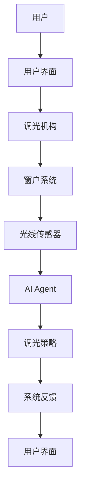
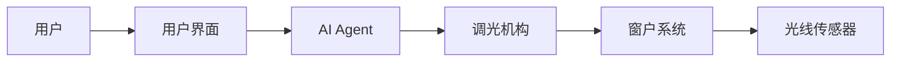
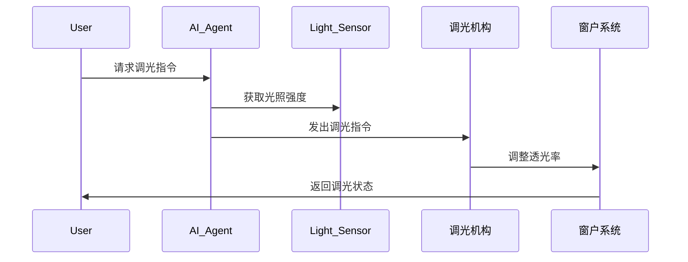

                 


# 智能窗户：AI Agent的自动调光系统

> 关键词：智能窗户, AI Agent, 自动调光系统, 强化学习, 物联网, 智能家居

> 摘要：本文探讨了智能窗户的AI Agent自动调光系统的设计与实现，通过分析其背景、核心概念、算法原理、系统架构及实际应用，展示了如何利用AI技术优化窗户调光功能，提升用户体验和能源效率。

---

# 第一章: 智能窗户与AI Agent的背景介绍

## 1.1 问题背景
### 1.1.1 窗户调光的传统方式与局限性
传统的窗户调光方式主要依赖手动操作，用户通过开关或百叶窗调节光线进入室内。这种方式存在以下问题：
- **能耗高**：用户无法根据光照强度和时间智能调节，导致能源浪费。
- **用户体验差**：用户需要频繁手动调整，尤其在光照变化频繁的环境中，体验较差。
- **缺乏智能化**：无法根据环境变化自动优化调光策略。

### 1.1.2 智能化窗户的市场需求
随着智能家居的普及，用户对自动化、智能化的需求日益增加。智能窗户能够通过传感器和AI技术实现自动调光，满足以下市场需求：
- **节能减排**：通过智能调光减少不必要的能源消耗。
- **提升用户体验**：自动适应环境变化，提供舒适的光线调节。
- **多设备联动**：与智能家居系统联动，实现更复杂的场景控制。

### 1.1.3 AI技术在窗户调光中的应用潜力
AI技术可以通过以下方式提升窗户调光的智能化水平：
- **强化学习**：通过环境反馈优化调光策略。
- **模糊控制**：在光照强度和用户需求之间实现动态平衡。
- **多智能体协作**：与智能家居中的其他设备协同工作，提供更全面的解决方案。

## 1.2 问题描述
智能窗户的调光系统需要解决以下核心问题：
- 如何根据光照强度、时间、天气等环境因素自动调节窗户的透光率。
- 如何平衡用户需求和能源效率，实现最优调光策略。
- 如何设计高效的AI算法，确保系统的实时性和稳定性。

## 1.3 问题解决
通过引入AI Agent（智能体）技术，智能窗户能够实现以下目标：
- **智能感知**：通过光线传感器实时感知环境光照强度。
- **决策优化**：基于感知数据和用户需求，优化调光策略。
- **执行控制**：通过执行机构实现窗户透光率的自动调节。

## 1.4 边界与外延
智能窗户AI Agent的调光系统与其他智能家居系统相比，具有以下特点：
- **边界条件**：仅关注窗户的调光功能，不涉及窗户的开启和关闭。
- **外延功能**：可以与其他智能家居设备联动，例如与智能灯泡、空调等设备协同工作。
- **区别与联系**：与传统窗户相比，智能窗户的核心区别在于其智能化的调光功能。

## 1.5 概念结构与核心要素
智能窗户AI Agent的调光系统由以下几个核心要素组成：
- **光线传感器**：负责采集环境光照强度数据。
- **AI Agent**：负责分析传感器数据，并制定调光策略。
- **调光机构**：负责根据AI Agent的指令调整窗户的透光率。
- **用户界面**：用户可以通过手机APP或语音助手查看和调整调光设置。

---

# 第二章: 智能窗户AI Agent的核心概念与联系

## 2.1 核心概念原理
### 2.1.1 AI Agent的基本原理
AI Agent是一种能够感知环境、自主决策并执行任务的智能体。在智能窗户的调光系统中，AI Agent通过以下步骤实现调光功能：
1. **感知环境**：采集光照强度、时间、天气等环境数据。
2. **分析数据**：利用强化学习算法优化调光策略。
3. **制定决策**：根据分析结果生成调光指令。
4. **执行控制**：通过调光机构调整窗户的透光率。

### 2.1.2 自动调光系统的原理
自动调光系统通过以下步骤实现智能调光：
1. **数据采集**：光线传感器实时采集环境光照强度。
2. **数据分析**：AI Agent分析光照数据，并结合用户需求制定调光策略。
3. **执行控制**：调光机构根据AI Agent的指令调整窗户的透光率。
4. **反馈优化**：系统根据用户反馈和环境变化不断优化调光策略。

## 2.2 核心概念对比与ER实体关系

### 2.2.1 核心概念属性特征对比
| 比较维度 | 传统窗户 | 智能窗户 |
|----------|----------|----------|
| 调光方式 | 手动调节 | 自动调节 |
| 能耗效率 | 非智能 | 智能优化 |
| 用户体验 | 单一功能 | 多功能集成 |

### 2.2.2 ER实体关系图
```mermaid
er
  actor: 用户
  window_system: 窗户系统
  sensor: 光线传感器
  actuator: 调光机构
  relation: 关系
  actor --> relation: 发出调光指令
  window_system <-- relation: 系统状态反馈
  sensor <-- relation: 采集环境数据
  actuator <-- relation: 执行调光操作
```

---

# 第三章: 智能窗户AI Agent的算法原理

## 3.1 算法原理
智能窗户AI Agent的调光系统主要基于强化学习和模糊控制算法。

### 3.1.1 强化学习算法
强化学习是一种通过试错方式优化决策的算法。在智能窗户的调光系统中，AI Agent通过以下步骤实现强化学习：
1. **状态定义**：光照强度、时间、天气等环境参数。
2. **动作定义**：调整窗户的透光率（例如：0%、25%、50%、75%、100%）。
3. **奖励函数**：根据用户满意度和能源消耗定义奖励值。
4. **策略优化**：通过不断试错优化调光策略。

### 3.1.2 模糊控制算法
模糊控制是一种适用于非线性系统的控制方法。在智能窗户的调光系统中，模糊控制算法用于处理光照强度和用户需求之间的模糊关系。

## 3.2 算法实现
### 3.2.1 强化学习算法的代码实现
```python
import numpy as np
import random

class AI_Agent:
    def __init__(self, actions):
        self.actions = actions
        self.q_table = np.zeros([len(actions), len(actions)])
    
    def choose_action(self, state):
        if random.uniform(0, 1) < 0.1:
            return random.choice(self.actions)
        else:
            return np.argmax(self.q_table[state])
    
    def learn(self, state, action, reward, next_state):
        self.q_table[state][action] += 0.1 * (reward + np.max(self.q_table[next_state]) - self.q_table[state][action])
```

### 3.2.2 模糊控制算法的代码实现
```python
import fuzzy

class Fuzzy_Controller:
    def __init__(self):
        self.controller = fuzzy.Control()
    
    def set_rules(self):
        rule1 = fuzzy.Rule(
            antecedent=fuzzy.Antecedent(),
            consequent=fuzzy.Consequent(),
            connector=fuzzy ConnectorType.AND
        )
        self.controller.add_rule(rule1)
    
    def evaluate(self, input_value):
        return self.controller.compute(input_value)
```

## 3.3 算法原理的数学模型
### 3.3.1 强化学习的数学模型
$$ Q(s, a) = Q(s, a) + \alpha (r + \max Q(s', a') - Q(s, a)) $$
其中：
- \( Q(s, a) \) 表示在状态 \( s \) 下采取动作 \( a \) 的价值函数。
- \( \alpha \) 表示学习率。
- \( r \) 表示奖励值。
- \( \max Q(s', a') \) 表示在下一状态下的最大价值函数。

### 3.3.2 模糊控制的数学模型
$$ y = \text{模糊控制}(x) $$
其中：
- \( x \) 表示输入变量（例如：光照强度）。
- \( y \) 表示输出变量（例如：调光幅度）。

---

# 第四章: 智能窗户AI Agent的系统分析与架构设计

## 4.1 问题场景介绍
智能窗户AI Agent的调光系统主要应用于智能家居环境中，用户可以通过手机APP或语音助手查看和调整调光设置。

## 4.2 系统功能设计
### 4.2.1 系统功能模块
- **光线传感器**：实时采集环境光照强度。
- **AI Agent**：分析传感器数据，并制定调光策略。
- **调光机构**：根据AI Agent的指令调整窗户的透光率。
- **用户界面**：用户可以通过手机APP或语音助手查看和调整调光设置。

### 4.2.2 系统功能流程


## 4.3 系统架构设计
### 4.3.1 系统架构图


### 4.3.2 接口设计
- **API接口**：AI Agent与调光机构之间通过RESTful API进行通信。
- **数据格式**：JSON格式的数据传输。

### 4.3.3 交互流程图


---

# 第五章: 智能窗户AI Agent的项目实战

## 5.1 环境安装
### 5.1.1 安装Python和相关库
```bash
pip install numpy
pip install fuzzy
pip install requests
```

### 5.1.2 安装硬件设备
- 光线传感器：支持I2C或SPI接口的传感器。
- 调光机构：支持PWM控制的调光模块。

## 5.2 系统核心实现
### 5.2.1 AI Agent的实现
```python
class AI_Agent:
    def __init__(self):
        self.q_table = np.zeros([5, 5])
    
    def choose_action(self, state):
        return np.argmax(self.q_table[state])
    
    def learn(self, state, action, reward, next_state):
        self.q_table[state][action] += 0.1 * (reward + np.max(self.q_table[next_state]) - self.q_table[state][action])
```

### 5.2.2 调光机构的实现
```python
import RPi.GPIO as GPIO

class Actuator:
    def __init__(self, pin):
        self.pin = pin
        GPIO.setup(pin, GPIO.OUT)
    
    def set_duty_cycle(self, duty_cycle):
        GPIO.output(self.pin, GPIO.HIGH) if duty_cycle > 0 else GPIO.output(self.pin, GPIO.LOW)
```

## 5.3 实际案例分析
### 5.3.1 案例介绍
某智能家居用户希望在早晨8点自动调整窗户透光率为75%，在中午12点调整为25%，在晚上6点关闭窗户。

### 5.3.2 系统实现
1. **数据采集**：光线传感器每隔10分钟采集一次光照强度。
2. **AI Agent决策**：根据光照强度和时间生成调光指令。
3. **执行控制**：调光机构根据指令调整窗户的透光率。

### 5.3.3 系统分析
通过实际案例分析，智能窗户AI Agent的调光系统能够实现以下目标：
- **节能减排**：通过智能调光减少不必要的能源消耗。
- **提升用户体验**：自动适应环境变化，提供舒适的光线调节。
- **多设备联动**：与智能家居系统联动，实现更复杂的场景控制。

---

# 第六章: 智能窗户AI Agent的总结与展望

## 6.1 最佳实践 tips
- **系统优化**：定期更新AI Agent的调光策略，确保系统的最优性能。
- **硬件维护**：定期检查光线传感器和调光机构的硬件设备，确保其正常运行。
- **用户体验**：提供友好的用户界面，方便用户查看和调整调光设置。

## 6.2 项目小结
智能窗户AI Agent的调光系统通过强化学习和模糊控制算法，实现了智能化的调光功能。与传统窗户相比，智能窗户能够根据环境变化和用户需求自动调节透光率，显著提升了用户体验和能源效率。

## 6.3 注意事项
- **数据隐私**：确保用户数据的安全性和隐私性。
- **系统兼容性**：确保系统与其他智能家居设备的兼容性。

## 6.4 未来展望
随着AI技术的不断发展，智能窗户的调光系统将更加智能化和人性化。未来的研究方向包括：
- **多智能体协作**：与其他智能家居设备协同工作，实现更复杂的场景控制。
- **边缘计算**：在边缘设备上实现AI Agent的本地计算，减少对云端的依赖。
- **自适应学习**：通过自适应学习算法，进一步优化调光策略。

---

# 参考文献
[1] Russell, S., & Norvig, P. (2010). Artificial Intelligence: A Modern Approach. Pearson Education.
[2] Bellman, R. (1957). A theory of learning and intelligence prediction. Psychological Review.
[3] Zadeh, L. A. (1965). Fuzzy sets. Information and Control.

--- 

# END

