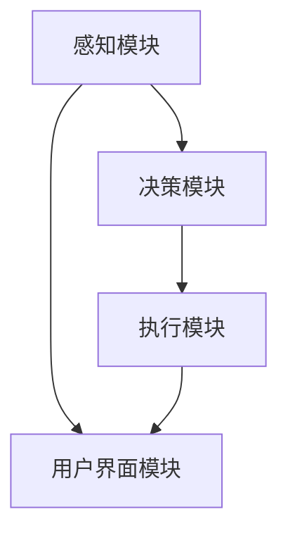
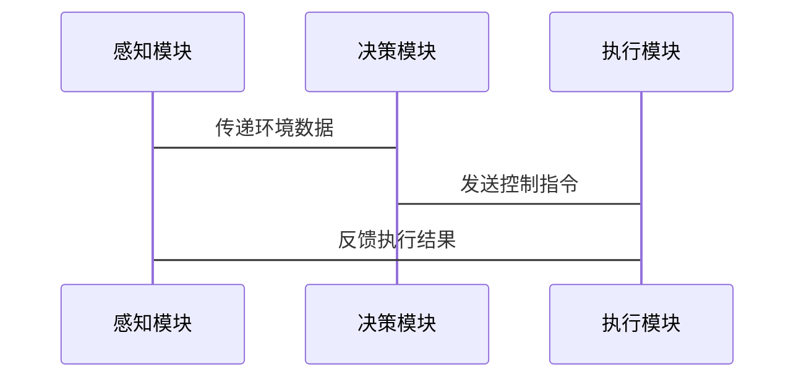

                 


# 智能花园系统：AI Agent的生态平衡维护

> 关键词：智能花园系统，AI Agent，生态平衡，算法原理，系统架构

> 摘要：智能花园系统通过AI Agent实现对植物生长环境的智能监控和优化，从而维护生态平衡。本文从AI Agent的基本原理出发，详细探讨其在智能花园系统中的应用，包括感知、决策、执行模块的设计，生态平衡的数学建模与算法优化，系统架构设计与实现，以及项目实战与最佳实践。通过本文，读者将深入了解如何利用AI技术实现智能花园系统的生态平衡维护。

---

# 第1章 智能花园系统与AI Agent概述

## 1.1 智能花园系统的基本概念

### 1.1.1 智能花园系统的定义

智能花园系统是一种结合了物联网、人工智能和自动化技术的智能 gardening 系统。通过传感器、摄像头和其他智能设备，系统能够实时感知植物的生长环境（如温度、湿度、光照、土壤 pH 值等），并利用 AI 技术进行数据分析和决策，自动调整环境参数以优化植物的生长条件。

### 1.1.2 AI Agent在智能花园中的角色

AI Agent（智能代理）是智能花园系统的核心，负责接收传感器数据，分析环境状态，制定决策并执行动作（如调整温湿度、开启/关闭光照等）。AI Agent 的作用是通过实时监控和优化，确保植物在最佳生长环境中生长，从而实现生态平衡。

### 1.1.3 智能花园系统的应用场景

智能花园系统广泛应用于家庭花园、农业大棚、公共绿地等场景。通过智能化管理，系统可以减少人工干预，提高资源利用率，降低环境压力，同时确保植物健康生长。

## 1.2 智能花园系统的生态平衡目标

### 1.2.1 生态平衡的定义与重要性

生态平衡是指生态系统中各组成部分之间的动态平衡状态，使得系统能够持续稳定地运行。在智能花园系统中，生态平衡的目标是通过优化环境参数，使植物与其他生物、非生物因素之间达到和谐共存的状态。

### 1.2.2 智能花园系统如何实现生态平衡

AI Agent 通过实时感知环境数据，分析植物的生长需求，并根据历史数据和模型预测，制定最优的环境调整策略。例如，当土壤湿度低于阈值时，系统会自动启动喷灌；当光照不足时，系统会调节光照强度。

### 1.2.3 生态平衡与可持续发展的关系

实现生态平衡是可持续发展的基础。通过智能花园系统，我们可以减少资源浪费，降低能源消耗，同时提高植物的生长效率，从而为人类提供更多的食物和资源，促进可持续发展。

## 1.3 本章小结

本章介绍了智能花园系统的基本概念和 AI Agent 的角色，探讨了生态平衡的目标及其与可持续发展的关系。通过这些内容，读者可以理解智能花园系统的核心目标和实现方式。

---

# 第2章 AI Agent的核心原理

## 2.1 AI Agent的感知模块

### 2.1.1 感知模块的功能与作用

感知模块是 AI Agent 的眼睛和耳朵，负责采集环境数据。常见的感知设备包括温度传感器、湿度传感器、光照强度传感器、土壤 pH 传感器等。

### 2.1.2 常见的感知技术

- **传感器技术**：通过传感器采集环境数据，如 DHT11 温湿度传感器、BH1750 光照传感器等。
- **图像识别技术**：通过摄像头采集植物的图像，利用图像识别技术检测植物的生长状态，如叶片颜色、形状变化等。

### 2.1.3 感知数据的处理与分析

感知数据需要经过预处理、特征提取和数据融合等步骤，以便为决策模块提供可靠的输入。

## 2.2 AI Agent的决策模块

### 2.2.1 决策模块的算法原理

决策模块是 AI Agent 的大脑，负责根据感知数据和历史数据，利用算法模型制定决策。常用的算法包括规则引擎、机器学习模型（如随机森林、支持向量机）和强化学习模型。

### 2.2.2 常见的决策算法

- **规则引擎**：基于预定义的规则进行决策，适用于简单的条件判断。
- **机器学习模型**：通过训练数据学习环境与植物生长的关系，预测最优的环境参数。
- **强化学习模型**：通过与环境的交互，不断优化决策策略，实现自适应控制。

### 2.2.3 决策模块的优化策略

为了提高决策的准确性，可以采用多目标优化、在线学习和模型融合等技术。

## 2.3 AI Agent的执行模块

### 2.3.1 执行模块的功能与实现

执行模块是 AI Agent 的手和脚，负责根据决策模块的指令，调整环境参数。常见的执行设备包括喷灌系统、智能灯泡、风扇等。

### 2.3.2 执行模块与硬件设备的接口设计

执行模块需要与硬件设备进行通信，常见的通信方式包括 GPIO 控制、串口通信、网络通信等。

### 2.3.3 执行模块的反馈机制

为了实现闭环控制，执行模块需要将执行结果反馈给感知模块，确保系统能够实时调整。

## 2.4 本章小结

本章详细讲解了 AI Agent 的感知、决策和执行模块的核心原理，为后续的系统设计和实现奠定了基础。

---

# 第3章 智能花园系统的数学模型与算法

## 3.1 生态平衡的数学建模

### 3.1.1 系统状态的描述与变量定义

智能花园系统的状态可以用多个变量描述，如温度（T）、湿度（H）、光照强度（L）、土壤 pH 值（pH）等。

### 3.1.2 系统动态的数学表达式

系统状态的变化可以用微分方程或差分方程描述。例如，温度的变化可以表示为：

$$
\frac{dT}{dt} = a \cdot T - b \cdot T^2 + c
$$

其中，a、b、c 是模型参数。

### 3.1.3 系统平衡点的求解

通过求解系统的数学模型，可以找到系统的平衡点，即各变量的稳态值。

## 3.2 AI Agent的决策算法模型

### 3.2.1 监督学习模型的数学表达

监督学习模型可以通过训练数据学习输入与输出的关系。例如，线性回归模型可以表示为：

$$
y = w_1 x_1 + w_2 x_2 + \dots + w_n x_n + b
$$

其中，x_i 是输入特征，y 是输出目标。

### 3.2.2 非监督学习模型的数学表达

非监督学习模型用于聚类分析，例如 K-means 算法：

$$
\text{目标是最小化} \sum_{i=1}^{k} \sum_{j \in C_i} (x_j - \mu_i)^2
$$

其中，C_i 是第 i 个聚类，μ_i 是聚类中心。

### 3.2.3 强化学习模型的数学表达

强化学习模型通过与环境的交互，学习最优策略。Q-Learning 算法的更新规则为：

$$
Q(s, a) = Q(s, a) + \alpha \left[ r + \gamma \max Q(s', a') - Q(s, a) \right]
$$

其中，α 是学习率，γ 是折扣因子。

## 3.3 算法的优化与改进

### 3.3.1 算法优化的目标与方法

算法优化的目标是提高决策的准确性和响应速度。常用的方法包括参数调优、模型压缩和分布式计算。

### 3.3.2 算法改进的具体策略

例如，可以通过集成学习（如随机森林）来提高模型的泛化能力。

### 3.3.3 算法优化的效果评估

通过交叉验证和性能指标（如准确率、F1 分数）来评估算法优化的效果。

## 3.4 本章小结

本章通过数学建模和算法分析，探讨了如何利用 AI 技术实现智能花园系统的生态平衡维护。

---

# 第4章 智能花园系统的架构设计

## 4.1 系统模块划分

### 4.1.1 系统功能模块的划分

智能花园系统可以划分为感知模块、决策模块、执行模块和用户界面模块。

### 4.1.2 模块之间的关系与交互

模块之间的关系可以用以下 Mermaid 图表示：



### 4.1.3 模块的实现方式

感知模块通过传感器采集数据，决策模块利用算法模型制定决策，执行模块通过硬件设备调整环境参数。

## 4.2 系统架构的实现

### 4.2.1 系统架构的分层设计

系统架构可以分为感知层、决策层和执行层。

### 4.2.2 每层的功能实现

- **感知层**：负责数据采集。
- **决策层**：负责数据分析和决策。
- **执行层**：负责环境调整。

### 4.2.3 层之间的通信机制

各层之间通过消息队列或数据库进行通信。

## 4.3 系统接口设计

### 4.3.1 系统内部接口的设计

内部接口需要定义清晰的数据格式和通信协议。

### 4.3.2 系统外部接口的设计

外部接口可以提供 API，方便用户或其他系统接入。

## 4.4 系统交互的实现

### 4.4.1 系统交互的 Mermaid 序列图



## 4.5 本章小结

本章详细讲解了智能花园系统的架构设计，为后续的系统实现奠定了基础。

---

# 第5章 项目实战：智能花园系统的核心实现

## 5.1 环境配置与传感器安装

### 5.1.1 硬件设备的选择与安装

选择合适的传感器和执行设备，例如 DHT11 温湿度传感器、BH1750 光照传感器、微型水泵等。

### 5.1.2 系统环境的搭建

安装必要的软件和库，例如 Python 的gpiozero库、paho-mqtt 库等。

## 5.2 系统核心实现

### 5.2.1 感知模块的实现

编写代码采集传感器数据，并通过 MQTT 协议发送到决策模块。

```python
from gpiozero import MCP3008
import paho.mqtt.client as mqtt

# 传感器数据采集
def read_sensor():
    sensor_value = MCP3008().value[0]
    return sensor_value

# MQTT 发布数据
def publish_data():
    client = mqtt.Client("sensor_publisher")
    client.connect("localhost", 1883)
    client.publish("sensor_topic", str(read_sensor()))
```

### 5.2.2 决策模块的实现

利用机器学习模型进行数据分析和决策。

```python
import pandas as pd
from sklearn.ensemble import RandomForestRegressor

# 加载训练数据
data = pd.read_csv("training_data.csv")

# 训练模型
model = RandomForestRegressor()
model.fit(data.drop(columns=['label']), data['label'])

# 预测决策
def make_decision(input_data):
    prediction = model.predict(input_data)
    return prediction
```

### 5.2.3 执行模块的实现

根据决策结果，控制执行设备。

```python
import paho.mqtt.client as mqtt

# MQTT 订阅决策结果
def on_message(client, userdata, message):
    decision = message.payload.decode()
    if decision == 'start_pump':
        # 控制水泵
        pass

client = mqtt.Client("execution_module")
client.connect("localhost", 1883)
client.on_message = on_message
client.subscribe("decision_topic", 0)
client.loop_forever()
```

## 5.3 系统测试与优化

### 5.3.1 系统测试

对各模块进行功能测试，确保系统正常运行。

### 5.3.2 系统优化

通过参数调优和算法优化，提高系统的响应速度和决策准确性。

## 5.4 本章小结

本章通过具体的代码实现，展示了智能花园系统的核心实现过程。

---

# 第6章 最佳实践与系统优化

## 6.1 传感器的选型与部署

### 6.1.1 传感器的选型原则

选择传感器时需要考虑精度、成本、易用性等因素。

### 6.1.2 传感器的部署方式

根据植物的生长需求，合理布置传感器的位置和密度。

## 6.2 数据处理的优化

### 6.2.1 数据预处理技术

通过数据清洗、特征提取等技术，提高数据质量。

### 6.2.2 数据存储与管理

使用数据库或时间序列数据库存储传感器数据。

## 6.3 系统性能优化

### 6.3.1 算法优化策略

通过模型压缩、并行计算等技术，提高系统的运行效率。

### 6.3.2 系统扩展性优化

设计模块化的系统架构，方便后续的功能扩展。

## 6.4 本章小结

本章总结了智能花园系统的最佳实践和优化策略，帮助读者进一步提升系统的性能和稳定性。

---

# 第7章 总结与展望

## 7.1 总结

智能花园系统通过 AI Agent 实现了对植物生长环境的智能监控和优化，从而维护了生态平衡。本文详细探讨了系统的原理、架构和实现过程。

## 7.2 展望

未来，智能花园系统可以进一步结合边缘计算和雾计算技术，实现更高效的环境监控和优化。同时，随着 AI 技术的不断发展，系统的智能化水平将不断提高，为人类创造更美好的生活环境。

## 7.3 本章小结

本文总结了智能花园系统的核心内容，并展望了未来的发展方向。

---

# 参考文献

（此处列出相关的技术文献和资料）

---

通过以上内容，您可以系统地了解智能花园系统的设计与实现过程，以及 AI Agent 在其中发挥的重要作用。

