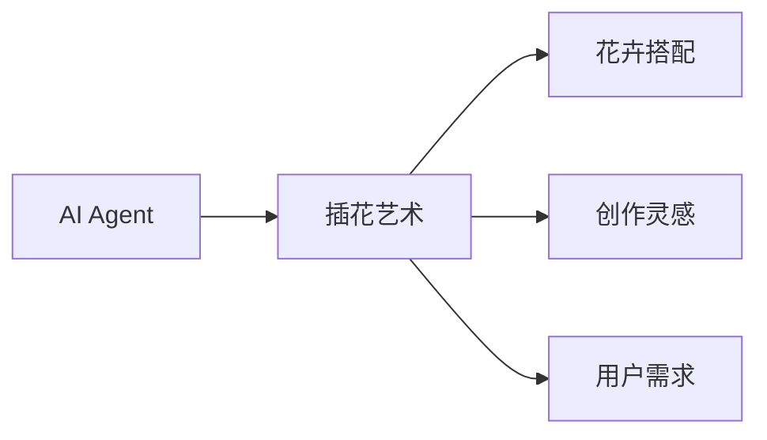
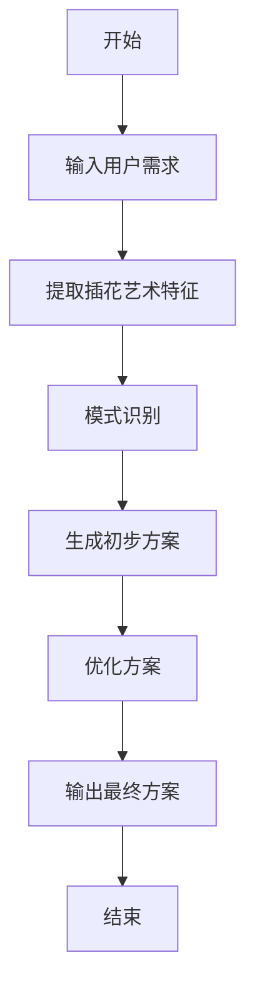
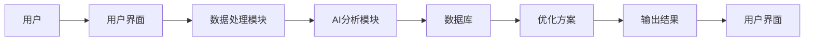
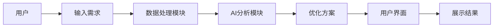

                 


# 智能花瓶：AI Agent的插花艺术指导

## 关键词：
AI Agent，插花艺术，数字花艺，人工智能，艺术设计

## 摘要：
本文探讨了AI Agent在插花艺术中的应用，分析了其核心原理、系统架构，并通过实际案例展示了AI Agent如何作为插花艺术的智能助手，为用户提供个性化的插花设计建议。文章从理论到实践，详细阐述了AI Agent在插花艺术中的潜力与实现方式。

---

# 第1章: AI Agent与插花艺术的背景介绍

## 1.1 AI Agent的基本概念
### 1.1.1 什么是AI Agent
AI Agent（人工智能代理）是一种能够感知环境、执行任务并做出决策的智能系统。它通过数据处理和算法分析，为用户提供智能化的服务。

### 1.1.2 AI Agent的核心功能
- **感知环境**：通过传感器或数据输入获取环境信息。
- **决策与推理**：利用算法对信息进行分析和推理，生成解决方案。
- **执行任务**：根据决策结果执行相应的操作。

### 1.1.3 AI Agent在插花艺术中的应用潜力
AI Agent可以通过分析用户需求和环境数据，提供个性化的插花设计建议，优化花卉搭配，甚至生成创新的插花方案。

## 1.2 插花艺术的基本知识
### 1.2.1 插花艺术的定义与历史
插花艺术是一种通过剪枝、组合花卉和其他植物材料，创造出具有美感和象征意义的艺术形式。其历史可以追溯到古埃及和希腊时期。

### 1.2.2 不同风格的插花艺术
- **东方式插花**：强调自然与和谐，常用线条和空间感。
- **西方式插花**：注重对称和色彩搭配，结构严谨。
- **现代插花**：结合多种风格，强调创新和个性化。

### 1.2.3 插花艺术的创作原则
- **平衡**：整体结构的对称与和谐。
- **对比**：通过色彩、形状的对比增强视觉效果。
- **焦点**：确定一个主要的视觉中心。

## 1.3 AI Agent与插花艺术的结合背景
### 1.3.1 当代插花艺术的数字化趋势
随着科技的发展，插花艺术逐渐从传统手工创作向数字化、智能化方向转变。

### 1.3.2 AI技术在艺术领域的应用现状
AI技术已在绘画、音乐等领域展现巨大潜力，插花艺术作为艺术的一种，同样可以借助AI技术提升创作效率和创新性。

### 1.3.3 插花艺术与AI Agent结合的可行性分析
AI Agent可以通过数据处理和算法分析，帮助用户快速找到合适的插花设计方案，节省时间和精力。

---

# 第2章: 插花艺术指导的AI Agent核心概念

## 2.1 AI Agent在插花艺术中的核心功能
### 2.1.1 智能推荐系统
AI Agent可以根据用户喜好和环境数据，推荐适合的花卉组合和设计方案。

### 2.1.2 花卉搭配优化
通过分析花卉的颜色、形状和季节性，AI Agent可以帮助用户优化搭配效果。

### 2.1.3 创作灵感生成
AI Agent可以通过生成式算法，为用户提供创新的插花灵感。

## 2.2 插花艺术与AI Agent的核心要素对比
### 2.2.1 AI Agent的核心要素
- 数据输入：用户需求、环境数据
- 决策算法：模式识别、优化算法
- 输出结果：插花设计方案

### 2.2.2 插花艺术的核心要素
- 花卉选择：种类、颜色、形状
- 设计原则：平衡、对比、焦点
- 创作工具：剪刀、花瓶、辅助工具

### 2.2.3 两者要素的对比分析
| 要素 | AI Agent | 插花艺术 |
|------|-----------|----------|
| 数据输入 | 用户需求、环境数据 | 花卉选择、设计原则 |
| 决策方式 | 算法分析 | 创意设计 |
| 输出结果 | 插花设计方案 | 实际作品 |

## 2.3 AI Agent与插花艺术的实体关系图


---

# 第3章: AI Agent插花艺术指导的算法原理

## 3.1 AI Agent插花艺术指导的模式识别算法
### 3.1.1 模式识别的基本原理
模式识别是通过算法分析数据中的模式，识别出特定的特征或类别。

### 3.1.2 插花艺术的特征提取
- 花卉颜色：RGB值
- 花卉形状：几何特征
- 花卉组合：搭配模式

### 3.1.3 基于深度学习的花卉识别
使用卷积神经网络（CNN）对花卉图像进行分类和识别，例如：
$$
P(y|x) = \frac{P(x|y)P(y)}{P(x)}
$$

其中，$P(y|x)$ 是花卉属于某一类别的概率，$P(x|y)$ 是类别对图像的条件概率，$P(y)$ 是先验概率，$P(x)$ 是边缘概率。

## 3.2 插花艺术优化的遗传算法
### 3.2.1 遗传算法的基本原理
遗传算法是一种模拟自然选择的优化算法，包括选择、交叉和变异三个步骤。

### 3.2.2 插花艺术优化的适应度函数
适应度函数用于评估插花设计方案的优劣：
$$
F(f) = w_1 \cdot C + w_2 \cdot B + w_3 \cdot H
$$

其中，$C$ 是色彩协调度，$B$ 是平衡性，$H$ 是和谐度，$w_1, w_2, w_3$ 是权重系数。

### 3.2.3 遗传算法在插花艺术中的应用
- **选择**：选择适应度高的设计方案。
- **交叉**：将两个设计方案的特征进行组合。
- **变异**：随机改变设计方案的一部分。

## 3.3 算法流程图


---

# 第4章: 插花艺术指导系统的架构设计

## 4.1 系统功能模块划分
### 4.1.1 功能模块
- 用户界面：接收用户输入，展示设计方案。
- AI分析模块：处理数据，生成方案。
- 数据库：存储用户偏好和历史数据。

## 4.2 插花艺术指导系统的架构图


## 4.3 系统接口设计
- 用户输入接口：文本框、按钮。
- 数据接口：与花卉数据库交互。

## 4.4 系统交互流程图


---

# 第5章: 项目实战

## 5.1 项目介绍
设计一个AI插花助手，帮助用户快速找到适合的插花方案。

## 5.2 环境安装
- 安装Python、TensorFlow、Keras。

## 5.3 核心代码实现
```python
import tensorflow as tf
from tensorflow.keras import layers

# 数据预处理
def preprocess_image(image):
    image = image.resize((224, 224))
    image = tf.keras.preprocessing.image.img_to_array(image)
    image = tf.keras.applications.mobilenet_v2.preprocess_input(image)
    return image

# 模型定义
def create_model():
    model = tf.keras.Sequential([
        layers.Conv2D(32, (3,3), activation='relu', input_shape=(224, 224, 3)),
        layers.MaxPooling2D((2,2)),
        layers.Conv2D(64, (3,3), activation='relu'),
        layers.MaxPooling2D((2,2)),
        layers.Flatten(),
        layers.Dense(128, activation='relu'),
        layers.Dense(10, activation='softmax')
    ])
    return model
```

## 5.4 功能解读
- 数据预处理：将花卉图像调整为模型输入格式。
- 模型训练：使用迁移学习训练花卉分类模型。

## 5.5 项目小结
通过本项目，我们实现了AI Agent在插花艺术中的应用，展示了其在推荐系统和优化算法中的潜力。

---

# 第6章: 最佳实践

## 6.1 小结
AI Agent为插花艺术提供了智能化的设计工具，能够提升创作效率和创新性。

## 6.2 注意事项
- 数据质量影响结果，需保证训练数据的多样性。
- 用户隐私保护需重视，避免数据泄露。

## 6.3 拓展阅读
- 《深度学习与艺术创作》
- 《人工智能在艺术设计中的应用》

---

通过以上内容，我们可以看到，AI Agent在插花艺术中的应用前景广阔，不仅能够辅助设计师创作，还能为用户提供个性化的艺术体验。未来，随着技术的不断发展，AI Agent在艺术领域的潜力将进一步释放。

