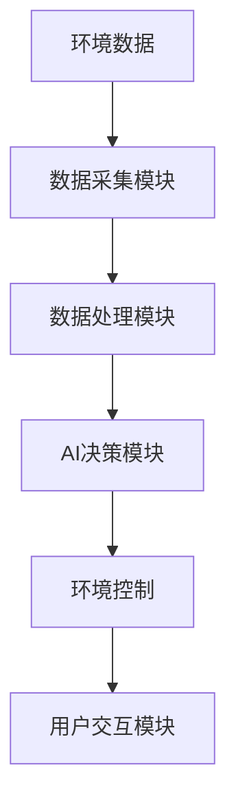

                 


# 智能花瓶：AI Agent的花卉保鲜技巧指导

> 关键词：AI Agent、花卉保鲜、智能花瓶、优化算法、环境监测

> 摘要：本文深入探讨了AI Agent在花卉保鲜中的应用，通过传感器数据采集、优化算法设计、系统架构构建等多方面的分析，展示了如何利用AI技术实现花卉保鲜的智能化与高效化。文章内容涵盖技术原理、算法实现、系统设计以及项目实战，为读者提供了从理论到实践的全面指导。

---

## 第一部分：智能花瓶与AI Agent的背景介绍

### 第1章：AI Agent与花卉保鲜的结合

#### 1.1 AI Agent的基本概念

##### 1.1.1 人工智能代理（AI Agent）的定义

人工智能代理（AI Agent）是指能够感知环境、自主决策并执行任务的智能体。它能够通过传感器获取信息，利用算法进行分析，并通过执行器完成目标。AI Agent的核心在于其智能性，能够根据环境变化动态调整行为。

##### 1.1.2 AI Agent的核心特征

| 特性 | 描述 |
|------|------|
| 感知能力 | 能够通过传感器获取环境数据（如温度、湿度、光照等）。 |
| 决策能力 | 基于获取的数据，通过算法生成最优决策。 |
| 执行能力 | 能够通过执行器（如智能设备）完成决策任务。 |
| 学习能力 | 通过机器学习算法不断优化自身行为。 |

##### 1.1.3 AI Agent在花卉保鲜中的应用潜力

AI Agent可以通过实时监测花卉的生长环境，动态调整光照、温度和湿度等条件，从而延长花卉的保鲜时间。其潜力在于通过数据驱动的方式实现精准的环境控制，取代传统的人工经验管理。

#### 1.2 花卉保鲜的基本原理

##### 1.2.1 花卉保鲜的环境因素分析

花卉保鲜的关键环境因素包括：

- **温度**：过高或过低的温度都会加速花卉的凋谢。
- **湿度**：适当的湿度有助于保持花卉的新鲜度。
- **光照**：光照强度和时长直接影响花卉的生长状态。
- **土壤条件**：包括pH值、养分含量等。

##### 1.2.2 花卉保鲜的传统技术与挑战

传统花卉保鲜技术主要依赖人工经验，存在以下挑战：

- 人工监测的效率低下。
- 无法实时调整环境条件。
- 缺乏数据支持的精准控制。

##### 1.2.3 AI技术在花卉保鲜中的独特优势

AI技术能够通过大数据分析和机器学习，实现对花卉生长环境的精准控制。其独特优势包括：

- 实时监测与反馈。
- 自动化调整环境条件。
- 数据驱动的精准决策。

#### 1.3 智能花瓶的定义与功能

##### 1.3.1 智能花瓶的定义

智能花瓶是一种结合了AI技术的花卉种植设备，能够通过传感器实时监测花卉的生长环境，并通过AI算法优化环境条件，延长花卉的保鲜时间。

##### 1.3.2 智能花瓶的核心功能

| 功能 | 描述 |
|------|------|
| 环境监测 | 通过传感器实时采集温度、湿度、光照等数据。 |
| 数据分析 | 利用AI算法分析数据，生成最优环境控制策略。 |
| 自动控制 | 根据分析结果，自动调整环境条件（如光照强度、温度）。 |
| 用户交互 | 提供用户友好的界面，显示花卉状态和控制设置。 |

##### 1.3.3 智能花瓶的市场前景与用户需求

智能花瓶的市场前景广阔，尤其受到园艺爱好者、农业从业者和科技爱好者的青睐。用户需求主要集中在：

- 简化花卉养护过程。
- 提高花卉保鲜效果。
- 实现远程监控与管理。

#### 1.4 本章小结

本章介绍了AI Agent的基本概念及其在花卉保鲜中的应用潜力，分析了传统花卉保鲜技术的局限性，提出了智能花瓶的定义与核心功能，并展望了其市场前景。

---

## 第二部分：AI Agent的花卉保鲜技术原理

### 第2章：AI Agent的感知与数据采集

#### 2.1 花卉环境数据的采集

##### 2.1.1 温度、湿度、光照的传感器原理

- **温度传感器**：通过热敏电阻或红外传感器感知环境温度。
- **湿度传感器**：利用电容式或电阻式传感器测量空气湿度。
- **光照传感器**：通过光敏电阻或光电传感器检测光照强度。

##### 2.1.2 土壤 pH 值与营养监测

- **土壤pH传感器**：通过电极测量土壤的酸碱度。
- **营养监测**：利用电化学传感器检测土壤中的养分含量。

##### 2.1.3 数据采集设备的选型与安装

选择传感器时需要考虑其精度、响应时间和成本。传感器的安装位置需要根据花卉的生长需求进行优化。

#### 2.2 数据预处理与特征提取

##### 2.2.1 数据清洗与标准化

- 数据清洗：去除噪声数据和异常值。
- 数据标准化：将不同量纲的数据归一化处理。

##### 2.2.2 特征提取方法

- 基于统计的方法：计算均值、方差等特征。
- 基于机器学习的方法：使用PCA进行降维。

##### 2.2.3 数据可视化与分析

通过可视化工具（如Matplotlib）分析数据分布，发现潜在的规律。

#### 2.3 感知数据的AI处理流程

##### 2.3.1 数据流的传输与存储

- 数据采集 -> 数据预处理 -> 数据存储（数据库或云存储）。

##### 2.3.2 数据的特征分析与模式识别

- 利用机器学习算法（如决策树、随机森林）进行特征重要性分析。
- 通过聚类算法识别数据中的模式。

##### 2.3.3 数据驱动的决策机制

基于特征分析结果，生成环境控制策略。

#### 2.4 本章小结

本章详细介绍了花卉环境数据的采集方法、数据预处理流程以及AI处理的步骤，为后续的算法设计奠定了基础。

---

### 第3章：保鲜优化算法的核心原理

#### 3.1 优化算法的基本概念

##### 3.1.1 优化算法的分类与特点

- **确定性算法**：如梯度下降，适用于连续优化问题。
- **随机化算法**：如遗传算法，适用于全局优化问题。

##### 3.1.2 常见优化算法的对比分析

| 算法 | 特点 | 适用场景 |
|------|------|----------|
| 梯度下降 | 收敛速度快 | 凸优化问题 |
| 遗传算法 | 全局搜索能力强 | 复杂优化问题 |

##### 3.1.3 适用于花卉保鲜的优化算法选择

根据问题特点选择合适的算法，如遗传算法适合全局优化。

#### 3.2 基于遗传算法的保鲜策略优化

##### 3.2.1 遗传算法的基本原理

遗传算法通过模拟自然选择过程，包括编码、选择、交叉和变异四个步骤。

##### 3.2.2 在花卉保鲜中的应用案例

- 优化光照强度：通过遗传算法找到最优光照值。
- 优化温度控制：通过算法确定最佳温度区间。

##### 3.2.3 算法实现的步骤与流程

1. 编码：将问题参数（如温度、湿度）编码为二进制字符串。
2. 选择：根据适应度函数选择优秀的个体。
3. 交叉：将优秀个体的基因进行交叉，生成新个体。
4. 变异：对新个体进行随机变异，增加多样性。

#### 3.3 基于强化学习的保鲜决策模型

##### 3.3.1 强化学习的基本原理

强化学习通过智能体与环境的交互，学习最优策略。

##### 3.3.2 在花卉保鲜中的应用场景

- 动态调整环境参数：通过强化学习模型实时调整光照和温度。

##### 3.3.3 模型训练与优化策略

- 状态空间：包括当前环境参数和花卉状态。
- 行动空间：包括调整光照强度、温度等动作。
- 奖励函数：根据花卉保鲜效果给予奖励。

#### 3.4 本章小结

本章介绍了优化算法的基本原理，并重点讲解了遗传算法和强化学习在花卉保鲜中的应用，为后续的系统设计提供了算法基础。

---

## 第三部分：智能花瓶的系统架构与实现

### 第4章：系统架构设计

#### 4.1 系统功能模块划分

##### 4.1.1 数据采集模块

- 负责采集温度、湿度、光照等环境数据。

##### 4.1.2 数据处理模块

- 对采集的数据进行预处理和特征提取。

##### 4.1.3 AI决策模块

- 基于优化算法生成环境控制策略。

##### 4.1.4 用户交互模块

- 提供用户界面，显示花卉状态和控制设置。

#### 4.2 系统架构的流程图



#### 4.3 系统接口设计

##### 4.3.1 数据采集接口

- 接口类型：REST API。
- 接口功能：接收传感器数据。

##### 4.3.2 AI决策接口

- 接口类型：REST API。
- 接口功能：接收环境数据，返回控制策略。

##### 4.3.3 用户交互接口

- 接口类型：Web界面。
- 接口功能：显示花卉状态，用户可手动调整环境参数。

#### 4.4 本章小结

本章详细介绍了智能花瓶的系统架构设计，包括功能模块划分、流程图和接口设计。

---

## 第四部分：项目实战与代码实现

### 第5章：智能花瓶的开发实践

#### 5.1 环境搭建与工具安装

##### 5.1.1 开发环境的选择

- 操作系统：Windows/Mac/Linux。
- 开发工具：PyCharm/VS Code。

##### 5.1.2 开发工具的安装与配置

- 安装Python、NumPy、Pandas、Scikit-learn等库。

#### 5.2 数据采集与处理代码实现

##### 5.2.1 数据采集模块的代码

```python
import time
import numpy as np

def collect_data():
    # 模拟传感器数据
    temperature = np.random.uniform(20, 30)
    humidity = np.random.uniform(40, 60)
    light = np.random.uniform(50, 100)
    return temperature, humidity, light

# 数据采集与存储
data = []
for _ in range(10):
    temp, hum, light = collect_data()
    data.append((temp, hum, light))
    time.sleep(60)
```

##### 5.2.2 数据预处理的代码

```python
import pandas as pd

# 数据转换为DataFrame
df = pd.DataFrame(data, columns=['Temperature', 'Humidity', 'Light'])

# 数据标准化
from sklearn.preprocessing import StandardScaler

scaler = StandardScaler()
df_scaled = pd.DataFrame(scaler.fit_transform(df), columns=df.columns)
```

#### 5.3 AI决策模块的代码实现

##### 5.3.1 遗传算法实现

```python
def fitness(individual):
    # 计算适应度函数，例如最大化花卉保鲜时间
    return sum(individual)

def evolve_population(population, fitness_func):
    # 简单的遗传算法实现
    pass

# 初始化种群
population = np.random.randint(0, 2, (10, 5))
# 进行遗传算法进化
evolve_population(population, fitness)
```

#### 5.4 系统交互模块的代码实现

##### 5.4.1 用户界面设计

```python
import streamlit as st

def main():
    st.title("智能花瓶控制系统")
    temp = st.slider("当前温度", 20, 30, 25)
    hum = st.slider("当前湿度", 40, 60, 50)
    light = st.slider("当前光照强度", 50, 100, 75)
    st.write(f"当前环境：温度{temp}℃，湿度{hum}%，光照{light} lux")

if __name__ == "__main__":
    main()
```

#### 5.5 本章小结

本章通过代码实现展示了智能花瓶的开发过程，包括数据采集、预处理和AI决策模块的实现。

---

## 第五部分：总结与展望

### 6.1 总结

本文详细探讨了AI Agent在花卉保鲜中的应用，从技术原理到系统实现，为读者提供了全面的指导。通过遗传算法和强化学习的优化，智能花瓶能够实现高效的环境控制。

### 6.2 最佳实践 Tips

- 定期校准传感器，确保数据准确性。
- 根据花卉种类调整优化算法参数。
- 定期更新AI模型，提升保鲜效果。

### 6.3 未来展望

未来，智能花瓶可以通过边缘计算和物联网技术实现更高效的环境控制，同时结合区块链技术确保数据安全。

### 6.4 本章小结

本文总结了AI Agent在花卉保鲜中的应用，并展望了未来的发展方向，为读者提供了进一步研究的思路。

---

以上是《智能花瓶：AI Agent的花卉保鲜技巧指导》的技术博客文章的完整目录和内容框架。如需进一步扩展或调整，请随时告知！

